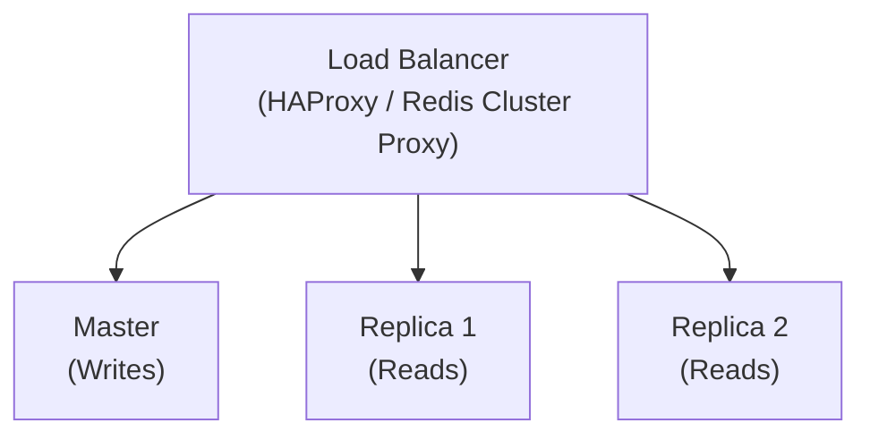

# How to Tune Redis for High Throughput

Author: [nawazdhandala](https://www.github.com/nawazdhandala)

Tags: Redis, Performance, Throughput, Tuning, TCP, Kernel, Production, Optimization

Description: A comprehensive guide to tuning Redis for high throughput workloads. Learn TCP settings, kernel optimizations, persistence tuning, and configuration best practices for maximum performance.

---

> Redis can handle millions of operations per second, but achieving maximum throughput requires careful tuning of Redis configuration, operating system settings, and network parameters. This guide covers the optimizations needed to unlock Redis's full performance potential.

---

## Baseline Performance

### Benchmarking

```bash
# Basic benchmark
redis-benchmark -h localhost -p 6379 -c 50 -n 100000 -a password

# Realistic benchmark with pipelining
redis-benchmark -h localhost -p 6379 -c 100 -n 1000000 -P 16 -a password

# Specific commands
redis-benchmark -h localhost -p 6379 -c 100 -n 1000000 -t set,get -P 16

# Key metrics to observe:
# - Requests per second
# - Latency percentiles (p50, p99, p99.9)
```

### Performance Targets

| Hardware | Expected Throughput |
|----------|-------------------|
| Single core | 50-100K ops/sec |
| 4+ cores | 100-300K ops/sec |
| With pipelining | 500K-1M+ ops/sec |

---

## Redis Configuration

### Memory Settings

```bash
# redis.conf

# Disable memory overcommit check (improves startup)
# Note: Ensure system has overcommit enabled
ignore-warnings ARM64-COW-BUG

# Hash optimization for small hashes
hash-max-ziplist-entries 512
hash-max-ziplist-value 64

# List optimization
list-max-listpack-size -2
list-compress-depth 0

# Set optimization
set-max-intset-entries 512
set-max-listpack-entries 128

# Sorted set optimization
zset-max-ziplist-entries 128
zset-max-ziplist-value 64

# Active rehashing during idle time
activerehashing yes
```

### Connection Settings

```bash
# Maximum connections (default 10000)
maxclients 50000

# TCP keepalive (seconds, 0 = disabled)
tcp-keepalive 300

# TCP backlog (pending connections queue)
tcp-backlog 511

# Timeout for idle clients (0 = disabled)
timeout 0
```

### Persistence Tuning for Throughput

```bash
# Option 1: Disable persistence (maximum throughput)
save ""
appendonly no

# Option 2: Relaxed RDB (less frequent saves)
save 900 1
save 300 100
save 60 10000

# Option 3: AOF with relaxed fsync
appendonly yes
appendfsync everysec
no-appendfsync-on-rewrite yes
auto-aof-rewrite-percentage 100
auto-aof-rewrite-min-size 64mb

# Reduce fsync impact
aof-rewrite-incremental-fsync yes
```

### I/O Threads (Redis 6+)

```bash
# Enable I/O threads for read operations
io-threads 4
io-threads-do-reads yes

# Guidelines:
# - 4 threads for 4-8 core machines
# - 8 threads for 16+ core machines
# - Only helps with high connection counts
```

---

## Operating System Tuning

### Memory Settings

```bash
# Enable memory overcommit
echo 1 > /proc/sys/vm/overcommit_memory
# Or in /etc/sysctl.conf:
vm.overcommit_memory = 1

# Disable Transparent Huge Pages (THP)
echo never > /sys/kernel/mm/transparent_hugepage/enabled
echo never > /sys/kernel/mm/transparent_hugepage/defrag

# Add to /etc/rc.local for persistence
```

### Network Settings

```bash
# /etc/sysctl.conf

# Increase connection backlog
net.core.somaxconn = 65535
net.ipv4.tcp_max_syn_backlog = 65535

# Increase network buffer sizes
net.core.rmem_max = 16777216
net.core.wmem_max = 16777216
net.core.rmem_default = 1048576
net.core.wmem_default = 1048576

# TCP buffer tuning
net.ipv4.tcp_rmem = 4096 1048576 16777216
net.ipv4.tcp_wmem = 4096 1048576 16777216

# Enable TCP window scaling
net.ipv4.tcp_window_scaling = 1

# Reduce TIME_WAIT
net.ipv4.tcp_fin_timeout = 15
net.ipv4.tcp_tw_reuse = 1

# Increase local port range
net.ipv4.ip_local_port_range = 1024 65535

# Apply settings
sysctl -p
```

### File Descriptor Limits

```bash
# Check current limits
ulimit -n

# Increase limits for Redis user
# /etc/security/limits.conf
redis soft nofile 65535
redis hard nofile 65535

# Or in systemd service file
[Service]
LimitNOFILE=65535
```

### CPU Affinity

```bash
# Pin Redis to specific CPUs
taskset -c 0,1,2,3 redis-server /etc/redis/redis.conf

# Or use numactl for NUMA systems
numactl --cpunodebind=0 --membind=0 redis-server /etc/redis/redis.conf
```

---

## Client-Side Optimization

### Connection Pooling

```python
import redis
from redis import ConnectionPool

# Create connection pool
pool = ConnectionPool(
    host='localhost',
    port=6379,
    password='password',
    max_connections=100,
    socket_timeout=5.0,
    socket_connect_timeout=2.0,
    retry_on_timeout=True
)

# Use pool
r = redis.Redis(connection_pool=pool)

# Pool sizing guidelines:
# - Start with workers * 2
# - Monitor pool usage
# - Increase if seeing connection waits
```

### Pipelining

```python
def bulk_set_with_pipeline(r, data, chunk_size=1000):
    """High-throughput bulk set using pipelining"""
    items = list(data.items())

    for i in range(0, len(items), chunk_size):
        chunk = items[i:i + chunk_size]

        pipe = r.pipeline(transaction=False)
        for key, value in chunk:
            pipe.set(key, value)
        pipe.execute()

# Throughput comparison:
# Without pipeline: ~10,000 ops/sec
# With pipeline (1000 batch): ~200,000 ops/sec
```

### Async Clients

```python
import asyncio
import redis.asyncio as aioredis

async def high_throughput_operations():
    """Async operations for high throughput"""
    r = await aioredis.from_url('redis://localhost')

    # Concurrent operations
    tasks = []
    for i in range(10000):
        tasks.append(r.set(f'key:{i}', f'value:{i}'))

    await asyncio.gather(*tasks)

    await r.close()

# Run
asyncio.run(high_throughput_operations())
```

### Node.js High Throughput

```javascript
const Redis = require('ioredis');

// Connection pool via cluster of connections
const connections = [];
for (let i = 0; i < 10; i++) {
    connections.push(new Redis({
        host: 'localhost',
        port: 6379,
        password: 'password',
        enableOfflineQueue: false,
        maxRetriesPerRequest: 3
    }));
}

let connectionIndex = 0;

function getConnection() {
    const conn = connections[connectionIndex];
    connectionIndex = (connectionIndex + 1) % connections.length;
    return conn;
}

// Pipelined operations
async function bulkSet(data) {
    const conn = getConnection();
    const pipeline = conn.pipeline();

    for (const [key, value] of Object.entries(data)) {
        pipeline.set(key, value);
    }

    return pipeline.exec();
}
```

---

## Monitoring Throughput

### Key Metrics

```bash
# Real-time stats
redis-cli INFO stats

# Key metrics:
# instantaneous_ops_per_sec: Current throughput
# total_commands_processed: Total commands since start
# rejected_connections: Connections rejected (maxclients)
# expired_keys: Keys expired per second
# evicted_keys: Keys evicted per second
```

### Prometheus Metrics

```python
from prometheus_client import Gauge, Counter, start_http_server
import redis
import time

ops_per_sec = Gauge('redis_ops_per_second', 'Redis operations per second')
connections = Gauge('redis_connected_clients', 'Connected clients')
rejected = Counter('redis_rejected_connections_total', 'Rejected connections')

def monitor(r):
    prev_ops = None

    while True:
        info = r.info('stats')
        clients = r.info('clients')

        current_ops = info['total_commands_processed']

        if prev_ops is not None:
            ops_per_sec.set(current_ops - prev_ops)

        prev_ops = current_ops
        connections.set(clients['connected_clients'])

        time.sleep(1)

if __name__ == '__main__':
    start_http_server(8000)
    r = redis.Redis(host='localhost', password='password')
    monitor(r)
```

---

## Architecture Patterns

### Read Replicas



```python
class ReadWriteSplitter:
    """Split reads to replicas for higher throughput"""

    def __init__(self, master_config, replica_configs):
        self.master = redis.Redis(**master_config)
        self.replicas = [redis.Redis(**config) for config in replica_configs]
        self.replica_index = 0

    def get_replica(self):
        replica = self.replicas[self.replica_index]
        self.replica_index = (self.replica_index + 1) % len(self.replicas)
        return replica

    def set(self, key, value, **kwargs):
        return self.master.set(key, value, **kwargs)

    def get(self, key):
        return self.get_replica().get(key)

# Usage
splitter = ReadWriteSplitter(
    master_config={'host': 'master', 'password': 'pass'},
    replica_configs=[
        {'host': 'replica1', 'password': 'pass'},
        {'host': 'replica2', 'password': 'pass'},
    ]
)
```

### Redis Cluster

```bash
# For horizontal scaling beyond single node
# Distributes load across multiple masters

redis-cli --cluster create \
    node1:7000 node2:7001 node3:7002 \
    node4:7003 node5:7004 node6:7005 \
    --cluster-replicas 1
```

---

## Common Bottlenecks

### 1. Network Latency

```python
# Diagnosis
import time

def measure_latency(r, iterations=1000):
    latencies = []
    for _ in range(iterations):
        start = time.perf_counter()
        r.ping()
        latencies.append((time.perf_counter() - start) * 1000)

    latencies.sort()
    print(f"Min: {latencies[0]:.3f}ms")
    print(f"P50: {latencies[500]:.3f}ms")
    print(f"P99: {latencies[990]:.3f}ms")

# Solutions:
# - Co-locate client and Redis
# - Use Unix sockets
# - Increase pipelining
```

### 2. CPU Saturation

```bash
# Check CPU usage
top -p $(pgrep redis-server)

# Solutions:
# - Enable I/O threads
# - Add read replicas
# - Use Redis Cluster
```

### 3. Memory Pressure

```bash
# Check memory
redis-cli INFO memory

# Solutions:
# - Increase maxmemory
# - Optimize data structures
# - Enable eviction
```

---

## Production Checklist

```bash
# Redis Configuration
maxclients 50000
tcp-backlog 511
tcp-keepalive 300
timeout 0

# For throughput over durability
save ""
appendonly no

# Or relaxed AOF
appendonly yes
appendfsync everysec
no-appendfsync-on-rewrite yes

# I/O threads
io-threads 4
io-threads-do-reads yes

# OS Configuration
vm.overcommit_memory = 1
net.core.somaxconn = 65535
Transparent Huge Pages = never
ulimit -n 65535
```

---

## Conclusion

Achieving high Redis throughput requires tuning at multiple levels:

- **Redis config**: Connection limits, persistence, I/O threads
- **OS config**: Network buffers, file descriptors, memory
- **Client config**: Connection pools, pipelining, async

Key takeaways:
- Use pipelining for bulk operations (10x+ improvement)
- Tune TCP settings for high connection counts
- Consider disabling persistence for cache workloads
- Monitor and benchmark continuously

---

*Need to monitor your high-throughput Redis deployment? [OneUptime](https://oneuptime.com) provides real-time throughput monitoring, latency tracking, and performance alerts.*
