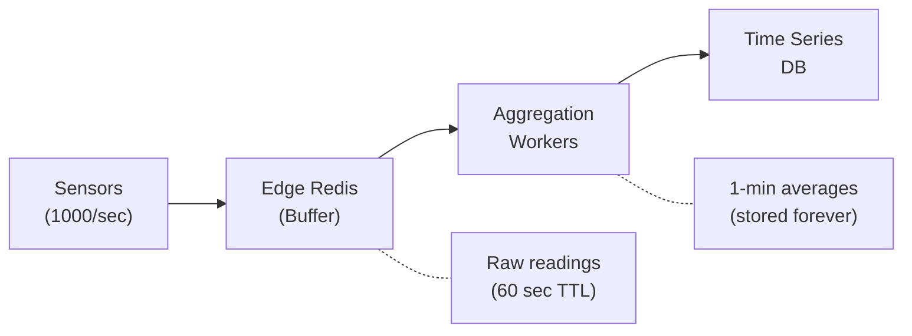

# How to Aggregate IoT Metrics with Redis

Author: [nawazdhandala](https://www.github.com/nawazdhandala)

Tags: Redis, IoT, Metrics, Aggregation, Time Series, Edge Computing, Data Summarization, Analytics

Description: A comprehensive guide to aggregating IoT metrics with Redis, covering edge computing patterns, real-time data summarization, time-windowed aggregations, and efficient storage for high-volume sensor data.

---

IoT systems generate massive volumes of raw sensor data that must be aggregated before storage and analysis. Redis serves as an excellent aggregation layer, summarizing high-frequency readings into meaningful metrics. This guide covers building efficient IoT metrics aggregation pipelines.

## Why Aggregate at the Edge?

Sending every sensor reading to a central database is often impractical:

1. **Bandwidth constraints** - Limited network capacity
2. **Storage costs** - Raw data volumes are enormous
3. **Query performance** - Aggregated data queries faster
4. **Real-time insights** - Pre-computed metrics enable instant dashboards
5. **Reduced latency** - Local aggregation responds faster

## Aggregation Architecture



## Basic Aggregation Implementation

```python
import redis
import json
import time
from typing import Dict, List, Optional
from dataclasses import dataclass
import statistics

@dataclass
class AggregatedMetric:
    device_id: str
    sensor_type: str
    window_start: float
    window_end: float
    count: int
    sum: float
    min: float
    max: float
    avg: float
    stddev: Optional[float]

class MetricsAggregator:
    def __init__(self, redis_client: redis.Redis):
        self.redis = redis_client
        self.window_seconds = 60  # 1-minute windows
        self.raw_ttl = 300  # Keep raw data for 5 minutes

    def record_reading(
        self,
        device_id: str,
        sensor_type: str,
        value: float,
        timestamp: float = None
    ):
        """Record a single sensor reading."""
        timestamp = timestamp or time.time()

        # Store in list for aggregation
        raw_key = f"raw:{device_id}:{sensor_type}"
        reading = json.dumps({
            "value": value,
            "timestamp": timestamp
        })

        pipe = self.redis.pipeline()
        pipe.rpush(raw_key, reading)
        pipe.expire(raw_key, self.raw_ttl)
        pipe.execute()

        # Update real-time stats
        self._update_realtime_stats(device_id, sensor_type, value, timestamp)

    def _update_realtime_stats(
        self,
        device_id: str,
        sensor_type: str,
        value: float,
        timestamp: float
    ):
        """Update rolling aggregation using Lua script."""
        window = int(timestamp // self.window_seconds) * self.window_seconds
        agg_key = f"agg:{device_id}:{sensor_type}:{window}"

        lua_script = """
        local key = KEYS[1]
        local value = tonumber(ARGV[1])
        local window_ttl = tonumber(ARGV[2])

        -- Increment count
        local count = redis.call('HINCRBY', key, 'count', 1)

        -- Update sum
        redis.call('HINCRBYFLOAT', key, 'sum', value)

        -- Update sum of squares (for stddev)
        redis.call('HINCRBYFLOAT', key, 'sum_sq', value * value)

        -- Update min
        local current_min = redis.call('HGET', key, 'min')
        if not current_min or value < tonumber(current_min) then
            redis.call('HSET', key, 'min', value)
        end

        -- Update max
        local current_max = redis.call('HGET', key, 'max')
        if not current_max or value > tonumber(current_max) then
            redis.call('HSET', key, 'max', value)
        end

        -- Store last value
        redis.call('HSET', key, 'last', value)

        -- Set TTL on first write
        if count == 1 then
            redis.call('EXPIRE', key, window_ttl)
        end

        return count
        """

        self.redis.eval(
            lua_script,
            1,
            agg_key,
            value,
            self.window_seconds * 10  # Keep for 10 windows
        )

    def get_current_aggregation(
        self,
        device_id: str,
        sensor_type: str
    ) -> Optional[AggregatedMetric]:
        """Get aggregation for the current time window."""
        now = time.time()
        window = int(now // self.window_seconds) * self.window_seconds
        return self._get_window_aggregation(device_id, sensor_type, window)

    def get_aggregations(
        self,
        device_id: str,
        sensor_type: str,
        num_windows: int = 10
    ) -> List[AggregatedMetric]:
        """Get aggregations for multiple recent windows."""
        now = time.time()
        current_window = int(now // self.window_seconds) * self.window_seconds

        aggregations = []
        for i in range(num_windows):
            window = current_window - (i * self.window_seconds)
            agg = self._get_window_aggregation(device_id, sensor_type, window)
            if agg:
                aggregations.append(agg)

        return list(reversed(aggregations))

    def _get_window_aggregation(
        self,
        device_id: str,
        sensor_type: str,
        window: int
    ) -> Optional[AggregatedMetric]:
        """Get aggregation for a specific window."""
        agg_key = f"agg:{device_id}:{sensor_type}:{window}"
        data = self.redis.hgetall(agg_key)

        if not data:
            return None

        count = int(data.get(b"count", 0))
        if count == 0:
            return None

        sum_val = float(data.get(b"sum", 0))
        sum_sq = float(data.get(b"sum_sq", 0))
        min_val = float(data.get(b"min", 0))
        max_val = float(data.get(b"max", 0))
        avg = sum_val / count

        # Calculate standard deviation
        variance = (sum_sq / count) - (avg ** 2)
        stddev = variance ** 0.5 if variance > 0 else 0

        return AggregatedMetric(
            device_id=device_id,
            sensor_type=sensor_type,
            window_start=window,
            window_end=window + self.window_seconds,
            count=count,
            sum=sum_val,
            min=min_val,
            max=max_val,
            avg=avg,
            stddev=stddev
        )

    def flush_to_timeseries(
        self,
        device_id: str,
        sensor_type: str,
        timeseries_writer: callable
    ) -> int:
        """Flush completed aggregations to time series database."""
        now = time.time()
        current_window = int(now // self.window_seconds) * self.window_seconds

        # Find completed windows (not current)
        pattern = f"agg:{device_id}:{sensor_type}:*"
        keys = self.redis.keys(pattern)

        flushed = 0
        for key in keys:
            key = key.decode() if isinstance(key, bytes) else key
            window = int(key.split(":")[-1])

            # Skip current window
            if window >= current_window:
                continue

            agg = self._get_window_aggregation(device_id, sensor_type, window)
            if agg:
                timeseries_writer(agg)
                self.redis.delete(key)
                flushed += 1

        return flushed
```

## Multi-Level Aggregation

Aggregate at different time granularities:

```python
class MultiLevelAggregator:
    def __init__(self, redis_client: redis.Redis):
        self.redis = redis_client
        self.levels = {
            "1m": 60,
            "5m": 300,
            "1h": 3600,
            "1d": 86400
        }

    def record_and_aggregate(
        self,
        device_id: str,
        sensor_type: str,
        value: float,
        timestamp: float = None
    ):
        """Record reading and update all aggregation levels."""
        timestamp = timestamp or time.time()

        pipe = self.redis.pipeline()

        for level_name, window_size in self.levels.items():
            window = int(timestamp // window_size) * window_size
            agg_key = f"agg:{level_name}:{device_id}:{sensor_type}:{window}"

            # Use same Lua script pattern for each level
            self._update_aggregation(pipe, agg_key, value, window_size)

        pipe.execute()

    def _update_aggregation(
        self,
        pipe,
        agg_key: str,
        value: float,
        ttl: int
    ):
        """Add aggregation update to pipeline."""
        lua_script = """
        local key = KEYS[1]
        local value = tonumber(ARGV[1])
        local ttl = tonumber(ARGV[2])

        local count = redis.call('HINCRBY', key, 'count', 1)
        redis.call('HINCRBYFLOAT', key, 'sum', value)

        local min = redis.call('HGET', key, 'min')
        if not min or value < tonumber(min) then
            redis.call('HSET', key, 'min', value)
        end

        local max = redis.call('HGET', key, 'max')
        if not max or value > tonumber(max) then
            redis.call('HSET', key, 'max', value)
        end

        if count == 1 then
            redis.call('EXPIRE', key, ttl)
        end

        return count
        """

        pipe.eval(lua_script, 1, agg_key, value, ttl * 2)

    def get_aggregation(
        self,
        device_id: str,
        sensor_type: str,
        level: str,
        window: int = None
    ) -> Optional[Dict]:
        """Get aggregation at a specific level."""
        if level not in self.levels:
            raise ValueError(f"Unknown level: {level}")

        window_size = self.levels[level]
        if window is None:
            window = int(time.time() // window_size) * window_size

        agg_key = f"agg:{level}:{device_id}:{sensor_type}:{window}"
        data = self.redis.hgetall(agg_key)

        if not data:
            return None

        count = int(data.get(b"count", 0))
        if count == 0:
            return None

        sum_val = float(data.get(b"sum", 0))

        return {
            "device_id": device_id,
            "sensor_type": sensor_type,
            "level": level,
            "window_start": window,
            "window_end": window + window_size,
            "count": count,
            "sum": sum_val,
            "avg": sum_val / count,
            "min": float(data.get(b"min", 0)),
            "max": float(data.get(b"max", 0))
        }

    def get_time_range(
        self,
        device_id: str,
        sensor_type: str,
        level: str,
        start_time: float,
        end_time: float
    ) -> List[Dict]:
        """Get aggregations over a time range."""
        window_size = self.levels[level]
        start_window = int(start_time // window_size) * window_size
        end_window = int(end_time // window_size) * window_size

        aggregations = []
        window = start_window

        while window <= end_window:
            agg = self.get_aggregation(device_id, sensor_type, level, window)
            if agg:
                aggregations.append(agg)
            window += window_size

        return aggregations
```

## Percentile Calculations

Track percentiles for latency and distribution metrics:

```python
class PercentileAggregator:
    def __init__(self, redis_client: redis.Redis):
        self.redis = redis_client
        self.window_seconds = 60
        self.max_samples = 1000  # Keep up to 1000 samples per window

    def record_value(
        self,
        metric_name: str,
        value: float,
        timestamp: float = None
    ):
        """Record a value for percentile calculation."""
        timestamp = timestamp or time.time()
        window = int(timestamp // self.window_seconds) * self.window_seconds
        samples_key = f"percentile:{metric_name}:{window}"

        pipe = self.redis.pipeline()

        # Add to sorted set (score = value for sorting)
        pipe.zadd(samples_key, {f"{timestamp}:{value}": value})

        # Trim to max samples
        pipe.zremrangebyrank(samples_key, 0, -self.max_samples - 1)

        # Set TTL
        pipe.expire(samples_key, self.window_seconds * 5)

        pipe.execute()

    def get_percentile(
        self,
        metric_name: str,
        percentile: float,
        window: int = None
    ) -> Optional[float]:
        """Get a specific percentile value."""
        if window is None:
            window = int(time.time() // self.window_seconds) * self.window_seconds

        samples_key = f"percentile:{metric_name}:{window}"
        count = self.redis.zcard(samples_key)

        if count == 0:
            return None

        # Calculate rank for percentile
        rank = int((percentile / 100) * (count - 1))
        result = self.redis.zrange(samples_key, rank, rank, withscores=True)

        if result:
            return result[0][1]
        return None

    def get_percentiles(
        self,
        metric_name: str,
        percentiles: List[float] = [50, 90, 95, 99],
        window: int = None
    ) -> Dict[float, float]:
        """Get multiple percentiles at once."""
        if window is None:
            window = int(time.time() // self.window_seconds) * self.window_seconds

        samples_key = f"percentile:{metric_name}:{window}"
        count = self.redis.zcard(samples_key)

        if count == 0:
            return {}

        results = {}
        for p in percentiles:
            rank = int((p / 100) * (count - 1))
            result = self.redis.zrange(samples_key, rank, rank, withscores=True)
            if result:
                results[p] = result[0][1]

        return results
```

## Node.js Implementation

```javascript
const Redis = require('ioredis');

class MetricsAggregator {
    constructor(redisConfig) {
        this.redis = new Redis(redisConfig);
        this.windowSeconds = 60;
    }

    async recordReading(deviceId, sensorType, value, timestamp = null) {
        timestamp = timestamp || Date.now() / 1000;
        const window = Math.floor(timestamp / this.windowSeconds) * this.windowSeconds;
        const aggKey = `agg:${deviceId}:${sensorType}:${window}`;

        const luaScript = `
            local key = KEYS[1]
            local value = tonumber(ARGV[1])
            local windowTtl = tonumber(ARGV[2])

            local count = redis.call('HINCRBY', key, 'count', 1)
            redis.call('HINCRBYFLOAT', key, 'sum', value)
            redis.call('HINCRBYFLOAT', key, 'sumSq', value * value)

            local currentMin = redis.call('HGET', key, 'min')
            if not currentMin or value < tonumber(currentMin) then
                redis.call('HSET', key, 'min', value)
            end

            local currentMax = redis.call('HGET', key, 'max')
            if not currentMax or value > tonumber(currentMax) then
                redis.call('HSET', key, 'max', value)
            end

            redis.call('HSET', key, 'last', value)

            if count == 1 then
                redis.call('EXPIRE', key, windowTtl)
            end

            return count
        `;

        await this.redis.eval(
            luaScript,
            1,
            aggKey,
            value,
            this.windowSeconds * 10
        );
    }

    async getCurrentAggregation(deviceId, sensorType) {
        const now = Date.now() / 1000;
        const window = Math.floor(now / this.windowSeconds) * this.windowSeconds;
        return this.getWindowAggregation(deviceId, sensorType, window);
    }

    async getWindowAggregation(deviceId, sensorType, window) {
        const aggKey = `agg:${deviceId}:${sensorType}:${window}`;
        const data = await this.redis.hgetall(aggKey);

        if (!data.count) return null;

        const count = parseInt(data.count);
        const sum = parseFloat(data.sum);
        const sumSq = parseFloat(data.sumSq || 0);
        const avg = sum / count;
        const variance = (sumSq / count) - (avg * avg);
        const stddev = variance > 0 ? Math.sqrt(variance) : 0;

        return {
            deviceId,
            sensorType,
            windowStart: window,
            windowEnd: window + this.windowSeconds,
            count,
            sum,
            avg,
            min: parseFloat(data.min),
            max: parseFloat(data.max),
            last: parseFloat(data.last),
            stddev
        };
    }

    async getRecentAggregations(deviceId, sensorType, numWindows = 10) {
        const now = Date.now() / 1000;
        const currentWindow = Math.floor(now / this.windowSeconds) * this.windowSeconds;

        const aggregations = [];
        for (let i = 0; i < numWindows; i++) {
            const window = currentWindow - (i * this.windowSeconds);
            const agg = await this.getWindowAggregation(deviceId, sensorType, window);
            if (agg) aggregations.push(agg);
        }

        return aggregations.reverse();
    }
}

// Multi-level aggregator
class MultiLevelAggregator {
    constructor(redisConfig) {
        this.redis = new Redis(redisConfig);
        this.levels = {
            '1m': 60,
            '5m': 300,
            '1h': 3600,
            '1d': 86400
        };
    }

    async recordAndAggregate(deviceId, sensorType, value, timestamp = null) {
        timestamp = timestamp || Date.now() / 1000;

        const pipeline = this.redis.pipeline();

        for (const [levelName, windowSize] of Object.entries(this.levels)) {
            const window = Math.floor(timestamp / windowSize) * windowSize;
            const aggKey = `agg:${levelName}:${deviceId}:${sensorType}:${window}`;

            const luaScript = `
                local key = KEYS[1]
                local value = tonumber(ARGV[1])
                local ttl = tonumber(ARGV[2])

                local count = redis.call('HINCRBY', key, 'count', 1)
                redis.call('HINCRBYFLOAT', key, 'sum', value)

                local min = redis.call('HGET', key, 'min')
                if not min or value < tonumber(min) then
                    redis.call('HSET', key, 'min', value)
                end

                local max = redis.call('HGET', key, 'max')
                if not max or value > tonumber(max) then
                    redis.call('HSET', key, 'max', value)
                end

                if count == 1 then
                    redis.call('EXPIRE', key, ttl)
                end

                return count
            `;

            pipeline.eval(luaScript, 1, aggKey, value, windowSize * 2);
        }

        await pipeline.exec();
    }
}

// Usage
const aggregator = new MetricsAggregator({ host: 'localhost', port: 6379 });

// Record readings (simulating high frequency)
for (let i = 0; i < 100; i++) {
    await aggregator.recordReading(
        'sensor-001',
        'temperature',
        20 + Math.random() * 10
    );
}

// Get aggregation
const agg = await aggregator.getCurrentAggregation('sensor-001', 'temperature');
console.log(agg);
```

## Best Practices

1. **Aggregate in Redis, store in TSDB** - Use Redis for real-time aggregation, flush to time series database for long-term storage.

2. **Choose appropriate window sizes** - Balance between granularity and storage costs.

3. **Use Lua scripts** - Ensure atomic updates of aggregation values.

4. **Set TTLs on aggregation keys** - Prevent memory bloat from stale data.

5. **Track sum of squares** - Enables standard deviation calculation without storing individual values.

6. **Implement multiple levels** - 1min, 5min, 1hour aggregations serve different query needs.

7. **Flush periodically** - Move completed aggregations to permanent storage.

## Conclusion

Redis provides an excellent foundation for IoT metrics aggregation. Its atomic operations ensure consistent aggregations even under high write loads, while TTLs automatically clean up old data. By pre-computing aggregations at the edge, you can dramatically reduce storage requirements and improve query performance.

For more IoT patterns with Redis, check out our guides on [IoT Data Ingestion](/blog/redis-iot-data-ingestion) and [Device State Management](/blog/redis-device-state-management).
