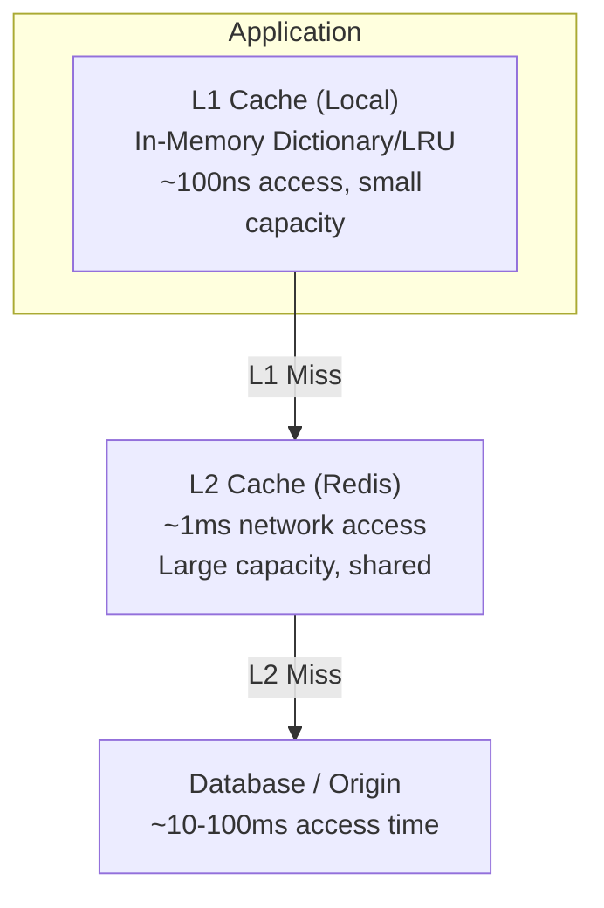

# How to Implement Multi-Level Caching with Redis

Author: [nawazdhandala](https://www.github.com/nawazdhandala)

Tags: Redis, Caching, Multi-Level Cache, L1 Cache, L2 Cache, Performance, Python, Node.js, Architecture

Description: A comprehensive guide to implementing multi-level caching with Redis as L2 cache and in-memory L1 cache. Learn cache hierarchies, invalidation across levels, and practical implementations for high-performance applications.

---

> When milliseconds matter, even Redis network latency can be too slow. Multi-level caching combines a fast local in-memory cache (L1) with Redis as a distributed cache (L2), giving you sub-microsecond local hits while maintaining consistency across multiple application instances.

The L1/L2 cache pattern is inspired by CPU cache hierarchies - small, fast caches backed by larger, slower ones.

---

## Understanding Multi-Level Caching

### Cache Hierarchy



### Performance Comparison

| Level | Technology | Latency | Capacity | Shared |
|-------|-----------|---------|----------|--------|
| L1 | In-memory dict | ~100ns | Limited (MB) | No (per-instance) |
| L2 | Redis | ~1ms | Large (GB) | Yes (all instances) |
| Origin | Database | ~10-100ms | Unlimited | Yes |

---

## Basic Multi-Level Cache Implementation

### Python Implementation

```python
import redis
import json
import time
from typing import Any, Optional, Callable
from functools import wraps
from collections import OrderedDict
import threading

class LRUCache:
    """Thread-safe LRU cache for L1"""

    def __init__(self, max_size: int = 1000):
        self.cache = OrderedDict()
        self.max_size = max_size
        self.lock = threading.RLock()

    def get(self, key: str) -> Optional[tuple]:
        """Get value and TTL expiry time"""
        with self.lock:
            if key not in self.cache:
                return None

            value, expiry = self.cache[key]

            # Check if expired
            if expiry and time.time() > expiry:
                del self.cache[key]
                return None

            # Move to end (most recently used)
            self.cache.move_to_end(key)

            return value

    def set(self, key: str, value: Any, ttl: int = None):
        """Set value with optional TTL"""
        with self.lock:
            expiry = time.time() + ttl if ttl else None

            if key in self.cache:
                self.cache.move_to_end(key)
            elif len(self.cache) >= self.max_size:
                # Remove oldest item
                self.cache.popitem(last=False)

            self.cache[key] = (value, expiry)

    def delete(self, key: str):
        """Delete key from cache"""
        with self.lock:
            self.cache.pop(key, None)

    def clear(self):
        """Clear all entries"""
        with self.lock:
            self.cache.clear()

class MultiLevelCache:
    """Two-level cache: L1 (local) + L2 (Redis)"""

    def __init__(
        self,
        redis_client,
        l1_max_size: int = 1000,
        l1_ttl: int = 60,
        l2_ttl: int = 300
    ):
        self.l1 = LRUCache(max_size=l1_max_size)
        self.l2 = redis_client
        self.l1_ttl = l1_ttl
        self.l2_ttl = l2_ttl

        # Metrics
        self.l1_hits = 0
        self.l2_hits = 0
        self.misses = 0

    def get(self, key: str) -> Optional[Any]:
        """
        Get value from cache hierarchy.
        Checks L1 first, then L2, promotes to L1 on L2 hit.
        """
        # Try L1 (local memory)
        value = self.l1.get(key)
        if value is not None:
            self.l1_hits += 1
            return value

        # Try L2 (Redis)
        l2_value = self.l2.get(key)
        if l2_value:
            self.l2_hits += 1
            value = json.loads(l2_value)

            # Promote to L1
            self.l1.set(key, value, self.l1_ttl)

            return value

        self.misses += 1
        return None

    def set(self, key: str, value: Any, l1_ttl: int = None, l2_ttl: int = None):
        """
        Set value in both cache levels.
        """
        l1_ttl = l1_ttl or self.l1_ttl
        l2_ttl = l2_ttl or self.l2_ttl

        # Set in L1
        self.l1.set(key, value, l1_ttl)

        # Set in L2
        self.l2.setex(key, l2_ttl, json.dumps(value, default=str))

    def delete(self, key: str):
        """Delete from both cache levels"""
        self.l1.delete(key)
        self.l2.delete(key)

    def get_or_set(
        self,
        key: str,
        fetch_fn: Callable,
        l1_ttl: int = None,
        l2_ttl: int = None
    ) -> Any:
        """
        Get from cache or fetch and cache.
        """
        value = self.get(key)
        if value is not None:
            return value

        # Fetch from origin
        value = fetch_fn()

        if value is not None:
            self.set(key, value, l1_ttl, l2_ttl)

        return value

    def get_stats(self) -> dict:
        """Get cache statistics"""
        total = self.l1_hits + self.l2_hits + self.misses
        return {
            'l1_hits': self.l1_hits,
            'l2_hits': self.l2_hits,
            'misses': self.misses,
            'l1_hit_rate': self.l1_hits / total if total > 0 else 0,
            'l2_hit_rate': self.l2_hits / total if total > 0 else 0,
            'total_hit_rate': (self.l1_hits + self.l2_hits) / total if total > 0 else 0
        }

# Usage
redis_client = redis.Redis(host='localhost', port=6379, decode_responses=True)
cache = MultiLevelCache(
    redis_client,
    l1_max_size=1000,
    l1_ttl=60,      # 1 minute in L1
    l2_ttl=300      # 5 minutes in L2
)

# Simple get/set
cache.set("user:123", {"id": 123, "name": "John"})
user = cache.get("user:123")  # L1 hit

# Get or fetch pattern
def fetch_user(user_id):
    return db.query("SELECT * FROM users WHERE id = ?", user_id)

user = cache.get_or_set(
    "user:456",
    lambda: fetch_user(456),
    l1_ttl=30,
    l2_ttl=300
)

# Check stats
print(cache.get_stats())
```

### Decorator for Multi-Level Caching

```python
def multilevel_cached(
    cache: MultiLevelCache,
    key_prefix: str,
    l1_ttl: int = 60,
    l2_ttl: int = 300
):
    """Decorator for multi-level caching"""
    def decorator(func: Callable):
        @wraps(func)
        def wrapper(*args, **kwargs):
            # Build cache key
            key_parts = [key_prefix] + [str(arg) for arg in args]
            key_parts += [f"{k}={v}" for k, v in sorted(kwargs.items())]
            cache_key = ":".join(key_parts)

            return cache.get_or_set(
                cache_key,
                lambda: func(*args, **kwargs),
                l1_ttl,
                l2_ttl
            )

        return wrapper
    return decorator

# Usage
@multilevel_cached(cache, "product", l1_ttl=30, l2_ttl=300)
def get_product(product_id: int) -> dict:
    return db.query("SELECT * FROM products WHERE id = ?", product_id)

# First call: L1 miss, L2 miss, DB fetch
product = get_product(123)

# Second call (same instance): L1 hit
product = get_product(123)
```

---

## Node.js Implementation

```javascript
const Redis = require('redis');

class LRUCache {
    constructor(maxSize = 1000) {
        this.cache = new Map();
        this.maxSize = maxSize;
    }

    get(key) {
        if (!this.cache.has(key)) {
            return null;
        }

        const { value, expiry } = this.cache.get(key);

        // Check expiry
        if (expiry && Date.now() > expiry) {
            this.cache.delete(key);
            return null;
        }

        // Move to end (most recently used)
        this.cache.delete(key);
        this.cache.set(key, { value, expiry });

        return value;
    }

    set(key, value, ttlMs = null) {
        const expiry = ttlMs ? Date.now() + ttlMs : null;

        // Delete if exists (to update position)
        this.cache.delete(key);

        // Evict oldest if at capacity
        if (this.cache.size >= this.maxSize) {
            const firstKey = this.cache.keys().next().value;
            this.cache.delete(firstKey);
        }

        this.cache.set(key, { value, expiry });
    }

    delete(key) {
        this.cache.delete(key);
    }

    clear() {
        this.cache.clear();
    }
}

class MultiLevelCache {
    constructor(options = {}) {
        this.l1 = new LRUCache(options.l1MaxSize || 1000);
        this.l2 = options.redisClient;
        this.l1TtlMs = (options.l1Ttl || 60) * 1000;
        this.l2Ttl = options.l2Ttl || 300;

        // Stats
        this.stats = { l1Hits: 0, l2Hits: 0, misses: 0 };
    }

    async get(key) {
        // Try L1
        const l1Value = this.l1.get(key);
        if (l1Value !== null) {
            this.stats.l1Hits++;
            return l1Value;
        }

        // Try L2
        const l2Value = await this.l2.get(key);
        if (l2Value) {
            this.stats.l2Hits++;
            const value = JSON.parse(l2Value);

            // Promote to L1
            this.l1.set(key, value, this.l1TtlMs);

            return value;
        }

        this.stats.misses++;
        return null;
    }

    async set(key, value, options = {}) {
        const l1TtlMs = (options.l1Ttl || this.l1TtlMs / 1000) * 1000;
        const l2Ttl = options.l2Ttl || this.l2Ttl;

        // Set in L1
        this.l1.set(key, value, l1TtlMs);

        // Set in L2
        await this.l2.setEx(key, l2Ttl, JSON.stringify(value));
    }

    async delete(key) {
        this.l1.delete(key);
        await this.l2.del(key);
    }

    async getOrSet(key, fetchFn, options = {}) {
        const cached = await this.get(key);
        if (cached !== null) {
            return cached;
        }

        const value = await fetchFn();

        if (value !== null && value !== undefined) {
            await this.set(key, value, options);
        }

        return value;
    }

    getStats() {
        const total = this.stats.l1Hits + this.stats.l2Hits + this.stats.misses;
        return {
            ...this.stats,
            l1HitRate: total > 0 ? this.stats.l1Hits / total : 0,
            l2HitRate: total > 0 ? this.stats.l2Hits / total : 0,
            totalHitRate: total > 0 ? (this.stats.l1Hits + this.stats.l2Hits) / total : 0
        };
    }
}

// Usage
const redisClient = Redis.createClient();
await redisClient.connect();

const cache = new MultiLevelCache({
    redisClient,
    l1MaxSize: 1000,
    l1Ttl: 60,    // seconds
    l2Ttl: 300    // seconds
});

// Get or fetch
const user = await cache.getOrSet(
    'user:123',
    async () => await db.query('SELECT * FROM users WHERE id = ?', [123]),
    { l1Ttl: 30, l2Ttl: 300 }
);
```

---

## Cache Invalidation Across Levels

### Pub/Sub Based Invalidation

```python
import redis
import threading
import json

class DistributedMultiLevelCache:
    """
    Multi-level cache with distributed invalidation via Pub/Sub.
    Ensures L1 caches across all instances stay consistent.
    """

    def __init__(self, redis_client, channel: str = "cache_invalidation"):
        self.l1 = LRUCache(max_size=1000)
        self.l2 = redis_client
        self.channel = channel
        self.pubsub = redis_client.pubsub()
        self.l1_ttl = 60
        self.l2_ttl = 300

        # Start invalidation listener
        self._start_listener()

    def _start_listener(self):
        """Listen for invalidation messages from other instances"""
        def listener():
            self.pubsub.subscribe(self.channel)

            for message in self.pubsub.listen():
                if message['type'] == 'message':
                    data = json.loads(message['data'])
                    self._handle_invalidation(data)

        thread = threading.Thread(target=listener, daemon=True)
        thread.start()

    def _handle_invalidation(self, data: dict):
        """Handle invalidation message"""
        action = data.get('action')
        key = data.get('key')
        pattern = data.get('pattern')

        if action == 'delete' and key:
            self.l1.delete(key)
        elif action == 'delete_pattern' and pattern:
            # Clear matching keys from L1
            # Note: This is simplified - real implementation would track keys
            self.l1.clear()

    def set(self, key: str, value: Any):
        """Set in both levels"""
        self.l1.set(key, value, self.l1_ttl)
        self.l2.setex(key, self.l2_ttl, json.dumps(value, default=str))

    def get(self, key: str) -> Optional[Any]:
        """Get from cache hierarchy"""
        # Try L1
        value = self.l1.get(key)
        if value is not None:
            return value

        # Try L2
        l2_value = self.l2.get(key)
        if l2_value:
            value = json.loads(l2_value)
            self.l1.set(key, value, self.l1_ttl)
            return value

        return None

    def delete(self, key: str):
        """Delete from both levels and notify other instances"""
        self.l1.delete(key)
        self.l2.delete(key)

        # Notify other instances to invalidate their L1
        self.l2.publish(self.channel, json.dumps({
            'action': 'delete',
            'key': key
        }))

    def delete_pattern(self, pattern: str):
        """Delete all keys matching pattern"""
        # Delete from L2
        cursor = 0
        while True:
            cursor, keys = self.l2.scan(cursor, match=pattern, count=100)
            if keys:
                self.l2.delete(*keys)
            if cursor == 0:
                break

        # Clear L1 and notify other instances
        self.l1.clear()
        self.l2.publish(self.channel, json.dumps({
            'action': 'delete_pattern',
            'pattern': pattern
        }))

# Usage across multiple application instances
cache = DistributedMultiLevelCache(redis_client)

# Instance 1 updates data
cache.set("user:123", {"id": 123, "name": "John"})

# Instance 2 reads (gets from L2, populates L1)
user = cache.get("user:123")

# Instance 1 invalidates
cache.delete("user:123")
# Instance 2's L1 is also invalidated via Pub/Sub
```

### Version-Based Invalidation

```python
class VersionedMultiLevelCache:
    """
    Multi-level cache with version-based invalidation.
    Simpler than Pub/Sub but requires version checks.
    """

    def __init__(self, redis_client):
        self.l1 = {}  # Simple dict with versions
        self.l2 = redis_client

    def _get_version(self, namespace: str) -> int:
        """Get current version for namespace"""
        version = self.l2.get(f"version:{namespace}")
        return int(version) if version else 1

    def _increment_version(self, namespace: str) -> int:
        """Increment version to invalidate all keys in namespace"""
        return self.l2.incr(f"version:{namespace}")

    def get(self, namespace: str, key: str) -> Optional[Any]:
        """Get with version checking"""
        current_version = self._get_version(namespace)
        full_key = f"{namespace}:v{current_version}:{key}"

        # Check L1
        if full_key in self.l1:
            entry = self.l1[full_key]
            if time.time() < entry['expiry']:
                return entry['value']
            else:
                del self.l1[full_key]

        # Check L2
        l2_value = self.l2.get(full_key)
        if l2_value:
            value = json.loads(l2_value)
            self.l1[full_key] = {
                'value': value,
                'expiry': time.time() + 60
            }
            return value

        return None

    def set(self, namespace: str, key: str, value: Any, ttl: int = 300):
        """Set with current version"""
        current_version = self._get_version(namespace)
        full_key = f"{namespace}:v{current_version}:{key}"

        # Set L1
        self.l1[full_key] = {
            'value': value,
            'expiry': time.time() + 60
        }

        # Set L2
        self.l2.setex(full_key, ttl, json.dumps(value, default=str))

    def invalidate_namespace(self, namespace: str):
        """
        Invalidate all keys in namespace by incrementing version.
        Old versioned keys will naturally expire.
        """
        self._increment_version(namespace)

        # Clear L1 entries for this namespace
        keys_to_delete = [k for k in self.l1 if k.startswith(f"{namespace}:")]
        for k in keys_to_delete:
            del self.l1[k]

# Usage
cache = VersionedMultiLevelCache(redis_client)

# Set with namespace
cache.set("products", "123", {"id": 123, "name": "Widget"})
cache.set("products", "456", {"id": 456, "name": "Gadget"})

# Invalidate entire namespace (e.g., after bulk import)
cache.invalidate_namespace("products")
# All product keys are now stale - new version will be used
```

---

## Advanced Patterns

### Tiered TTLs Based on Access Frequency

```python
class AdaptiveMultiLevelCache:
    """
    Cache that adjusts L1 TTL based on access frequency.
    Hot keys stay in L1 longer.
    """

    def __init__(self, redis_client):
        self.l1 = LRUCache(max_size=1000)
        self.l2 = redis_client
        self.access_counts = {}
        self.base_l1_ttl = 30  # Base TTL in seconds
        self.max_l1_ttl = 300  # Max TTL in seconds

    def _calculate_l1_ttl(self, key: str) -> int:
        """Calculate L1 TTL based on access frequency"""
        count = self.access_counts.get(key, 0)

        # More accesses = longer TTL (up to max)
        ttl = min(self.base_l1_ttl * (1 + count // 10), self.max_l1_ttl)

        return ttl

    def get(self, key: str) -> Optional[Any]:
        """Get with access tracking"""
        # Track access
        self.access_counts[key] = self.access_counts.get(key, 0) + 1

        # Try L1
        value = self.l1.get(key)
        if value is not None:
            return value

        # Try L2
        l2_value = self.l2.get(key)
        if l2_value:
            value = json.loads(l2_value)

            # Promote to L1 with adaptive TTL
            l1_ttl = self._calculate_l1_ttl(key)
            self.l1.set(key, value, l1_ttl)

            return value

        return None

    def set(self, key: str, value: Any, l2_ttl: int = 300):
        """Set in both levels with adaptive L1 TTL"""
        l1_ttl = self._calculate_l1_ttl(key)

        self.l1.set(key, value, l1_ttl)
        self.l2.setex(key, l2_ttl, json.dumps(value, default=str))
```

### Read-Through with Write-Around

```python
class ReadThroughWriteAroundCache:
    """
    Read-through: Automatically fetch on miss
    Write-around: Writes go directly to DB, invalidating cache
    """

    def __init__(self, redis_client, db_client):
        self.l1 = LRUCache(max_size=1000)
        self.l2 = redis_client
        self.db = db_client

    def get(self, entity_type: str, entity_id: int) -> Optional[dict]:
        """Read-through get"""
        key = f"{entity_type}:{entity_id}"

        # Try L1
        value = self.l1.get(key)
        if value is not None:
            return value

        # Try L2
        l2_value = self.l2.get(key)
        if l2_value:
            value = json.loads(l2_value)
            self.l1.set(key, value, 60)
            return value

        # Fetch from database
        value = self._fetch_from_db(entity_type, entity_id)

        if value:
            self.l1.set(key, value, 60)
            self.l2.setex(key, 300, json.dumps(value, default=str))

        return value

    def write(self, entity_type: str, entity_id: int, data: dict):
        """Write-around: Write to DB and invalidate cache"""
        key = f"{entity_type}:{entity_id}"

        # Write to database
        self._write_to_db(entity_type, entity_id, data)

        # Invalidate cache (don't populate - let next read do it)
        self.l1.delete(key)
        self.l2.delete(key)

    def _fetch_from_db(self, entity_type: str, entity_id: int) -> dict:
        # Implement database fetch
        pass

    def _write_to_db(self, entity_type: str, entity_id: int, data: dict):
        # Implement database write
        pass
```

---

## Monitoring Multi-Level Cache

```python
from prometheus_client import Counter, Gauge, Histogram

# Metrics
cache_operations = Counter(
    'multilevel_cache_operations_total',
    'Cache operations',
    ['level', 'operation', 'result']
)

cache_latency = Histogram(
    'multilevel_cache_latency_seconds',
    'Cache operation latency',
    ['level']
)

l1_size = Gauge(
    'multilevel_cache_l1_size',
    'L1 cache size'
)

class InstrumentedMultiLevelCache(MultiLevelCache):
    """Multi-level cache with Prometheus metrics"""

    def get(self, key: str) -> Optional[Any]:
        # Try L1
        with cache_latency.labels(level='l1').time():
            value = self.l1.get(key)

        if value is not None:
            cache_operations.labels(level='l1', operation='get', result='hit').inc()
            return value

        cache_operations.labels(level='l1', operation='get', result='miss').inc()

        # Try L2
        with cache_latency.labels(level='l2').time():
            l2_value = self.l2.get(key)

        if l2_value:
            cache_operations.labels(level='l2', operation='get', result='hit').inc()
            value = json.loads(l2_value)
            self.l1.set(key, value, self.l1_ttl)
            l1_size.set(len(self.l1.cache))
            return value

        cache_operations.labels(level='l2', operation='get', result='miss').inc()
        return None
```

---

## Best Practices

### 1. Size L1 Cache Appropriately

```python
# Calculate L1 size based on available memory
import sys

def calculate_l1_size(avg_object_size_bytes: int, max_memory_mb: int) -> int:
    """Calculate max L1 entries based on memory budget"""
    max_memory_bytes = max_memory_mb * 1024 * 1024
    return max_memory_bytes // avg_object_size_bytes

# Example: 100MB budget, 1KB average object
l1_max_size = calculate_l1_size(1024, 100)  # ~100,000 entries
```

### 2. Use Shorter L1 TTLs

```python
# L1 TTL should be shorter than L2
# This ensures L1 refreshes from L2 frequently enough to catch updates

L1_TTL = 30   # 30 seconds
L2_TTL = 300  # 5 minutes

# For highly volatile data
L1_TTL = 5    # 5 seconds
L2_TTL = 60   # 1 minute
```

### 3. Handle Cold Start

```python
class WarmableMultiLevelCache(MultiLevelCache):
    """Cache that can be pre-warmed"""

    async def warm(self, keys: List[str]):
        """Pre-populate L1 from L2"""
        for key in keys:
            l2_value = self.l2.get(key)
            if l2_value:
                self.l1.set(key, json.loads(l2_value), self.l1_ttl)

    async def warm_from_db(self, query_fn: Callable, key_fn: Callable):
        """Pre-populate both levels from database"""
        results = await query_fn()

        for item in results:
            key = key_fn(item)
            self.set(key, item)
```

---

## Conclusion

Multi-level caching provides the best of both worlds:

- **L1 (local)**: Sub-microsecond access for hot data
- **L2 (Redis)**: Shared cache across instances with persistence

Key takeaways:
- Use shorter TTLs for L1 than L2
- Implement distributed invalidation for L1 consistency
- Monitor hit rates at each level to optimize sizing
- Consider adaptive TTLs based on access patterns

---

*Need to monitor your multi-level cache performance? [OneUptime](https://oneuptime.com) provides comprehensive caching metrics with per-level hit rates, latency tracking, and capacity alerts.*
