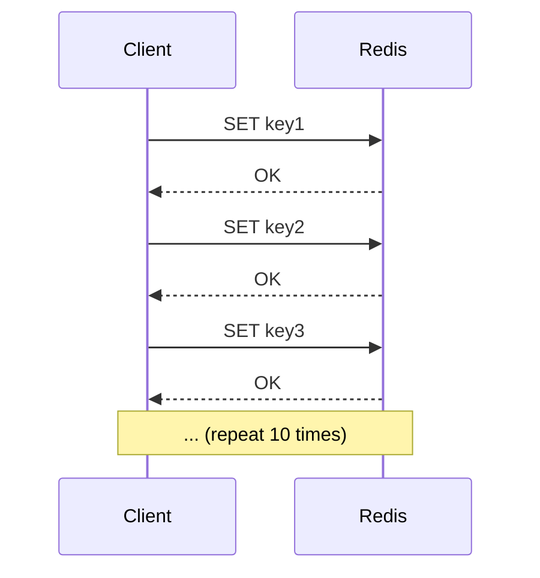
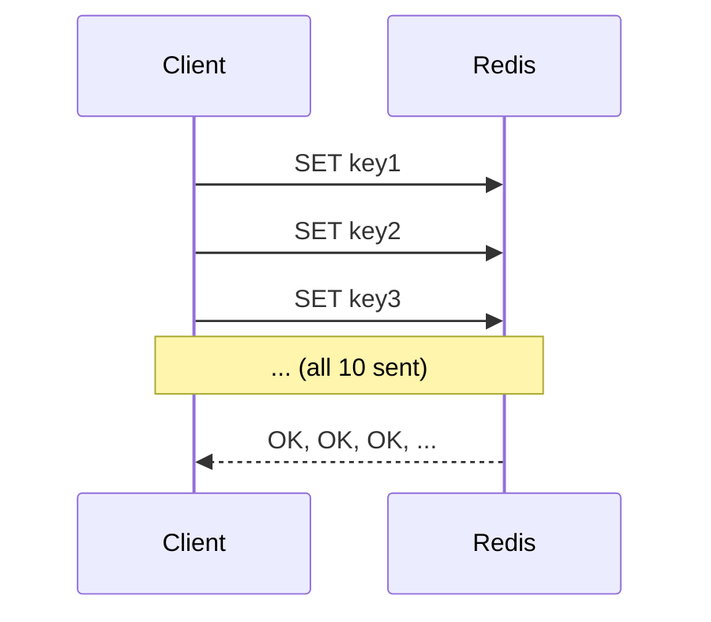

# How to Use Redis Pipelining for Batch Operations

Author: [nawazdhandala](https://www.github.com/nawazdhandala)

Tags: Redis, Pipelining, Batch Operations, Performance, Throughput, Network Optimization, Python, Node.js

Description: A comprehensive guide to using Redis pipelining for batch operations. Learn how to reduce round-trips, improve throughput, and implement efficient batch processing patterns.

---

> Every Redis command requires a network round-trip. When executing hundreds of commands, network latency dominates execution time. Pipelining batches multiple commands into a single request, dramatically reducing round-trips and improving throughput by 5-10x or more.

Pipelining is one of the simplest and most effective Redis optimizations. This guide covers implementation patterns, best practices, and common pitfalls.

---

## Understanding Pipelining

### The Network Round-Trip Problem

**Without Pipelining (10 commands):**



Total time: 10 * (network_latency * 2 + command_time)
Example: 10 * (1ms * 2 + 0.1ms) = 21ms

**With Pipelining (10 commands):**



Total time: network_latency * 2 + 10 * command_time
Example: 1ms * 2 + 10 * 0.1ms = 3ms

**Speedup: 21ms / 3ms = 7x faster**

### When to Use Pipelining

- Executing multiple independent commands
- Bulk data loading
- Batch updates (incrementing counters, setting flags)
- Read-modify-write patterns (when atomicity not required)

### When NOT to Use Pipelining

- Commands that depend on previous results
- When you need atomicity (use transactions instead)
- Single commands (no benefit)

---

## Basic Pipelining

### Python with redis-py

```python
import redis
import time

r = redis.Redis(host='localhost', port=6379, decode_responses=True)

# Without pipelining - slow
def set_without_pipeline(keys_values):
    for key, value in keys_values.items():
        r.set(key, value)

# With pipelining - fast
def set_with_pipeline(keys_values):
    pipe = r.pipeline()
    for key, value in keys_values.items():
        pipe.set(key, value)
    return pipe.execute()

# Benchmark
data = {f"key:{i}": f"value:{i}" for i in range(1000)}

start = time.time()
set_without_pipeline(data)
print(f"Without pipeline: {time.time() - start:.3f}s")

start = time.time()
set_with_pipeline(data)
print(f"With pipeline: {time.time() - start:.3f}s")

# Example output:
# Without pipeline: 1.234s
# With pipeline: 0.045s
```

### Reading Results

```python
# Pipeline returns list of results in order
pipe = r.pipeline()
pipe.set("name", "John")
pipe.get("name")
pipe.incr("counter")
pipe.hgetall("user:1000")

results = pipe.execute()
# results = [True, "John", 1, {"name": "John", "email": "..."}]

# Unpack results
set_result, name, counter, user = results
```

### Node.js with ioredis

```javascript
const Redis = require('ioredis');
const redis = new Redis();

// Basic pipeline
async function setWithPipeline(keysValues) {
    const pipeline = redis.pipeline();

    for (const [key, value] of Object.entries(keysValues)) {
        pipeline.set(key, value);
    }

    const results = await pipeline.exec();
    return results;
}

// Usage
const data = {};
for (let i = 0; i < 1000; i++) {
    data[`key:${i}`] = `value:${i}`;
}

console.time('pipeline');
await setWithPipeline(data);
console.timeEnd('pipeline');

// Reading results
const pipeline = redis.pipeline();
pipeline.set('name', 'John');
pipeline.get('name');
pipeline.incr('counter');

const results = await pipeline.exec();
// results = [[null, 'OK'], [null, 'John'], [null, 1]]
// Each result is [error, value]

for (const [err, result] of results) {
    if (err) {
        console.error('Error:', err);
    } else {
        console.log('Result:', result);
    }
}
```

---

## Chunked Pipelining

### Why Chunk Pipelines

Large pipelines can:
- Consume too much memory on client and server
- Block Redis for too long
- Cause network issues with huge payloads

### Chunked Implementation

```python
def chunked_pipeline(r, operations, chunk_size=1000):
    """
    Execute operations in chunks to avoid memory issues.

    Args:
        r: Redis client
        operations: List of (command, args, kwargs) tuples
        chunk_size: Operations per pipeline

    Returns:
        List of all results
    """
    all_results = []

    for i in range(0, len(operations), chunk_size):
        chunk = operations[i:i + chunk_size]

        pipe = r.pipeline()
        for cmd, args, kwargs in chunk:
            getattr(pipe, cmd)(*args, **kwargs)

        results = pipe.execute()
        all_results.extend(results)

    return all_results

# Usage
operations = []
for i in range(100000):
    operations.append(('set', (f'key:{i}', f'value:{i}'), {}))

results = chunked_pipeline(r, operations, chunk_size=5000)
print(f"Set {len(results)} keys")
```

### Generator-Based Chunking

```python
def pipeline_chunks(r, operations, chunk_size=1000):
    """Generator that yields results as chunks complete"""
    pipe = r.pipeline()
    count = 0

    for cmd, args, kwargs in operations:
        getattr(pipe, cmd)(*args, **kwargs)
        count += 1

        if count >= chunk_size:
            yield pipe.execute()
            pipe = r.pipeline()
            count = 0

    # Execute remaining
    if count > 0:
        yield pipe.execute()

# Usage with progress tracking
def bulk_set(r, data_generator, chunk_size=5000):
    total = 0

    operations = ((f'set', (k, v), {}) for k, v in data_generator)

    for chunk_results in pipeline_chunks(r, operations, chunk_size):
        total += len(chunk_results)
        print(f"Processed {total} operations")

    return total
```

---

## Common Patterns

### Bulk Loading

```python
def bulk_load_users(r, users):
    """Load many users efficiently"""
    pipe = r.pipeline()

    for user in users:
        user_key = f"user:{user['id']}"

        # Set user hash
        pipe.hset(user_key, mapping={
            'name': user['name'],
            'email': user['email'],
            'created_at': user['created_at']
        })

        # Add to user index
        pipe.sadd('users:all', user['id'])

        # Add to email index
        pipe.set(f"email:{user['email']}", user['id'])

        # Set TTL if needed
        if user.get('temporary'):
            pipe.expire(user_key, 3600)

    results = pipe.execute()

    # Count successful operations
    return sum(1 for r in results if r)

# Usage
users = [
    {'id': 1, 'name': 'Alice', 'email': 'alice@example.com', 'created_at': '2024-01-01'},
    {'id': 2, 'name': 'Bob', 'email': 'bob@example.com', 'created_at': '2024-01-02'},
    # ... thousands more
]

loaded = bulk_load_users(r, users)
print(f"Loaded {loaded} users")
```

### Batch Counter Updates

```python
def increment_counters(r, counter_updates):
    """
    Increment multiple counters atomically.

    Args:
        counter_updates: Dict of {counter_key: increment_value}
    """
    pipe = r.pipeline()

    for key, increment in counter_updates.items():
        pipe.incrby(key, increment)

    return pipe.execute()

# Usage
updates = {
    'stats:page_views': 150,
    'stats:api_calls': 42,
    'stats:errors': 3,
    'user:1000:actions': 5
}

new_values = increment_counters(r, updates)
# new_values = [150, 42, 3, 5] (assuming counters started at 0)
```

### Batch Gets

```python
def mget_with_pipeline(r, keys):
    """Get multiple keys using pipeline (alternative to MGET)"""
    pipe = r.pipeline()

    for key in keys:
        pipe.get(key)

    return dict(zip(keys, pipe.execute()))

def mhgetall_with_pipeline(r, keys):
    """Get multiple hashes"""
    pipe = r.pipeline()

    for key in keys:
        pipe.hgetall(key)

    return dict(zip(keys, pipe.execute()))

# Usage
user_ids = [1, 2, 3, 4, 5]
user_keys = [f"user:{id}" for id in user_ids]

users = mhgetall_with_pipeline(r, user_keys)
# users = {'user:1': {...}, 'user:2': {...}, ...}
```

### Conditional Batch Operations

```python
def batch_set_if_not_exists(r, keys_values, chunk_size=1000):
    """
    Set multiple keys only if they don't exist.
    Returns dict of {key: was_set}.
    """
    results = {}

    items = list(keys_values.items())

    for i in range(0, len(items), chunk_size):
        chunk = items[i:i + chunk_size]

        pipe = r.pipeline()
        for key, value in chunk:
            pipe.setnx(key, value)

        chunk_results = pipe.execute()

        for (key, _), was_set in zip(chunk, chunk_results):
            results[key] = bool(was_set)

    return results

# Usage
data = {f"cache:{i}": f"value:{i}" for i in range(1000)}
set_results = batch_set_if_not_exists(r, data)
newly_set = sum(set_results.values())
print(f"Set {newly_set} new keys")
```

---

## Pipeline vs Transaction

### Key Differences

```python
# Pipeline: Commands may interleave with other clients
pipe = r.pipeline(transaction=False)  # Explicit non-transaction
pipe.incr("counter")
pipe.incr("counter")
pipe.execute()
# Another client could read counter between increments

# Transaction (MULTI/EXEC): Atomic execution
pipe = r.pipeline(transaction=True)  # Default in redis-py
pipe.incr("counter")
pipe.incr("counter")
pipe.execute()
# Wrapped in MULTI/EXEC - atomic

# Pipeline without transaction is faster when atomicity not needed
```

### When to Use Each

```python
# Use non-transactional pipeline for:
# - Bulk reads (no write conflicts)
# - Independent writes (order doesn't matter)
# - Maximum throughput

pipe = r.pipeline(transaction=False)
for i in range(1000):
    pipe.set(f"key:{i}", f"value:{i}")
pipe.execute()

# Use transaction pipeline for:
# - Atomic multi-key updates
# - When you need all-or-nothing semantics

pipe = r.pipeline(transaction=True)
pipe.decrby("account:A", 100)
pipe.incrby("account:B", 100)
pipe.execute()  # Transfer is atomic
```

---

## Error Handling

### Handling Partial Failures

```python
def pipeline_with_error_handling(r, operations):
    """Execute pipeline and handle individual errors"""
    pipe = r.pipeline(transaction=False)

    for cmd, args, kwargs in operations:
        getattr(pipe, cmd)(*args, **kwargs)

    # raise_on_error=False returns exceptions instead of raising
    results = pipe.execute(raise_on_error=False)

    successes = []
    failures = []

    for i, (result, (cmd, args, kwargs)) in enumerate(zip(results, operations)):
        if isinstance(result, Exception):
            failures.append({
                'index': i,
                'operation': (cmd, args, kwargs),
                'error': str(result)
            })
        else:
            successes.append({
                'index': i,
                'operation': (cmd, args, kwargs),
                'result': result
            })

    return successes, failures

# Usage
operations = [
    ('set', ('key1', 'value1'), {}),
    ('incr', ('not_a_number',), {}),  # This will fail if value is not integer
    ('set', ('key2', 'value2'), {}),
]

successes, failures = pipeline_with_error_handling(r, operations)
print(f"Successes: {len(successes)}, Failures: {len(failures)}")
for failure in failures:
    print(f"Failed: {failure['operation']} - {failure['error']}")
```

### Node.js Error Handling

```javascript
async function pipelineWithErrorHandling(redis, operations) {
    const pipeline = redis.pipeline();

    for (const [cmd, ...args] of operations) {
        pipeline[cmd](...args);
    }

    const results = await pipeline.exec();

    const successes = [];
    const failures = [];

    results.forEach(([err, result], index) => {
        if (err) {
            failures.push({
                index,
                operation: operations[index],
                error: err.message
            });
        } else {
            successes.push({
                index,
                operation: operations[index],
                result
            });
        }
    });

    return { successes, failures };
}
```

---

## Performance Tips

### Optimal Chunk Size

```python
import time

def find_optimal_chunk_size(r, num_operations=10000):
    """Benchmark different chunk sizes"""
    operations = [(f'key:{i}', f'value:{i}') for i in range(num_operations)]

    results = {}

    for chunk_size in [100, 500, 1000, 2000, 5000, 10000]:
        start = time.time()

        for i in range(0, len(operations), chunk_size):
            chunk = operations[i:i + chunk_size]
            pipe = r.pipeline(transaction=False)
            for key, value in chunk:
                pipe.set(key, value)
            pipe.execute()

        elapsed = time.time() - start
        ops_per_sec = num_operations / elapsed
        results[chunk_size] = ops_per_sec

        print(f"Chunk size {chunk_size}: {ops_per_sec:.0f} ops/sec")

    optimal = max(results, key=results.get)
    print(f"\nOptimal chunk size: {optimal}")
    return optimal

# Typical result: 1000-5000 is usually optimal
# Depends on value size, network latency, etc.
```

### Disable Response Parsing

```python
# For fire-and-forget operations
pipe = r.pipeline(transaction=False)
for i in range(10000):
    pipe.set(f"key:{i}", f"value:{i}")
pipe.execute()  # Returns all results

# If you don't need results, still need to execute
# but can ignore return value
```

---

## Conclusion

Redis pipelining provides massive performance improvements:

- **Reduce network round-trips**: Batch commands into single request
- **Improve throughput**: 5-10x or more speedup
- **Simple to implement**: Minor code changes for major gains

Key takeaways:
- Use pipelining for bulk operations
- Chunk large pipelines (1000-5000 commands per chunk)
- Use non-transactional pipelines when atomicity isn't needed
- Handle partial failures appropriately

---

*Need to monitor your Redis performance? [OneUptime](https://oneuptime.com) provides comprehensive Redis monitoring with command latency tracking, throughput metrics, and performance alerts.*
