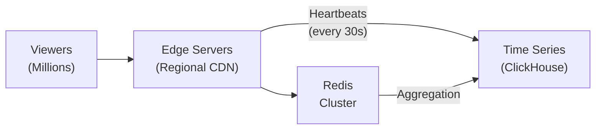

# How to Build a Streaming View Counter with Redis

Author: [nawazdhandala](https://www.github.com/nawazdhandala)

Tags: Redis, Streaming, View Counter, Real-Time, HyperLogLog, Analytics, Live Video, Twitch

Description: A comprehensive guide to building real-time streaming view counters with Redis, covering concurrent viewer tracking, unique viewer counts, engagement metrics, and scalable architectures for live video platforms.

---

Live streaming platforms need accurate, real-time viewer counts that can handle millions of concurrent connections. Whether you're building a Twitch-like platform, live event streaming, or real-time webinars, Redis provides the speed and data structures needed to track viewer metrics at scale. This guide covers building production-ready view counters.

## Understanding Streaming Metrics

Streaming platforms typically track several viewer metrics:

1. **Concurrent viewers** - How many people are watching right now
2. **Unique viewers** - Total distinct viewers over a period
3. **Peak concurrent** - Maximum simultaneous viewers
4. **Watch time** - How long viewers stay engaged
5. **Geographic distribution** - Where viewers are located
6. **Engagement events** - Chat, reactions, interactions

## Architecture Overview



## Basic View Counter

### Simple Counter Implementation

```python
import redis
import time
from typing import Dict, List, Optional
from dataclasses import dataclass

@dataclass
class ViewerSession:
    viewer_id: str
    stream_id: str
    started_at: float
    last_heartbeat: float
    metadata: Dict = None

class StreamViewCounter:
    def __init__(self, redis_client: redis.Redis):
        self.redis = redis_client
        self.heartbeat_timeout = 60  # Viewer considered gone after 60s
        self.heartbeat_interval = 30  # Expected heartbeat every 30s

    def join_stream(
        self,
        stream_id: str,
        viewer_id: str,
        metadata: Dict = None
    ) -> Dict:
        """Record a viewer joining a stream."""
        now = time.time()
        viewer_key = f"stream:{stream_id}:viewer:{viewer_id}"
        active_viewers_key = f"stream:{stream_id}:active_viewers"
        unique_viewers_key = f"stream:{stream_id}:unique_viewers"

        session_data = {
            "viewer_id": viewer_id,
            "stream_id": stream_id,
            "started_at": now,
            "last_heartbeat": now,
            "metadata": metadata or {}
        }

        pipe = self.redis.pipeline()

        # Store viewer session
        pipe.hset(viewer_key, mapping={
            "started_at": str(now),
            "last_heartbeat": str(now),
            "metadata": str(metadata or {})
        })
        pipe.expire(viewer_key, self.heartbeat_timeout)

        # Add to active viewers set with timestamp as score
        pipe.zadd(active_viewers_key, {viewer_id: now})

        # Add to unique viewers (HyperLogLog for memory efficiency)
        pipe.pfadd(unique_viewers_key, viewer_id)

        # Increment total join counter
        pipe.incr(f"stream:{stream_id}:total_joins")

        pipe.execute()

        # Get current viewer count
        viewer_count = self._get_active_viewer_count(stream_id)

        # Update peak if necessary
        self._update_peak_viewers(stream_id, viewer_count)

        return {
            "stream_id": stream_id,
            "viewer_id": viewer_id,
            "current_viewers": viewer_count,
            "joined_at": now
        }

    def heartbeat(self, stream_id: str, viewer_id: str) -> Dict:
        """Record a viewer heartbeat to keep them in the active count."""
        now = time.time()
        viewer_key = f"stream:{stream_id}:viewer:{viewer_id}"
        active_viewers_key = f"stream:{stream_id}:active_viewers"

        pipe = self.redis.pipeline()

        # Update last heartbeat
        pipe.hset(viewer_key, "last_heartbeat", str(now))
        pipe.expire(viewer_key, self.heartbeat_timeout)

        # Update score in active viewers
        pipe.zadd(active_viewers_key, {viewer_id: now})

        pipe.execute()

        return {
            "stream_id": stream_id,
            "viewer_id": viewer_id,
            "heartbeat_at": now
        }

    def leave_stream(
        self,
        stream_id: str,
        viewer_id: str
    ) -> Dict:
        """Record a viewer leaving a stream."""
        viewer_key = f"stream:{stream_id}:viewer:{viewer_id}"
        active_viewers_key = f"stream:{stream_id}:active_viewers"

        # Get session data for watch time calculation
        session_data = self.redis.hgetall(viewer_key)

        watch_time = 0
        if session_data:
            started_at = float(session_data.get(b"started_at", time.time()))
            watch_time = time.time() - started_at

            # Accumulate total watch time
            self.redis.incrbyfloat(
                f"stream:{stream_id}:total_watch_time",
                watch_time
            )

        pipe = self.redis.pipeline()
        pipe.delete(viewer_key)
        pipe.zrem(active_viewers_key, viewer_id)
        pipe.execute()

        return {
            "stream_id": stream_id,
            "viewer_id": viewer_id,
            "watch_time_seconds": watch_time
        }

    def _get_active_viewer_count(self, stream_id: str) -> int:
        """Get current active viewer count."""
        active_viewers_key = f"stream:{stream_id}:active_viewers"
        cutoff = time.time() - self.heartbeat_timeout

        # Remove stale viewers and count active ones
        pipe = self.redis.pipeline()
        pipe.zremrangebyscore(active_viewers_key, "-inf", cutoff)
        pipe.zcard(active_viewers_key)
        results = pipe.execute()

        return results[1]

    def _update_peak_viewers(self, stream_id: str, current_count: int):
        """Update peak viewer count if current exceeds it."""
        peak_key = f"stream:{stream_id}:peak_viewers"

        # Use Lua script for atomic compare-and-set
        lua_script = """
        local peak_key = KEYS[1]
        local current = tonumber(ARGV[1])

        local peak = tonumber(redis.call('GET', peak_key) or 0)

        if current > peak then
            redis.call('SET', peak_key, current)
            return current
        end

        return peak
        """

        self.redis.eval(lua_script, 1, peak_key, current_count)

    def get_stream_stats(self, stream_id: str) -> Dict:
        """Get comprehensive stream statistics."""
        pipe = self.redis.pipeline()

        active_viewers_key = f"stream:{stream_id}:active_viewers"
        unique_viewers_key = f"stream:{stream_id}:unique_viewers"

        # Clean up stale viewers first
        cutoff = time.time() - self.heartbeat_timeout
        pipe.zremrangebyscore(active_viewers_key, "-inf", cutoff)

        # Get stats
        pipe.zcard(active_viewers_key)
        pipe.pfcount(unique_viewers_key)
        pipe.get(f"stream:{stream_id}:peak_viewers")
        pipe.get(f"stream:{stream_id}:total_joins")
        pipe.get(f"stream:{stream_id}:total_watch_time")

        results = pipe.execute()

        return {
            "stream_id": stream_id,
            "concurrent_viewers": results[1],
            "unique_viewers": results[2],
            "peak_viewers": int(results[3] or 0),
            "total_joins": int(results[4] or 0),
            "total_watch_time_seconds": float(results[5] or 0)
        }
```

## Scalable View Counter with Time Windows

For large-scale streaming, aggregate counts in time windows:

```python
class TimeWindowedViewCounter:
    def __init__(self, redis_client: redis.Redis):
        self.redis = redis_client
        self.window_size = 60  # 1 minute windows
        self.retention_windows = 60  # Keep 1 hour of history

    def record_view(self, stream_id: str, viewer_id: str):
        """Record a view in the current time window."""
        now = time.time()
        window = int(now // self.window_size) * self.window_size
        window_key = f"stream:{stream_id}:window:{window}"

        pipe = self.redis.pipeline()

        # Add viewer to current window's HyperLogLog
        pipe.pfadd(window_key, viewer_id)
        pipe.expire(window_key, self.window_size * self.retention_windows)

        # Track current window for this stream
        pipe.zadd(
            f"stream:{stream_id}:windows",
            {str(window): window}
        )

        pipe.execute()

    def get_viewers_in_window(
        self,
        stream_id: str,
        window_start: int
    ) -> int:
        """Get unique viewer count for a specific window."""
        window_key = f"stream:{stream_id}:window:{window_start}"
        return self.redis.pfcount(window_key)

    def get_viewers_over_period(
        self,
        stream_id: str,
        minutes: int = 5
    ) -> int:
        """Get unique viewers over the last N minutes."""
        now = time.time()
        current_window = int(now // self.window_size) * self.window_size

        # Get all windows to merge
        window_keys = []
        for i in range(minutes):
            window = current_window - (i * self.window_size)
            window_key = f"stream:{stream_id}:window:{window}"
            window_keys.append(window_key)

        # PFCOUNT on multiple keys returns union count
        if window_keys:
            return self.redis.pfcount(*window_keys)
        return 0

    def get_viewer_trend(
        self,
        stream_id: str,
        minutes: int = 30
    ) -> List[Dict]:
        """Get viewer counts per window for trending."""
        now = time.time()
        current_window = int(now // self.window_size) * self.window_size

        trend = []
        for i in range(minutes):
            window = current_window - (i * self.window_size)
            count = self.get_viewers_in_window(stream_id, window)
            trend.append({
                "window": window,
                "timestamp": window,
                "viewers": count
            })

        return list(reversed(trend))
```

## Real-Time Broadcasting

Push view counts to clients in real-time:

```python
import asyncio
import json

class RealtimeViewBroadcaster:
    def __init__(self, redis_client: redis.Redis):
        self.redis = redis_client
        self.counter = StreamViewCounter(redis_client)
        self.update_interval = 5  # Broadcast every 5 seconds

    async def start_broadcasting(self, stream_id: str):
        """Start broadcasting view counts for a stream."""
        channel = f"stream:{stream_id}:view_updates"

        while True:
            stats = self.counter.get_stream_stats(stream_id)

            # Publish to channel
            self.redis.publish(channel, json.dumps({
                "type": "view_update",
                "stream_id": stream_id,
                "concurrent_viewers": stats["concurrent_viewers"],
                "peak_viewers": stats["peak_viewers"],
                "timestamp": time.time()
            }))

            await asyncio.sleep(self.update_interval)

    def subscribe_to_updates(self, stream_id: str, callback):
        """Subscribe to view count updates."""
        pubsub = self.redis.pubsub()
        channel = f"stream:{stream_id}:view_updates"
        pubsub.subscribe(channel)

        for message in pubsub.listen():
            if message["type"] == "message":
                data = json.loads(message["data"])
                callback(data)
```

## Geographic Distribution Tracking

Track where viewers are watching from:

```python
class GeographicViewTracker:
    def __init__(self, redis_client: redis.Redis):
        self.redis = redis_client

    def record_viewer_location(
        self,
        stream_id: str,
        viewer_id: str,
        country: str,
        region: str = None,
        city: str = None
    ):
        """Record viewer's geographic location."""
        now = time.time()

        pipe = self.redis.pipeline()

        # Country-level aggregation
        pipe.zincrby(
            f"stream:{stream_id}:geo:countries",
            1,
            country
        )

        # Region-level aggregation
        if region:
            pipe.zincrby(
                f"stream:{stream_id}:geo:regions:{country}",
                1,
                region
            )

        # City-level aggregation (for popular cities)
        if city:
            pipe.zincrby(
                f"stream:{stream_id}:geo:cities:{country}",
                1,
                city
            )

        # HyperLogLog for unique viewers per country
        pipe.pfadd(
            f"stream:{stream_id}:geo:unique:{country}",
            viewer_id
        )

        pipe.execute()

    def get_geographic_distribution(self, stream_id: str) -> Dict:
        """Get viewer distribution by country."""
        countries_key = f"stream:{stream_id}:geo:countries"

        # Get top 20 countries
        top_countries = self.redis.zrevrange(
            countries_key,
            0,
            19,
            withscores=True
        )

        distribution = []
        total = 0

        for country, count in top_countries:
            country = country.decode() if isinstance(country, bytes) else country
            count = int(count)
            total += count

            # Get unique viewers for this country
            unique = self.redis.pfcount(
                f"stream:{stream_id}:geo:unique:{country}"
            )

            distribution.append({
                "country": country,
                "views": count,
                "unique_viewers": unique
            })

        return {
            "stream_id": stream_id,
            "total_views": total,
            "distribution": distribution
        }
```

## Node.js Implementation

```javascript
const Redis = require('ioredis');

class StreamViewCounter {
    constructor(redisConfig) {
        this.redis = new Redis(redisConfig);
        this.pubClient = new Redis(redisConfig);
        this.heartbeatTimeout = 60;
        this.heartbeatInterval = 30;
    }

    async joinStream(streamId, viewerId, metadata = {}) {
        const now = Date.now() / 1000;
        const viewerKey = `stream:${streamId}:viewer:${viewerId}`;
        const activeViewersKey = `stream:${streamId}:active_viewers`;
        const uniqueViewersKey = `stream:${streamId}:unique_viewers`;

        const pipeline = this.redis.pipeline();

        // Store viewer session
        pipeline.hset(viewerKey, {
            startedAt: now.toString(),
            lastHeartbeat: now.toString(),
            metadata: JSON.stringify(metadata)
        });
        pipeline.expire(viewerKey, this.heartbeatTimeout);

        // Add to active viewers
        pipeline.zadd(activeViewersKey, now, viewerId);

        // Add to unique viewers (HyperLogLog)
        pipeline.pfadd(uniqueViewersKey, viewerId);

        // Increment joins
        pipeline.incr(`stream:${streamId}:total_joins`);

        await pipeline.exec();

        const viewerCount = await this.getActiveViewerCount(streamId);
        await this.updatePeakViewers(streamId, viewerCount);

        // Broadcast update
        await this.broadcastViewerUpdate(streamId, viewerCount);

        return {
            streamId,
            viewerId,
            currentViewers: viewerCount,
            joinedAt: now
        };
    }

    async heartbeat(streamId, viewerId) {
        const now = Date.now() / 1000;
        const viewerKey = `stream:${streamId}:viewer:${viewerId}`;
        const activeViewersKey = `stream:${streamId}:active_viewers`;

        const pipeline = this.redis.pipeline();
        pipeline.hset(viewerKey, 'lastHeartbeat', now.toString());
        pipeline.expire(viewerKey, this.heartbeatTimeout);
        pipeline.zadd(activeViewersKey, now, viewerId);
        await pipeline.exec();

        return { streamId, viewerId, heartbeatAt: now };
    }

    async leaveStream(streamId, viewerId) {
        const viewerKey = `stream:${streamId}:viewer:${viewerId}`;
        const activeViewersKey = `stream:${streamId}:active_viewers`;

        const sessionData = await this.redis.hgetall(viewerKey);
        let watchTime = 0;

        if (sessionData.startedAt) {
            const startedAt = parseFloat(sessionData.startedAt);
            watchTime = (Date.now() / 1000) - startedAt;

            await this.redis.incrbyfloat(
                `stream:${streamId}:total_watch_time`,
                watchTime
            );
        }

        await this.redis.del(viewerKey);
        await this.redis.zrem(activeViewersKey, viewerId);

        const viewerCount = await this.getActiveViewerCount(streamId);
        await this.broadcastViewerUpdate(streamId, viewerCount);

        return {
            streamId,
            viewerId,
            watchTimeSeconds: watchTime
        };
    }

    async getActiveViewerCount(streamId) {
        const activeViewersKey = `stream:${streamId}:active_viewers`;
        const cutoff = (Date.now() / 1000) - this.heartbeatTimeout;

        // Remove stale and count
        await this.redis.zremrangebyscore(activeViewersKey, '-inf', cutoff);
        return await this.redis.zcard(activeViewersKey);
    }

    async updatePeakViewers(streamId, currentCount) {
        const luaScript = `
            local peakKey = KEYS[1]
            local current = tonumber(ARGV[1])
            local peak = tonumber(redis.call('GET', peakKey) or 0)

            if current > peak then
                redis.call('SET', peakKey, current)
                return current
            end
            return peak
        `;

        await this.redis.eval(
            luaScript,
            1,
            `stream:${streamId}:peak_viewers`,
            currentCount
        );
    }

    async broadcastViewerUpdate(streamId, viewerCount) {
        const channel = `stream:${streamId}:view_updates`;
        await this.pubClient.publish(channel, JSON.stringify({
            type: 'view_update',
            streamId,
            concurrentViewers: viewerCount,
            timestamp: Date.now()
        }));
    }

    async getStreamStats(streamId) {
        const activeViewersKey = `stream:${streamId}:active_viewers`;
        const uniqueViewersKey = `stream:${streamId}:unique_viewers`;
        const cutoff = (Date.now() / 1000) - this.heartbeatTimeout;

        const pipeline = this.redis.pipeline();
        pipeline.zremrangebyscore(activeViewersKey, '-inf', cutoff);
        pipeline.zcard(activeViewersKey);
        pipeline.pfcount(uniqueViewersKey);
        pipeline.get(`stream:${streamId}:peak_viewers`);
        pipeline.get(`stream:${streamId}:total_joins`);
        pipeline.get(`stream:${streamId}:total_watch_time`);

        const results = await pipeline.exec();

        return {
            streamId,
            concurrentViewers: results[1][1],
            uniqueViewers: results[2][1],
            peakViewers: parseInt(results[3][1]) || 0,
            totalJoins: parseInt(results[4][1]) || 0,
            totalWatchTimeSeconds: parseFloat(results[5][1]) || 0
        };
    }

    // Subscribe to view updates
    subscribeToUpdates(streamId, callback) {
        const subClient = new Redis(this.redis.options);
        const channel = `stream:${streamId}:view_updates`;

        subClient.subscribe(channel);
        subClient.on('message', (ch, message) => {
            if (ch === channel) {
                callback(JSON.parse(message));
            }
        });

        return () => {
            subClient.unsubscribe(channel);
            subClient.quit();
        };
    }
}

// Engagement tracking
class EngagementTracker {
    constructor(redisClient) {
        this.redis = redisClient;
    }

    async recordReaction(streamId, viewerId, reactionType) {
        const now = Date.now() / 1000;
        const reactionsKey = `stream:${streamId}:reactions`;
        const reactionTypeKey = `stream:${streamId}:reactions:${reactionType}`;

        const pipeline = this.redis.pipeline();

        // Total reactions
        pipeline.incr(reactionsKey);

        // Reactions by type
        pipeline.incr(reactionTypeKey);

        // Recent reactions for animation (sorted set with timestamp)
        pipeline.zadd(
            `stream:${streamId}:recent_reactions`,
            now,
            `${viewerId}:${reactionType}:${now}`
        );

        // Trim to last 100 for memory
        pipeline.zremrangebyrank(
            `stream:${streamId}:recent_reactions`,
            0,
            -101
        );

        await pipeline.exec();

        // Broadcast reaction
        await this.redis.publish(
            `stream:${streamId}:engagement`,
            JSON.stringify({
                type: 'reaction',
                reactionType,
                viewerId,
                timestamp: now
            })
        );
    }

    async recordChatMessage(streamId, viewerId, messageId) {
        const now = Date.now() / 1000;

        const pipeline = this.redis.pipeline();

        // Chat message count
        pipeline.incr(`stream:${streamId}:chat_count`);

        // Unique chatters (HyperLogLog)
        pipeline.pfadd(`stream:${streamId}:unique_chatters`, viewerId);

        // Chat activity per minute
        const minute = Math.floor(now / 60) * 60;
        pipeline.incr(`stream:${streamId}:chat:${minute}`);
        pipeline.expire(`stream:${streamId}:chat:${minute}`, 3600);

        await pipeline.exec();
    }

    async getEngagementStats(streamId) {
        const pipeline = this.redis.pipeline();

        pipeline.get(`stream:${streamId}:reactions`);
        pipeline.get(`stream:${streamId}:chat_count`);
        pipeline.pfcount(`stream:${streamId}:unique_chatters`);

        // Get reaction breakdown
        const reactionTypes = ['like', 'love', 'laugh', 'wow', 'sad'];
        for (const type of reactionTypes) {
            pipeline.get(`stream:${streamId}:reactions:${type}`);
        }

        const results = await pipeline.exec();

        const reactionBreakdown = {};
        for (let i = 0; i < reactionTypes.length; i++) {
            reactionBreakdown[reactionTypes[i]] = parseInt(results[3 + i][1]) || 0;
        }

        return {
            streamId,
            totalReactions: parseInt(results[0][1]) || 0,
            totalChatMessages: parseInt(results[1][1]) || 0,
            uniqueChatters: results[2][1] || 0,
            reactionBreakdown
        };
    }
}

// Usage
const viewCounter = new StreamViewCounter({ host: 'localhost', port: 6379 });

// Viewer joins
await viewCounter.joinStream('stream123', 'viewer456', { region: 'US' });

// Heartbeat loop
setInterval(async () => {
    await viewCounter.heartbeat('stream123', 'viewer456');
}, 30000);

// Subscribe to updates
const unsubscribe = viewCounter.subscribeToUpdates('stream123', (update) => {
    console.log(`Current viewers: ${update.concurrentViewers}`);
});

// Get stats
const stats = await viewCounter.getStreamStats('stream123');
console.log(stats);
```

## Handling Scale: Sharding and Aggregation

For millions of concurrent viewers:

```python
class ShardedViewCounter:
    def __init__(self, redis_clients: List[redis.Redis]):
        self.shards = redis_clients
        self.num_shards = len(redis_clients)

    def _get_shard(self, viewer_id: str) -> redis.Redis:
        """Get the shard for a viewer based on consistent hashing."""
        shard_index = hash(viewer_id) % self.num_shards
        return self.shards[shard_index]

    def join_stream(
        self,
        stream_id: str,
        viewer_id: str
    ) -> Dict:
        """Record a viewer joining - writes to appropriate shard."""
        shard = self._get_shard(viewer_id)
        now = time.time()

        # Write to shard-specific keys
        shard_id = self.shards.index(shard)
        active_key = f"stream:{stream_id}:shard:{shard_id}:active"

        pipe = shard.pipeline()
        pipe.zadd(active_key, {viewer_id: now})
        pipe.pfadd(f"stream:{stream_id}:shard:{shard_id}:unique", viewer_id)
        pipe.execute()

        return {"viewer_id": viewer_id, "shard": shard_id}

    def get_total_viewers(self, stream_id: str) -> int:
        """Aggregate viewer count across all shards."""
        total = 0
        cutoff = time.time() - 60

        for i, shard in enumerate(self.shards):
            active_key = f"stream:{stream_id}:shard:{i}:active"
            # Clean up and count
            shard.zremrangebyscore(active_key, "-inf", cutoff)
            total += shard.zcard(active_key)

        return total

    def get_unique_viewers(self, stream_id: str) -> int:
        """Get unique viewers by merging HyperLogLogs."""
        # Merge all shard HLLs into a temporary key
        merge_key = f"stream:{stream_id}:unique_merged:{int(time.time())}"

        # Collect all HLL keys
        hll_keys = [
            f"stream:{stream_id}:shard:{i}:unique"
            for i in range(self.num_shards)
        ]

        # Use first shard for merge operation
        # PFMERGE all into one
        self.shards[0].pfmerge(merge_key, *hll_keys)
        count = self.shards[0].pfcount(merge_key)
        self.shards[0].delete(merge_key)

        return count
```

## Best Practices

1. **Use HyperLogLog** for unique viewer counts - it provides ~2% accuracy with minimal memory.

2. **Implement heartbeats** - Don't rely on explicit "leave" events; viewers may disconnect unexpectedly.

3. **Aggregate in time windows** - For trending and analytics, aggregate by minute or second.

4. **Broadcast efficiently** - Use pub/sub for real-time updates but throttle to prevent overload.

5. **Shard for scale** - At millions of viewers, shard by viewer ID across Redis instances.

6. **Set TTLs aggressively** - Session data should expire to prevent memory bloat.

7. **Use pipelines** - Batch Redis operations to reduce latency.

## Conclusion

Redis provides an excellent foundation for building streaming view counters. Its combination of sorted sets for active viewers, HyperLogLog for unique counts, and pub/sub for real-time updates makes it ideal for live streaming platforms. The key is choosing the right data structures for each metric and implementing proper cleanup for inactive viewers.

For more real-time patterns with Redis, check out our guides on [Game State Management](/blog/redis-game-state-management) and [Real-Time Notifications](/blog/redis-realtime-notifications).
