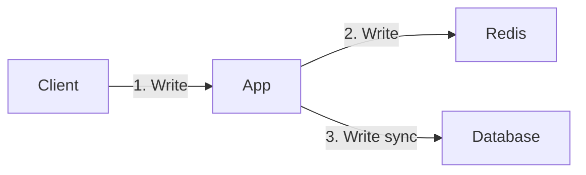

# How to Implement Write-Through and Write-Behind Caching with Redis

Author: [nawazdhandala](https://www.github.com/nawazdhandala)

Tags: Redis, Caching, Write-Through, Write-Behind, Write-Back, Database, Performance, Python, Node.js

Description: A comprehensive guide to implementing write-through and write-behind caching patterns with Redis. Learn how to keep your cache and database in sync with practical examples and best practices.

---

> While cache-aside focuses on reads, write-through and write-behind patterns address the challenge of keeping cache and database synchronized during writes. Choosing the right write strategy can dramatically impact both data consistency and application performance.

Write-through caching ensures strong consistency by writing to both cache and database synchronously. Write-behind (also called write-back) improves write performance by deferring database writes asynchronously.

---

## Understanding Write Strategies

### Write-Through vs Write-Behind

| Aspect | Write-Through | Write-Behind |
|--------|--------------|--------------|
| Consistency | Strong - data always in sync | Eventual - brief inconsistency window |
| Write Latency | Higher - waits for both stores | Lower - returns immediately |
| Data Safety | Higher - no data loss risk | Risk of data loss on failure |
| Complexity | Simpler | More complex |
| Use Case | Critical data, transactions | High-write workloads, analytics |

### Write-Through Flow



### Write-Behind Flow


---

## Write-Through Implementation

### Basic Write-Through in Python

```python
import redis
import json
from typing import Optional, Any
from functools import wraps

redis_client = redis.Redis(host='localhost', port=6379, decode_responses=True)

class WriteThrough:
    """Write-through cache implementation"""

    def __init__(self, cache_prefix: str, ttl: int = 3600):
        self.cache_prefix = cache_prefix
        self.ttl = ttl

    def _cache_key(self, entity_id: str) -> str:
        return f"{self.cache_prefix}:{entity_id}"

    def get(self, entity_id: str) -> Optional[dict]:
        """Read from cache, fallback to database"""
        cache_key = self._cache_key(entity_id)

        # Try cache first
        cached = redis_client.get(cache_key)
        if cached:
            return json.loads(cached)

        # Cache miss - fetch from database
        data = self._fetch_from_database(entity_id)
        if data:
            redis_client.setex(cache_key, self.ttl, json.dumps(data))

        return data

    def set(self, entity_id: str, data: dict) -> bool:
        """
        Write-through: Write to both cache and database.
        Database write happens first for durability.
        """
        cache_key = self._cache_key(entity_id)

        # Step 1: Write to database first (source of truth)
        if not self._write_to_database(entity_id, data):
            return False

        # Step 2: Update cache
        redis_client.setex(cache_key, self.ttl, json.dumps(data))

        return True

    def delete(self, entity_id: str) -> bool:
        """Delete from both cache and database"""
        cache_key = self._cache_key(entity_id)

        # Delete from database first
        if not self._delete_from_database(entity_id):
            return False

        # Delete from cache
        redis_client.delete(cache_key)

        return True

    def _fetch_from_database(self, entity_id: str) -> Optional[dict]:
        """Fetch from database - implement based on your DB"""
        # Example: return db.query("SELECT * FROM entities WHERE id = ?", entity_id)
        pass

    def _write_to_database(self, entity_id: str, data: dict) -> bool:
        """Write to database - implement based on your DB"""
        # Example: db.execute("INSERT INTO entities ... ON CONFLICT UPDATE", data)
        return True

    def _delete_from_database(self, entity_id: str) -> bool:
        """Delete from database"""
        return True

# Usage
user_cache = WriteThrough(cache_prefix="user", ttl=3600)

# Write-through: updates both cache and database
user_cache.set("123", {
    "id": "123",
    "name": "John Doe",
    "email": "john@example.com"
})

# Read: from cache if available
user = user_cache.get("123")
```

### Transaction-Safe Write-Through

```python
import redis
from contextlib import contextmanager

class TransactionalWriteThrough:
    """Write-through with transaction support"""

    def __init__(self, redis_client, db_connection):
        self.redis = redis_client
        self.db = db_connection

    @contextmanager
    def transaction(self):
        """Context manager for transactional write-through"""
        self.db.begin()
        cache_operations = []

        try:
            yield cache_operations
            self.db.commit()

            # Apply cache operations only after DB commit
            pipe = self.redis.pipeline()
            for op, key, value, ttl in cache_operations:
                if op == 'set':
                    pipe.setex(key, ttl, value)
                elif op == 'delete':
                    pipe.delete(key)
            pipe.execute()

        except Exception as e:
            self.db.rollback()
            raise e

    def set(self, entity_id: str, data: dict, cache_ops: list, ttl: int = 3600):
        """Queue cache set operation for transaction"""
        # Write to database
        self._write_to_database(entity_id, data)

        # Queue cache operation
        cache_key = f"entity:{entity_id}"
        cache_ops.append(('set', cache_key, json.dumps(data), ttl))

    def delete(self, entity_id: str, cache_ops: list):
        """Queue cache delete operation for transaction"""
        self._delete_from_database(entity_id)
        cache_key = f"entity:{entity_id}"
        cache_ops.append(('delete', cache_key, None, None))

# Usage with transaction
cache = TransactionalWriteThrough(redis_client, db_connection)

with cache.transaction() as ops:
    cache.set("user:1", {"name": "Alice"}, ops)
    cache.set("user:2", {"name": "Bob"}, ops)
    # If any operation fails, nothing is committed
```

---

## Write-Behind Implementation

### Basic Write-Behind with Queue

```python
import redis
import json
import threading
import time
from queue import Queue
from typing import Dict, Any
import logging

logger = logging.getLogger(__name__)

class WriteBehind:
    """Write-behind cache with async database writes"""

    def __init__(
        self,
        cache_prefix: str,
        ttl: int = 3600,
        batch_size: int = 100,
        flush_interval: float = 1.0
    ):
        self.cache_prefix = cache_prefix
        self.ttl = ttl
        self.batch_size = batch_size
        self.flush_interval = flush_interval

        self.write_queue = Queue()
        self._start_background_writer()

    def _cache_key(self, entity_id: str) -> str:
        return f"{self.cache_prefix}:{entity_id}"

    def get(self, entity_id: str) -> dict:
        """Read from cache"""
        cache_key = self._cache_key(entity_id)
        cached = redis_client.get(cache_key)

        if cached:
            return json.loads(cached)

        # Cache miss - fetch from database
        data = self._fetch_from_database(entity_id)
        if data:
            redis_client.setex(cache_key, self.ttl, json.dumps(data))

        return data

    def set(self, entity_id: str, data: dict) -> bool:
        """
        Write-behind: Write to cache immediately, queue database write.
        Returns immediately after cache write.
        """
        cache_key = self._cache_key(entity_id)

        # Write to cache immediately
        redis_client.setex(cache_key, self.ttl, json.dumps(data))

        # Queue async database write
        self.write_queue.put({
            'operation': 'set',
            'entity_id': entity_id,
            'data': data,
            'timestamp': time.time()
        })

        return True

    def delete(self, entity_id: str) -> bool:
        """Delete from cache and queue database delete"""
        cache_key = self._cache_key(entity_id)

        # Delete from cache immediately
        redis_client.delete(cache_key)

        # Queue async database delete
        self.write_queue.put({
            'operation': 'delete',
            'entity_id': entity_id,
            'timestamp': time.time()
        })

        return True

    def _start_background_writer(self):
        """Start background thread for database writes"""
        self.running = True
        self.writer_thread = threading.Thread(
            target=self._background_writer,
            daemon=True
        )
        self.writer_thread.start()

    def _background_writer(self):
        """Background thread that flushes writes to database"""
        batch = []
        last_flush = time.time()

        while self.running:
            try:
                # Try to get item with timeout
                try:
                    item = self.write_queue.get(timeout=0.1)
                    batch.append(item)
                except:
                    pass

                # Flush if batch is full or interval elapsed
                should_flush = (
                    len(batch) >= self.batch_size or
                    (batch and time.time() - last_flush >= self.flush_interval)
                )

                if should_flush and batch:
                    self._flush_batch(batch)
                    batch = []
                    last_flush = time.time()

            except Exception as e:
                logger.error(f"Background writer error: {e}")

    def _flush_batch(self, batch: list):
        """Flush batch of writes to database"""
        sets = [item for item in batch if item['operation'] == 'set']
        deletes = [item for item in batch if item['operation'] == 'delete']

        try:
            if sets:
                self._batch_write_to_database(sets)
            if deletes:
                self._batch_delete_from_database(deletes)

            logger.info(f"Flushed {len(sets)} sets, {len(deletes)} deletes")

        except Exception as e:
            logger.error(f"Batch flush failed: {e}")
            # Re-queue failed items
            for item in batch:
                self.write_queue.put(item)

    def shutdown(self, timeout: float = 5.0):
        """Gracefully shutdown, flushing remaining writes"""
        self.running = False
        self.writer_thread.join(timeout)

        # Flush any remaining items
        remaining = []
        while not self.write_queue.empty():
            remaining.append(self.write_queue.get())

        if remaining:
            self._flush_batch(remaining)

    def _fetch_from_database(self, entity_id: str):
        pass

    def _batch_write_to_database(self, items: list):
        """Batch write to database"""
        # Implement bulk insert/update
        pass

    def _batch_delete_from_database(self, items: list):
        """Batch delete from database"""
        # Implement bulk delete
        pass

# Usage
cache = WriteBehind(
    cache_prefix="product",
    ttl=3600,
    batch_size=50,
    flush_interval=2.0
)

# Fast writes - returns immediately after cache update
for i in range(1000):
    cache.set(f"product:{i}", {"id": i, "name": f"Product {i}"})

# Graceful shutdown
cache.shutdown()
```

### Write-Behind with Redis Streams

Using Redis Streams for more robust write-behind:

```python
import redis
import json
import time
from typing import Optional

class StreamWriteBehind:
    """Write-behind using Redis Streams for durability"""

    def __init__(
        self,
        cache_prefix: str,
        stream_key: str = "write_behind_stream",
        ttl: int = 3600
    ):
        self.cache_prefix = cache_prefix
        self.stream_key = stream_key
        self.ttl = ttl
        self.consumer_group = "db_writers"
        self.consumer_name = f"writer_{time.time()}"

        # Create consumer group if not exists
        try:
            redis_client.xgroup_create(
                self.stream_key,
                self.consumer_group,
                mkstream=True
            )
        except redis.ResponseError:
            pass  # Group already exists

    def _cache_key(self, entity_id: str) -> str:
        return f"{self.cache_prefix}:{entity_id}"

    def set(self, entity_id: str, data: dict) -> str:
        """Write to cache and queue to stream"""
        cache_key = self._cache_key(entity_id)

        # Write to cache
        redis_client.setex(cache_key, self.ttl, json.dumps(data))

        # Add to stream for async database write
        message_id = redis_client.xadd(
            self.stream_key,
            {
                'operation': 'set',
                'entity_id': entity_id,
                'data': json.dumps(data),
                'timestamp': str(time.time())
            }
        )

        return message_id

    def process_writes(self, batch_size: int = 100, block_ms: int = 1000):
        """
        Process pending writes from stream.
        Run this in a separate worker process.
        """
        while True:
            # Read from stream
            messages = redis_client.xreadgroup(
                self.consumer_group,
                self.consumer_name,
                {self.stream_key: '>'},
                count=batch_size,
                block=block_ms
            )

            if not messages:
                continue

            for stream_name, stream_messages in messages:
                for message_id, fields in stream_messages:
                    try:
                        self._process_message(fields)

                        # Acknowledge successful processing
                        redis_client.xack(
                            self.stream_key,
                            self.consumer_group,
                            message_id
                        )
                    except Exception as e:
                        print(f"Error processing {message_id}: {e}")
                        # Message will be retried

    def _process_message(self, fields: dict):
        """Process a single write message"""
        operation = fields.get('operation', '').decode()
        entity_id = fields.get('entity_id', '').decode()
        data = json.loads(fields.get('data', '{}').decode())

        if operation == 'set':
            self._write_to_database(entity_id, data)
        elif operation == 'delete':
            self._delete_from_database(entity_id)

    def _write_to_database(self, entity_id: str, data: dict):
        """Write to database"""
        print(f"Writing to database: {entity_id}")

    def _delete_from_database(self, entity_id: str):
        """Delete from database"""
        print(f"Deleting from database: {entity_id}")

# Producer - in your main application
cache = StreamWriteBehind(cache_prefix="order")
cache.set("order:123", {"id": "123", "total": 99.99})

# Consumer - run in separate worker process
# cache.process_writes()
```

---

## Node.js Implementation

### Write-Through in Node.js

```javascript
const Redis = require('redis');

const client = Redis.createClient();
await client.connect();

class WriteThroughCache {
    constructor(prefix, ttl = 3600) {
        this.prefix = prefix;
        this.ttl = ttl;
    }

    cacheKey(id) {
        return `${this.prefix}:${id}`;
    }

    async get(id) {
        const key = this.cacheKey(id);

        // Try cache first
        const cached = await client.get(key);
        if (cached) {
            return JSON.parse(cached);
        }

        // Fetch from database
        const data = await this.fetchFromDatabase(id);
        if (data) {
            await client.setEx(key, this.ttl, JSON.stringify(data));
        }

        return data;
    }

    async set(id, data) {
        const key = this.cacheKey(id);

        // Write to database first
        await this.writeToDatabase(id, data);

        // Then update cache
        await client.setEx(key, this.ttl, JSON.stringify(data));

        return true;
    }

    async delete(id) {
        const key = this.cacheKey(id);

        // Delete from database first
        await this.deleteFromDatabase(id);

        // Then delete from cache
        await client.del(key);

        return true;
    }

    async fetchFromDatabase(id) {
        // Implement database fetch
    }

    async writeToDatabase(id, data) {
        // Implement database write
    }

    async deleteFromDatabase(id) {
        // Implement database delete
    }
}

// Usage
const userCache = new WriteThroughCache('user', 3600);

await userCache.set('123', {
    id: '123',
    name: 'John Doe',
    email: 'john@example.com'
});

const user = await userCache.get('123');
```

### Write-Behind in Node.js

```javascript
const Redis = require('redis');
const { EventEmitter } = require('events');

class WriteBehindCache extends EventEmitter {
    constructor(prefix, options = {}) {
        super();
        this.prefix = prefix;
        this.ttl = options.ttl || 3600;
        this.batchSize = options.batchSize || 100;
        this.flushInterval = options.flushInterval || 1000;

        this.writeQueue = [];
        this.startBackgroundWriter();
    }

    cacheKey(id) {
        return `${this.prefix}:${id}`;
    }

    async get(id) {
        const key = this.cacheKey(id);
        const cached = await client.get(key);

        if (cached) {
            return JSON.parse(cached);
        }

        const data = await this.fetchFromDatabase(id);
        if (data) {
            await client.setEx(key, this.ttl, JSON.stringify(data));
        }

        return data;
    }

    async set(id, data) {
        const key = this.cacheKey(id);

        // Write to cache immediately
        await client.setEx(key, this.ttl, JSON.stringify(data));

        // Queue for async database write
        this.writeQueue.push({
            operation: 'set',
            id,
            data,
            timestamp: Date.now()
        });

        return true;
    }

    startBackgroundWriter() {
        this.flushTimer = setInterval(async () => {
            if (this.writeQueue.length > 0) {
                await this.flush();
            }
        }, this.flushInterval);
    }

    async flush() {
        const batch = this.writeQueue.splice(0, this.batchSize);

        if (batch.length === 0) return;

        const sets = batch.filter(item => item.operation === 'set');
        const deletes = batch.filter(item => item.operation === 'delete');

        try {
            if (sets.length > 0) {
                await this.batchWriteToDatabase(sets);
            }
            if (deletes.length > 0) {
                await this.batchDeleteFromDatabase(deletes);
            }

            this.emit('flushed', { sets: sets.length, deletes: deletes.length });
        } catch (error) {
            console.error('Flush failed:', error);
            // Re-queue failed items
            this.writeQueue.unshift(...batch);
            this.emit('flushError', error);
        }
    }

    async shutdown() {
        clearInterval(this.flushTimer);
        await this.flush(); // Flush remaining items
    }

    async fetchFromDatabase(id) { /* implement */ }
    async batchWriteToDatabase(items) { /* implement */ }
    async batchDeleteFromDatabase(items) { /* implement */ }
}

// Usage
const cache = new WriteBehindCache('product', {
    ttl: 3600,
    batchSize: 50,
    flushInterval: 2000
});

cache.on('flushed', ({ sets, deletes }) => {
    console.log(`Flushed ${sets} sets, ${deletes} deletes`);
});

// Fast writes
for (let i = 0; i < 1000; i++) {
    await cache.set(`product:${i}`, { id: i, name: `Product ${i}` });
}

// Graceful shutdown
process.on('SIGTERM', async () => {
    await cache.shutdown();
    process.exit(0);
});
```

---

## Handling Failures

### Write-Through Failure Handling

```python
import logging
from enum import Enum

class WriteResult(Enum):
    SUCCESS = "success"
    CACHE_FAILURE = "cache_failure"
    DATABASE_FAILURE = "database_failure"
    BOTH_FAILED = "both_failed"

class ResilientWriteThrough:
    """Write-through with comprehensive failure handling"""

    def __init__(self, cache_prefix: str, ttl: int = 3600):
        self.cache_prefix = cache_prefix
        self.ttl = ttl
        self.logger = logging.getLogger(__name__)

    def set(self, entity_id: str, data: dict) -> WriteResult:
        """Write with failure handling and rollback"""
        cache_key = f"{self.cache_prefix}:{entity_id}"
        original_cache_data = None

        try:
            # Store original cache value for potential rollback
            original_cache_data = redis_client.get(cache_key)

            # Step 1: Write to database
            self._write_to_database(entity_id, data)

        except Exception as db_error:
            self.logger.error(f"Database write failed: {db_error}")
            return WriteResult.DATABASE_FAILURE

        try:
            # Step 2: Write to cache
            redis_client.setex(cache_key, self.ttl, json.dumps(data))
            return WriteResult.SUCCESS

        except Exception as cache_error:
            self.logger.error(f"Cache write failed: {cache_error}")

            # Cache failed but database succeeded
            # Option 1: Accept inconsistency (cache will be populated on next read)
            # Option 2: Invalidate cache to force database read
            try:
                redis_client.delete(cache_key)
            except:
                pass

            return WriteResult.CACHE_FAILURE

    def set_with_compensation(self, entity_id: str, data: dict) -> WriteResult:
        """Write with compensation on failure"""
        cache_key = f"{self.cache_prefix}:{entity_id}"

        # Get original values for compensation
        original_db_data = self._fetch_from_database(entity_id)
        original_cache_data = redis_client.get(cache_key)

        try:
            # Write to database
            self._write_to_database(entity_id, data)

            try:
                # Write to cache
                redis_client.setex(cache_key, self.ttl, json.dumps(data))
                return WriteResult.SUCCESS

            except Exception as cache_error:
                self.logger.error(f"Cache failed, rolling back database")

                # Rollback database
                if original_db_data:
                    self._write_to_database(entity_id, original_db_data)
                else:
                    self._delete_from_database(entity_id)

                return WriteResult.CACHE_FAILURE

        except Exception as db_error:
            self.logger.error(f"Database failed: {db_error}")
            return WriteResult.DATABASE_FAILURE

    def _write_to_database(self, entity_id: str, data: dict):
        pass

    def _fetch_from_database(self, entity_id: str):
        pass

    def _delete_from_database(self, entity_id: str):
        pass
```

### Write-Behind Failure Recovery

```python
class WriteBehindWithRecovery:
    """Write-behind with dead letter queue for failed writes"""

    def __init__(self, cache_prefix: str, max_retries: int = 3):
        self.cache_prefix = cache_prefix
        self.max_retries = max_retries
        self.write_queue = "write_queue"
        self.dead_letter_queue = "write_dlq"
        self.retry_counts = {}

    def set(self, entity_id: str, data: dict):
        """Queue write with retry metadata"""
        cache_key = f"{self.cache_prefix}:{entity_id}"

        # Write to cache
        redis_client.setex(cache_key, 3600, json.dumps(data))

        # Queue for async write
        message = json.dumps({
            'operation': 'set',
            'entity_id': entity_id,
            'data': data,
            'timestamp': time.time(),
            'retries': 0
        })

        redis_client.lpush(self.write_queue, message)

    def process_queue(self):
        """Process writes with retry logic"""
        while True:
            message = redis_client.brpop(self.write_queue, timeout=1)

            if not message:
                continue

            item = json.loads(message[1])

            try:
                self._process_item(item)

            except Exception as e:
                self._handle_failure(item, e)

    def _process_item(self, item: dict):
        """Process a single write"""
        if item['operation'] == 'set':
            self._write_to_database(item['entity_id'], item['data'])

    def _handle_failure(self, item: dict, error: Exception):
        """Handle write failure with retry or dead letter"""
        retries = item.get('retries', 0)

        if retries < self.max_retries:
            # Retry with exponential backoff
            item['retries'] = retries + 1
            delay = 2 ** retries  # 1, 2, 4 seconds

            # Use sorted set for delayed retry
            redis_client.zadd(
                "write_retry_queue",
                {json.dumps(item): time.time() + delay}
            )

            self.logger.warning(
                f"Retry {retries + 1}/{self.max_retries} for {item['entity_id']}"
            )
        else:
            # Move to dead letter queue
            redis_client.lpush(self.dead_letter_queue, json.dumps({
                **item,
                'error': str(error),
                'failed_at': time.time()
            }))

            self.logger.error(
                f"Moved to DLQ: {item['entity_id']} - {error}"
            )

    def process_retries(self):
        """Process delayed retries"""
        while True:
            now = time.time()

            # Get items ready for retry
            items = redis_client.zrangebyscore(
                "write_retry_queue",
                0,
                now,
                start=0,
                num=100
            )

            if not items:
                time.sleep(0.1)
                continue

            for item_json in items:
                # Remove from retry queue
                redis_client.zrem("write_retry_queue", item_json)

                # Add back to main queue
                redis_client.lpush(self.write_queue, item_json)

    def _write_to_database(self, entity_id: str, data: dict):
        pass
```

---

## Best Practices

### 1. Choose the Right Pattern

```python
# Use write-through for:
# - Critical data requiring strong consistency
# - Financial transactions
# - User authentication data

# Use write-behind for:
# - High-write workloads (analytics, logging)
# - Non-critical data that can tolerate eventual consistency
# - When write performance is critical
```

### 2. Monitor Write Performance

```python
from prometheus_client import Counter, Histogram

write_latency = Histogram(
    'cache_write_latency_seconds',
    'Write latency by pattern',
    ['pattern', 'operation']
)

write_failures = Counter(
    'cache_write_failures_total',
    'Write failures',
    ['pattern', 'failure_type']
)

queue_depth = Gauge(
    'write_behind_queue_depth',
    'Write-behind queue depth'
)
```

### 3. Set Appropriate TTLs

```python
# Write-through: TTL can be longer since data is always fresh
WRITE_THROUGH_TTL = 3600 * 24  # 24 hours

# Write-behind: Consider consistency window
WRITE_BEHIND_TTL = 3600  # 1 hour (refresh more often)
```

---

## Conclusion

Write-through and write-behind caching patterns address different needs:

- **Write-through**: Prioritizes consistency - use when data accuracy is critical
- **Write-behind**: Prioritizes performance - use when write throughput is critical

Key considerations:
- Write-through adds latency but guarantees consistency
- Write-behind requires careful failure handling and monitoring
- Consider hybrid approaches for different data types

---

*Need to monitor your caching layer? [OneUptime](https://oneuptime.com) provides comprehensive Redis monitoring with cache hit ratios, latency tracking, and write-behind queue depth alerts.*
