# How to Implement Sliding Window Rate Limiting in Python

Author: [nawazdhandala](https://www.github.com/nawazdhandala)

Tags: Python, Rate Limiting, Sliding Window, Redis, API Security, Performance

Description: Learn how to implement sliding window rate limiting in Python for smoother traffic control than fixed windows. This guide covers in-memory and Redis-based implementations with practical examples for FastAPI and Flask.

---

> Rate limiting protects your API from abuse and ensures fair resource allocation. The sliding window algorithm provides smoother rate limiting than fixed windows by eliminating the burst problem at window boundaries. This guide shows you how to implement it in Python.

Fixed window rate limiting has a flaw: a user can make all their requests at the end of one window and the start of the next, effectively doubling their rate. Sliding window solves this by considering a rolling time period.

---

## Fixed Window vs Sliding Window

The difference is in how we count requests:

```mermaid
gantt
    title Fixed Window vs Sliding Window
    dateFormat X
    axisFormat %S

    section Fixed Window
    Window 1 (10 req)    :0, 60
    Window 2 (10 req)    :60, 120

    section Sliding Window
    Rolling 60s window   :active, 30, 90
```



| Algorithm | Pros | Cons |
|-----------|------|------|
| **Fixed Window** | Simple, memory efficient | Burst at boundaries |
| **Sliding Window Log** | Precise | Memory intensive |
| **Sliding Window Counter** | Balanced | Slight approximation |

---

## Sliding Window Log Implementation

This algorithm stores timestamps of all requests and counts those within the window.

```python
# sliding_window_log.py
# Sliding window rate limiter using request log
from typing import Dict, List
from dataclasses import dataclass, field
from datetime import datetime, timedelta
import threading
import time

@dataclass
class RateLimitResult:
    """Result of a rate limit check"""
    allowed: bool  # Whether the request is allowed
    remaining: int  # Requests remaining in window
    reset_after: float  # Seconds until oldest request expires
    retry_after: float  # Seconds to wait if denied (0 if allowed)

class SlidingWindowLog:
    """
    Sliding window rate limiter using a log of request timestamps.

    Precise but memory-intensive for high-volume APIs.
    Best for: Low to medium traffic, when precision matters.
    """

    def __init__(
        self,
        max_requests: int,
        window_seconds: int
    ):
        """
        Initialize the rate limiter.

        Args:
            max_requests: Maximum requests allowed per window
            window_seconds: Size of the sliding window in seconds
        """
        self.max_requests = max_requests
        self.window_seconds = window_seconds
        self._requests: Dict[str, List[float]] = {}  # key -> list of timestamps
        self._lock = threading.Lock()

    def check(self, key: str) -> RateLimitResult:
        """
        Check if a request should be allowed.

        Args:
            key: Identifier for the rate limit (e.g., user ID, IP)

        Returns:
            RateLimitResult with allowed status and metadata
        """
        now = time.time()
        window_start = now - self.window_seconds

        with self._lock:
            # Get existing requests for this key
            requests = self._requests.get(key, [])

            # Remove requests outside the window
            requests = [ts for ts in requests if ts > window_start]

            # Count requests in the current window
            request_count = len(requests)

            if request_count < self.max_requests:
                # Request allowed - add timestamp
                requests.append(now)
                self._requests[key] = requests

                # Calculate when oldest request expires
                if requests:
                    oldest = min(requests)
                    reset_after = (oldest + self.window_seconds) - now
                else:
                    reset_after = self.window_seconds

                return RateLimitResult(
                    allowed=True,
                    remaining=self.max_requests - request_count - 1,
                    reset_after=reset_after,
                    retry_after=0
                )
            else:
                # Request denied - calculate retry time
                oldest = min(requests)
                retry_after = (oldest + self.window_seconds) - now

                return RateLimitResult(
                    allowed=False,
                    remaining=0,
                    reset_after=retry_after,
                    retry_after=retry_after
                )

    def clear(self, key: str):
        """Clear rate limit data for a key"""
        with self._lock:
            self._requests.pop(key, None)

    def cleanup(self):
        """Remove expired entries to free memory"""
        now = time.time()
        window_start = now - self.window_seconds

        with self._lock:
            keys_to_remove = []

            for key, requests in self._requests.items():
                # Filter to only requests in window
                valid = [ts for ts in requests if ts > window_start]

                if valid:
                    self._requests[key] = valid
                else:
                    keys_to_remove.append(key)

            # Remove empty entries
            for key in keys_to_remove:
                del self._requests[key]
```

---

## Sliding Window Counter Implementation

This algorithm combines fixed windows with interpolation for a memory-efficient approximation.

```python
# sliding_window_counter.py
# Sliding window rate limiter using weighted counters
from typing import Dict, Tuple
from dataclasses import dataclass
import threading
import time
import math

@dataclass
class WindowCounter:
    """Stores count and timestamp for a window"""
    count: int
    window_start: float

class SlidingWindowCounter:
    """
    Sliding window rate limiter using weighted counters.

    Memory efficient approximation that combines:
    - Count from previous window (weighted by overlap)
    - Count from current window

    Best for: High-volume APIs, distributed systems.
    """

    def __init__(
        self,
        max_requests: int,
        window_seconds: int
    ):
        """
        Initialize the rate limiter.

        Args:
            max_requests: Maximum requests allowed per window
            window_seconds: Size of the sliding window in seconds
        """
        self.max_requests = max_requests
        self.window_seconds = window_seconds
        # Store current and previous window counters per key
        self._windows: Dict[str, Tuple[WindowCounter, WindowCounter]] = {}
        self._lock = threading.Lock()

    def _get_window_start(self, timestamp: float) -> float:
        """Get the start of the fixed window containing timestamp"""
        return math.floor(timestamp / self.window_seconds) * self.window_seconds

    def check(self, key: str) -> RateLimitResult:
        """
        Check if a request should be allowed.

        The count is calculated as:
        weighted_count = prev_count * overlap_ratio + current_count

        Where overlap_ratio is how much of the sliding window
        overlaps with the previous fixed window.
        """
        now = time.time()
        current_window_start = self._get_window_start(now)
        prev_window_start = current_window_start - self.window_seconds

        with self._lock:
            # Get or create window counters for this key
            if key not in self._windows:
                self._windows[key] = (
                    WindowCounter(0, prev_window_start),
                    WindowCounter(0, current_window_start)
                )

            prev_counter, curr_counter = self._windows[key]

            # Check if we've moved to a new window
            if curr_counter.window_start != current_window_start:
                # Shift windows
                if curr_counter.window_start == prev_window_start:
                    # Previous window becomes the old previous
                    prev_counter = curr_counter
                else:
                    # Gap in requests - previous window is empty
                    prev_counter = WindowCounter(0, prev_window_start)

                # Start fresh current window
                curr_counter = WindowCounter(0, current_window_start)
                self._windows[key] = (prev_counter, curr_counter)

            # Calculate weighted count
            # How far into the current window are we? (0 to 1)
            time_into_window = now - current_window_start
            current_ratio = time_into_window / self.window_seconds

            # Previous window weight (how much of sliding window it covers)
            prev_ratio = 1 - current_ratio

            # Weighted count from both windows
            weighted_count = (
                prev_counter.count * prev_ratio +
                curr_counter.count
            )

            if weighted_count < self.max_requests:
                # Request allowed - increment current window counter
                curr_counter.count += 1
                self._windows[key] = (prev_counter, curr_counter)

                remaining = self.max_requests - int(weighted_count) - 1

                return RateLimitResult(
                    allowed=True,
                    remaining=max(0, remaining),
                    reset_after=self.window_seconds - time_into_window,
                    retry_after=0
                )
            else:
                # Request denied
                # Estimate when a slot opens up
                retry_after = self.window_seconds * (
                    1 - (self.max_requests - curr_counter.count) / max(prev_counter.count, 1)
                )

                return RateLimitResult(
                    allowed=False,
                    remaining=0,
                    reset_after=self.window_seconds - time_into_window,
                    retry_after=max(0.1, retry_after)
                )

    def get_usage(self, key: str) -> float:
        """Get current usage ratio (0.0 to 1.0)"""
        result = self.check(key)
        # Don't count the check itself
        return 1 - (result.remaining + 1) / self.max_requests
```

---

## Redis-Based Sliding Window

For distributed systems, use Redis to share rate limit state across instances.

```python
# redis_sliding_window.py
# Distributed sliding window rate limiter using Redis
import redis
import time
from typing import Optional

class RedisSlidingWindow:
    """
    Distributed sliding window rate limiter using Redis.

    Uses Redis sorted sets to store request timestamps.
    Suitable for: Distributed systems, microservices.
    """

    def __init__(
        self,
        redis_client: redis.Redis,
        max_requests: int,
        window_seconds: int,
        key_prefix: str = "ratelimit"
    ):
        """
        Initialize the Redis rate limiter.

        Args:
            redis_client: Redis client instance
            max_requests: Maximum requests per window
            window_seconds: Window size in seconds
            key_prefix: Prefix for Redis keys
        """
        self.redis = redis_client
        self.max_requests = max_requests
        self.window_seconds = window_seconds
        self.key_prefix = key_prefix

    def _get_key(self, identifier: str) -> str:
        """Build the Redis key for an identifier"""
        return f"{self.key_prefix}:{identifier}"

    def check(self, identifier: str) -> RateLimitResult:
        """
        Check if request is allowed using Redis sorted set.

        Uses MULTI/EXEC for atomic operations.
        """
        key = self._get_key(identifier)
        now = time.time()
        window_start = now - self.window_seconds

        # Use pipeline for atomic operations
        pipe = self.redis.pipeline()

        # Remove old entries outside the window
        pipe.zremrangebyscore(key, 0, window_start)

        # Count current entries in window
        pipe.zcard(key)

        # Execute removal and count
        results = pipe.execute()
        current_count = results[1]

        if current_count < self.max_requests:
            # Request allowed - add timestamp with score = timestamp
            # Using timestamp as both score and value ensures uniqueness
            unique_value = f"{now}:{id(self)}"  # Ensure uniqueness

            pipe = self.redis.pipeline()
            pipe.zadd(key, {unique_value: now})
            pipe.expire(key, self.window_seconds + 1)  # TTL for cleanup
            pipe.execute()

            # Get oldest entry for reset calculation
            oldest = self.redis.zrange(key, 0, 0, withscores=True)
            if oldest:
                reset_after = (oldest[0][1] + self.window_seconds) - now
            else:
                reset_after = self.window_seconds

            return RateLimitResult(
                allowed=True,
                remaining=self.max_requests - current_count - 1,
                reset_after=reset_after,
                retry_after=0
            )
        else:
            # Request denied
            oldest = self.redis.zrange(key, 0, 0, withscores=True)
            if oldest:
                retry_after = (oldest[0][1] + self.window_seconds) - now
            else:
                retry_after = 1.0

            return RateLimitResult(
                allowed=False,
                remaining=0,
                reset_after=retry_after,
                retry_after=max(0.1, retry_after)
            )

    def check_lua(self, identifier: str) -> RateLimitResult:
        """
        Check using Lua script for true atomicity.

        Lua scripts execute atomically on Redis.
        """
        key = self._get_key(identifier)
        now = time.time()

        # Lua script for atomic check and update
        lua_script = """
        local key = KEYS[1]
        local now = tonumber(ARGV[1])
        local window = tonumber(ARGV[2])
        local max_requests = tonumber(ARGV[3])
        local window_start = now - window

        -- Remove old entries
        redis.call('ZREMRANGEBYSCORE', key, 0, window_start)

        -- Count current entries
        local count = redis.call('ZCARD', key)

        if count < max_requests then
            -- Add new entry
            redis.call('ZADD', key, now, now .. ':' .. math.random())
            redis.call('EXPIRE', key, window + 1)

            -- Get oldest for reset calculation
            local oldest = redis.call('ZRANGE', key, 0, 0, 'WITHSCORES')
            local reset_after = window
            if oldest[2] then
                reset_after = (tonumber(oldest[2]) + window) - now
            end

            return {1, max_requests - count - 1, reset_after, 0}
        else
            -- Denied - calculate retry
            local oldest = redis.call('ZRANGE', key, 0, 0, 'WITHSCORES')
            local retry_after = 1
            if oldest[2] then
                retry_after = (tonumber(oldest[2]) + window) - now
            end

            return {0, 0, retry_after, retry_after}
        end
        """

        # Register the script
        check_script = self.redis.register_script(lua_script)

        # Execute atomically
        result = check_script(
            keys=[key],
            args=[now, self.window_seconds, self.max_requests]
        )

        return RateLimitResult(
            allowed=bool(result[0]),
            remaining=int(result[1]),
            reset_after=float(result[2]),
            retry_after=float(result[3])
        )

    def reset(self, identifier: str):
        """Reset rate limit for an identifier"""
        key = self._get_key(identifier)
        self.redis.delete(key)
```

---

## FastAPI Integration

Here is how to use the rate limiter as FastAPI middleware.

```python
# fastapi_ratelimit.py
# FastAPI middleware for sliding window rate limiting
from fastapi import FastAPI, Request, HTTPException, Depends
from fastapi.responses import JSONResponse
from starlette.middleware.base import BaseHTTPMiddleware
from typing import Callable, Optional
import redis

# Initialize rate limiter
redis_client = redis.Redis(host="localhost", port=6379, db=0)
rate_limiter = RedisSlidingWindow(
    redis_client=redis_client,
    max_requests=100,  # 100 requests
    window_seconds=60  # per minute
)

class RateLimitMiddleware(BaseHTTPMiddleware):
    """
    Middleware that applies rate limiting to all requests.

    Adds rate limit headers to responses:
    - X-RateLimit-Limit: Max requests allowed
    - X-RateLimit-Remaining: Requests remaining
    - X-RateLimit-Reset: Seconds until window resets
    """

    def __init__(
        self,
        app,
        limiter: RedisSlidingWindow,
        key_func: Optional[Callable[[Request], str]] = None
    ):
        super().__init__(app)
        self.limiter = limiter
        self.key_func = key_func or self._default_key

    def _default_key(self, request: Request) -> str:
        """Default: rate limit by IP address"""
        forwarded = request.headers.get("X-Forwarded-For")
        if forwarded:
            # Take first IP if behind proxy
            return forwarded.split(",")[0].strip()
        return request.client.host if request.client else "unknown"

    async def dispatch(self, request: Request, call_next):
        # Skip rate limiting for health checks
        if request.url.path in ("/health", "/ready"):
            return await call_next(request)

        # Get rate limit key
        key = self.key_func(request)

        # Check rate limit
        result = self.limiter.check(key)

        if not result.allowed:
            # Return 429 Too Many Requests
            return JSONResponse(
                status_code=429,
                content={
                    "error": "Rate limit exceeded",
                    "retry_after": result.retry_after
                },
                headers={
                    "X-RateLimit-Limit": str(self.limiter.max_requests),
                    "X-RateLimit-Remaining": "0",
                    "X-RateLimit-Reset": str(int(result.reset_after)),
                    "Retry-After": str(int(result.retry_after))
                }
            )

        # Process request
        response = await call_next(request)

        # Add rate limit headers to response
        response.headers["X-RateLimit-Limit"] = str(self.limiter.max_requests)
        response.headers["X-RateLimit-Remaining"] = str(result.remaining)
        response.headers["X-RateLimit-Reset"] = str(int(result.reset_after))

        return response

# Create FastAPI app with rate limiting
app = FastAPI()

app.add_middleware(
    RateLimitMiddleware,
    limiter=rate_limiter,
    key_func=lambda r: r.headers.get("X-API-Key", r.client.host)  # Rate limit by API key
)

@app.get("/api/data")
async def get_data():
    return {"message": "Hello, World!"}
```

---

## Per-Endpoint Rate Limiting

For different limits on different endpoints, use a dependency.

```python
# endpoint_ratelimit.py
# Per-endpoint rate limiting with configurable limits
from fastapi import Depends, HTTPException, Request
from functools import wraps

class EndpointRateLimiter:
    """
    Rate limiter configured per endpoint.

    Usage:
        @app.get("/expensive")
        async def expensive_endpoint(
            _: None = Depends(EndpointRateLimiter(10, 60))  # 10/min
        ):
            return {"result": "expensive computation"}
    """

    def __init__(
        self,
        max_requests: int,
        window_seconds: int,
        key_prefix: str = "endpoint"
    ):
        self.limiter = RedisSlidingWindow(
            redis_client=redis_client,
            max_requests=max_requests,
            window_seconds=window_seconds,
            key_prefix=key_prefix
        )

    async def __call__(self, request: Request):
        # Build key from endpoint + user identifier
        endpoint = request.url.path
        user_key = request.headers.get("X-API-Key", request.client.host)
        key = f"{endpoint}:{user_key}"

        result = self.limiter.check(key)

        if not result.allowed:
            raise HTTPException(
                status_code=429,
                detail={
                    "error": "Rate limit exceeded for this endpoint",
                    "retry_after": result.retry_after
                },
                headers={"Retry-After": str(int(result.retry_after))}
            )

        return result

# Usage with different limits per endpoint
@app.get("/api/search")
async def search(
    query: str,
    _: None = Depends(EndpointRateLimiter(30, 60))  # 30 searches per minute
):
    return {"results": []}

@app.post("/api/upload")
async def upload(
    _: None = Depends(EndpointRateLimiter(5, 60))  # 5 uploads per minute
):
    return {"status": "uploaded"}

@app.get("/api/status")
async def status(
    _: None = Depends(EndpointRateLimiter(1000, 60))  # 1000 status checks per minute
):
    return {"status": "ok"}
```

---

## Testing Rate Limiters

```python
# test_ratelimit.py
# Tests for rate limiting implementations
import pytest
import time
from unittest.mock import MagicMock

class TestSlidingWindowLog:
    """Tests for sliding window log rate limiter"""

    def test_allows_requests_under_limit(self):
        """Should allow requests under the limit"""
        limiter = SlidingWindowLog(max_requests=5, window_seconds=60)

        for i in range(5):
            result = limiter.check("user1")
            assert result.allowed
            assert result.remaining == 4 - i

    def test_blocks_requests_over_limit(self):
        """Should block requests over the limit"""
        limiter = SlidingWindowLog(max_requests=3, window_seconds=60)

        # Use up the limit
        for _ in range(3):
            limiter.check("user1")

        # Next request should be blocked
        result = limiter.check("user1")
        assert not result.allowed
        assert result.remaining == 0
        assert result.retry_after > 0

    def test_separate_keys_have_separate_limits(self):
        """Different keys should have independent limits"""
        limiter = SlidingWindowLog(max_requests=2, window_seconds=60)

        # User 1 uses their limit
        limiter.check("user1")
        limiter.check("user1")

        # User 2 should still have their full limit
        result = limiter.check("user2")
        assert result.allowed
        assert result.remaining == 1

    def test_window_expires(self):
        """Requests should expire after window passes"""
        limiter = SlidingWindowLog(max_requests=2, window_seconds=1)

        # Use up limit
        limiter.check("user1")
        limiter.check("user1")

        # Wait for window to expire
        time.sleep(1.1)

        # Should be allowed again
        result = limiter.check("user1")
        assert result.allowed

class TestSlidingWindowCounter:
    """Tests for sliding window counter rate limiter"""

    def test_weighted_count_across_windows(self):
        """Should weight previous window count correctly"""
        limiter = SlidingWindowCounter(max_requests=10, window_seconds=2)

        # Make requests at end of a window
        for _ in range(8):
            limiter.check("user1")

        # Move to next window
        time.sleep(1)

        # Previous window count should be partially weighted
        result = limiter.check("user1")
        # Depending on timing, some requests should still be available
        assert result.allowed
```

---

## Best Practices

### 1. Choose the Right Algorithm

```python
# Low traffic, need precision: use log
limiter = SlidingWindowLog(max_requests=100, window_seconds=60)

# High traffic, distributed: use Redis counter
limiter = RedisSlidingWindow(redis, max_requests=10000, window_seconds=60)
```

### 2. Return Proper Headers

```python
# Always include rate limit headers in responses
response.headers["X-RateLimit-Limit"] = str(limit)
response.headers["X-RateLimit-Remaining"] = str(remaining)
response.headers["Retry-After"] = str(retry_seconds)  # When blocked
```

### 3. Use Appropriate Keys

```python
# Rate limit by user when authenticated
key = f"user:{user_id}"

# Rate limit by IP for anonymous requests
key = f"ip:{client_ip}"

# Rate limit by API key for service accounts
key = f"apikey:{api_key}"
```

### 4. Handle Redis Failures

```python
def check_with_fallback(self, key: str) -> RateLimitResult:
    try:
        return self.redis_limiter.check(key)
    except redis.RedisError:
        # Fall back to allowing request if Redis is down
        # Or use local in-memory limiter as backup
        return RateLimitResult(allowed=True, remaining=1, reset_after=60, retry_after=0)
```

---

## Conclusion

Sliding window rate limiting provides smoother traffic control than fixed windows:

- **Sliding Window Log** is precise but uses more memory
- **Sliding Window Counter** balances precision and efficiency
- **Redis** enables distributed rate limiting across instances

Start with the counter approach for most use cases. Use Redis when you need to share limits across multiple application instances.

---

*Need to monitor your API rate limits? [OneUptime](https://oneuptime.com) tracks rate limit metrics and alerts you when clients are being throttled excessively.*

**Related Reading:**
- [How to Build Rate Limiting in FastAPI](https://oneuptime.com/blog/post/2025-01-06-fastapi-rate-limiting/view)
- [How to Build Rate Limiting in Node.js](https://oneuptime.com/blog/post/2026-01-06-nodejs-rate-limiting-no-external-services/view)
