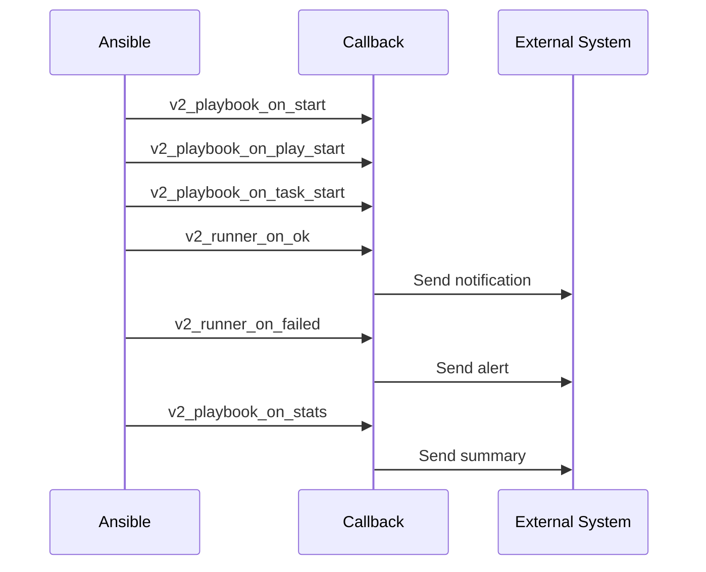

# How to Implement Ansible Callbacks

Author: [nawazdhandala](https://www.github.com/nawazdhandala)

Tags: Ansible, Callbacks, Plugins, Notifications, DevOps, Automation

Description: Customize Ansible output and integrate with external systems using callback plugins for logging, notifications, metrics, and custom reporting.

---

Ansible callback plugins intercept events during playbook execution and respond to them. They power the output you see in your terminal, but they can do much more: send Slack notifications, log to external systems, collect metrics, or generate custom reports. Understanding callbacks unlocks powerful integrations without modifying your playbooks.

This guide covers using built-in callbacks and creating custom ones for your needs.

## How Callbacks Work

Callbacks receive events at specific points during Ansible execution:



Common callback events:
- `v2_playbook_on_start` - Playbook begins
- `v2_playbook_on_play_start` - Play begins
- `v2_playbook_on_task_start` - Task begins
- `v2_runner_on_ok` - Task succeeded
- `v2_runner_on_failed` - Task failed
- `v2_runner_on_skipped` - Task skipped
- `v2_runner_on_unreachable` - Host unreachable
- `v2_playbook_on_stats` - Playbook complete, final stats

## Enabling Built-in Callbacks

Ansible includes several useful callbacks. Enable them in ansible.cfg.

```ini
# ansible.cfg
[defaults]
# Enable stdout callback (only one at a time)
stdout_callback = yaml

# Enable additional callbacks (comma-separated)
callbacks_enabled = timer, profile_tasks, profile_roles

# Callback plugin search path
callback_plugins = ./plugins/callback
```

### Timer Callback

Shows playbook execution time.

```ini
[defaults]
callbacks_enabled = timer
```

Output:
```
Playbook run took 0 days, 0 hours, 2 minutes, 34 seconds
```

### Profile Tasks Callback

Shows timing for each task.

```ini
[defaults]
callbacks_enabled = profile_tasks
```

Output:
```
Tuesday 25 January 2026  10:30:45 +0000 (0:00:05.234)   0:02:34.567 *****
===============================================================================
Install packages -------------------------------------------- 45.23s
Configure nginx --------------------------------------------- 12.45s
Restart services -------------------------------------------- 5.23s
```

### YAML Callback

More readable output format.

```ini
[defaults]
stdout_callback = yaml
```

Output:
```yaml
TASK [Install nginx]
ok: [web1.example.com] => {
    "changed": false,
    "msg": "All items completed"
}
```

### JSON Callback

Machine-readable output for CI/CD integration.

```ini
[defaults]
stdout_callback = json
```

### Dense Callback

Compact output for large inventories.

```ini
[defaults]
stdout_callback = dense
```

## Log Callbacks

Write output to log files.

```ini
# ansible.cfg
[defaults]
callbacks_enabled = log_plays

# Log file location
log_path = /var/log/ansible/playbook.log
```

### Syslog Callback

Send events to syslog.

```ini
[defaults]
callbacks_enabled = syslog_json
```

```ini
# Environment variables for configuration
export SYSLOG_SERVER=syslog.example.com
export SYSLOG_PORT=514
export SYSLOG_FACILITY=LOG_USER
```

## Creating Custom Callbacks

Build your own callback plugin for specific needs.

### Basic Callback Structure

```python
# plugins/callback/custom_notify.py
"""
Custom callback plugin for notifications
"""

from ansible.plugins.callback import CallbackBase
import json
import requests


DOCUMENTATION = '''
name: custom_notify
type: notification
short_description: Send notifications to custom endpoint
description:
  - Sends playbook events to a custom notification endpoint
requirements:
  - requests library
options:
  webhook_url:
    description: URL to send notifications
    env:
      - name: ANSIBLE_NOTIFY_WEBHOOK_URL
    ini:
      - section: callback_custom_notify
        key: webhook_url
'''


class CallbackModule(CallbackBase):
    """
    Custom notification callback
    """

    CALLBACK_VERSION = 2.0
    CALLBACK_TYPE = 'notification'
    CALLBACK_NAME = 'custom_notify'
    CALLBACK_NEEDS_WHITELIST = True

    def __init__(self):
        super(CallbackModule, self).__init__()
        self.playbook_name = None
        self.play_name = None
        self.task_name = None
        self.start_time = None

    def set_options(self, task_keys=None, var_options=None, direct=None):
        super(CallbackModule, self).set_options(
            task_keys=task_keys,
            var_options=var_options,
            direct=direct
        )
        self.webhook_url = self.get_option('webhook_url')

    def _send_notification(self, event_type, data):
        """Send notification to webhook"""
        if not self.webhook_url:
            return

        payload = {
            'event_type': event_type,
            'playbook': self.playbook_name,
            'play': self.play_name,
            'task': self.task_name,
            'data': data
        }

        try:
            requests.post(
                self.webhook_url,
                json=payload,
                timeout=5
            )
        except Exception as e:
            self._display.warning(f"Failed to send notification: {e}")

    def v2_playbook_on_start(self, playbook):
        self.playbook_name = playbook._file_name
        self._send_notification('playbook_start', {
            'playbook': self.playbook_name
        })

    def v2_playbook_on_play_start(self, play):
        self.play_name = play.get_name()

    def v2_playbook_on_task_start(self, task, is_conditional):
        self.task_name = task.get_name()

    def v2_runner_on_ok(self, result):
        host = result._host.get_name()
        self._send_notification('task_ok', {
            'host': host,
            'task': self.task_name,
            'changed': result._result.get('changed', False)
        })

    def v2_runner_on_failed(self, result, ignore_errors=False):
        host = result._host.get_name()
        self._send_notification('task_failed', {
            'host': host,
            'task': self.task_name,
            'error': result._result.get('msg', 'Unknown error'),
            'ignored': ignore_errors
        })

    def v2_playbook_on_stats(self, stats):
        """Send summary at playbook end"""
        summary = {}
        for host in stats.processed.keys():
            summary[host] = stats.summarize(host)

        self._send_notification('playbook_complete', {
            'summary': summary
        })
```

### Slack Notification Callback

```python
# plugins/callback/slack_notify.py
"""
Send Ansible events to Slack
"""

from ansible.plugins.callback import CallbackBase
import json
import requests
from datetime import datetime


DOCUMENTATION = '''
name: slack_notify
type: notification
short_description: Send notifications to Slack
options:
  webhook_url:
    description: Slack webhook URL
    env:
      - name: SLACK_WEBHOOK_URL
    required: true
  channel:
    description: Slack channel
    default: "#ansible"
    env:
      - name: SLACK_CHANNEL
  notify_on_ok:
    description: Send notifications for successful tasks
    type: bool
    default: false
  notify_on_failed:
    description: Send notifications for failed tasks
    type: bool
    default: true
'''


class CallbackModule(CallbackBase):
    CALLBACK_VERSION = 2.0
    CALLBACK_TYPE = 'notification'
    CALLBACK_NAME = 'slack_notify'
    CALLBACK_NEEDS_WHITELIST = True

    def __init__(self):
        super(CallbackModule, self).__init__()
        self.playbook_name = None
        self.failed_tasks = []
        self.start_time = None

    def set_options(self, task_keys=None, var_options=None, direct=None):
        super(CallbackModule, self).set_options(
            task_keys=task_keys,
            var_options=var_options,
            direct=direct
        )
        self.webhook_url = self.get_option('webhook_url')
        self.channel = self.get_option('channel')
        self.notify_on_ok = self.get_option('notify_on_ok')
        self.notify_on_failed = self.get_option('notify_on_failed')

    def _send_slack(self, message, color='good'):
        """Send message to Slack"""
        if not self.webhook_url:
            return

        payload = {
            'channel': self.channel,
            'username': 'Ansible',
            'icon_emoji': ':robot_face:',
            'attachments': [{
                'color': color,
                'text': message,
                'ts': datetime.now().timestamp()
            }]
        }

        try:
            requests.post(self.webhook_url, json=payload, timeout=10)
        except Exception as e:
            self._display.warning(f"Slack notification failed: {e}")

    def v2_playbook_on_start(self, playbook):
        self.playbook_name = playbook._file_name
        self.start_time = datetime.now()
        self.failed_tasks = []

    def v2_runner_on_failed(self, result, ignore_errors=False):
        if ignore_errors:
            return

        host = result._host.get_name()
        task = result._task.get_name()
        error = result._result.get('msg', 'Unknown error')

        self.failed_tasks.append({
            'host': host,
            'task': task,
            'error': error
        })

        if self.notify_on_failed:
            self._send_slack(
                f":x: Task failed on *{host}*\n"
                f"Task: `{task}`\n"
                f"Error: {error}",
                color='danger'
            )

    def v2_playbook_on_stats(self, stats):
        """Send summary to Slack"""
        duration = datetime.now() - self.start_time

        hosts = stats.processed.keys()
        failures = sum(stats.summarize(h)['failures'] for h in hosts)
        changed = sum(stats.summarize(h)['changed'] for h in hosts)
        ok = sum(stats.summarize(h)['ok'] for h in hosts)

        if failures > 0:
            color = 'danger'
            emoji = ':x:'
            status = 'FAILED'
        elif changed > 0:
            color = 'warning'
            emoji = ':warning:'
            status = 'CHANGED'
        else:
            color = 'good'
            emoji = ':white_check_mark:'
            status = 'SUCCESS'

        message = (
            f"{emoji} Playbook `{self.playbook_name}` {status}\n"
            f"Duration: {duration}\n"
            f"Hosts: {len(hosts)} | OK: {ok} | Changed: {changed} | Failed: {failures}"
        )

        self._send_slack(message, color=color)
```

### Metrics Callback (Prometheus/StatsD)

```python
# plugins/callback/metrics_statsd.py
"""
Send metrics to StatsD
"""

from ansible.plugins.callback import CallbackBase
import time

try:
    import statsd
    HAS_STATSD = True
except ImportError:
    HAS_STATSD = False


class CallbackModule(CallbackBase):
    CALLBACK_VERSION = 2.0
    CALLBACK_TYPE = 'aggregate'
    CALLBACK_NAME = 'metrics_statsd'
    CALLBACK_NEEDS_WHITELIST = True

    def __init__(self):
        super(CallbackModule, self).__init__()
        self.task_start_time = None
        self.client = None

        if HAS_STATSD:
            self.client = statsd.StatsClient(
                host='localhost',
                port=8125,
                prefix='ansible'
            )

    def v2_playbook_on_task_start(self, task, is_conditional):
        self.task_start_time = time.time()

    def v2_runner_on_ok(self, result):
        if not self.client:
            return

        duration = (time.time() - self.task_start_time) * 1000
        task = result._task.get_name().replace(' ', '_').lower()

        self.client.timing(f'task.{task}.duration', duration)
        self.client.incr(f'task.{task}.ok')

        if result._result.get('changed'):
            self.client.incr(f'task.{task}.changed')

    def v2_runner_on_failed(self, result, ignore_errors=False):
        if not self.client:
            return

        task = result._task.get_name().replace(' ', '_').lower()
        self.client.incr(f'task.{task}.failed')

    def v2_playbook_on_stats(self, stats):
        if not self.client:
            return

        for host in stats.processed.keys():
            summary = stats.summarize(host)
            self.client.gauge('hosts.ok', summary['ok'])
            self.client.gauge('hosts.changed', summary['changed'])
            self.client.gauge('hosts.failures', summary['failures'])
            self.client.gauge('hosts.unreachable', summary['unreachable'])
```

## Configuring Custom Callbacks

Enable your custom callbacks.

```ini
# ansible.cfg
[defaults]
callback_plugins = ./plugins/callback
callbacks_enabled = slack_notify, metrics_statsd

[callback_slack_notify]
webhook_url = https://hooks.slack.com/services/XXX/YYY/ZZZ
channel = #deployments
notify_on_failed = true
```

Or use environment variables:

```bash
export SLACK_WEBHOOK_URL=https://hooks.slack.com/services/XXX/YYY/ZZZ
export SLACK_CHANNEL=#ansible
ansible-playbook playbook.yml
```

## Callback Use Cases

1. **CI/CD Integration**: Send job status to Jenkins, GitHub Actions
2. **Alerting**: Notify PagerDuty or OpsGenie on failures
3. **Audit Logging**: Send events to SIEM systems
4. **Metrics**: Track execution time and success rates
5. **Custom Reports**: Generate HTML or PDF reports
6. **Database Logging**: Record all changes to a database

---

Callbacks extend Ansible's capabilities without changing your playbooks. Start with built-in callbacks for better visibility into execution, then create custom callbacks to integrate with your organization's tools. The event-driven nature of callbacks makes them perfect for notifications, logging, and metrics collection that happen automatically with every playbook run.
