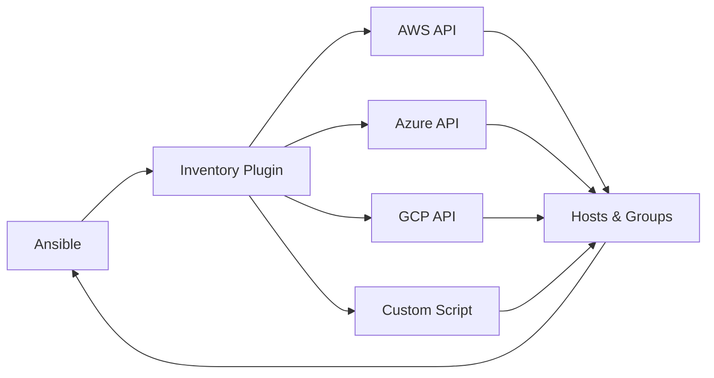

# How to Implement Ansible Dynamic Inventory

Author: [nawazdhandala](https://www.github.com/nawazdhandala)

Tags: Ansible, Dynamic Inventory, AWS, Cloud, DevOps, Infrastructure Automation

Description: Replace static inventory files with dynamic inventory that automatically discovers hosts from AWS, Azure, GCP, and other sources for always-accurate infrastructure targeting.

---

Static inventory files become outdated the moment your infrastructure changes. Dynamic inventory solves this by querying your infrastructure in real-time to discover hosts. When you spin up new EC2 instances, add VMs in Azure, or create GKE nodes, dynamic inventory finds them automatically.

This guide covers configuring dynamic inventory for major cloud providers and custom sources.

## How Dynamic Inventory Works

Dynamic inventory plugins query external sources and return JSON-formatted host data.



The plugin returns data in this format:

```json
{
  "_meta": {
    "hostvars": {
      "web1.example.com": {
        "ansible_host": "192.168.1.10",
        "environment": "production"
      }
    }
  },
  "webservers": {
    "hosts": ["web1.example.com", "web2.example.com"]
  },
  "databases": {
    "hosts": ["db1.example.com"]
  }
}
```

## AWS EC2 Dynamic Inventory

Query AWS for EC2 instances using the amazon.aws collection.

```bash
# Install required collection
ansible-galaxy collection install amazon.aws

# Install boto3 (AWS SDK)
pip install boto3 botocore
```

```yaml
# inventory/aws_ec2.yml
---
plugin: amazon.aws.aws_ec2

# AWS regions to query
regions:
  - us-east-1
  - us-west-2
  - eu-west-1

# Filter instances
filters:
  instance-state-name: running
  # Only include tagged instances
  "tag:ManagedBy": ansible

# Create groups based on tags and attributes
keyed_groups:
  # Group by Environment tag (env_production, env_staging)
  - key: tags.Environment
    prefix: env
    separator: "_"

  # Group by instance type (type_t3_medium)
  - key: instance_type
    prefix: type

  # Group by availability zone (az_us_east_1a)
  - key: placement.availability_zone
    prefix: az

  # Group by custom Application tag
  - key: tags.Application
    prefix: app

# Create groups from boolean conditions
groups:
  # All production web servers
  production_webservers: tags.Environment == 'production' and tags.Role == 'webserver'

  # Large instances that might need special handling
  large_instances: instance_type.startswith('m5') or instance_type.startswith('c5')

# Set ansible connection variables
compose:
  # Use public IP for ansible_host (or private_ip_address for VPN)
  ansible_host: public_ip_address | default(private_ip_address)

  # Set SSH user based on AMI
  ansible_user: "'ubuntu' if 'ubuntu' in (image_id | lower) else 'ec2-user'"

# Hostnames to use for inventory
hostnames:
  # Use Name tag, fall back to instance ID
  - tag:Name
  - instance-id

# Cache settings for performance
cache: true
cache_plugin: ansible.builtin.jsonfile
cache_timeout: 300  # 5 minutes
cache_connection: /tmp/aws_inventory_cache
```

Configure AWS credentials:

```bash
# Option 1: Environment variables
export AWS_ACCESS_KEY_ID=AKIAXXXXXXXX
export AWS_SECRET_ACCESS_KEY=xxxxxxxx
export AWS_DEFAULT_REGION=us-east-1

# Option 2: AWS credentials file (~/.aws/credentials)
[default]
aws_access_key_id = AKIAXXXXXXXX
aws_secret_access_key = xxxxxxxx

# Option 3: IAM role (for EC2 instances or ECS tasks)
# No configuration needed - uses instance profile
```

Test the inventory:

```bash
# List all hosts
ansible-inventory -i inventory/aws_ec2.yml --list

# Graph view of groups
ansible-inventory -i inventory/aws_ec2.yml --graph

# Test connectivity
ansible -i inventory/aws_ec2.yml all -m ping

# Target specific group
ansible -i inventory/aws_ec2.yml env_production -m shell -a "uptime"
```

## Azure Dynamic Inventory

Query Azure for virtual machines.

```bash
# Install Azure collection
ansible-galaxy collection install azure.azcollection

# Install Azure SDK
pip install azure-identity azure-mgmt-compute azure-mgmt-network azure-mgmt-resource
```

```yaml
# inventory/azure_rm.yml
---
plugin: azure.azcollection.azure_rm

# Authentication (uses environment variables or managed identity)
auth_source: auto

# Include only specific resource groups
include_vm_resource_groups:
  - production-rg
  - staging-rg

# Exclude resource groups
exclude_vm_resource_groups:
  - test-rg

# Filter by tags
conditional_groups:
  webservers: "'webserver' in tags.Role"
  databases: "'database' in tags.Role"

# Create groups from Azure properties
keyed_groups:
  - key: location
    prefix: azure_location

  - key: tags.Environment | default('untagged')
    prefix: env

  - key: resource_group
    prefix: rg

# Host variables from Azure metadata
compose:
  ansible_host: public_ip_addresses[0] | default(private_ip_addresses[0])
  ansible_user: "'azureuser'"

# Use VM name as hostname
plain_host_names: true

# Caching
cache: true
cache_timeout: 600
```

Configure Azure authentication:

```bash
# Service Principal authentication
export AZURE_SUBSCRIPTION_ID=xxxxxxxx-xxxx-xxxx-xxxx-xxxxxxxxxxxx
export AZURE_CLIENT_ID=xxxxxxxx-xxxx-xxxx-xxxx-xxxxxxxxxxxx
export AZURE_SECRET=xxxxxxxxxxxxxxxx
export AZURE_TENANT=xxxxxxxx-xxxx-xxxx-xxxx-xxxxxxxxxxxx

# Or use Azure CLI authentication
az login
```

## GCP Dynamic Inventory

Query Google Cloud Platform for compute instances.

```bash
# Install GCP collection
ansible-galaxy collection install google.cloud

# Install Google Cloud SDK
pip install google-auth google-cloud-compute
```

```yaml
# inventory/gcp_compute.yml
---
plugin: google.cloud.gcp_compute

# GCP project
projects:
  - my-gcp-project

# Regions to query (or zones)
zones:
  - us-central1-a
  - us-east1-b

# Filter instances
filters:
  - status = RUNNING
  - labels.managed_by = ansible

# Create groups based on labels and attributes
keyed_groups:
  - key: labels.environment
    prefix: env

  - key: labels.application
    prefix: app

  - key: zone
    prefix: zone

  - key: machine_type
    prefix: machine

# Conditional groups
groups:
  webservers: "'webserver' in labels.role"
  production: labels.environment == 'production'

# Set connection variables
compose:
  ansible_host: networkInterfaces[0].accessConfigs[0].natIP | default(networkInterfaces[0].networkIP)
  ansible_user: "'gce-user'"

# Use instance name as hostname
hostnames:
  - name

# Authentication via service account
service_account_file: /path/to/service-account.json
# Or use application default credentials
# auth_kind: application
```

## Combining Multiple Inventory Sources

Use an inventory directory to combine static and dynamic sources.

```
inventory/
├── 01-static.yml           # Static hosts (bastion, etc.)
├── 02-aws_ec2.yml          # AWS EC2 inventory
├── 03-azure_rm.yml         # Azure VMs
├── group_vars/
│   ├── all.yml
│   └── webservers.yml
└── host_vars/
    └── bastion.example.com.yml
```

```yaml
# inventory/01-static.yml
---
all:
  children:
    bastion:
      hosts:
        bastion.example.com:
          ansible_host: 52.12.34.56
          ansible_user: ubuntu

    on_premises:
      hosts:
        server1.internal:
        server2.internal:
```

```bash
# Use the entire inventory directory
ansible-playbook -i inventory/ playbooks/site.yml

# Ansible loads files in alphabetical order
# Static hosts + AWS + Azure all combined
```

## Custom Dynamic Inventory Scripts

Create your own inventory source for custom infrastructure.

```python
#!/usr/bin/env python3
# inventory/custom_inventory.py
"""
Custom dynamic inventory script for internal CMDB
"""

import json
import argparse
import requests


def get_inventory():
    """Fetch inventory from internal CMDB API"""
    # Query your CMDB or infrastructure database
    response = requests.get(
        "https://cmdb.internal/api/v1/servers",
        headers={"Authorization": "Bearer TOKEN"}
    )
    servers = response.json()

    inventory = {
        "_meta": {
            "hostvars": {}
        }
    }

    # Process servers into groups
    for server in servers:
        hostname = server["hostname"]
        environment = server.get("environment", "unknown")
        role = server.get("role", "unknown")

        # Add host variables
        inventory["_meta"]["hostvars"][hostname] = {
            "ansible_host": server["ip_address"],
            "ansible_user": server.get("ssh_user", "deploy"),
            "datacenter": server.get("datacenter"),
            "os_version": server.get("os_version"),
        }

        # Create environment groups
        env_group = f"env_{environment}"
        if env_group not in inventory:
            inventory[env_group] = {"hosts": []}
        inventory[env_group]["hosts"].append(hostname)

        # Create role groups
        role_group = f"role_{role}"
        if role_group not in inventory:
            inventory[role_group] = {"hosts": []}
        inventory[role_group]["hosts"].append(hostname)

    return inventory


def get_host(hostname):
    """Get variables for a specific host"""
    inventory = get_inventory()
    return inventory["_meta"]["hostvars"].get(hostname, {})


def main():
    parser = argparse.ArgumentParser()
    parser.add_argument("--list", action="store_true")
    parser.add_argument("--host", type=str)
    args = parser.parse_args()

    if args.list:
        print(json.dumps(get_inventory(), indent=2))
    elif args.host:
        print(json.dumps(get_host(args.host), indent=2))
    else:
        parser.print_help()


if __name__ == "__main__":
    main()
```

```bash
# Make script executable
chmod +x inventory/custom_inventory.py

# Test the script
./inventory/custom_inventory.py --list

# Use with Ansible
ansible -i inventory/custom_inventory.py all -m ping
```

## Inventory Plugin (YAML-based)

Create a custom inventory plugin for better integration.

```python
# plugins/inventory/custom_cmdb.py
"""
Custom CMDB inventory plugin
"""

from ansible.plugins.inventory import BaseInventoryPlugin, Constructable, Cacheable
import requests

DOCUMENTATION = r'''
name: custom_cmdb
plugin_type: inventory
short_description: Custom CMDB inventory source
description:
  - Fetches inventory from internal CMDB
options:
  api_url:
    description: CMDB API URL
    required: true
  api_token:
    description: API authentication token
    required: true
    env:
      - name: CMDB_API_TOKEN
'''


class InventoryModule(BaseInventoryPlugin, Constructable, Cacheable):
    NAME = 'custom_cmdb'

    def verify_file(self, path):
        valid = False
        if super().verify_file(path):
            if path.endswith(('cmdb.yml', 'cmdb.yaml')):
                valid = True
        return valid

    def parse(self, inventory, loader, path, cache=True):
        super().parse(inventory, loader, path, cache)
        self._read_config_data(path)

        api_url = self.get_option('api_url')
        api_token = self.get_option('api_token')

        # Fetch from CMDB
        response = requests.get(
            f"{api_url}/servers",
            headers={"Authorization": f"Bearer {api_token}"}
        )
        servers = response.json()

        for server in servers:
            hostname = server['hostname']
            self.inventory.add_host(hostname)

            # Set host variables
            self.inventory.set_variable(hostname, 'ansible_host', server['ip_address'])
            self.inventory.set_variable(hostname, 'datacenter', server.get('datacenter'))

            # Add to groups
            env_group = f"env_{server.get('environment', 'unknown')}"
            self.inventory.add_group(env_group)
            self.inventory.add_child(env_group, hostname)
```

```yaml
# inventory/internal_cmdb.yml
---
plugin: custom_cmdb
api_url: https://cmdb.internal/api/v1
api_token: "{{ lookup('env', 'CMDB_API_TOKEN') }}"
```

## Performance Optimization

Speed up dynamic inventory with caching and filtering.

```yaml
# inventory/aws_ec2.yml with caching
---
plugin: amazon.aws.aws_ec2

# Enable caching
cache: true
cache_plugin: ansible.builtin.jsonfile
cache_connection: ~/.ansible/tmp/aws_inventory_cache
cache_timeout: 300  # 5 minutes

# Only query necessary regions
regions:
  - us-east-1

# Filter aggressively to reduce API calls
filters:
  instance-state-name: running
  "tag:ManagedBy": ansible
```

```bash
# Refresh cache manually
ansible-inventory -i inventory/aws_ec2.yml --list --refresh-cache

# Use cache for subsequent runs
ansible-inventory -i inventory/aws_ec2.yml --list
```

---

Dynamic inventory eliminates the drift between your inventory files and actual infrastructure. Start with the built-in plugins for your cloud provider, add caching for performance, and create custom plugins for internal systems. The real-time accuracy of dynamic inventory makes multi-cloud and hybrid infrastructure manageable without constant manual updates.
