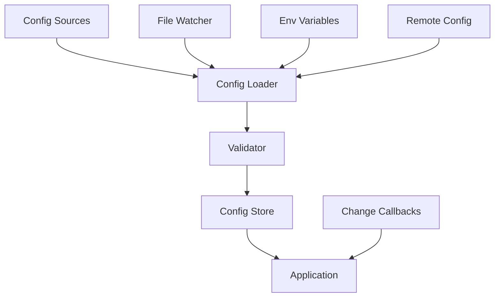

# How to Build a Config System with Hot Reload in Python

Author: [nawazdhandala](https://www.github.com/nawazdhandala)

Tags: Python, Configuration, Hot Reload, File Watching, DevOps, Production Systems

Description: Learn how to build a configuration system in Python that supports hot reloading without restarting your application. This guide covers file watching, environment variables, validation, and thread-safe config updates.

---

> Configuration changes shouldn't require application restarts. A well-designed config system lets you update settings on the fly, whether you're tweaking feature flags, adjusting rate limits, or rotating credentials. This guide shows you how to build one in Python.

Hot reloading configuration is valuable in production systems where downtime is expensive. Instead of restarting services to pick up new settings, you watch for changes and reload automatically.

---

## Configuration System Architecture

A production config system needs several components:



| Component | Purpose |
|-----------|---------|
| **Sources** | Files, env vars, remote stores |
| **Loader** | Reads and merges config from sources |
| **Validator** | Ensures config values are valid |
| **Store** | Thread-safe access to current config |
| **Watcher** | Detects changes and triggers reload |

---

## Core Configuration Classes

Let's start with the foundational classes for our config system.

```python
# config_core.py
# Core configuration system with type safety
from dataclasses import dataclass, field
from typing import Any, Dict, Optional, Callable, List, TypeVar, Generic
from pathlib import Path
from enum import Enum
import json
import yaml
import os
import threading
from datetime import datetime

T = TypeVar('T')

class ConfigSource(Enum):
    """Sources where configuration can be loaded from"""
    FILE = "file"
    ENVIRONMENT = "environment"
    REMOTE = "remote"
    DEFAULT = "default"

@dataclass
class ConfigValue(Generic[T]):
    """
    Wrapper for a configuration value with metadata.

    Tracks where the value came from and when it was last updated.
    """
    value: T
    source: ConfigSource
    updated_at: datetime = field(default_factory=datetime.utcnow)

    def __repr__(self):
        return f"ConfigValue({self.value}, source={self.source.value})"

class ConfigValidationError(Exception):
    """Raised when configuration validation fails"""
    def __init__(self, errors: List[str]):
        self.errors = errors
        super().__init__(f"Config validation failed: {', '.join(errors)}")

class ConfigSchema:
    """
    Define expected configuration structure and validation rules.

    Example:
        schema = ConfigSchema()
        schema.require("database.host", str)
        schema.require("database.port", int, min_value=1, max_value=65535)
        schema.optional("debug", bool, default=False)
    """

    def __init__(self):
        self._required: Dict[str, dict] = {}
        self._optional: Dict[str, dict] = {}

    def require(
        self,
        key: str,
        value_type: type,
        min_value: Optional[Any] = None,
        max_value: Optional[Any] = None,
        choices: Optional[List[Any]] = None
    ):
        """Define a required configuration key"""
        self._required[key] = {
            "type": value_type,
            "min": min_value,
            "max": max_value,
            "choices": choices
        }

    def optional(
        self,
        key: str,
        value_type: type,
        default: Any = None,
        min_value: Optional[Any] = None,
        max_value: Optional[Any] = None
    ):
        """Define an optional configuration key with default"""
        self._optional[key] = {
            "type": value_type,
            "default": default,
            "min": min_value,
            "max": max_value
        }

    def validate(self, config: Dict[str, Any]) -> List[str]:
        """
        Validate configuration against schema.

        Returns list of validation errors (empty if valid).
        """
        errors = []

        # Check required keys
        for key, rules in self._required.items():
            value = self._get_nested(config, key)

            if value is None:
                errors.append(f"Missing required config: {key}")
                continue

            errors.extend(self._validate_value(key, value, rules))

        # Check optional keys (if present)
        for key, rules in self._optional.items():
            value = self._get_nested(config, key)

            if value is not None:
                errors.extend(self._validate_value(key, value, rules))

        return errors

    def _get_nested(self, config: dict, key: str) -> Any:
        """Get a nested value using dot notation"""
        parts = key.split(".")
        value = config

        for part in parts:
            if isinstance(value, dict) and part in value:
                value = value[part]
            else:
                return None

        return value

    def _validate_value(self, key: str, value: Any, rules: dict) -> List[str]:
        """Validate a single value against its rules"""
        errors = []

        # Type check
        if not isinstance(value, rules["type"]):
            errors.append(
                f"{key}: expected {rules['type'].__name__}, got {type(value).__name__}"
            )
            return errors

        # Range checks for numbers
        if rules.get("min") is not None and value < rules["min"]:
            errors.append(f"{key}: value {value} below minimum {rules['min']}")

        if rules.get("max") is not None and value > rules["max"]:
            errors.append(f"{key}: value {value} above maximum {rules['max']}")

        # Choice validation
        if rules.get("choices") and value not in rules["choices"]:
            errors.append(f"{key}: value {value} not in {rules['choices']}")

        return errors

    def apply_defaults(self, config: Dict[str, Any]) -> Dict[str, Any]:
        """Apply default values for missing optional keys"""
        result = config.copy()

        for key, rules in self._optional.items():
            if self._get_nested(result, key) is None and rules["default"] is not None:
                self._set_nested(result, key, rules["default"])

        return result

    def _set_nested(self, config: dict, key: str, value: Any):
        """Set a nested value using dot notation"""
        parts = key.split(".")
        current = config

        for part in parts[:-1]:
            if part not in current:
                current[part] = {}
            current = current[part]

        current[parts[-1]] = value
```

---

## File Watcher Implementation

The file watcher monitors configuration files and triggers reload on changes.

```python
# file_watcher.py
# File system watcher for configuration hot reload
import threading
import time
from pathlib import Path
from typing import Callable, Dict, Set
import hashlib
import os

class FileWatcher:
    """
    Watch files for changes and trigger callbacks.

    Uses file hashing to detect changes reliably across
    different file systems and editors.
    """

    def __init__(self, poll_interval: float = 1.0):
        """
        Initialize the file watcher.

        Args:
            poll_interval: Seconds between file checks
        """
        self.poll_interval = poll_interval
        self._watched_files: Dict[Path, str] = {}  # path -> hash
        self._callbacks: Dict[Path, Callable] = {}
        self._running = False
        self._thread: Optional[threading.Thread] = None
        self._lock = threading.Lock()

    def watch(self, file_path: str, callback: Callable[[Path], None]):
        """
        Start watching a file for changes.

        Args:
            file_path: Path to the file to watch
            callback: Function to call when file changes
        """
        path = Path(file_path).resolve()

        with self._lock:
            # Calculate initial hash
            file_hash = self._get_file_hash(path)
            self._watched_files[path] = file_hash
            self._callbacks[path] = callback

        # Start watcher thread if not running
        if not self._running:
            self.start()

    def unwatch(self, file_path: str):
        """Stop watching a file"""
        path = Path(file_path).resolve()

        with self._lock:
            self._watched_files.pop(path, None)
            self._callbacks.pop(path, None)

    def start(self):
        """Start the file watcher thread"""
        if self._running:
            return

        self._running = True
        self._thread = threading.Thread(target=self._watch_loop, daemon=True)
        self._thread.start()

    def stop(self):
        """Stop the file watcher thread"""
        self._running = False
        if self._thread:
            self._thread.join(timeout=5.0)
            self._thread = None

    def _watch_loop(self):
        """Main loop that checks for file changes"""
        while self._running:
            self._check_files()
            time.sleep(self.poll_interval)

    def _check_files(self):
        """Check all watched files for changes"""
        with self._lock:
            files_to_check = list(self._watched_files.items())

        for path, old_hash in files_to_check:
            try:
                new_hash = self._get_file_hash(path)

                if new_hash != old_hash:
                    # File changed - update hash and trigger callback
                    with self._lock:
                        self._watched_files[path] = new_hash
                        callback = self._callbacks.get(path)

                    if callback:
                        try:
                            callback(path)
                        except Exception as e:
                            # Log but don't crash the watcher
                            print(f"Error in file change callback: {e}")

            except FileNotFoundError:
                # File was deleted - could trigger callback or remove watch
                pass

    def _get_file_hash(self, path: Path) -> str:
        """Calculate MD5 hash of file contents"""
        if not path.exists():
            return ""

        hasher = hashlib.md5()
        with open(path, "rb") as f:
            # Read in chunks for large files
            for chunk in iter(lambda: f.read(8192), b""):
                hasher.update(chunk)

        return hasher.hexdigest()
```

---

## Configuration Manager

The main configuration manager ties everything together.

```python
# config_manager.py
# Configuration manager with hot reload support
from typing import Any, Dict, Optional, Callable, List
from pathlib import Path
import json
import yaml
import os
import threading
import logging
from copy import deepcopy

logger = logging.getLogger(__name__)

class ConfigManager:
    """
    Thread-safe configuration manager with hot reload support.

    Features:
    - Load from multiple sources (files, env vars)
    - Automatic file watching and reload
    - Schema validation
    - Change callbacks for application updates
    - Thread-safe access
    """

    def __init__(
        self,
        schema: Optional[ConfigSchema] = None,
        watch_interval: float = 1.0
    ):
        """
        Initialize the configuration manager.

        Args:
            schema: Optional schema for validation
            watch_interval: File check interval in seconds
        """
        self.schema = schema
        self._config: Dict[str, Any] = {}
        self._lock = threading.RLock()
        self._watcher = FileWatcher(poll_interval=watch_interval)
        self._change_callbacks: List[Callable[[Dict], None]] = []
        self._config_files: List[Path] = []

    def load_file(
        self,
        file_path: str,
        watch: bool = True,
        required: bool = True
    ):
        """
        Load configuration from a file.

        Args:
            file_path: Path to config file (JSON or YAML)
            watch: Whether to watch for changes
            required: Raise error if file doesn't exist
        """
        path = Path(file_path).resolve()

        if not path.exists():
            if required:
                raise FileNotFoundError(f"Config file not found: {path}")
            return

        # Read and parse the file
        config = self._read_file(path)

        # Merge with existing config
        with self._lock:
            self._deep_merge(self._config, config)
            self._config_files.append(path)

        logger.info(f"Loaded config from {path}")

        # Set up file watching if requested
        if watch:
            self._watcher.watch(str(path), self._on_file_changed)

    def load_env(self, prefix: str = "", mapping: Optional[Dict[str, str]] = None):
        """
        Load configuration from environment variables.

        Args:
            prefix: Only load vars starting with this prefix
            mapping: Map env var names to config keys
        """
        if mapping:
            # Use explicit mapping
            for env_var, config_key in mapping.items():
                value = os.environ.get(env_var)
                if value is not None:
                    self._set_from_env(config_key, value)
        else:
            # Load all vars with prefix
            for key, value in os.environ.items():
                if prefix and not key.startswith(prefix):
                    continue

                # Convert env var name to config key
                # APP_DATABASE_HOST -> database.host
                config_key = key[len(prefix):].lower().replace("_", ".")
                self._set_from_env(config_key, value)

    def _set_from_env(self, key: str, value: str):
        """Set a config value from an environment variable"""
        # Try to parse as JSON for complex types
        try:
            parsed = json.loads(value)
        except json.JSONDecodeError:
            # Keep as string
            parsed = value

        with self._lock:
            self._set_nested(self._config, key, parsed)

    def get(self, key: str, default: Any = None) -> Any:
        """
        Get a configuration value.

        Args:
            key: Dot-notation key (e.g., "database.host")
            default: Value to return if key not found

        Returns:
            Configuration value or default
        """
        with self._lock:
            value = self._get_nested(self._config, key)
            return value if value is not None else default

    def get_all(self) -> Dict[str, Any]:
        """Get a copy of the entire configuration"""
        with self._lock:
            return deepcopy(self._config)

    def set(self, key: str, value: Any):
        """
        Set a configuration value at runtime.

        Note: This doesn't persist to files.
        """
        with self._lock:
            self._set_nested(self._config, key, value)

        # Notify listeners of the change
        self._notify_change()

    def on_change(self, callback: Callable[[Dict], None]):
        """
        Register a callback for configuration changes.

        The callback receives the entire new config dict.
        """
        self._change_callbacks.append(callback)

    def validate(self) -> bool:
        """
        Validate current configuration against schema.

        Returns:
            True if valid

        Raises:
            ConfigValidationError if invalid
        """
        if not self.schema:
            return True

        with self._lock:
            errors = self.schema.validate(self._config)

        if errors:
            raise ConfigValidationError(errors)

        return True

    def reload(self):
        """Manually reload all configuration files"""
        with self._lock:
            self._config = {}

            for path in self._config_files:
                if path.exists():
                    config = self._read_file(path)
                    self._deep_merge(self._config, config)

        # Apply defaults from schema
        if self.schema:
            with self._lock:
                self._config = self.schema.apply_defaults(self._config)

        self.validate()
        self._notify_change()
        logger.info("Configuration reloaded")

    def _on_file_changed(self, path: Path):
        """Callback when a watched file changes"""
        logger.info(f"Config file changed: {path}")

        try:
            self.reload()
        except Exception as e:
            logger.error(f"Failed to reload config: {e}")

    def _notify_change(self):
        """Notify all registered callbacks of config change"""
        config_copy = self.get_all()

        for callback in self._change_callbacks:
            try:
                callback(config_copy)
            except Exception as e:
                logger.error(f"Error in config change callback: {e}")

    def _read_file(self, path: Path) -> Dict[str, Any]:
        """Read and parse a config file"""
        with open(path, "r") as f:
            content = f.read()

        if path.suffix in (".yaml", ".yml"):
            return yaml.safe_load(content) or {}
        elif path.suffix == ".json":
            return json.loads(content)
        else:
            raise ValueError(f"Unsupported config file format: {path.suffix}")

    def _deep_merge(self, base: dict, override: dict):
        """Recursively merge override into base"""
        for key, value in override.items():
            if key in base and isinstance(base[key], dict) and isinstance(value, dict):
                self._deep_merge(base[key], value)
            else:
                base[key] = value

    def _get_nested(self, config: dict, key: str) -> Any:
        """Get a nested value using dot notation"""
        parts = key.split(".")
        value = config

        for part in parts:
            if isinstance(value, dict) and part in value:
                value = value[part]
            else:
                return None

        return value

    def _set_nested(self, config: dict, key: str, value: Any):
        """Set a nested value using dot notation"""
        parts = key.split(".")
        current = config

        for part in parts[:-1]:
            if part not in current:
                current[part] = {}
            current = current[part]

        current[parts[-1]] = value

    def close(self):
        """Stop file watching and cleanup"""
        self._watcher.stop()
```

---

## Usage Example

Here is how to use the configuration system in a real application.

```python
# app_config.py
# Application configuration setup
from config_manager import ConfigManager, ConfigSchema

# Define the configuration schema
schema = ConfigSchema()

# Required settings
schema.require("server.host", str)
schema.require("server.port", int, min_value=1, max_value=65535)
schema.require("database.url", str)

# Optional settings with defaults
schema.optional("server.workers", int, default=4)
schema.optional("debug", bool, default=False)
schema.optional("log_level", str, default="INFO")
schema.optional("rate_limit.requests_per_minute", int, default=100)
schema.optional("feature_flags.new_checkout", bool, default=False)

# Create the config manager
config = ConfigManager(schema=schema, watch_interval=2.0)

# Load configuration in priority order (later sources override earlier)
# 1. Default config file
config.load_file("config/default.yaml", required=True)

# 2. Environment-specific config
import os
env = os.environ.get("APP_ENV", "development")
config.load_file(f"config/{env}.yaml", required=False)

# 3. Local overrides (not in version control)
config.load_file("config/local.yaml", required=False)

# 4. Environment variables override everything
config.load_env(prefix="APP_")

# Validate the final configuration
config.validate()

# Register change handlers
def on_config_change(new_config):
    """Handle configuration changes"""
    print(f"Config updated! Debug mode: {new_config.get('debug')}")

    # Update application components that cache config
    update_rate_limiter(new_config.get("rate_limit", {}))
    update_feature_flags(new_config.get("feature_flags", {}))

config.on_change(on_config_change)

# Access configuration values in your application
def get_database_url() -> str:
    return config.get("database.url")

def is_feature_enabled(feature: str) -> bool:
    return config.get(f"feature_flags.{feature}", False)

def get_rate_limit() -> int:
    return config.get("rate_limit.requests_per_minute", 100)
```

---

## Example Configuration Files

```yaml
# config/default.yaml
# Default configuration values
server:
  host: "0.0.0.0"
  port: 8000
  workers: 4

database:
  url: "postgresql://localhost/myapp"
  pool_size: 10

log_level: "INFO"
debug: false

rate_limit:
  requests_per_minute: 100
  burst_size: 20

feature_flags:
  new_checkout: false
  dark_mode: true
```

```yaml
# config/production.yaml
# Production overrides
server:
  workers: 8

database:
  pool_size: 20

log_level: "WARNING"

rate_limit:
  requests_per_minute: 1000
  burst_size: 100
```

---

## FastAPI Integration

Here is how to integrate the config system with a FastAPI application.

```python
# fastapi_app.py
# FastAPI integration with hot-reload config
from fastapi import FastAPI, Depends
from contextlib import asynccontextmanager

# Import our config
from app_config import config

@asynccontextmanager
async def lifespan(app: FastAPI):
    """Manage config lifecycle with the app"""
    # Config is already loaded, just log it
    print(f"Starting with debug={config.get('debug')}")

    yield

    # Cleanup on shutdown
    config.close()

app = FastAPI(lifespan=lifespan)

# Dependency to get current config
def get_config():
    return config

@app.get("/settings")
async def get_settings(cfg = Depends(get_config)):
    """Endpoint to view current config (be careful what you expose)"""
    return {
        "debug": cfg.get("debug"),
        "log_level": cfg.get("log_level"),
        "feature_flags": cfg.get("feature_flags")
    }

@app.get("/feature/{name}")
async def check_feature(name: str, cfg = Depends(get_config)):
    """Check if a feature flag is enabled"""
    enabled = cfg.get(f"feature_flags.{name}", False)
    return {"feature": name, "enabled": enabled}
```

---

## Testing Configuration

```python
# test_config.py
# Tests for configuration system
import pytest
import tempfile
from pathlib import Path
import yaml
import time

class TestConfigManager:
    """Tests for ConfigManager"""

    def test_load_yaml_file(self, tmp_path):
        """Should load configuration from YAML file"""
        config_file = tmp_path / "config.yaml"
        config_file.write_text(yaml.dump({
            "database": {"host": "localhost", "port": 5432}
        }))

        manager = ConfigManager()
        manager.load_file(str(config_file), watch=False)

        assert manager.get("database.host") == "localhost"
        assert manager.get("database.port") == 5432

    def test_hot_reload(self, tmp_path):
        """Should reload config when file changes"""
        config_file = tmp_path / "config.yaml"
        config_file.write_text(yaml.dump({"value": 1}))

        manager = ConfigManager(watch_interval=0.1)
        manager.load_file(str(config_file))

        assert manager.get("value") == 1

        # Update the file
        config_file.write_text(yaml.dump({"value": 2}))

        # Wait for watcher to detect change
        time.sleep(0.3)

        assert manager.get("value") == 2
        manager.close()

    def test_env_override(self, tmp_path, monkeypatch):
        """Environment variables should override file config"""
        config_file = tmp_path / "config.yaml"
        config_file.write_text(yaml.dump({"debug": False}))

        monkeypatch.setenv("APP_DEBUG", "true")

        manager = ConfigManager()
        manager.load_file(str(config_file), watch=False)
        manager.load_env(prefix="APP_")

        # Env var overrides file
        assert manager.get("debug") == True

    def test_validation(self):
        """Should validate config against schema"""
        schema = ConfigSchema()
        schema.require("port", int, min_value=1, max_value=65535)

        manager = ConfigManager(schema=schema)
        manager.set("port", 80)

        assert manager.validate() == True

        manager.set("port", 70000)
        with pytest.raises(ConfigValidationError):
            manager.validate()
```

---

## Best Practices

### 1. Use Schema Validation

```python
# Always validate config on load
schema = ConfigSchema()
schema.require("database.url", str)
config.validate()  # Fail fast if config is invalid
```

### 2. Separate Secrets from Config

```python
# Don't put secrets in config files
# Load from environment or secret manager
database_password = os.environ.get("DB_PASSWORD")
```

### 3. Handle Reload Failures Gracefully

```python
def on_file_changed(path):
    try:
        config.reload()
    except ConfigValidationError as e:
        # Keep using old config if new one is invalid
        logger.error(f"Invalid config, keeping previous: {e}")
```

### 4. Log Configuration Changes

```python
config.on_change(lambda c: logger.info(f"Config reloaded: {c.keys()}"))
```

---

## Conclusion

A configuration system with hot reload provides:

- **Zero-downtime updates** for settings changes
- **Environment flexibility** with layered config sources
- **Safety** through schema validation
- **Observability** through change callbacks

Start with file-based config and add complexity (remote sources, encryption) as needed.

---

*Need to monitor configuration changes across your services? [OneUptime](https://oneuptime.com) tracks deployment changes and configuration updates with automatic alerting.*

**Related Reading:**
- [How to Build Feature Flags in Python](https://oneuptime.com/blog/post/2025-07-02-spring-boot-launchdarkly-feature-flags/view)
- [How to Manage Production Environment Variables](https://oneuptime.com/blog/post/2026-01-06-nodejs-production-environment-variables/view)
