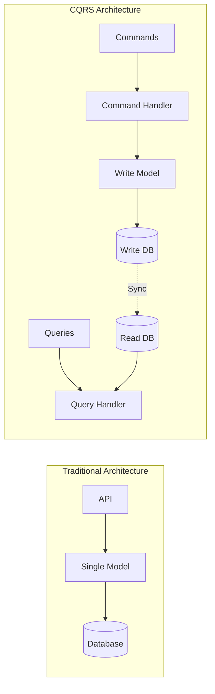

# How to Implement CQRS Pattern in Python

Author: [nawazdhandala](https://www.github.com/nawazdhandala)

Tags: Python, CQRS, Design Patterns, Architecture, Command Query Separation, Microservices, Domain-Driven Design

Description: Learn how to implement the CQRS (Command Query Responsibility Segregation) pattern in Python. This guide covers command and query separation, mediator patterns, read model optimization, and practical examples for building scalable applications.

---

> CQRS separates reads from writes, allowing you to optimize each independently. Your command side handles business logic and validation, while the query side serves data in exactly the shape your UI needs. This guide shows you how to implement CQRS in Python for better scalability and maintainability.

Most applications use the same model for reading and writing data. This works fine for simple CRUD operations, but becomes problematic as applications grow. CQRS (Command Query Responsibility Segregation) solves this by using separate models for updates and queries.

---

## Why CQRS?

Traditional architectures force compromises. Your domain model must satisfy both complex business rules and efficient query requirements. CQRS eliminates this tension:

- **Independent scaling** - Scale read and write sides separately
- **Optimized queries** - Denormalized read models for fast retrieval
- **Simplified domain model** - Focus on business rules without query concerns
- **Better security** - Separate authorization for commands and queries
- **Event sourcing ready** - Natural fit for event-driven architectures



---

## Project Structure

Organize your CQRS application with clear separation:

```
my_app/
    domain/
        __init__.py
        commands.py      # Command definitions
        queries.py       # Query definitions
        handlers/
            __init__.py
            command_handlers.py
            query_handlers.py
    infrastructure/
        __init__.py
        mediator.py      # Command/Query dispatcher
        repositories.py  # Data access
        read_models.py   # Query-optimized models
    api/
        __init__.py
        routes.py        # API endpoints
```

---

## Commands and Command Handlers

### Defining Commands

Commands represent intentions to change state. They should be immutable and contain all data needed for the operation:

```python
# domain/commands.py
# Command definitions for the application
from dataclasses import dataclass, field
from datetime import datetime
from typing import Optional, List
from uuid import UUID, uuid4


@dataclass(frozen=True)
class Command:
    """
    Base class for all commands.
    frozen=True ensures immutability.
    """
    command_id: UUID = field(default_factory=uuid4)
    timestamp: datetime = field(default_factory=datetime.utcnow)


@dataclass(frozen=True)
class CreateUser(Command):
    """Command to create a new user account."""
    email: str = ""
    username: str = ""
    password: str = ""
    full_name: Optional[str] = None


@dataclass(frozen=True)
class UpdateUserProfile(Command):
    """Command to update user profile information."""
    user_id: UUID = field(default_factory=uuid4)
    full_name: Optional[str] = None
    bio: Optional[str] = None
    avatar_url: Optional[str] = None


@dataclass(frozen=True)
class DeactivateUser(Command):
    """Command to deactivate a user account."""
    user_id: UUID = field(default_factory=uuid4)
    reason: str = ""
    deactivated_by: UUID = field(default_factory=uuid4)


@dataclass(frozen=True)
class CreateOrder(Command):
    """Command to create a new order."""
    customer_id: UUID = field(default_factory=uuid4)
    items: tuple = ()  # Tuple of (product_id, quantity, price)
    shipping_address: str = ""
    notes: Optional[str] = None


@dataclass(frozen=True)
class CancelOrder(Command):
    """Command to cancel an existing order."""
    order_id: UUID = field(default_factory=uuid4)
    reason: str = ""
    cancelled_by: UUID = field(default_factory=uuid4)
```

### Implementing Command Handlers

Handlers contain the business logic for processing commands:

```python
# domain/handlers/command_handlers.py
# Command handlers with business logic
from dataclasses import dataclass
from typing import Protocol, TypeVar, Generic
from uuid import UUID, uuid4
import hashlib

from domain.commands import (
    Command,
    CreateUser,
    UpdateUserProfile,
    DeactivateUser,
    CreateOrder,
    CancelOrder,
)


# Type variable for command types
C = TypeVar('C', bound=Command)


class CommandHandler(Protocol[C]):
    """Protocol defining the command handler interface."""

    def handle(self, command: C) -> UUID:
        """Handle the command and return the entity ID."""
        ...


@dataclass
class CommandResult:
    """Result of command execution."""
    success: bool
    entity_id: UUID = None
    error: str = None


class CreateUserHandler:
    """
    Handler for CreateUser command.
    Validates input and creates the user.
    """

    def __init__(self, user_repository, email_service=None):
        self.user_repository = user_repository
        self.email_service = email_service

    def handle(self, command: CreateUser) -> CommandResult:
        # Validate email uniqueness
        if self.user_repository.exists_by_email(command.email):
            return CommandResult(
                success=False,
                error="Email already registered"
            )

        # Validate username uniqueness
        if self.user_repository.exists_by_username(command.username):
            return CommandResult(
                success=False,
                error="Username already taken"
            )

        # Create user entity
        user_id = uuid4()
        hashed_password = self._hash_password(command.password)

        user = {
            'id': user_id,
            'email': command.email,
            'username': command.username,
            'hashed_password': hashed_password,
            'full_name': command.full_name,
            'is_active': True,
            'created_at': command.timestamp,
        }

        # Persist to write store
        self.user_repository.save(user)

        # Send welcome email (side effect)
        if self.email_service:
            self.email_service.send_welcome(command.email)

        return CommandResult(success=True, entity_id=user_id)

    def _hash_password(self, password: str) -> str:
        # Use bcrypt in production
        return hashlib.sha256(password.encode()).hexdigest()


class UpdateUserProfileHandler:
    """Handler for UpdateUserProfile command."""

    def __init__(self, user_repository):
        self.user_repository = user_repository

    def handle(self, command: UpdateUserProfile) -> CommandResult:
        # Load existing user
        user = self.user_repository.get_by_id(command.user_id)
        if not user:
            return CommandResult(success=False, error="User not found")

        # Apply updates
        if command.full_name is not None:
            user['full_name'] = command.full_name
        if command.bio is not None:
            user['bio'] = command.bio
        if command.avatar_url is not None:
            user['avatar_url'] = command.avatar_url

        user['updated_at'] = command.timestamp

        # Persist changes
        self.user_repository.save(user)

        return CommandResult(success=True, entity_id=command.user_id)


class CreateOrderHandler:
    """Handler for CreateOrder command."""

    def __init__(self, order_repository, inventory_service, customer_repository):
        self.order_repository = order_repository
        self.inventory_service = inventory_service
        self.customer_repository = customer_repository

    def handle(self, command: CreateOrder) -> CommandResult:
        # Validate customer exists
        customer = self.customer_repository.get_by_id(command.customer_id)
        if not customer:
            return CommandResult(success=False, error="Customer not found")

        # Validate inventory availability
        for product_id, quantity, _ in command.items:
            if not self.inventory_service.is_available(product_id, quantity):
                return CommandResult(
                    success=False,
                    error=f"Insufficient inventory for product {product_id}"
                )

        # Calculate total
        total = sum(quantity * price for _, quantity, price in command.items)

        # Create order
        order_id = uuid4()
        order = {
            'id': order_id,
            'customer_id': command.customer_id,
            'items': list(command.items),
            'total': total,
            'status': 'pending',
            'shipping_address': command.shipping_address,
            'notes': command.notes,
            'created_at': command.timestamp,
        }

        self.order_repository.save(order)

        # Reserve inventory
        for product_id, quantity, _ in command.items:
            self.inventory_service.reserve(product_id, quantity, order_id)

        return CommandResult(success=True, entity_id=order_id)
```

---

## Queries and Query Handlers

### Defining Queries

Queries request data without modifying state:

```python
# domain/queries.py
# Query definitions for reading data
from dataclasses import dataclass, field
from datetime import datetime
from typing import Optional, List
from uuid import UUID


@dataclass(frozen=True)
class Query:
    """Base class for all queries."""
    pass


@dataclass(frozen=True)
class GetUserById(Query):
    """Query to get a single user by ID."""
    user_id: UUID = field(default_factory=lambda: UUID(int=0))


@dataclass(frozen=True)
class GetUserByEmail(Query):
    """Query to get a user by email address."""
    email: str = ""


@dataclass(frozen=True)
class ListUsers(Query):
    """Query to list users with pagination and filtering."""
    page: int = 1
    page_size: int = 20
    is_active: Optional[bool] = None
    search: Optional[str] = None
    sort_by: str = "created_at"
    sort_order: str = "desc"


@dataclass(frozen=True)
class GetOrderById(Query):
    """Query to get order details."""
    order_id: UUID = field(default_factory=lambda: UUID(int=0))


@dataclass(frozen=True)
class ListOrdersByCustomer(Query):
    """Query to list orders for a customer."""
    customer_id: UUID = field(default_factory=lambda: UUID(int=0))
    status: Optional[str] = None
    page: int = 1
    page_size: int = 20


@dataclass(frozen=True)
class GetOrderStatistics(Query):
    """Query for order statistics dashboard."""
    start_date: Optional[datetime] = None
    end_date: Optional[datetime] = None
```

### Implementing Query Handlers

Query handlers retrieve data from optimized read models:

```python
# domain/handlers/query_handlers.py
# Query handlers for data retrieval
from dataclasses import dataclass
from typing import Optional, List, Dict, Any
from datetime import datetime

from domain.queries import (
    GetUserById,
    GetUserByEmail,
    ListUsers,
    GetOrderById,
    ListOrdersByCustomer,
    GetOrderStatistics,
)


@dataclass
class UserDTO:
    """Data transfer object for user data."""
    id: str
    email: str
    username: str
    full_name: Optional[str]
    bio: Optional[str]
    avatar_url: Optional[str]
    is_active: bool
    created_at: datetime


@dataclass
class UserListResult:
    """Paginated list of users."""
    users: List[UserDTO]
    total: int
    page: int
    page_size: int
    total_pages: int


@dataclass
class OrderDTO:
    """Data transfer object for order data."""
    id: str
    customer_id: str
    customer_name: str  # Denormalized for display
    items: List[Dict[str, Any]]
    total: float
    status: str
    shipping_address: str
    created_at: datetime


class GetUserByIdHandler:
    """Handler for GetUserById query."""

    def __init__(self, read_model_repository):
        self.read_model = read_model_repository

    def handle(self, query: GetUserById) -> Optional[UserDTO]:
        # Query the read-optimized store
        user_data = self.read_model.find_user_by_id(str(query.user_id))

        if not user_data:
            return None

        return UserDTO(
            id=user_data['id'],
            email=user_data['email'],
            username=user_data['username'],
            full_name=user_data.get('full_name'),
            bio=user_data.get('bio'),
            avatar_url=user_data.get('avatar_url'),
            is_active=user_data['is_active'],
            created_at=user_data['created_at'],
        )


class ListUsersHandler:
    """Handler for ListUsers query with pagination."""

    def __init__(self, read_model_repository):
        self.read_model = read_model_repository

    def handle(self, query: ListUsers) -> UserListResult:
        # Build filter criteria
        filters = {}
        if query.is_active is not None:
            filters['is_active'] = query.is_active
        if query.search:
            filters['search'] = query.search

        # Calculate pagination
        offset = (query.page - 1) * query.page_size

        # Execute query against read model
        users_data, total = self.read_model.find_users(
            filters=filters,
            offset=offset,
            limit=query.page_size,
            sort_by=query.sort_by,
            sort_order=query.sort_order,
        )

        # Map to DTOs
        users = [
            UserDTO(
                id=u['id'],
                email=u['email'],
                username=u['username'],
                full_name=u.get('full_name'),
                bio=u.get('bio'),
                avatar_url=u.get('avatar_url'),
                is_active=u['is_active'],
                created_at=u['created_at'],
            )
            for u in users_data
        ]

        total_pages = (total + query.page_size - 1) // query.page_size

        return UserListResult(
            users=users,
            total=total,
            page=query.page,
            page_size=query.page_size,
            total_pages=total_pages,
        )


class GetOrderStatisticsHandler:
    """Handler for dashboard statistics query."""

    def __init__(self, analytics_repository):
        self.analytics = analytics_repository

    def handle(self, query: GetOrderStatistics) -> Dict[str, Any]:
        # Query pre-aggregated statistics
        stats = self.analytics.get_order_stats(
            start_date=query.start_date,
            end_date=query.end_date,
        )

        return {
            'total_orders': stats['total_orders'],
            'total_revenue': stats['total_revenue'],
            'average_order_value': stats['average_order_value'],
            'orders_by_status': stats['orders_by_status'],
            'top_products': stats['top_products'],
            'orders_per_day': stats['orders_per_day'],
        }
```

---

## The Mediator Pattern

### Dispatching Commands and Queries

The mediator routes commands and queries to their handlers:

```python
# infrastructure/mediator.py
# Mediator for dispatching commands and queries
from typing import Dict, Type, TypeVar, Generic, Any, Callable
from dataclasses import dataclass

from domain.commands import Command
from domain.queries import Query


T = TypeVar('T')


class Mediator:
    """
    Mediator that dispatches commands and queries to handlers.
    Provides a single entry point for all operations.
    """

    def __init__(self):
        self._command_handlers: Dict[Type[Command], Callable] = {}
        self._query_handlers: Dict[Type[Query], Callable] = {}

    def register_command_handler(
        self,
        command_type: Type[Command],
        handler: Callable,
    ):
        """Register a handler for a command type."""
        self._command_handlers[command_type] = handler

    def register_query_handler(
        self,
        query_type: Type[Query],
        handler: Callable,
    ):
        """Register a handler for a query type."""
        self._query_handlers[query_type] = handler

    def send_command(self, command: Command) -> Any:
        """
        Dispatch a command to its handler.
        Raises KeyError if no handler is registered.
        """
        command_type = type(command)
        handler = self._command_handlers.get(command_type)

        if not handler:
            raise KeyError(f"No handler registered for {command_type.__name__}")

        return handler.handle(command)

    def send_query(self, query: Query) -> Any:
        """
        Dispatch a query to its handler.
        Raises KeyError if no handler is registered.
        """
        query_type = type(query)
        handler = self._query_handlers.get(query_type)

        if not handler:
            raise KeyError(f"No handler registered for {query_type.__name__}")

        return handler.handle(query)


# Decorator-based registration
class MediatorBuilder:
    """
    Builder for configuring the mediator with handlers.
    Supports fluent interface and decorators.
    """

    def __init__(self):
        self._mediator = Mediator()
        self._command_handler_factories: Dict[Type, Callable] = {}
        self._query_handler_factories: Dict[Type, Callable] = {}

    def register_command(self, command_type: Type[Command]):
        """Decorator to register a command handler."""
        def decorator(handler_class):
            self._command_handler_factories[command_type] = handler_class
            return handler_class
        return decorator

    def register_query(self, query_type: Type[Query]):
        """Decorator to register a query handler."""
        def decorator(handler_class):
            self._query_handler_factories[query_type] = handler_class
            return handler_class
        return decorator

    def build(self, dependency_container) -> Mediator:
        """
        Build the mediator with instantiated handlers.
        Uses dependency container to resolve handler dependencies.
        """
        # Create command handlers
        for command_type, factory in self._command_handler_factories.items():
            handler = dependency_container.resolve(factory)
            self._mediator.register_command_handler(command_type, handler)

        # Create query handlers
        for query_type, factory in self._query_handler_factories.items():
            handler = dependency_container.resolve(factory)
            self._mediator.register_query_handler(query_type, handler)

        return self._mediator


# Global builder instance
mediator_builder = MediatorBuilder()
```

---

## Read Model Synchronization

### Keeping Read Models Updated

Sync write model changes to read models using events:

```python
# infrastructure/read_model_sync.py
# Synchronize write model changes to read models
from typing import Dict, Any, List
from dataclasses import dataclass
from datetime import datetime


class ReadModelSynchronizer:
    """
    Synchronizes write model changes to read models.
    Listens to domain events and updates denormalized views.
    """

    def __init__(self, read_model_store, event_bus=None):
        self.read_model = read_model_store
        self.event_bus = event_bus

    def handle_user_created(self, event: Dict[str, Any]):
        """Update read model when user is created."""
        user_view = {
            'id': str(event['user_id']),
            'email': event['email'],
            'username': event['username'],
            'full_name': event.get('full_name'),
            'is_active': True,
            'created_at': event['timestamp'],
            'updated_at': event['timestamp'],
            # Denormalized fields for queries
            'order_count': 0,
            'total_spent': 0.0,
            'last_order_date': None,
        }
        self.read_model.upsert_user(user_view)

    def handle_user_updated(self, event: Dict[str, Any]):
        """Update read model when user profile changes."""
        user_id = str(event['user_id'])
        updates = {
            'updated_at': event['timestamp'],
        }

        for field in ['full_name', 'bio', 'avatar_url', 'is_active']:
            if field in event:
                updates[field] = event[field]

        self.read_model.update_user(user_id, updates)

    def handle_order_created(self, event: Dict[str, Any]):
        """Update read models when order is created."""
        # Create order view
        order_view = {
            'id': str(event['order_id']),
            'customer_id': str(event['customer_id']),
            'items': event['items'],
            'total': event['total'],
            'status': 'pending',
            'created_at': event['timestamp'],
        }

        # Fetch customer name for denormalization
        customer = self.read_model.get_user(str(event['customer_id']))
        if customer:
            order_view['customer_name'] = customer.get('full_name', customer['email'])
            order_view['customer_email'] = customer['email']

        self.read_model.upsert_order(order_view)

        # Update customer statistics
        self.read_model.increment_user_stats(
            str(event['customer_id']),
            order_count=1,
            total_spent=event['total'],
            last_order_date=event['timestamp'],
        )

    def handle_order_status_changed(self, event: Dict[str, Any]):
        """Update order status in read model."""
        self.read_model.update_order(
            str(event['order_id']),
            {
                'status': event['new_status'],
                'updated_at': event['timestamp'],
            }
        )


class InMemoryReadModelStore:
    """
    Simple in-memory read model store.
    Replace with Redis, Elasticsearch, or dedicated read DB in production.
    """

    def __init__(self):
        self._users: Dict[str, Dict] = {}
        self._orders: Dict[str, Dict] = {}

    def upsert_user(self, user: Dict[str, Any]):
        self._users[user['id']] = user

    def get_user(self, user_id: str) -> Dict[str, Any]:
        return self._users.get(user_id)

    def update_user(self, user_id: str, updates: Dict[str, Any]):
        if user_id in self._users:
            self._users[user_id].update(updates)

    def find_users(
        self,
        filters: Dict = None,
        offset: int = 0,
        limit: int = 20,
        sort_by: str = 'created_at',
        sort_order: str = 'desc',
    ) -> tuple[List[Dict], int]:
        """Find users with filtering and pagination."""
        results = list(self._users.values())

        # Apply filters
        if filters:
            if 'is_active' in filters:
                results = [u for u in results if u['is_active'] == filters['is_active']]
            if 'search' in filters:
                search = filters['search'].lower()
                results = [
                    u for u in results
                    if search in u['email'].lower()
                    or search in u['username'].lower()
                    or (u.get('full_name') and search in u['full_name'].lower())
                ]

        total = len(results)

        # Sort
        reverse = sort_order == 'desc'
        results.sort(key=lambda x: x.get(sort_by, ''), reverse=reverse)

        # Paginate
        results = results[offset:offset + limit]

        return results, total

    def increment_user_stats(
        self,
        user_id: str,
        order_count: int = 0,
        total_spent: float = 0,
        last_order_date: datetime = None,
    ):
        """Update aggregated user statistics."""
        if user_id in self._users:
            user = self._users[user_id]
            user['order_count'] = user.get('order_count', 0) + order_count
            user['total_spent'] = user.get('total_spent', 0) + total_spent
            if last_order_date:
                user['last_order_date'] = last_order_date

    def upsert_order(self, order: Dict[str, Any]):
        self._orders[order['id']] = order

    def update_order(self, order_id: str, updates: Dict[str, Any]):
        if order_id in self._orders:
            self._orders[order_id].update(updates)

    def find_order_by_id(self, order_id: str) -> Dict[str, Any]:
        return self._orders.get(order_id)
```

---

## FastAPI Integration

### Building the API Layer

Integrate CQRS with FastAPI endpoints:

```python
# api/routes.py
# FastAPI routes using CQRS
from fastapi import APIRouter, Depends, HTTPException, Query, status
from pydantic import BaseModel, EmailStr
from typing import Optional, List
from uuid import UUID

from infrastructure.mediator import Mediator
from domain.commands import CreateUser, UpdateUserProfile
from domain.queries import GetUserById, ListUsers


router = APIRouter()


# Request/Response models
class CreateUserRequest(BaseModel):
    email: EmailStr
    username: str
    password: str
    full_name: Optional[str] = None


class UpdateProfileRequest(BaseModel):
    full_name: Optional[str] = None
    bio: Optional[str] = None
    avatar_url: Optional[str] = None


class UserResponse(BaseModel):
    id: str
    email: str
    username: str
    full_name: Optional[str]
    is_active: bool


# Dependency to get mediator
def get_mediator() -> Mediator:
    # In production, use dependency injection
    from infrastructure.container import container
    return container.mediator


@router.post("/users", response_model=UserResponse, status_code=status.HTTP_201_CREATED)
async def create_user(
    request: CreateUserRequest,
    mediator: Mediator = Depends(get_mediator),
):
    """Create a new user account."""
    command = CreateUser(
        email=request.email,
        username=request.username,
        password=request.password,
        full_name=request.full_name,
    )

    result = mediator.send_command(command)

    if not result.success:
        raise HTTPException(
            status_code=status.HTTP_400_BAD_REQUEST,
            detail=result.error,
        )

    # Query the created user for response
    user = mediator.send_query(GetUserById(user_id=result.entity_id))

    return UserResponse(
        id=user.id,
        email=user.email,
        username=user.username,
        full_name=user.full_name,
        is_active=user.is_active,
    )


@router.get("/users/{user_id}", response_model=UserResponse)
async def get_user(
    user_id: UUID,
    mediator: Mediator = Depends(get_mediator),
):
    """Get user by ID."""
    query = GetUserById(user_id=user_id)
    user = mediator.send_query(query)

    if not user:
        raise HTTPException(
            status_code=status.HTTP_404_NOT_FOUND,
            detail="User not found",
        )

    return UserResponse(
        id=user.id,
        email=user.email,
        username=user.username,
        full_name=user.full_name,
        is_active=user.is_active,
    )


@router.get("/users", response_model=dict)
async def list_users(
    page: int = Query(1, ge=1),
    page_size: int = Query(20, ge=1, le=100),
    is_active: Optional[bool] = None,
    search: Optional[str] = None,
    mediator: Mediator = Depends(get_mediator),
):
    """List users with pagination and filtering."""
    query = ListUsers(
        page=page,
        page_size=page_size,
        is_active=is_active,
        search=search,
    )

    result = mediator.send_query(query)

    return {
        "users": [
            UserResponse(
                id=u.id,
                email=u.email,
                username=u.username,
                full_name=u.full_name,
                is_active=u.is_active,
            )
            for u in result.users
        ],
        "total": result.total,
        "page": result.page,
        "page_size": result.page_size,
        "total_pages": result.total_pages,
    }


@router.patch("/users/{user_id}")
async def update_user_profile(
    user_id: UUID,
    request: UpdateProfileRequest,
    mediator: Mediator = Depends(get_mediator),
):
    """Update user profile."""
    command = UpdateUserProfile(
        user_id=user_id,
        full_name=request.full_name,
        bio=request.bio,
        avatar_url=request.avatar_url,
    )

    result = mediator.send_command(command)

    if not result.success:
        raise HTTPException(
            status_code=status.HTTP_400_BAD_REQUEST,
            detail=result.error,
        )

    return {"message": "Profile updated"}
```

---

## Best Practices

1. **Commands should be task-based** - Name commands after user intentions, not CRUD operations
2. **Queries return DTOs** - Never expose domain entities through queries
3. **Keep handlers focused** - Each handler should do one thing well
4. **Use eventual consistency** - Accept that read models may be slightly behind
5. **Validate in handlers** - Command handlers should validate business rules
6. **Make commands idempotent** - Same command twice should have same effect
7. **Log all commands** - Commands form an audit trail of system changes

---

*Implementing CQRS in your application? [OneUptime](https://oneuptime.com) provides comprehensive monitoring for command and query performance, helping you identify bottlenecks and optimize your architecture.*

**Related Reading:**
- [How to Build Event-Sourced Apps with EventStoreDB in Python](https://oneuptime.com/blog/post/2026-01-24-event-sourcing-eventstoredb-python/view)
- [How to Build RabbitMQ Consumers with Pika in Python](https://oneuptime.com/blog/post/2026-01-23-rabbitmq-consumers-pika-python/view)
