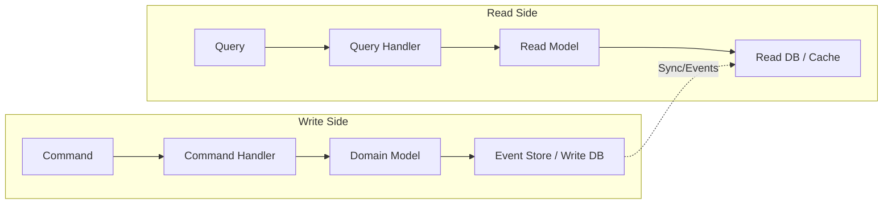

# How to Implement CQRS Pattern in TypeScript

Author: [nawazdhandala](https://www.github.com/nawazdhandala)

Tags: CQRS, TypeScript, Architecture, Design Patterns, Node.js, Event-Driven, Backend

Description: A practical guide to implementing the Command Query Responsibility Segregation (CQRS) pattern in TypeScript. Learn how to separate read and write operations for better scalability, maintainability, and performance.

---

> CQRS (Command Query Responsibility Segregation) separates read and write operations into distinct models. This separation allows you to optimize each side independently, scale them differently, and use different data stores when needed. It is particularly useful for complex domains where reads and writes have very different requirements.

Traditional CRUD applications use the same model for both reading and writing data. This works fine for simple applications, but becomes limiting when read and write patterns diverge significantly. CQRS addresses this by explicitly separating commands (writes) from queries (reads).

---

## Prerequisites

Before diving in, you should have:
- Node.js 18 or higher
- Solid understanding of TypeScript
- Familiarity with async/await patterns
- Basic knowledge of domain-driven design concepts

---

## Understanding CQRS

The core idea of CQRS is simple: use different models for reading and writing. Commands change state but do not return data. Queries return data but do not change state.



---

## Project Setup

Create a new TypeScript project for our CQRS implementation.

```bash
mkdir cqrs-typescript
cd cqrs-typescript
npm init -y
npm install uuid reflect-metadata
npm install -D typescript @types/node @types/uuid ts-node
npx tsc --init
```

Configure TypeScript with decorator support.

```json
{
  "compilerOptions": {
    "target": "ES2022",
    "module": "commonjs",
    "lib": ["ES2022"],
    "outDir": "./dist",
    "rootDir": "./src",
    "strict": true,
    "esModuleInterop": true,
    "experimentalDecorators": true,
    "emitDecoratorMetadata": true,
    "skipLibCheck": true
  },
  "include": ["src/**/*"]
}
```

---

## Defining the Core Interfaces

Start by defining the fundamental interfaces for commands, queries, and their handlers.

```typescript
// src/core/interfaces.ts

// Commands represent intent to change state
// They should be named in imperative form: CreateOrder, UpdateUser, DeleteProduct
export interface Command {
  readonly type: string;
}

// Queries represent requests for data
// They should be named as questions: GetOrderById, ListUserOrders, FindProductsByCategory
export interface Query {
  readonly type: string;
}

// Command handlers process commands and may return a result
export interface CommandHandler<TCommand extends Command, TResult = void> {
  execute(command: TCommand): Promise<TResult>;
}

// Query handlers process queries and always return data
export interface QueryHandler<TQuery extends Query, TResult> {
  execute(query: TQuery): Promise<TResult>;
}

// Events represent something that has happened
// They should be named in past tense: OrderCreated, UserUpdated, ProductDeleted
export interface DomainEvent {
  readonly type: string;
  readonly occurredAt: Date;
  readonly aggregateId: string;
}

// Event handlers react to domain events
export interface EventHandler<TEvent extends DomainEvent> {
  handle(event: TEvent): Promise<void>;
}
```

---

## Building the Command Bus

The command bus routes commands to their appropriate handlers.

```typescript
// src/core/command-bus.ts
import { Command, CommandHandler } from './interfaces';

type CommandHandlerFactory<T extends Command, R = void> = () => CommandHandler<T, R>;

export class CommandBus {
  // Store handler factories by command type
  private handlers = new Map<string, CommandHandlerFactory<any, any>>();

  // Register a handler for a specific command type
  register<TCommand extends Command, TResult = void>(
    commandType: string,
    handlerFactory: CommandHandlerFactory<TCommand, TResult>
  ): void {
    if (this.handlers.has(commandType)) {
      throw new Error(`Handler already registered for command: ${commandType}`);
    }
    this.handlers.set(commandType, handlerFactory);
  }

  // Execute a command by finding and invoking its handler
  async execute<TCommand extends Command, TResult = void>(
    command: TCommand
  ): Promise<TResult> {
    const handlerFactory = this.handlers.get(command.type);

    if (!handlerFactory) {
      throw new Error(`No handler registered for command: ${command.type}`);
    }

    // Create a new handler instance for each command
    // This ensures handlers are stateless and thread-safe
    const handler = handlerFactory();

    console.log(`Executing command: ${command.type}`);
    const startTime = Date.now();

    try {
      const result = await handler.execute(command);
      console.log(`Command ${command.type} completed in ${Date.now() - startTime}ms`);
      return result;
    } catch (error) {
      console.error(`Command ${command.type} failed:`, error);
      throw error;
    }
  }
}
```

---

## Building the Query Bus

The query bus routes queries to their handlers, similar to the command bus.

```typescript
// src/core/query-bus.ts
import { Query, QueryHandler } from './interfaces';

type QueryHandlerFactory<T extends Query, R> = () => QueryHandler<T, R>;

export class QueryBus {
  private handlers = new Map<string, QueryHandlerFactory<any, any>>();

  register<TQuery extends Query, TResult>(
    queryType: string,
    handlerFactory: QueryHandlerFactory<TQuery, TResult>
  ): void {
    if (this.handlers.has(queryType)) {
      throw new Error(`Handler already registered for query: ${queryType}`);
    }
    this.handlers.set(queryType, handlerFactory);
  }

  async execute<TQuery extends Query, TResult>(query: TQuery): Promise<TResult> {
    const handlerFactory = this.handlers.get(query.type);

    if (!handlerFactory) {
      throw new Error(`No handler registered for query: ${query.type}`);
    }

    const handler = handlerFactory();

    console.log(`Executing query: ${query.type}`);
    const startTime = Date.now();

    try {
      const result = await handler.execute(query);
      console.log(`Query ${query.type} completed in ${Date.now() - startTime}ms`);
      return result;
    } catch (error) {
      console.error(`Query ${query.type} failed:`, error);
      throw error;
    }
  }
}
```

---

## Building the Event Bus

The event bus publishes domain events to all registered handlers.

```typescript
// src/core/event-bus.ts
import { DomainEvent, EventHandler } from './interfaces';

type EventHandlerFactory<T extends DomainEvent> = () => EventHandler<T>;

export class EventBus {
  // Multiple handlers can subscribe to the same event type
  private handlers = new Map<string, EventHandlerFactory<any>[]>();

  subscribe<TEvent extends DomainEvent>(
    eventType: string,
    handlerFactory: EventHandlerFactory<TEvent>
  ): void {
    const existing = this.handlers.get(eventType) || [];
    existing.push(handlerFactory);
    this.handlers.set(eventType, existing);
  }

  // Publish an event to all subscribed handlers
  async publish<TEvent extends DomainEvent>(event: TEvent): Promise<void> {
    const handlerFactories = this.handlers.get(event.type) || [];

    if (handlerFactories.length === 0) {
      console.log(`No handlers for event: ${event.type}`);
      return;
    }

    console.log(`Publishing event: ${event.type} to ${handlerFactories.length} handlers`);

    // Execute all handlers concurrently
    const promises = handlerFactories.map(async (factory) => {
      const handler = factory();
      try {
        await handler.handle(event);
      } catch (error) {
        // Log but do not fail other handlers
        console.error(`Event handler failed for ${event.type}:`, error);
      }
    });

    await Promise.all(promises);
  }

  // Publish multiple events in order
  async publishAll(events: DomainEvent[]): Promise<void> {
    for (const event of events) {
      await this.publish(event);
    }
  }
}
```

---

## Implementing the Write Side

Now let us build a complete example with an order domain. Start with the command definitions.

```typescript
// src/orders/commands/commands.ts
import { Command } from '../../core/interfaces';

export interface CreateOrderCommand extends Command {
  type: 'CreateOrder';
  orderId: string;
  customerId: string;
  items: Array<{
    productId: string;
    productName: string;
    quantity: number;
    unitPrice: number;
  }>;
}

export interface AddItemToOrderCommand extends Command {
  type: 'AddItemToOrder';
  orderId: string;
  productId: string;
  productName: string;
  quantity: number;
  unitPrice: number;
}

export interface RemoveItemFromOrderCommand extends Command {
  type: 'RemoveItemFromOrder';
  orderId: string;
  productId: string;
}

export interface SubmitOrderCommand extends Command {
  type: 'SubmitOrder';
  orderId: string;
  shippingAddress: string;
}

export interface CancelOrderCommand extends Command {
  type: 'CancelOrder';
  orderId: string;
  reason: string;
}
```

---

## Building the Domain Model

The domain model handles business logic and produces events.

```typescript
// src/orders/domain/order.ts
import { DomainEvent } from '../../core/interfaces';
import { v4 as uuidv4 } from 'uuid';

// Domain events for the order aggregate
export interface OrderCreatedEvent extends DomainEvent {
  type: 'OrderCreated';
  customerId: string;
  items: OrderItem[];
}

export interface ItemAddedToOrderEvent extends DomainEvent {
  type: 'ItemAddedToOrder';
  item: OrderItem;
}

export interface ItemRemovedFromOrderEvent extends DomainEvent {
  type: 'ItemRemovedFromOrder';
  productId: string;
}

export interface OrderSubmittedEvent extends DomainEvent {
  type: 'OrderSubmitted';
  shippingAddress: string;
  totalAmount: number;
}

export interface OrderCancelledEvent extends DomainEvent {
  type: 'OrderCancelled';
  reason: string;
}

export type OrderDomainEvent =
  | OrderCreatedEvent
  | ItemAddedToOrderEvent
  | ItemRemovedFromOrderEvent
  | OrderSubmittedEvent
  | OrderCancelledEvent;

export interface OrderItem {
  productId: string;
  productName: string;
  quantity: number;
  unitPrice: number;
}

export type OrderStatus = 'draft' | 'submitted' | 'cancelled';

// The Order aggregate root
export class Order {
  private id: string;
  private customerId: string;
  private items: OrderItem[] = [];
  private status: OrderStatus = 'draft';
  private shippingAddress?: string;

  // Uncommitted events generated by this aggregate
  private uncommittedEvents: OrderDomainEvent[] = [];

  private constructor(id: string) {
    this.id = id;
    this.customerId = '';
  }

  // Factory method to create a new order
  static create(orderId: string, customerId: string, items: OrderItem[]): Order {
    const order = new Order(orderId);

    // Raise the creation event
    order.applyEvent({
      type: 'OrderCreated',
      aggregateId: orderId,
      occurredAt: new Date(),
      customerId,
      items,
    });

    return order;
  }

  // Reconstruct an order from event history
  static fromEvents(orderId: string, events: OrderDomainEvent[]): Order {
    const order = new Order(orderId);

    for (const event of events) {
      order.applyEvent(event, false); // Do not add to uncommitted
    }

    return order;
  }

  // Add an item to the order
  addItem(item: OrderItem): void {
    if (this.status !== 'draft') {
      throw new Error(`Cannot add items to an order with status: ${this.status}`);
    }

    // Check if item already exists
    const existing = this.items.find(i => i.productId === item.productId);
    if (existing) {
      throw new Error(`Product ${item.productId} already in order. Update quantity instead.`);
    }

    this.applyEvent({
      type: 'ItemAddedToOrder',
      aggregateId: this.id,
      occurredAt: new Date(),
      item,
    });
  }

  // Remove an item from the order
  removeItem(productId: string): void {
    if (this.status !== 'draft') {
      throw new Error(`Cannot remove items from an order with status: ${this.status}`);
    }

    const existing = this.items.find(i => i.productId === productId);
    if (!existing) {
      throw new Error(`Product ${productId} not found in order`);
    }

    this.applyEvent({
      type: 'ItemRemovedFromOrder',
      aggregateId: this.id,
      occurredAt: new Date(),
      productId,
    });
  }

  // Submit the order for processing
  submit(shippingAddress: string): void {
    if (this.status !== 'draft') {
      throw new Error(`Cannot submit an order with status: ${this.status}`);
    }

    if (this.items.length === 0) {
      throw new Error('Cannot submit an empty order');
    }

    if (!shippingAddress || shippingAddress.trim().length === 0) {
      throw new Error('Shipping address is required');
    }

    this.applyEvent({
      type: 'OrderSubmitted',
      aggregateId: this.id,
      occurredAt: new Date(),
      shippingAddress,
      totalAmount: this.calculateTotal(),
    });
  }

  // Cancel the order
  cancel(reason: string): void {
    if (this.status === 'cancelled') {
      throw new Error('Order is already cancelled');
    }

    this.applyEvent({
      type: 'OrderCancelled',
      aggregateId: this.id,
      occurredAt: new Date(),
      reason,
    });
  }

  // Apply an event and optionally track it as uncommitted
  private applyEvent(event: OrderDomainEvent, isNew: boolean = true): void {
    // Update state based on event
    switch (event.type) {
      case 'OrderCreated':
        this.customerId = event.customerId;
        this.items = [...event.items];
        this.status = 'draft';
        break;

      case 'ItemAddedToOrder':
        this.items.push(event.item);
        break;

      case 'ItemRemovedFromOrder':
        this.items = this.items.filter(i => i.productId !== event.productId);
        break;

      case 'OrderSubmitted':
        this.status = 'submitted';
        this.shippingAddress = event.shippingAddress;
        break;

      case 'OrderCancelled':
        this.status = 'cancelled';
        break;
    }

    // Track new events for persistence
    if (isNew) {
      this.uncommittedEvents.push(event);
    }
  }

  private calculateTotal(): number {
    return this.items.reduce(
      (sum, item) => sum + item.quantity * item.unitPrice,
      0
    );
  }

  // Getters
  getId(): string { return this.id; }
  getCustomerId(): string { return this.customerId; }
  getItems(): OrderItem[] { return [...this.items]; }
  getStatus(): OrderStatus { return this.status; }
  getTotal(): number { return this.calculateTotal(); }

  getUncommittedEvents(): OrderDomainEvent[] {
    return [...this.uncommittedEvents];
  }

  clearUncommittedEvents(): void {
    this.uncommittedEvents = [];
  }
}
```

---

## Implementing Command Handlers

Command handlers coordinate between the command, domain, and persistence.

```typescript
// src/orders/commands/handlers.ts
import { CommandHandler } from '../../core/interfaces';
import { EventBus } from '../../core/event-bus';
import { Order } from '../domain/order';
import { OrderRepository } from '../infrastructure/order-repository';
import {
  CreateOrderCommand,
  AddItemToOrderCommand,
  RemoveItemFromOrderCommand,
  SubmitOrderCommand,
  CancelOrderCommand,
} from './commands';

export class CreateOrderHandler implements CommandHandler<CreateOrderCommand, string> {
  constructor(
    private repository: OrderRepository,
    private eventBus: EventBus
  ) {}

  async execute(command: CreateOrderCommand): Promise<string> {
    // Create the order aggregate
    const order = Order.create(
      command.orderId,
      command.customerId,
      command.items
    );

    // Persist the order
    await this.repository.save(order);

    // Publish domain events
    await this.eventBus.publishAll(order.getUncommittedEvents());
    order.clearUncommittedEvents();

    return order.getId();
  }
}

export class AddItemToOrderHandler implements CommandHandler<AddItemToOrderCommand> {
  constructor(
    private repository: OrderRepository,
    private eventBus: EventBus
  ) {}

  async execute(command: AddItemToOrderCommand): Promise<void> {
    // Load the existing order
    const order = await this.repository.getById(command.orderId);

    if (!order) {
      throw new Error(`Order not found: ${command.orderId}`);
    }

    // Execute the domain logic
    order.addItem({
      productId: command.productId,
      productName: command.productName,
      quantity: command.quantity,
      unitPrice: command.unitPrice,
    });

    // Persist and publish
    await this.repository.save(order);
    await this.eventBus.publishAll(order.getUncommittedEvents());
    order.clearUncommittedEvents();
  }
}

export class SubmitOrderHandler implements CommandHandler<SubmitOrderCommand> {
  constructor(
    private repository: OrderRepository,
    private eventBus: EventBus
  ) {}

  async execute(command: SubmitOrderCommand): Promise<void> {
    const order = await this.repository.getById(command.orderId);

    if (!order) {
      throw new Error(`Order not found: ${command.orderId}`);
    }

    order.submit(command.shippingAddress);

    await this.repository.save(order);
    await this.eventBus.publishAll(order.getUncommittedEvents());
    order.clearUncommittedEvents();
  }
}

export class CancelOrderHandler implements CommandHandler<CancelOrderCommand> {
  constructor(
    private repository: OrderRepository,
    private eventBus: EventBus
  ) {}

  async execute(command: CancelOrderCommand): Promise<void> {
    const order = await this.repository.getById(command.orderId);

    if (!order) {
      throw new Error(`Order not found: ${command.orderId}`);
    }

    order.cancel(command.reason);

    await this.repository.save(order);
    await this.eventBus.publishAll(order.getUncommittedEvents());
    order.clearUncommittedEvents();
  }
}
```

---

## Implementing the Read Side

The read side maintains optimized views for queries.

```typescript
// src/orders/queries/queries.ts
import { Query } from '../../core/interfaces';

export interface GetOrderByIdQuery extends Query {
  type: 'GetOrderById';
  orderId: string;
}

export interface ListCustomerOrdersQuery extends Query {
  type: 'ListCustomerOrders';
  customerId: string;
  page: number;
  pageSize: number;
}

export interface GetOrderSummaryQuery extends Query {
  type: 'GetOrderSummary';
  orderId: string;
}

// Read model DTOs
export interface OrderDto {
  id: string;
  customerId: string;
  items: Array<{
    productId: string;
    productName: string;
    quantity: number;
    unitPrice: number;
    lineTotal: number;
  }>;
  status: string;
  totalAmount: number;
  shippingAddress?: string;
  createdAt: Date;
  updatedAt: Date;
}

export interface OrderSummaryDto {
  id: string;
  status: string;
  itemCount: number;
  totalAmount: number;
  createdAt: Date;
}

export interface PaginatedResult<T> {
  items: T[];
  total: number;
  page: number;
  pageSize: number;
  totalPages: number;
}
```

---

## Building the Read Model Store

The read model store maintains denormalized views optimized for queries.

```typescript
// src/orders/infrastructure/read-model-store.ts
import { OrderDto, OrderSummaryDto } from '../queries/queries';
import { EventHandler, DomainEvent } from '../../core/interfaces';
import {
  OrderCreatedEvent,
  ItemAddedToOrderEvent,
  OrderSubmittedEvent,
  OrderCancelledEvent
} from '../domain/order';

// In-memory read model store
// Replace with a database like PostgreSQL, MongoDB, or Elasticsearch in production
class ReadModelStore {
  private orders = new Map<string, OrderDto>();

  upsert(order: OrderDto): void {
    this.orders.set(order.id, order);
  }

  getById(orderId: string): OrderDto | undefined {
    return this.orders.get(orderId);
  }

  getByCustomerId(customerId: string, page: number, pageSize: number): {
    items: OrderDto[];
    total: number;
  } {
    const customerOrders = Array.from(this.orders.values())
      .filter(o => o.customerId === customerId)
      .sort((a, b) => b.createdAt.getTime() - a.createdAt.getTime());

    const start = (page - 1) * pageSize;
    const items = customerOrders.slice(start, start + pageSize);

    return { items, total: customerOrders.length };
  }
}

export const readModelStore = new ReadModelStore();

// Event handlers that update the read model
export class OrderCreatedEventHandler implements EventHandler<OrderCreatedEvent> {
  async handle(event: OrderCreatedEvent): Promise<void> {
    const items = event.items.map(item => ({
      ...item,
      lineTotal: item.quantity * item.unitPrice,
    }));

    const order: OrderDto = {
      id: event.aggregateId,
      customerId: event.customerId,
      items,
      status: 'draft',
      totalAmount: items.reduce((sum, item) => sum + item.lineTotal, 0),
      createdAt: event.occurredAt,
      updatedAt: event.occurredAt,
    };

    readModelStore.upsert(order);
    console.log(`Read model updated: Order ${event.aggregateId} created`);
  }
}

export class ItemAddedEventHandler implements EventHandler<ItemAddedToOrderEvent> {
  async handle(event: ItemAddedToOrderEvent): Promise<void> {
    const order = readModelStore.getById(event.aggregateId);
    if (!order) return;

    const newItem = {
      ...event.item,
      lineTotal: event.item.quantity * event.item.unitPrice,
    };

    order.items.push(newItem);
    order.totalAmount = order.items.reduce((sum, item) => sum + item.lineTotal, 0);
    order.updatedAt = event.occurredAt;

    readModelStore.upsert(order);
    console.log(`Read model updated: Item added to order ${event.aggregateId}`);
  }
}

export class OrderSubmittedEventHandler implements EventHandler<OrderSubmittedEvent> {
  async handle(event: OrderSubmittedEvent): Promise<void> {
    const order = readModelStore.getById(event.aggregateId);
    if (!order) return;

    order.status = 'submitted';
    order.shippingAddress = event.shippingAddress;
    order.updatedAt = event.occurredAt;

    readModelStore.upsert(order);
    console.log(`Read model updated: Order ${event.aggregateId} submitted`);
  }
}

export class OrderCancelledEventHandler implements EventHandler<OrderCancelledEvent> {
  async handle(event: OrderCancelledEvent): Promise<void> {
    const order = readModelStore.getById(event.aggregateId);
    if (!order) return;

    order.status = 'cancelled';
    order.updatedAt = event.occurredAt;

    readModelStore.upsert(order);
    console.log(`Read model updated: Order ${event.aggregateId} cancelled`);
  }
}
```

---

## Implementing Query Handlers

Query handlers read from the optimized read model.

```typescript
// src/orders/queries/handlers.ts
import { QueryHandler } from '../../core/interfaces';
import { readModelStore } from '../infrastructure/read-model-store';
import {
  GetOrderByIdQuery,
  ListCustomerOrdersQuery,
  GetOrderSummaryQuery,
  OrderDto,
  OrderSummaryDto,
  PaginatedResult,
} from './queries';

export class GetOrderByIdHandler implements QueryHandler<GetOrderByIdQuery, OrderDto | null> {
  async execute(query: GetOrderByIdQuery): Promise<OrderDto | null> {
    const order = readModelStore.getById(query.orderId);
    return order || null;
  }
}

export class ListCustomerOrdersHandler
  implements QueryHandler<ListCustomerOrdersQuery, PaginatedResult<OrderDto>> {

  async execute(query: ListCustomerOrdersQuery): Promise<PaginatedResult<OrderDto>> {
    const { items, total } = readModelStore.getByCustomerId(
      query.customerId,
      query.page,
      query.pageSize
    );

    return {
      items,
      total,
      page: query.page,
      pageSize: query.pageSize,
      totalPages: Math.ceil(total / query.pageSize),
    };
  }
}

export class GetOrderSummaryHandler
  implements QueryHandler<GetOrderSummaryQuery, OrderSummaryDto | null> {

  async execute(query: GetOrderSummaryQuery): Promise<OrderSummaryDto | null> {
    const order = readModelStore.getById(query.orderId);

    if (!order) return null;

    return {
      id: order.id,
      status: order.status,
      itemCount: order.items.length,
      totalAmount: order.totalAmount,
      createdAt: order.createdAt,
    };
  }
}
```

---

## Wiring Everything Together

Create the application bootstrap that registers all handlers.

```typescript
// src/app.ts
import { v4 as uuidv4 } from 'uuid';
import { CommandBus } from './core/command-bus';
import { QueryBus } from './core/query-bus';
import { EventBus } from './core/event-bus';
import { OrderRepository } from './orders/infrastructure/order-repository';
import {
  CreateOrderHandler,
  AddItemToOrderHandler,
  SubmitOrderHandler,
  CancelOrderHandler,
} from './orders/commands/handlers';
import {
  GetOrderByIdHandler,
  ListCustomerOrdersHandler,
  GetOrderSummaryHandler,
} from './orders/queries/handlers';
import {
  OrderCreatedEventHandler,
  ItemAddedEventHandler,
  OrderSubmittedEventHandler,
  OrderCancelledEventHandler,
} from './orders/infrastructure/read-model-store';
import { CreateOrderCommand, AddItemToOrderCommand, SubmitOrderCommand } from './orders/commands/commands';
import { GetOrderByIdQuery, ListCustomerOrdersQuery } from './orders/queries/queries';

async function main() {
  // Create infrastructure
  const commandBus = new CommandBus();
  const queryBus = new QueryBus();
  const eventBus = new EventBus();
  const orderRepository = new OrderRepository();

  // Register command handlers
  commandBus.register('CreateOrder', () =>
    new CreateOrderHandler(orderRepository, eventBus));
  commandBus.register('AddItemToOrder', () =>
    new AddItemToOrderHandler(orderRepository, eventBus));
  commandBus.register('SubmitOrder', () =>
    new SubmitOrderHandler(orderRepository, eventBus));
  commandBus.register('CancelOrder', () =>
    new CancelOrderHandler(orderRepository, eventBus));

  // Register query handlers
  queryBus.register('GetOrderById', () => new GetOrderByIdHandler());
  queryBus.register('ListCustomerOrders', () => new ListCustomerOrdersHandler());
  queryBus.register('GetOrderSummary', () => new GetOrderSummaryHandler());

  // Register event handlers for read model updates
  eventBus.subscribe('OrderCreated', () => new OrderCreatedEventHandler());
  eventBus.subscribe('ItemAddedToOrder', () => new ItemAddedEventHandler());
  eventBus.subscribe('OrderSubmitted', () => new OrderSubmittedEventHandler());
  eventBus.subscribe('OrderCancelled', () => new OrderCancelledEventHandler());

  // Demo usage
  console.log('\n=== Creating an order ===');
  const orderId = uuidv4();
  const customerId = 'customer-123';

  const createCommand: CreateOrderCommand = {
    type: 'CreateOrder',
    orderId,
    customerId,
    items: [
      { productId: 'prod-1', productName: 'Widget', quantity: 2, unitPrice: 29.99 },
    ],
  };

  await commandBus.execute(createCommand);

  console.log('\n=== Adding an item ===');
  const addItemCommand: AddItemToOrderCommand = {
    type: 'AddItemToOrder',
    orderId,
    productId: 'prod-2',
    productName: 'Gadget',
    quantity: 1,
    unitPrice: 49.99,
  };

  await commandBus.execute(addItemCommand);

  console.log('\n=== Querying the order ===');
  const getOrderQuery: GetOrderByIdQuery = {
    type: 'GetOrderById',
    orderId,
  };

  const order = await queryBus.execute(getOrderQuery);
  console.log('Order from read model:', JSON.stringify(order, null, 2));

  console.log('\n=== Submitting the order ===');
  const submitCommand: SubmitOrderCommand = {
    type: 'SubmitOrder',
    orderId,
    shippingAddress: '123 Main St, City, Country',
  };

  await commandBus.execute(submitCommand);

  console.log('\n=== Final order state ===');
  const finalOrder = await queryBus.execute(getOrderQuery);
  console.log('Final order:', JSON.stringify(finalOrder, null, 2));

  console.log('\n=== Customer orders list ===');
  const listQuery: ListCustomerOrdersQuery = {
    type: 'ListCustomerOrders',
    customerId,
    page: 1,
    pageSize: 10,
  };

  const customerOrders = await queryBus.execute(listQuery);
  console.log('Customer orders:', JSON.stringify(customerOrders, null, 2));
}

main().catch(console.error);
```

---

## Conclusion

CQRS provides a clean separation between reads and writes that pays off in complex domains. The key benefits are:

1. **Independent scaling**: Scale read and write sides separately based on load
2. **Optimized models**: Use different data structures for reads and writes
3. **Clear boundaries**: Commands and queries have distinct responsibilities
4. **Flexibility**: Easy to add new read models without touching write logic

Start simple with in-memory stores, then migrate to databases as your needs grow. The pattern works well with event sourcing but can also be used with traditional persistence.

---

*Building CQRS applications? [OneUptime](https://oneuptime.com) helps you monitor command processing times, query performance, and event handling latency to keep your system running smoothly.*
