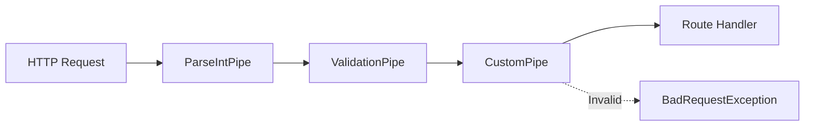

# How to Validate Data with Custom Pipes in NestJS

Author: [nawazdhandala](https://www.github.com/nawazdhandala)

Tags: NestJS, TypeScript, Validation, Pipes, Data Transformation, Backend, Node.js

Description: Learn how to build custom validation pipes in NestJS for data transformation and validation. This guide covers pipe implementation, validation decorators, async validation, and error handling patterns.

---

> Invalid data should never reach your business logic. NestJS pipes provide a clean way to validate and transform incoming requests. Build custom pipes that enforce your domain rules at the framework level.

Pipes in NestJS run before route handlers, making them perfect for validation and transformation. They keep your controllers clean and your validation rules reusable.

---

## Overview



---

## Understanding NestJS Pipes

Pipes have two main purposes:

1. **Transformation** - convert input data to a desired format
2. **Validation** - check if input data is valid, throw exception if not

Every pipe must implement the `PipeTransform` interface with a `transform` method.

---

## Basic Custom Pipe

Create a simple pipe that validates positive numbers:

```typescript
// pipes/positive-number.pipe.ts
import { PipeTransform, Injectable, BadRequestException, ArgumentMetadata } from '@nestjs/common';

@Injectable()
export class PositiveNumberPipe implements PipeTransform<string, number> {
  // Transform method receives the value and metadata about where it came from
  transform(value: string, metadata: ArgumentMetadata): number {
    // Convert string to number
    const num = parseInt(value, 10);

    // Check if conversion was successful
    if (isNaN(num)) {
      throw new BadRequestException(
        `${metadata.data || 'Value'} must be a valid number`
      );
    }

    // Check if number is positive
    if (num <= 0) {
      throw new BadRequestException(
        `${metadata.data || 'Value'} must be a positive number`
      );
    }

    return num;
  }
}

// Usage in controller
@Controller('products')
export class ProductsController {
  @Get(':id')
  findOne(@Param('id', PositiveNumberPipe) id: number) {
    // id is guaranteed to be a positive number here
    return this.productsService.findOne(id);
  }

  @Get()
  findAll(@Query('limit', PositiveNumberPipe) limit: number) {
    return this.productsService.findAll(limit);
  }
}
```

---

## Configurable Validation Pipe

Create pipes that accept configuration options:

```typescript
// pipes/range.pipe.ts
import { PipeTransform, Injectable, BadRequestException, ArgumentMetadata } from '@nestjs/common';

interface RangePipeOptions {
  min?: number;
  max?: number;
  allowDecimal?: boolean;
}

@Injectable()
export class RangePipe implements PipeTransform<string, number> {
  private min: number;
  private max: number;
  private allowDecimal: boolean;

  constructor(options: RangePipeOptions = {}) {
    // Set defaults for unconfigured options
    this.min = options.min ?? Number.MIN_SAFE_INTEGER;
    this.max = options.max ?? Number.MAX_SAFE_INTEGER;
    this.allowDecimal = options.allowDecimal ?? false;
  }

  transform(value: string, metadata: ArgumentMetadata): number {
    const fieldName = metadata.data || 'Value';

    // Parse as float if decimals allowed, otherwise as integer
    const num = this.allowDecimal
      ? parseFloat(value)
      : parseInt(value, 10);

    if (isNaN(num)) {
      throw new BadRequestException(`${fieldName} must be a valid number`);
    }

    // Check if integer when decimals not allowed
    if (!this.allowDecimal && !Number.isInteger(num)) {
      throw new BadRequestException(`${fieldName} must be a whole number`);
    }

    // Validate range
    if (num < this.min) {
      throw new BadRequestException(
        `${fieldName} must be at least ${this.min}`
      );
    }

    if (num > this.max) {
      throw new BadRequestException(
        `${fieldName} must be at most ${this.max}`
      );
    }

    return num;
  }
}

// Usage with configuration
@Controller('orders')
export class OrdersController {
  @Post()
  create(
    @Body('quantity', new RangePipe({ min: 1, max: 100 })) quantity: number,
    @Body('price', new RangePipe({ min: 0.01, max: 10000, allowDecimal: true })) price: number
  ) {
    return this.ordersService.create({ quantity, price });
  }
}
```

---

## String Transformation Pipes

Create pipes for common string transformations:

```typescript
// pipes/string-transform.pipe.ts
import { PipeTransform, Injectable, BadRequestException, ArgumentMetadata } from '@nestjs/common';

// Trim whitespace and optionally enforce length limits
@Injectable()
export class TrimPipe implements PipeTransform<string, string> {
  constructor(
    private minLength: number = 0,
    private maxLength: number = Infinity
  ) {}

  transform(value: string, metadata: ArgumentMetadata): string {
    const fieldName = metadata.data || 'Value';

    if (typeof value !== 'string') {
      throw new BadRequestException(`${fieldName} must be a string`);
    }

    const trimmed = value.trim();

    if (trimmed.length < this.minLength) {
      throw new BadRequestException(
        `${fieldName} must be at least ${this.minLength} characters`
      );
    }

    if (trimmed.length > this.maxLength) {
      throw new BadRequestException(
        `${fieldName} must be at most ${this.maxLength} characters`
      );
    }

    return trimmed;
  }
}

// Slug transformation pipe
@Injectable()
export class SlugifyPipe implements PipeTransform<string, string> {
  transform(value: string, metadata: ArgumentMetadata): string {
    if (typeof value !== 'string') {
      throw new BadRequestException(`${metadata.data || 'Value'} must be a string`);
    }

    // Convert to lowercase and replace spaces with hyphens
    return value
      .toLowerCase()
      .trim()
      .replace(/[^\w\s-]/g, '')    // Remove special characters
      .replace(/[\s_-]+/g, '-')     // Replace spaces and underscores with hyphens
      .replace(/^-+|-+$/g, '');     // Remove leading and trailing hyphens
  }
}

// Sanitize HTML to prevent XSS
@Injectable()
export class SanitizeHtmlPipe implements PipeTransform<string, string> {
  transform(value: string, metadata: ArgumentMetadata): string {
    if (typeof value !== 'string') {
      throw new BadRequestException(`${metadata.data || 'Value'} must be a string`);
    }

    // Basic HTML entity encoding
    return value
      .replace(/&/g, '&amp;')
      .replace(/</g, '&lt;')
      .replace(/>/g, '&gt;')
      .replace(/"/g, '&quot;')
      .replace(/'/g, '&#039;');
  }
}

// Usage
@Controller('articles')
export class ArticlesController {
  @Post()
  create(
    @Body('title', new TrimPipe(3, 100)) title: string,
    @Body('slug', SlugifyPipe) slug: string,
    @Body('content', SanitizeHtmlPipe) content: string
  ) {
    return this.articlesService.create({ title, slug, content });
  }
}
```

---

## UUID Validation Pipe

Validate UUID format for entity identifiers:

```typescript
// pipes/uuid.pipe.ts
import { PipeTransform, Injectable, BadRequestException, ArgumentMetadata } from '@nestjs/common';

// UUID v4 regex pattern
const UUID_V4_REGEX = /^[0-9a-f]{8}-[0-9a-f]{4}-4[0-9a-f]{3}-[89ab][0-9a-f]{3}-[0-9a-f]{12}$/i;

// Any UUID version regex
const UUID_REGEX = /^[0-9a-f]{8}-[0-9a-f]{4}-[0-9a-f]{4}-[0-9a-f]{4}-[0-9a-f]{12}$/i;

@Injectable()
export class UuidPipe implements PipeTransform<string, string> {
  constructor(private version: 'v4' | 'any' = 'any') {}

  transform(value: string, metadata: ArgumentMetadata): string {
    const fieldName = metadata.data || 'ID';
    const regex = this.version === 'v4' ? UUID_V4_REGEX : UUID_REGEX;

    if (typeof value !== 'string' || !regex.test(value)) {
      throw new BadRequestException(
        `${fieldName} must be a valid UUID${this.version === 'v4' ? ' v4' : ''}`
      );
    }

    // Return lowercase for consistency
    return value.toLowerCase();
  }
}

// Usage
@Controller('users')
export class UsersController {
  @Get(':id')
  findOne(@Param('id', new UuidPipe('v4')) id: string) {
    return this.usersService.findOne(id);
  }

  @Delete(':id')
  remove(@Param('id', UuidPipe) id: string) {
    return this.usersService.remove(id);
  }
}
```

---

## Async Validation Pipe

Create pipes that perform async validation:

```typescript
// pipes/unique-email.pipe.ts
import { PipeTransform, Injectable, BadRequestException, ArgumentMetadata } from '@nestjs/common';
import { UsersService } from '../users/users.service';

@Injectable()
export class UniqueEmailPipe implements PipeTransform<string, Promise<string>> {
  constructor(private usersService: UsersService) {}

  async transform(value: string, metadata: ArgumentMetadata): Promise<string> {
    const fieldName = metadata.data || 'Email';

    // Basic email format validation
    const emailRegex = /^[^\s@]+@[^\s@]+\.[^\s@]+$/;
    if (!emailRegex.test(value)) {
      throw new BadRequestException(`${fieldName} must be a valid email address`);
    }

    // Normalize email
    const normalizedEmail = value.toLowerCase().trim();

    // Check if email already exists in database
    const existingUser = await this.usersService.findByEmail(normalizedEmail);
    if (existingUser) {
      throw new BadRequestException(`${fieldName} is already registered`);
    }

    return normalizedEmail;
  }
}

// Validate entity exists in database
@Injectable()
export class EntityExistsPipe implements PipeTransform<string, Promise<string>> {
  constructor(
    private entityService: { findOne: (id: string) => Promise<any> },
    private entityName: string = 'Entity'
  ) {}

  async transform(value: string, metadata: ArgumentMetadata): Promise<string> {
    // First validate UUID format
    const uuidRegex = /^[0-9a-f]{8}-[0-9a-f]{4}-[0-9a-f]{4}-[0-9a-f]{4}-[0-9a-f]{12}$/i;
    if (!uuidRegex.test(value)) {
      throw new BadRequestException(`Invalid ${this.entityName} ID format`);
    }

    // Check if entity exists
    const entity = await this.entityService.findOne(value);
    if (!entity) {
      throw new BadRequestException(`${this.entityName} not found`);
    }

    return value;
  }
}

// Usage with dependency injection
@Controller('users')
export class UsersController {
  constructor(
    private usersService: UsersService,
    private productsService: ProductsService
  ) {}

  @Post()
  create(@Body('email', UniqueEmailPipe) email: string) {
    // email is validated and unique
    return this.usersService.create({ email });
  }

  @Post(':userId/wishlist')
  addToWishlist(
    @Param('userId', new EntityExistsPipe(this.usersService, 'User')) userId: string,
    @Body('productId', new EntityExistsPipe(this.productsService, 'Product')) productId: string
  ) {
    return this.usersService.addToWishlist(userId, productId);
  }
}
```

---

## Array Validation Pipe

Validate arrays of values:

```typescript
// pipes/array-validation.pipe.ts
import { PipeTransform, Injectable, BadRequestException, ArgumentMetadata } from '@nestjs/common';

interface ArrayPipeOptions {
  minLength?: number;
  maxLength?: number;
  itemValidator?: (item: any) => boolean;
  itemTransformer?: (item: any) => any;
  unique?: boolean;
}

@Injectable()
export class ArrayPipe<T = any> implements PipeTransform<any[], T[]> {
  constructor(private options: ArrayPipeOptions = {}) {}

  transform(value: any, metadata: ArgumentMetadata): T[] {
    const fieldName = metadata.data || 'Array';

    // Ensure value is an array
    if (!Array.isArray(value)) {
      throw new BadRequestException(`${fieldName} must be an array`);
    }

    // Validate length constraints
    if (this.options.minLength !== undefined && value.length < this.options.minLength) {
      throw new BadRequestException(
        `${fieldName} must have at least ${this.options.minLength} items`
      );
    }

    if (this.options.maxLength !== undefined && value.length > this.options.maxLength) {
      throw new BadRequestException(
        `${fieldName} must have at most ${this.options.maxLength} items`
      );
    }

    // Transform items if transformer provided
    let result = value;
    if (this.options.itemTransformer) {
      result = value.map((item, index) => {
        try {
          return this.options.itemTransformer!(item);
        } catch (error) {
          throw new BadRequestException(
            `${fieldName}[${index}]: ${error.message}`
          );
        }
      });
    }

    // Validate items if validator provided
    if (this.options.itemValidator) {
      result.forEach((item, index) => {
        if (!this.options.itemValidator!(item)) {
          throw new BadRequestException(
            `${fieldName}[${index}] is invalid`
          );
        }
      });
    }

    // Check uniqueness if required
    if (this.options.unique) {
      const uniqueSet = new Set(result.map(item => JSON.stringify(item)));
      if (uniqueSet.size !== result.length) {
        throw new BadRequestException(`${fieldName} must contain unique items`);
      }
    }

    return result;
  }
}

// Create specific array validators
@Injectable()
export class UuidArrayPipe extends ArrayPipe<string> {
  private uuidRegex = /^[0-9a-f]{8}-[0-9a-f]{4}-[0-9a-f]{4}-[0-9a-f]{4}-[0-9a-f]{12}$/i;

  constructor(options: { minLength?: number; maxLength?: number } = {}) {
    super({
      ...options,
      unique: true,
      itemValidator: (item) => typeof item === 'string' && this.uuidRegex.test(item),
      itemTransformer: (item) => item.toLowerCase()
    });
  }
}

// Usage
@Controller('orders')
export class OrdersController {
  @Post('bulk-delete')
  bulkDelete(
    @Body('ids', new UuidArrayPipe({ minLength: 1, maxLength: 100 })) ids: string[]
  ) {
    return this.ordersService.bulkDelete(ids);
  }

  @Post()
  create(
    @Body('tags', new ArrayPipe({
      maxLength: 10,
      unique: true,
      itemTransformer: (tag) => tag.toLowerCase().trim()
    })) tags: string[]
  ) {
    return this.ordersService.create({ tags });
  }
}
```

---

## Date Validation Pipe

Parse and validate date inputs:

```typescript
// pipes/date.pipe.ts
import { PipeTransform, Injectable, BadRequestException, ArgumentMetadata } from '@nestjs/common';

interface DatePipeOptions {
  minDate?: Date;
  maxDate?: Date;
  allowPast?: boolean;
  allowFuture?: boolean;
}

@Injectable()
export class DatePipe implements PipeTransform<string, Date> {
  constructor(private options: DatePipeOptions = {}) {}

  transform(value: string, metadata: ArgumentMetadata): Date {
    const fieldName = metadata.data || 'Date';

    // Try to parse the date
    const date = new Date(value);

    // Check if date is valid
    if (isNaN(date.getTime())) {
      throw new BadRequestException(`${fieldName} must be a valid date`);
    }

    const now = new Date();

    // Check if past dates are allowed
    if (this.options.allowPast === false && date < now) {
      throw new BadRequestException(`${fieldName} cannot be in the past`);
    }

    // Check if future dates are allowed
    if (this.options.allowFuture === false && date > now) {
      throw new BadRequestException(`${fieldName} cannot be in the future`);
    }

    // Check minimum date
    if (this.options.minDate && date < this.options.minDate) {
      throw new BadRequestException(
        `${fieldName} must be after ${this.options.minDate.toISOString()}`
      );
    }

    // Check maximum date
    if (this.options.maxDate && date > this.options.maxDate) {
      throw new BadRequestException(
        `${fieldName} must be before ${this.options.maxDate.toISOString()}`
      );
    }

    return date;
  }
}

// Date range validation pipe
@Injectable()
export class DateRangePipe implements PipeTransform<{ start: string; end: string }, { start: Date; end: Date }> {
  constructor(private maxRangeDays?: number) {}

  transform(
    value: { start: string; end: string },
    metadata: ArgumentMetadata
  ): { start: Date; end: Date } {
    const startDate = new Date(value.start);
    const endDate = new Date(value.end);

    if (isNaN(startDate.getTime())) {
      throw new BadRequestException('Start date must be a valid date');
    }

    if (isNaN(endDate.getTime())) {
      throw new BadRequestException('End date must be a valid date');
    }

    if (startDate >= endDate) {
      throw new BadRequestException('Start date must be before end date');
    }

    // Check range limit
    if (this.maxRangeDays) {
      const diffTime = endDate.getTime() - startDate.getTime();
      const diffDays = diffTime / (1000 * 60 * 60 * 24);

      if (diffDays > this.maxRangeDays) {
        throw new BadRequestException(
          `Date range cannot exceed ${this.maxRangeDays} days`
        );
      }
    }

    return { start: startDate, end: endDate };
  }
}

// Usage
@Controller('events')
export class EventsController {
  @Post()
  create(
    @Body('eventDate', new DatePipe({ allowPast: false })) eventDate: Date
  ) {
    return this.eventsService.create({ eventDate });
  }

  @Get('report')
  getReport(
    @Query(new DateRangePipe(90)) dateRange: { start: Date; end: Date }
  ) {
    return this.eventsService.getReport(dateRange.start, dateRange.end);
  }
}
```

---

## Global Pipe Registration

Register pipes globally for the entire application:

```typescript
// main.ts
import { NestFactory } from '@nestjs/core';
import { ValidationPipe } from '@nestjs/common';
import { AppModule } from './app.module';

async function bootstrap() {
  const app = await NestFactory.create(AppModule);

  // Register global validation pipe
  app.useGlobalPipes(
    new ValidationPipe({
      // Remove properties not in DTO
      whitelist: true,
      // Throw error for unknown properties
      forbidNonWhitelisted: true,
      // Transform payloads to DTO instances
      transform: true,
      // Use class-transformer for transformation
      transformOptions: {
        enableImplicitConversion: true
      }
    })
  );

  await app.listen(3000);
}
bootstrap();

// Or register via module for dependency injection
// app.module.ts
import { Module } from '@nestjs/common';
import { APP_PIPE } from '@nestjs/core';

@Module({
  providers: [
    {
      provide: APP_PIPE,
      useClass: ValidationPipe
    }
  ]
})
export class AppModule {}
```

---

## Custom Exception Formatting

Create consistent error responses:

```typescript
// pipes/validation-exception.ts
import { BadRequestException } from '@nestjs/common';

export class ValidationException extends BadRequestException {
  constructor(
    public readonly field: string,
    message: string,
    public readonly code?: string
  ) {
    super({
      statusCode: 400,
      error: 'Validation Error',
      field,
      message,
      code
    });
  }
}

// Use in pipes
@Injectable()
export class StrictEmailPipe implements PipeTransform<string, string> {
  transform(value: string, metadata: ArgumentMetadata): string {
    const field = metadata.data || 'email';

    if (!value) {
      throw new ValidationException(field, 'Email is required', 'EMAIL_REQUIRED');
    }

    const emailRegex = /^[^\s@]+@[^\s@]+\.[^\s@]+$/;
    if (!emailRegex.test(value)) {
      throw new ValidationException(field, 'Invalid email format', 'EMAIL_INVALID');
    }

    // Block disposable email domains
    const disposableDomains = ['tempmail.com', 'throwaway.com'];
    const domain = value.split('@')[1].toLowerCase();
    if (disposableDomains.includes(domain)) {
      throw new ValidationException(
        field,
        'Disposable email addresses are not allowed',
        'EMAIL_DISPOSABLE'
      );
    }

    return value.toLowerCase();
  }
}
```

---

## Best Practices

1. **Keep pipes focused** on single responsibility
2. **Use descriptive error messages** with field names
3. **Transform and validate together** in the same pipe
4. **Inject services** for async validation
5. **Configure globally** for common validation
6. **Test pipes independently** with unit tests

---

## Conclusion

Custom pipes in NestJS provide clean, reusable validation and transformation logic. Key takeaways:

- **Separate validation** from business logic
- **Configurable pipes** adapt to different requirements
- **Async pipes** enable database validation
- **Global pipes** ensure consistent validation

Well-designed pipes catch invalid data early, keeping your controllers clean and your application secure.

---

*Building NestJS applications? [OneUptime](https://oneuptime.com) provides monitoring and alerting to keep your APIs healthy and catch validation errors in production.*
