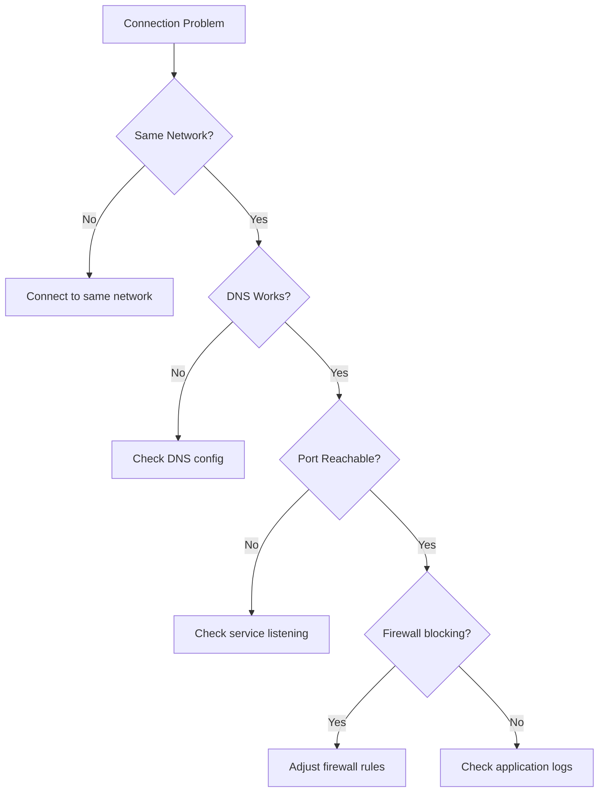

# How to Debug Docker Network Connectivity Issues

Author: [nawazdhandala](https://www.github.com/nawazdhandala)

Tags: Docker, Networking, Debugging, Troubleshooting, DevOps

Description: Systematically diagnose Docker network problems including container-to-container communication failures, external connectivity issues, and port mapping problems using practical debugging techniques.

---

Network connectivity issues in Docker manifest as connection timeouts, refused connections, or DNS failures. Containers cannot reach each other, external services are unreachable, or port mappings do not work. A systematic debugging approach helps you identify whether the problem is network configuration, firewall rules, or application-level issues.

## Understanding Docker Networks

Docker provides several network drivers:

```bash
# List available networks
docker network ls

# Typical output
NETWORK ID     NAME                DRIVER    SCOPE
a1b2c3d4e5f6   bridge              bridge    local
f6e5d4c3b2a1   host                host      local
1a2b3c4d5e6f   none                null      local
7f8e9d0c1b2a   myapp_default       bridge    local
```

Each network type behaves differently:

- **bridge**: Default network, containers get private IPs
- **host**: Container shares host's network stack
- **none**: No networking
- **custom bridge**: User-defined network with DNS

## Step 1: Verify Network Configuration

Check which networks a container uses:

```bash
# Get container's network settings
docker inspect mycontainer --format='{{json .NetworkSettings.Networks}}' | jq

# Output shows IP address and network name
{
  "myapp_default": {
    "IPAddress": "172.18.0.5",
    "Gateway": "172.18.0.1",
    "MacAddress": "02:42:ac:12:00:05"
  }
}
```

Check if containers are on the same network:

```bash
# List containers on a network
docker network inspect myapp_default --format='{{range .Containers}}{{.Name}}: {{.IPv4Address}}{{"\n"}}{{end}}'
```

## Step 2: Test Basic Connectivity

### Ping Between Containers

```bash
# Install ping if needed (Alpine)
docker exec mycontainer apk add --no-cache iputils

# Ping by container name (only works on user-defined networks)
docker exec mycontainer ping -c 3 othercontainer

# Ping by IP address
docker exec mycontainer ping -c 3 172.18.0.6
```

### Check DNS Resolution

```bash
# Test DNS lookup
docker exec mycontainer nslookup othercontainer

# Check resolver configuration
docker exec mycontainer cat /etc/resolv.conf
```

On user-defined networks, you should see Docker's embedded DNS at 127.0.0.11.

## Step 3: Test Port Connectivity

### TCP Connection Test

```bash
# Test if port is reachable using nc (netcat)
docker exec mycontainer nc -zv othercontainer 5432

# Or using timeout for non-interactive check
docker exec mycontainer timeout 5 bash -c 'cat < /dev/tcp/othercontainer/5432' && echo "Port open" || echo "Port closed"
```

### Check Listening Ports Inside Container

```bash
# Using netstat
docker exec mycontainer netstat -tlnp

# Using ss
docker exec mycontainer ss -tlnp

# Check specific port
docker exec mycontainer ss -tlnp | grep 5432
```

## Step 4: Debug with Network Tools

Use a dedicated debug container with networking tools:

```bash
# Run nicolaka/netshoot on the same network
docker run --rm -it --network myapp_default nicolaka/netshoot

# Inside the container, you have access to:
# - ping, traceroute, mtr
# - dig, nslookup, host
# - curl, wget
# - tcpdump, netstat, ss
# - iperf, netcat
```

### Trace Network Path

```bash
# Traceroute to another container
docker exec mycontainer traceroute othercontainer

# Or using mtr for continuous monitoring
docker run --rm -it --network myapp_default nicolaka/netshoot mtr othercontainer
```

### Capture Network Traffic

```bash
# Run tcpdump in debug container
docker run --rm -it --network container:mycontainer nicolaka/netshoot tcpdump -i eth0 port 5432

# Filter by host
docker run --rm -it --network container:mycontainer nicolaka/netshoot tcpdump -i eth0 host othercontainer
```

## Step 5: Check Port Mappings

### Published Ports

```bash
# View published ports
docker port mycontainer

# Output
3000/tcp -> 0.0.0.0:3000

# Check from host
curl http://localhost:3000
```

### Port Mapping Issues

```bash
# Check if port is already in use on host
sudo lsof -i :3000
sudo netstat -tlnp | grep 3000

# Verify Docker is listening
sudo ss -tlnp | grep docker
```

### Container Not Accessible from Host

```bash
# Check if container is bound to correct interface
docker exec mycontainer netstat -tlnp

# If bound to 127.0.0.1, it won't be accessible via port mapping
# Application must bind to 0.0.0.0
```

## Step 6: External Connectivity

### Internet Access from Container

```bash
# Test DNS
docker exec mycontainer nslookup google.com

# Test HTTP
docker exec mycontainer curl -I https://www.google.com

# Test with specific DNS server
docker exec mycontainer nslookup google.com 8.8.8.8
```

### Firewall Issues

```bash
# Check iptables rules (Linux)
sudo iptables -L -n -v

# Check Docker's NAT rules
sudo iptables -t nat -L -n -v

# Check if Docker's iptables management is enabled
docker info | grep -i iptables
```

### Host Firewall Blocking Docker

```bash
# On systems with firewalld
sudo firewall-cmd --list-all
sudo firewall-cmd --zone=docker --list-all

# On systems with ufw
sudo ufw status

# Allow Docker interface
sudo ufw allow in on docker0
```

## Common Issues and Solutions

### Issue: Containers Cannot Reach Each Other

**Cause**: Containers are on different networks or using default bridge.

```bash
# Check networks
docker inspect container1 --format='{{range $net, $config := .NetworkSettings.Networks}}{{$net}} {{end}}'
docker inspect container2 --format='{{range $net, $config := .NetworkSettings.Networks}}{{$net}} {{end}}'

# Solution: Connect to same network
docker network connect mynetwork container1
docker network connect mynetwork container2
```

### Issue: Port Published But Not Accessible

**Cause**: Application inside container binds to localhost.

```bash
# Check binding inside container
docker exec mycontainer netstat -tlnp | grep 3000

# If shows 127.0.0.1:3000, application needs to bind to 0.0.0.0
# Fix in application configuration or startup command
```

### Issue: DNS Resolution Fails

**Cause**: Using default bridge network or DNS misconfiguration.

```bash
# Solution 1: Use user-defined network
docker network create mynetwork
docker run --network mynetwork --name mycontainer myimage

# Solution 2: Specify DNS servers
docker run --dns 8.8.8.8 myimage

# Solution 3: Configure daemon DNS
# /etc/docker/daemon.json
# { "dns": ["8.8.8.8", "8.8.4.4"] }
```

### Issue: Connection Timeouts to External Services

**Cause**: Network routing or MTU issues.

```bash
# Check MTU settings
docker exec mycontainer ip link show eth0

# Test with different packet sizes
docker exec mycontainer ping -c 3 -M do -s 1472 google.com

# If large packets fail, there's an MTU issue
# Set MTU in network configuration
docker network create --opt com.docker.network.driver.mtu=1400 mynetwork
```

### Issue: Intermittent Connectivity

**Cause**: IP address conflicts or network overlaps.

```bash
# Check for subnet conflicts
docker network inspect bridge --format='{{range .IPAM.Config}}{{.Subnet}}{{end}}'

# Compare with host network
ip route

# Create network with non-conflicting subnet
docker network create --subnet=172.28.0.0/16 mynetwork
```

## Network Debugging Checklist



## Creating a Debug Script

```bash
#!/bin/bash
# docker-network-debug.sh

CONTAINER=$1
TARGET=${2:-}

echo "=== Container Network Configuration ==="
docker inspect "$CONTAINER" --format='
Networks: {{range $net, $config := .NetworkSettings.Networks}}{{$net}} ({{$config.IPAddress}}) {{end}}
Gateway: {{range .NetworkSettings.Networks}}{{.Gateway}}{{end}}
DNS: {{range .HostConfig.Dns}}{{.}} {{end}}'

echo -e "\n=== Resolv.conf ==="
docker exec "$CONTAINER" cat /etc/resolv.conf

echo -e "\n=== Listening Ports ==="
docker exec "$CONTAINER" netstat -tlnp 2>/dev/null || docker exec "$CONTAINER" ss -tlnp

if [ -n "$TARGET" ]; then
    echo -e "\n=== Testing connectivity to $TARGET ==="
    echo "DNS lookup:"
    docker exec "$CONTAINER" nslookup "$TARGET" 2>&1 || echo "DNS lookup failed"

    echo -e "\nPing:"
    docker exec "$CONTAINER" ping -c 3 "$TARGET" 2>&1 || echo "Ping failed"
fi
```

Usage:

```bash
./docker-network-debug.sh mycontainer database
```

---

Docker network debugging requires systematic investigation: verify network membership, test DNS resolution, check port connectivity, and examine firewall rules. Most issues stem from containers being on different networks, applications binding to localhost instead of all interfaces, or DNS misconfiguration. Use dedicated debug containers with networking tools for comprehensive troubleshooting.
