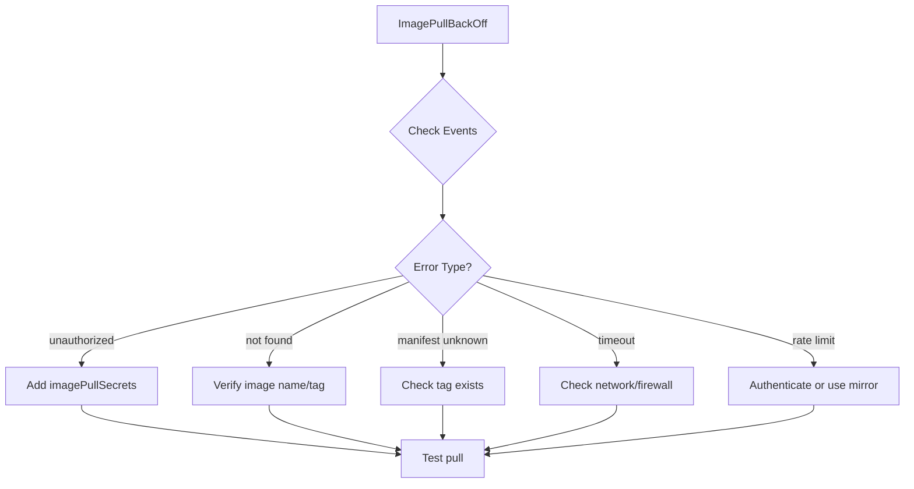

# How to Debug 'ImagePullBackOff' Errors in Kubernetes

Author: [nawazdhandala](https://www.github.com/nawazdhandala)

Tags: Kubernetes, Troubleshooting, Containers, Registry, Images

Description: Learn how to diagnose and fix ImagePullBackOff errors in Kubernetes. This guide covers authentication issues, image names, private registries, and network problems.

---

ImagePullBackOff is one of the most common Kubernetes errors. It means Kubernetes cannot pull the container image specified in your pod. The cluster will keep retrying with increasing delays (backoff), but your pod will not start until the underlying issue is fixed. This guide helps you identify and resolve the cause.

## Understanding the Error

When you see ImagePullBackOff in pod status:

```bash
kubectl get pods
# NAME                     READY   STATUS             RESTARTS   AGE
# web-app-5d4b8c9f6-x2jk   0/1     ImagePullBackOff   0          5m
```

Kubernetes tried to pull the image, failed, and is now backing off before retrying. The Events section provides the actual error:

```bash
kubectl describe pod web-app-5d4b8c9f6-x2jk
```

Look for events like:
- `Failed to pull image: rpc error: code = NotFound`
- `Failed to pull image: unauthorized`
- `Failed to pull image: manifest unknown`

## Common Causes and Solutions

### Cause 1: Image Does Not Exist

The most common cause. The image name or tag is wrong:

```bash
# Check the exact image name in pod spec
kubectl get pod web-app-5d4b8c9f6-x2jk -o jsonpath='{.spec.containers[0].image}'
# Output: myregistry.io/myapp:v1.2.3

# Verify the image exists
docker pull myregistry.io/myapp:v1.2.3
# Or check your registry directly
```

**Fix**: Correct the image name in your deployment:

```yaml
spec:
  containers:
  - name: app
    image: myregistry.io/myapp:v1.2.3  # Verify this is correct
```

Common typos:
- Wrong registry URL
- Missing tag (defaults to `:latest` which may not exist)
- Typo in image name
- Using a local image name without pushing to registry

### Cause 2: Private Registry Authentication

Private registries require authentication:

```bash
# Event shows unauthorized
# Failed to pull image "private.registry.io/myapp:v1":
# rpc error: code = Unknown desc = unauthorized
```

**Fix**: Create a docker-registry secret and reference it:

```bash
# Create the secret
kubectl create secret docker-registry regcred \
  --docker-server=private.registry.io \
  --docker-username=myuser \
  --docker-password=mypassword \
  --docker-email=me@example.com \
  -n your-namespace
```

Reference it in your pod:

```yaml
apiVersion: v1
kind: Pod
metadata:
  name: web-app
spec:
  imagePullSecrets:
  - name: regcred
  containers:
  - name: app
    image: private.registry.io/myapp:v1
```

Or attach to a ServiceAccount for all pods:

```bash
kubectl patch serviceaccount default -n your-namespace \
  -p '{"imagePullSecrets": [{"name": "regcred"}]}'
```

### Cause 3: Invalid Image Tag

The tag does not exist in the registry:

```bash
# Event shows manifest not found
# Failed to pull image: manifest for myregistry.io/myapp:v999 not found
```

**Fix**: Use a tag that exists. List available tags:

```bash
# Docker Hub
curl -s https://registry.hub.docker.com/v2/repositories/library/nginx/tags | jq '.results[].name'

# Private registry (with auth)
curl -s -u user:pass https://myregistry.io/v2/myapp/tags/list | jq '.tags'
```

### Cause 4: Digest Mismatch

If using image digest and the image was replaced:

```yaml
# This digest might no longer exist
image: myregistry.io/myapp@sha256:abc123...
```

**Fix**: Update the digest or use a mutable tag.

### Cause 5: Network Issues

The cluster nodes cannot reach the registry:

```bash
# Test from a node or debug pod
kubectl run test --rm -it --image=busybox -- wget -qO- https://myregistry.io/v2/
```

**Fix**: Check network policies, firewall rules, and DNS:

```bash
# Check DNS resolution
kubectl run test --rm -it --image=busybox -- nslookup myregistry.io

# Check connectivity
kubectl run test --rm -it --image=busybox -- wget -qO- https://myregistry.io/v2/ --timeout=5
```

### Cause 6: Rate Limiting (Docker Hub)

Docker Hub has rate limits for anonymous pulls:

```bash
# Event might show:
# toomanyrequests: You have reached your pull rate limit
```

**Fix**: Authenticate with Docker Hub:

```bash
kubectl create secret docker-registry dockerhub-cred \
  --docker-server=docker.io \
  --docker-username=myuser \
  --docker-password=mypassword
```

Or use a mirror/cache registry.

### Cause 7: Image Architecture Mismatch

The image is for a different architecture (e.g., ARM image on AMD64 node):

```bash
# Check node architecture
kubectl get nodes -o jsonpath='{.items[*].status.nodeInfo.architecture}'

# Check image architecture
docker manifest inspect myimage:latest | jq '.manifests[].platform'
```

**Fix**: Use multi-arch images or specify the correct platform.

## Diagnostic Script

Use this script to debug ImagePullBackOff:

```bash
#!/bin/bash
# debug-imagepull.sh

POD=$1
NAMESPACE=${2:-default}

echo "=== Pod Status ==="
kubectl get pod $POD -n $NAMESPACE

echo -e "\n=== Image Name ==="
IMAGE=$(kubectl get pod $POD -n $NAMESPACE -o jsonpath='{.spec.containers[0].image}')
echo "Image: $IMAGE"

echo -e "\n=== Events ==="
kubectl describe pod $POD -n $NAMESPACE | grep -A 10 "Events:"

echo -e "\n=== Image Pull Secrets ==="
kubectl get pod $POD -n $NAMESPACE -o jsonpath='{.spec.imagePullSecrets}' | jq .

echo -e "\n=== ServiceAccount ==="
SA=$(kubectl get pod $POD -n $NAMESPACE -o jsonpath='{.spec.serviceAccountName}')
echo "ServiceAccount: $SA"
kubectl get sa $SA -n $NAMESPACE -o jsonpath='{.imagePullSecrets}' | jq .

echo -e "\n=== Try Manual Pull ==="
echo "Run on a cluster node: docker pull $IMAGE"
```

## Quick Fixes Checklist



## Prevention Tips

1. **Always specify tags** - Avoid `:latest` in production
2. **Use digests for immutability** - `image@sha256:...`
3. **Pre-pull images** - Use DaemonSet to cache images on nodes
4. **Set up image pull secrets early** - Include in namespace setup
5. **Use a registry mirror** - Avoid rate limits and improve reliability

```yaml
# Example: DaemonSet to pre-pull images
apiVersion: apps/v1
kind: DaemonSet
metadata:
  name: image-prepuller
spec:
  selector:
    matchLabels:
      app: prepuller
  template:
    metadata:
      labels:
        app: prepuller
    spec:
      initContainers:
      - name: prepull
        image: myregistry.io/myapp:v1.2.3
        command: ["echo", "Image pulled"]
      containers:
      - name: pause
        image: k8s.gcr.io/pause:3.9
```

## Verify the Fix

After applying a fix, verify the pod starts:

```bash
# Delete the pod to trigger recreation
kubectl delete pod web-app-5d4b8c9f6-x2jk

# Watch the new pod
kubectl get pods -w

# Check it pulled successfully
kubectl describe pod <new-pod> | grep "Successfully pulled"
```

## Summary

ImagePullBackOff errors occur when Kubernetes cannot download your container image. Check the Events in `kubectl describe pod` for the specific error. Common causes include typos in image names, missing authentication for private registries, non-existent tags, network issues, and rate limiting. Create imagePullSecrets for private registries, verify image names exist, and ensure network connectivity from nodes to the registry. Always specify image tags and consider pre-pulling critical images to avoid startup delays.
