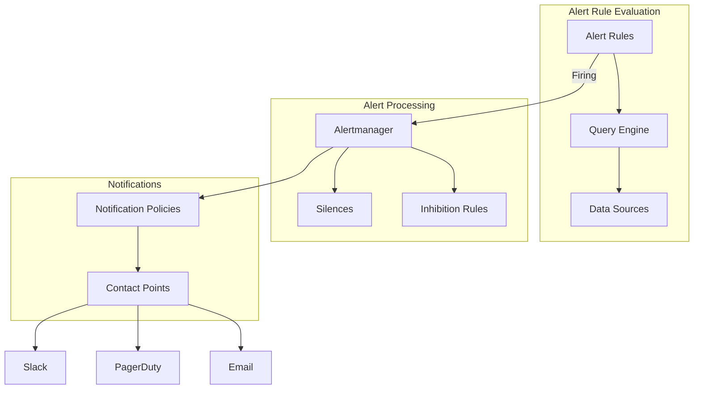

# How to Implement Alerting Rules in Grafana

Author: [nawazdhandala](https://www.github.com/nawazdhandala)

Tags: Grafana, Alerting, Monitoring, Prometheus, PromQL, Incident Response, SRE

Description: Learn how to create effective alerting rules in Grafana that reduce noise, catch real problems, and integrate with your incident response workflow.

---

Alerting is where observability becomes actionable. Well-designed alerts catch problems before users notice. Poorly designed alerts generate noise that leads to alert fatigue and ignored notifications. This guide shows you how to build Grafana alerts that your on-call team will actually trust.

## Grafana Alerting Architecture

Grafana 8+ introduced a unified alerting system that replaced the legacy dashboard-based alerts. Understanding the architecture helps you design better alerts.



Components:
- **Alert Rules**: Define what conditions trigger alerts
- **Contact Points**: Define where notifications go (Slack, PagerDuty, email)
- **Notification Policies**: Route alerts to appropriate contact points
- **Silences**: Temporarily suppress specific alerts
- **Mute Timings**: Define schedules when alerts should not fire

## Creating Your First Alert Rule

Navigate to Alerting > Alert rules > Create alert rule.

### Step 1: Define the Query

Select your data source and write the query. For Prometheus:

```promql
# Calculate error rate as a percentage
sum(rate(http_requests_total{status_code=~"5.."}[5m]))
/
sum(rate(http_requests_total[5m]))
* 100
```

### Step 2: Set Conditions

Define when the alert should fire:

- **Condition**: IS ABOVE
- **Threshold**: 5
- **For**: 5m (alert must be true for 5 minutes before firing)

The "For" duration prevents flapping alerts from transient spikes.

### Step 3: Add Labels and Annotations

Labels route alerts to the right contact point:

```yaml
Labels:
  severity: critical
  team: backend
  service: api-gateway
```

Annotations provide context in notifications:

```yaml
Annotations:
  summary: High error rate on {{ $labels.service }}
  description: Error rate is {{ $values.A }}% (threshold: 5%)
  runbook_url: https://wiki.company.com/runbooks/high-error-rate
```

### Step 4: Configure Evaluation

Set how often Grafana evaluates the rule:

- **Evaluation group**: api-alerts
- **Evaluation interval**: 1m

Group related alerts together for efficient evaluation.

## Alert Rule Examples

### High Latency Alert

```promql
# P99 latency exceeds 500ms
histogram_quantile(0.99,
  sum by (le, service) (
    rate(http_request_duration_seconds_bucket[5m])
  )
) > 0.5
```

Configuration:
```yaml
Alert name: High P99 Latency
Condition: IS ABOVE 0.5
For: 5m
Labels:
  severity: warning
  team: platform
Annotations:
  summary: P99 latency is {{ $values.A | printf "%.2f" }}s for {{ $labels.service }}
  description: Response times have exceeded 500ms for 5 minutes
```

### Pod Crash Loop Alert

```promql
# Pods restarting frequently
increase(kube_pod_container_status_restarts_total[1h]) > 5
```

Configuration:
```yaml
Alert name: Pod Crash Loop
Condition: IS ABOVE 5
For: 0m  # Alert immediately
Labels:
  severity: critical
  team: platform
Annotations:
  summary: Pod {{ $labels.pod }} restarting frequently
  description: Pod has restarted {{ $values.A }} times in the last hour
```

### Disk Space Alert

```promql
# Disk usage above 85%
(node_filesystem_size_bytes - node_filesystem_avail_bytes)
/ node_filesystem_size_bytes * 100 > 85
```

Configuration:
```yaml
Alert name: Disk Space Critical
Condition: IS ABOVE 85
For: 10m
Labels:
  severity: warning
  team: infrastructure
Annotations:
  summary: Disk space low on {{ $labels.instance }}
  description: "{{ $labels.mountpoint }} is {{ $values.A | printf \"%.1f\" }}% full"
```

### Error Budget Burn Rate Alert

For SLO-based alerting, alert on error budget consumption rate:

```promql
# Fast burn rate - consuming budget too quickly
(
  sum(rate(http_requests_total{status_code=~"5.."}[1h]))
  / sum(rate(http_requests_total[1h]))
) / 0.001 > 14.4
```

This alert fires when you are burning through your monthly error budget 14.4x faster than sustainable.

## Multi-Condition Alerts

Grafana supports multiple queries in a single alert. Use the reduce and math expressions to combine them.

```yaml
# Query A: Error rate
sum(rate(http_requests_total{status_code=~"5.."}[5m]))
/ sum(rate(http_requests_total[5m])) * 100

# Query B: Traffic volume
sum(rate(http_requests_total[5m]))

# Expression C: Combine conditions
$A > 5 && $B > 100
```

This alert only fires when error rate is high AND traffic volume is significant.

## Provisioning Alert Rules as Code

Store alert rules in YAML for version control:

```yaml
# /etc/grafana/provisioning/alerting/alerts.yaml
apiVersion: 1

groups:
  - orgId: 1
    name: backend-alerts
    folder: Backend
    interval: 1m
    rules:
      - uid: high-error-rate
        title: High Error Rate
        condition: C
        data:
          - refId: A
            relativeTimeRange:
              from: 300
              to: 0
            datasourceUid: prometheus
            model:
              expr: |
                sum(rate(http_requests_total{status_code=~"5.."}[5m]))
                / sum(rate(http_requests_total[5m])) * 100
              refId: A
          - refId: C
            relativeTimeRange:
              from: 0
              to: 0
            datasourceUid: "__expr__"
            model:
              type: threshold
              expression: A
              conditions:
                - evaluator:
                    type: gt
                    params: [5]
        for: 5m
        labels:
          severity: critical
          team: backend
        annotations:
          summary: High error rate detected
          description: Error rate is {{ $values.A }}%
```

## Notification Policies

Notification policies determine how alerts route to contact points. Configure them at Alerting > Notification policies.

```yaml
# Default policy
contact_point: slack-oncall
group_by: [alertname, cluster]
group_wait: 30s
group_interval: 5m
repeat_interval: 4h

# Override for critical alerts
routes:
  - match:
      severity: critical
    contact_point: pagerduty
    group_wait: 0s
    repeat_interval: 1h

  - match:
      team: database
    contact_point: slack-database
```

Policy fields:
- **group_wait**: How long to wait before sending the first notification
- **group_interval**: How long to wait before sending updates about new alerts in the group
- **repeat_interval**: How often to resend notifications for ongoing alerts

## Silence and Mute Timings

### Creating Silences

Silence alerts during known maintenance:

```bash
# Using Grafana API
curl -X POST http://grafana:3000/api/alertmanager/grafana/api/v2/silences \
  -H "Content-Type: application/json" \
  -H "Authorization: Bearer $GRAFANA_TOKEN" \
  -d '{
    "matchers": [
      {"name": "alertname", "value": "HighCPU", "isRegex": false},
      {"name": "instance", "value": "server-01", "isRegex": false}
    ],
    "startsAt": "2026-01-25T00:00:00Z",
    "endsAt": "2026-01-25T06:00:00Z",
    "createdBy": "john@company.com",
    "comment": "Scheduled maintenance window"
  }'
```

### Mute Timings

Define recurring schedules when alerts should be suppressed:

```yaml
# mute-timings.yaml
apiVersion: 1
muteTimes:
  - name: weekends
    time_intervals:
      - weekdays: [saturday, sunday]

  - name: maintenance-window
    time_intervals:
      - times:
          - start_time: "02:00"
            end_time: "04:00"
        weekdays: [tuesday]
```

Reference mute timings in notification policies:

```yaml
routes:
  - match:
      severity: warning
    contact_point: slack-general
    mute_time_intervals: [weekends, maintenance-window]
```

## Alert Rule Best Practices

### 1. Alert on Symptoms, Not Causes

Bad: Alert when CPU > 90%
Good: Alert when response latency > SLO threshold

Users do not care about CPU usage. They care about whether the service works.

### 2. Include Runbook Links

Every alert should link to documentation explaining:
- What this alert means
- How to investigate
- Common fixes

```yaml
annotations:
  runbook_url: https://wiki.company.com/runbooks/{{ $labels.alertname }}
```

### 3. Use Appropriate Severity Levels

```
critical: Wake someone up at 3 AM
warning: Look at this during business hours
info: Log for awareness, no action needed
```

### 4. Avoid Alert Fatigue

If an alert fires constantly and gets ignored, either:
- Fix the underlying issue
- Adjust the threshold
- Delete the alert

An ignored alert is worse than no alert.

### 5. Test Your Alerts

Periodically verify alerts actually fire when conditions are met:

```promql
# Temporarily set threshold to 0 to trigger the alert
sum(rate(http_requests_total[5m])) > 0
```

## Debugging Alert Rules

### Check Alert State

Navigate to Alerting > Alert rules. Each rule shows:
- **Normal**: Condition not met
- **Pending**: Condition met, waiting for "For" duration
- **Firing**: Alert is active
- **Error**: Query failed

### View Alert History

Alerting > Alert rules > (select rule) > Show state history

### Test Queries

Use Explore to test your alert queries:

1. Go to Explore
2. Select the same data source
3. Run the query
4. Verify it returns expected values

### Check Contact Point Delivery

Alerting > Contact points > (select point) > Test

This sends a test notification to verify the integration works.

## Integrating with Incident Management

Connect Grafana alerts to your incident management platform:

```yaml
# Contact point for OneUptime
contact_points:
  - name: oneuptime
    type: webhook
    settings:
      url: https://oneuptime.com/api/webhooks/alerts
      httpMethod: POST
      authorization_scheme: Bearer
      authorization_credentials: ${ONEUPTIME_API_KEY}
```

This creates incidents automatically when critical alerts fire, ensuring nothing gets missed during off-hours.

## Conclusion

Effective alerting requires continuous refinement. Start with a few high-signal alerts, add runbook links, and expand coverage based on incidents that alerts missed. The goal is not more alerts but the right alerts that help your team respond to real problems quickly.
