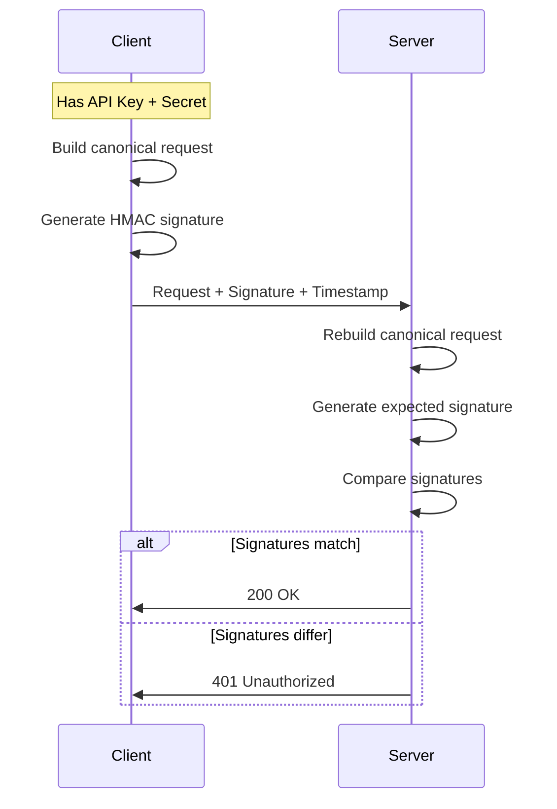

# How to Secure APIs with HMAC Signing in Python

Author: [nawazdhandala](https://www.github.com/nawazdhandala)

Tags: Python, HMAC, API Security, Authentication, Cryptography, FastAPI

Description: Learn how to implement HMAC-based request signing to secure your Python APIs. This guide covers signature generation, verification, replay attack prevention, and production-ready middleware patterns.

---

> API keys alone don't protect against tampering or replay attacks. HMAC signing lets you verify that requests haven't been modified and come from legitimate clients. This guide shows you how to implement HMAC signing in Python APIs.

HMAC (Hash-based Message Authentication Code) signing creates a cryptographic signature of the request using a shared secret. The server can verify this signature to confirm the request is authentic and unmodified. Services like AWS, Stripe, and GitHub use HMAC signing to secure their APIs and webhooks.

---

## How HMAC Signing Works

The basic flow is straightforward:



The key insight is that both client and server compute the same signature independently. If they match, the request is authentic.

---

## Basic HMAC Implementation

Let's start with a simple implementation that covers the fundamentals.

```python
# hmac_basics.py
# Basic HMAC signing for API requests
import hmac
import hashlib
import base64
from datetime import datetime
from typing import Optional

def generate_signature(
    secret_key: str,
    method: str,
    path: str,
    timestamp: str,
    body: str = ""
) -> str:
    """
    Generate HMAC-SHA256 signature for a request.

    Args:
        secret_key: Shared secret between client and server
        method: HTTP method (GET, POST, etc.)
        path: Request path (e.g., /api/users)
        timestamp: ISO format timestamp
        body: Request body (empty string for GET requests)

    Returns:
        Base64-encoded signature
    """
    # Build the string to sign (canonical request)
    # Order matters - both sides must use the same order
    string_to_sign = f"{method}\n{path}\n{timestamp}\n{body}"

    # Create HMAC using SHA-256
    signature = hmac.new(
        secret_key.encode('utf-8'),
        string_to_sign.encode('utf-8'),
        hashlib.sha256
    ).digest()

    # Return base64-encoded signature for HTTP header safety
    return base64.b64encode(signature).decode('utf-8')

def verify_signature(
    secret_key: str,
    method: str,
    path: str,
    timestamp: str,
    body: str,
    provided_signature: str
) -> bool:
    """
    Verify that a provided signature matches the expected signature.
    Uses constant-time comparison to prevent timing attacks.
    """
    expected_signature = generate_signature(
        secret_key, method, path, timestamp, body
    )

    # CRITICAL: Use constant-time comparison
    # Regular string comparison leaks timing information
    return hmac.compare_digest(expected_signature, provided_signature)

# Example client usage
def make_signed_request(api_key: str, secret: str, method: str, path: str, body: str = ""):
    """Example of how a client would sign a request"""
    timestamp = datetime.utcnow().isoformat() + "Z"
    signature = generate_signature(secret, method, path, timestamp, body)

    headers = {
        "X-API-Key": api_key,
        "X-Timestamp": timestamp,
        "X-Signature": signature,
        "Content-Type": "application/json"
    }

    return headers
```

---

## Complete FastAPI Implementation

Here's a production-ready implementation with proper error handling, replay attack prevention, and middleware integration.

```python
# hmac_fastapi.py
# Production HMAC signing middleware for FastAPI
from fastapi import FastAPI, Request, HTTPException, Depends
from fastapi.security import APIKeyHeader
from datetime import datetime, timedelta
from typing import Optional, Dict, Set
import hmac
import hashlib
import base64
import asyncio
from collections import OrderedDict

app = FastAPI()

# Configuration
HMAC_TOLERANCE_SECONDS = 300  # 5 minutes - reject requests outside this window
MAX_NONCE_CACHE_SIZE = 10000  # Prevent memory exhaustion

# In production, store these securely (e.g., database, secrets manager)
API_CREDENTIALS: Dict[str, str] = {
    "api_key_123": "secret_key_abc123xyz",
    "api_key_456": "secret_key_def456uvw"
}

class NonceCache:
    """
    Cache to track used nonces and prevent replay attacks.
    Uses OrderedDict for LRU-style eviction.
    """

    def __init__(self, max_size: int = 10000):
        self._cache: OrderedDict[str, datetime] = OrderedDict()
        self._max_size = max_size
        self._lock = asyncio.Lock()

    async def check_and_add(self, nonce: str) -> bool:
        """
        Check if nonce was used before, add if not.
        Returns True if nonce is new (valid), False if seen before (replay).
        """
        async with self._lock:
            # Clean up old entries periodically
            await self._cleanup_old_entries()

            if nonce in self._cache:
                return False  # Replay attack detected

            # Add new nonce
            self._cache[nonce] = datetime.utcnow()

            # Evict oldest if at capacity
            while len(self._cache) > self._max_size:
                self._cache.popitem(last=False)

            return True

    async def _cleanup_old_entries(self):
        """Remove nonces older than the tolerance window"""
        cutoff = datetime.utcnow() - timedelta(seconds=HMAC_TOLERANCE_SECONDS * 2)

        # Find keys to remove
        expired = [
            key for key, timestamp in self._cache.items()
            if timestamp < cutoff
        ]

        for key in expired:
            del self._cache[key]

# Global nonce cache
nonce_cache = NonceCache()

class HMACAuth:
    """
    HMAC authentication handler with full security features.
    """

    def __init__(self):
        self.api_key_header = APIKeyHeader(name="X-API-Key")

    def _get_secret(self, api_key: str) -> Optional[str]:
        """Look up the secret for an API key"""
        return API_CREDENTIALS.get(api_key)

    def _build_canonical_request(
        self,
        method: str,
        path: str,
        query_string: str,
        timestamp: str,
        nonce: str,
        body: bytes
    ) -> str:
        """
        Build the canonical string to sign.
        This must match exactly what the client builds.
        """
        # Sort query parameters for consistency
        if query_string:
            params = sorted(query_string.split('&'))
            query_string = '&'.join(params)

        # Hash the body to handle large payloads
        body_hash = hashlib.sha256(body).hexdigest()

        # Build canonical request string
        canonical = '\n'.join([
            method.upper(),
            path,
            query_string or '',
            timestamp,
            nonce,
            body_hash
        ])

        return canonical

    def _generate_signature(self, secret: str, canonical_request: str) -> str:
        """Generate HMAC-SHA256 signature"""
        signature = hmac.new(
            secret.encode('utf-8'),
            canonical_request.encode('utf-8'),
            hashlib.sha256
        ).digest()

        return base64.b64encode(signature).decode('utf-8')

    def _verify_timestamp(self, timestamp: str) -> bool:
        """
        Verify the timestamp is within acceptable range.
        Prevents replay of old requests.
        """
        try:
            request_time = datetime.fromisoformat(timestamp.replace('Z', '+00:00'))
            # Remove timezone info for comparison
            request_time = request_time.replace(tzinfo=None)
            now = datetime.utcnow()

            delta = abs((now - request_time).total_seconds())
            return delta <= HMAC_TOLERANCE_SECONDS
        except (ValueError, TypeError):
            return False

    async def verify_request(
        self,
        request: Request,
        api_key: str,
        timestamp: str,
        signature: str,
        nonce: str
    ) -> bool:
        """
        Full verification of a signed request.
        Checks API key, timestamp, nonce, and signature.
        """
        # Step 1: Validate API key exists
        secret = self._get_secret(api_key)
        if not secret:
            raise HTTPException(status_code=401, detail="Invalid API key")

        # Step 2: Validate timestamp is recent
        if not self._verify_timestamp(timestamp):
            raise HTTPException(
                status_code=401,
                detail="Request timestamp outside acceptable range"
            )

        # Step 3: Check nonce hasn't been used (prevent replay)
        nonce_valid = await nonce_cache.check_and_add(f"{api_key}:{nonce}")
        if not nonce_valid:
            raise HTTPException(
                status_code=401,
                detail="Request nonce already used (possible replay attack)"
            )

        # Step 4: Build canonical request and verify signature
        body = await request.body()

        canonical = self._build_canonical_request(
            method=request.method,
            path=request.url.path,
            query_string=str(request.url.query) if request.url.query else "",
            timestamp=timestamp,
            nonce=nonce,
            body=body
        )

        expected_signature = self._generate_signature(secret, canonical)

        # Step 5: Constant-time comparison
        if not hmac.compare_digest(expected_signature, signature):
            raise HTTPException(status_code=401, detail="Invalid signature")

        return True

hmac_auth = HMACAuth()

# Dependency for protected routes
async def require_hmac_auth(
    request: Request,
    x_api_key: str = Depends(APIKeyHeader(name="X-API-Key")),
    x_timestamp: str = Depends(APIKeyHeader(name="X-Timestamp")),
    x_signature: str = Depends(APIKeyHeader(name="X-Signature")),
    x_nonce: str = Depends(APIKeyHeader(name="X-Nonce"))
):
    """
    FastAPI dependency that verifies HMAC authentication.
    Use this on routes that require signed requests.
    """
    await hmac_auth.verify_request(
        request=request,
        api_key=x_api_key,
        timestamp=x_timestamp,
        signature=x_signature,
        nonce=x_nonce
    )
    return x_api_key  # Return API key for route to use

# Protected route example
@app.post("/api/secure/transfer")
async def secure_transfer(
    request: Request,
    api_key: str = Depends(require_hmac_auth)
):
    """
    Example protected endpoint requiring HMAC authentication.
    The dependency handles all verification before this runs.
    """
    body = await request.json()

    return {
        "status": "success",
        "message": "Transfer processed",
        "api_key_used": api_key,
        "amount": body.get("amount")
    }
```

---

## Client-Side Implementation

Here's how clients should sign their requests.

```python
# hmac_client.py
# Client library for HMAC-signed requests
import hmac
import hashlib
import base64
import requests
import uuid
from datetime import datetime
from typing import Optional, Dict, Any

class HMACClient:
    """
    HTTP client that automatically signs requests with HMAC.
    """

    def __init__(self, api_key: str, secret_key: str, base_url: str):
        self.api_key = api_key
        self.secret_key = secret_key
        self.base_url = base_url.rstrip('/')

    def _generate_nonce(self) -> str:
        """Generate a unique nonce for each request"""
        return str(uuid.uuid4())

    def _get_timestamp(self) -> str:
        """Get current UTC timestamp in ISO format"""
        return datetime.utcnow().strftime('%Y-%m-%dT%H:%M:%S') + 'Z'

    def _build_canonical_request(
        self,
        method: str,
        path: str,
        query_string: str,
        timestamp: str,
        nonce: str,
        body: bytes
    ) -> str:
        """Build canonical request string (must match server)"""
        if query_string:
            params = sorted(query_string.split('&'))
            query_string = '&'.join(params)

        body_hash = hashlib.sha256(body).hexdigest()

        return '\n'.join([
            method.upper(),
            path,
            query_string or '',
            timestamp,
            nonce,
            body_hash
        ])

    def _sign(self, canonical_request: str) -> str:
        """Generate HMAC signature"""
        signature = hmac.new(
            self.secret_key.encode('utf-8'),
            canonical_request.encode('utf-8'),
            hashlib.sha256
        ).digest()

        return base64.b64encode(signature).decode('utf-8')

    def request(
        self,
        method: str,
        path: str,
        params: Dict[str, Any] = None,
        json_data: Dict[str, Any] = None,
        **kwargs
    ) -> requests.Response:
        """
        Make a signed HTTP request.

        Args:
            method: HTTP method
            path: API path (e.g., /api/users)
            params: Query parameters
            json_data: JSON body data

        Returns:
            requests.Response object
        """
        import json

        # Prepare URL components
        url = f"{self.base_url}{path}"

        # Build query string
        query_string = ""
        if params:
            query_string = "&".join(f"{k}={v}" for k, v in sorted(params.items()))

        # Prepare body
        body = b""
        if json_data:
            body = json.dumps(json_data, separators=(',', ':')).encode('utf-8')

        # Generate signing components
        timestamp = self._get_timestamp()
        nonce = self._generate_nonce()

        # Build and sign canonical request
        canonical = self._build_canonical_request(
            method=method,
            path=path,
            query_string=query_string,
            timestamp=timestamp,
            nonce=nonce,
            body=body
        )
        signature = self._sign(canonical)

        # Build headers
        headers = {
            "X-API-Key": self.api_key,
            "X-Timestamp": timestamp,
            "X-Nonce": nonce,
            "X-Signature": signature,
            "Content-Type": "application/json"
        }

        # Make request
        return requests.request(
            method=method,
            url=url,
            params=params,
            data=body if body else None,
            headers=headers,
            **kwargs
        )

    def get(self, path: str, params: Dict = None, **kwargs):
        return self.request("GET", path, params=params, **kwargs)

    def post(self, path: str, json_data: Dict = None, **kwargs):
        return self.request("POST", path, json_data=json_data, **kwargs)

    def put(self, path: str, json_data: Dict = None, **kwargs):
        return self.request("PUT", path, json_data=json_data, **kwargs)

    def delete(self, path: str, **kwargs):
        return self.request("DELETE", path, **kwargs)

# Usage example
if __name__ == "__main__":
    client = HMACClient(
        api_key="api_key_123",
        secret_key="secret_key_abc123xyz",
        base_url="https://api.example.com"
    )

    # Make signed requests
    response = client.post(
        "/api/secure/transfer",
        json_data={
            "from_account": "123",
            "to_account": "456",
            "amount": 100.00
        }
    )

    print(f"Status: {response.status_code}")
    print(f"Response: {response.json()}")
```

---

## Adding Request Signing to Existing APIs

You can add HMAC signing to existing APIs using middleware.

```python
# hmac_middleware.py
# Middleware for adding HMAC auth to any FastAPI app
from fastapi import FastAPI, Request
from starlette.middleware.base import BaseHTTPMiddleware
from starlette.responses import JSONResponse
import hmac
import hashlib
import base64
from datetime import datetime, timedelta

class HMACMiddleware(BaseHTTPMiddleware):
    """
    Middleware that enforces HMAC authentication on specified paths.
    """

    def __init__(
        self,
        app,
        protected_paths: list = None,
        excluded_paths: list = None,
        get_secret_func=None
    ):
        super().__init__(app)
        self.protected_paths = protected_paths or ["/api/"]
        self.excluded_paths = excluded_paths or ["/api/health", "/api/docs"]
        self.get_secret = get_secret_func or self._default_get_secret

    def _default_get_secret(self, api_key: str) -> str:
        """Default secret lookup - override in production"""
        secrets = {"demo_key": "demo_secret"}
        return secrets.get(api_key)

    def _should_verify(self, path: str) -> bool:
        """Check if this path requires HMAC verification"""
        # Check exclusions first
        for excluded in self.excluded_paths:
            if path.startswith(excluded):
                return False

        # Check if path is protected
        for protected in self.protected_paths:
            if path.startswith(protected):
                return True

        return False

    async def dispatch(self, request: Request, call_next):
        # Skip verification for non-protected paths
        if not self._should_verify(request.url.path):
            return await call_next(request)

        # Extract authentication headers
        api_key = request.headers.get("X-API-Key")
        timestamp = request.headers.get("X-Timestamp")
        signature = request.headers.get("X-Signature")
        nonce = request.headers.get("X-Nonce")

        # Check all required headers present
        if not all([api_key, timestamp, signature, nonce]):
            return JSONResponse(
                status_code=401,
                content={"error": "Missing authentication headers"}
            )

        # Verify timestamp freshness
        try:
            request_time = datetime.fromisoformat(timestamp.replace('Z', ''))
            if abs((datetime.utcnow() - request_time).total_seconds()) > 300:
                return JSONResponse(
                    status_code=401,
                    content={"error": "Request expired"}
                )
        except ValueError:
            return JSONResponse(
                status_code=401,
                content={"error": "Invalid timestamp format"}
            )

        # Get secret for API key
        secret = self.get_secret(api_key)
        if not secret:
            return JSONResponse(
                status_code=401,
                content={"error": "Invalid API key"}
            )

        # Verify signature
        body = await request.body()
        body_hash = hashlib.sha256(body).hexdigest()

        canonical = '\n'.join([
            request.method,
            request.url.path,
            str(request.url.query) if request.url.query else '',
            timestamp,
            nonce,
            body_hash
        ])

        expected = base64.b64encode(
            hmac.new(
                secret.encode(),
                canonical.encode(),
                hashlib.sha256
            ).digest()
        ).decode()

        if not hmac.compare_digest(expected, signature):
            return JSONResponse(
                status_code=401,
                content={"error": "Invalid signature"}
            )

        # Request is authenticated - proceed
        return await call_next(request)

# Usage
app = FastAPI()

def lookup_secret(api_key: str) -> str:
    """Your custom secret lookup logic"""
    # Query database, secrets manager, etc.
    return "your_secret_here"

app.add_middleware(
    HMACMiddleware,
    protected_paths=["/api/v1/"],
    excluded_paths=["/api/v1/health", "/api/v1/public"],
    get_secret_func=lookup_secret
)
```

---

## Testing HMAC Authentication

Proper testing ensures your HMAC implementation is correct.

```python
# test_hmac.py
# Tests for HMAC authentication
import pytest
from fastapi.testclient import TestClient
import hmac
import hashlib
import base64
from datetime import datetime, timedelta
import uuid

from hmac_fastapi import app

client = TestClient(app)

def sign_request(
    method: str,
    path: str,
    body: bytes,
    api_key: str,
    secret: str,
    timestamp: str = None,
    nonce: str = None
) -> dict:
    """Helper to generate signed headers for tests"""
    timestamp = timestamp or datetime.utcnow().strftime('%Y-%m-%dT%H:%M:%S') + 'Z'
    nonce = nonce or str(uuid.uuid4())
    body_hash = hashlib.sha256(body).hexdigest()

    canonical = '\n'.join([method, path, '', timestamp, nonce, body_hash])

    signature = base64.b64encode(
        hmac.new(secret.encode(), canonical.encode(), hashlib.sha256).digest()
    ).decode()

    return {
        "X-API-Key": api_key,
        "X-Timestamp": timestamp,
        "X-Nonce": nonce,
        "X-Signature": signature
    }

def test_valid_signature():
    """Test that valid signatures are accepted"""
    body = b'{"amount": 100}'
    headers = sign_request(
        method="POST",
        path="/api/secure/transfer",
        body=body,
        api_key="api_key_123",
        secret="secret_key_abc123xyz"
    )
    headers["Content-Type"] = "application/json"

    response = client.post(
        "/api/secure/transfer",
        content=body,
        headers=headers
    )

    assert response.status_code == 200

def test_invalid_signature():
    """Test that invalid signatures are rejected"""
    body = b'{"amount": 100}'
    headers = sign_request(
        method="POST",
        path="/api/secure/transfer",
        body=body,
        api_key="api_key_123",
        secret="wrong_secret"
    )

    response = client.post(
        "/api/secure/transfer",
        content=body,
        headers=headers
    )

    assert response.status_code == 401

def test_expired_timestamp():
    """Test that old timestamps are rejected"""
    old_timestamp = (datetime.utcnow() - timedelta(hours=1)).strftime('%Y-%m-%dT%H:%M:%S') + 'Z'

    body = b'{"amount": 100}'
    headers = sign_request(
        method="POST",
        path="/api/secure/transfer",
        body=body,
        api_key="api_key_123",
        secret="secret_key_abc123xyz",
        timestamp=old_timestamp
    )

    response = client.post(
        "/api/secure/transfer",
        content=body,
        headers=headers
    )

    assert response.status_code == 401

def test_replay_attack_prevented():
    """Test that the same nonce cannot be used twice"""
    body = b'{"amount": 100}'
    fixed_nonce = str(uuid.uuid4())

    headers = sign_request(
        method="POST",
        path="/api/secure/transfer",
        body=body,
        api_key="api_key_123",
        secret="secret_key_abc123xyz",
        nonce=fixed_nonce
    )
    headers["Content-Type"] = "application/json"

    # First request should succeed
    response1 = client.post("/api/secure/transfer", content=body, headers=headers)
    assert response1.status_code == 200

    # Second request with same nonce should fail
    response2 = client.post("/api/secure/transfer", content=body, headers=headers)
    assert response2.status_code == 401
```

---

## Best Practices

1. **Use constant-time comparison** - Always use `hmac.compare_digest()` to prevent timing attacks.

2. **Include timestamps** - Prevent replay of old requests by rejecting timestamps outside a window.

3. **Use nonces** - Prevent replay within the timestamp window by tracking used nonces.

4. **Sign the entire request** - Include method, path, query params, and body in the signature.

5. **Store secrets securely** - Use a secrets manager, not config files.

6. **Hash large bodies** - Sign a hash of the body rather than the full content.

---

## Conclusion

HMAC signing adds a strong layer of security to your APIs by ensuring requests are authentic and unmodified. The implementation requires careful attention to detail, but the patterns in this guide give you a production-ready foundation. Start with basic signing, then add replay attack prevention and proper key management as you move toward production.

---

*Need to monitor your API security? [OneUptime](https://oneuptime.com) provides comprehensive API monitoring with authentication tracking, helping you detect unauthorized access attempts and security issues in real time.*

**Related Reading:**
- [How to Build Webhook Handlers in Python](https://oneuptime.com/blog/post/2026-01-25-webhook-handlers-python/view)
- [How to Implement Rate Limiting in FastAPI](https://oneuptime.com/blog/post/2025-01-06-fastapi-rate-limiting/view)
