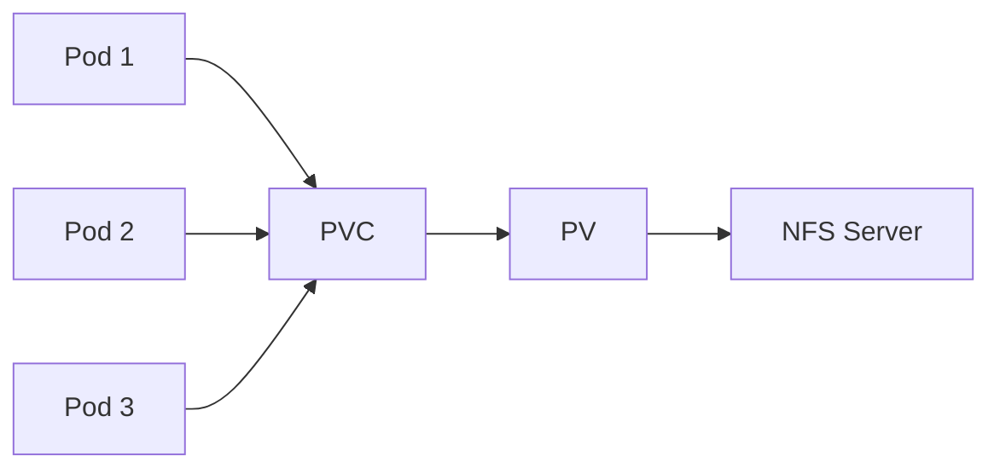

# How to Set Up Persistent Storage with NFS in Kubernetes

Author: [nawazdhandala](https://www.github.com/nawazdhandala)

Tags: Kubernetes, NFS, Persistent Storage, DevOps, Storage

Description: A step-by-step guide to configuring NFS-based persistent storage in Kubernetes, including NFS server setup, PersistentVolumes, PersistentVolumeClaims, and dynamic provisioning with NFS subdir external provisioner.

---

NFS (Network File System) provides shared storage accessible by multiple pods simultaneously. It is ideal for applications that need ReadWriteMany access mode or when you want to use existing NFS infrastructure with Kubernetes.

## NFS Storage Architecture



Multiple pods can mount the same NFS volume, making it suitable for shared data scenarios.

## Setting Up NFS Server

### On Ubuntu/Debian

```bash
# Install NFS server
sudo apt update
sudo apt install nfs-kernel-server

# Create shared directory
sudo mkdir -p /srv/nfs/kubedata
sudo chown nobody:nogroup /srv/nfs/kubedata
sudo chmod 777 /srv/nfs/kubedata

# Configure exports
sudo nano /etc/exports

# Add this line (adjust IP range for your cluster)
/srv/nfs/kubedata    10.0.0.0/8(rw,sync,no_subtree_check,no_root_squash)

# Apply configuration
sudo exportfs -ra

# Start NFS server
sudo systemctl enable nfs-kernel-server
sudo systemctl start nfs-kernel-server

# Verify
sudo exportfs -v
```

### On CentOS/RHEL

```bash
# Install NFS utilities
sudo yum install nfs-utils

# Create shared directory
sudo mkdir -p /srv/nfs/kubedata
sudo chmod 777 /srv/nfs/kubedata

# Configure exports
sudo nano /etc/exports
/srv/nfs/kubedata    10.0.0.0/8(rw,sync,no_root_squash)

# Start services
sudo systemctl enable rpcbind nfs-server
sudo systemctl start rpcbind nfs-server

# Export
sudo exportfs -ra
```

## Configure Kubernetes Nodes

Install NFS client on all Kubernetes nodes:

```bash
# Ubuntu/Debian
sudo apt install nfs-common

# CentOS/RHEL
sudo yum install nfs-utils

# Verify NFS mount works
sudo mount -t nfs 192.168.1.100:/srv/nfs/kubedata /mnt
ls /mnt
sudo umount /mnt
```

## Static NFS Provisioning

### Create PersistentVolume

```yaml
apiVersion: v1
kind: PersistentVolume
metadata:
  name: nfs-pv
spec:
  capacity:
    storage: 10Gi
  accessModes:
    - ReadWriteMany
  persistentVolumeReclaimPolicy: Retain
  storageClassName: nfs
  nfs:
    server: 192.168.1.100
    path: /srv/nfs/kubedata
```

### Create PersistentVolumeClaim

```yaml
apiVersion: v1
kind: PersistentVolumeClaim
metadata:
  name: nfs-pvc
  namespace: default
spec:
  accessModes:
    - ReadWriteMany
  storageClassName: nfs
  resources:
    requests:
      storage: 10Gi
```

### Use in Pod

```yaml
apiVersion: v1
kind: Pod
metadata:
  name: nfs-test
spec:
  containers:
    - name: app
      image: nginx
      volumeMounts:
        - name: nfs-storage
          mountPath: /data
  volumes:
    - name: nfs-storage
      persistentVolumeClaim:
        claimName: nfs-pvc
```

Apply and verify:

```bash
kubectl apply -f pv.yaml
kubectl apply -f pvc.yaml
kubectl apply -f pod.yaml

# Check binding
kubectl get pv,pvc
kubectl exec nfs-test -- ls -la /data
```

## Dynamic NFS Provisioning

For automatic PV creation, use the NFS subdir external provisioner.

### Install NFS Subdir External Provisioner

Using Helm:

```bash
# Add helm repo
helm repo add nfs-subdir-external-provisioner https://kubernetes-sigs.github.io/nfs-subdir-external-provisioner

# Install provisioner
helm install nfs-provisioner nfs-subdir-external-provisioner/nfs-subdir-external-provisioner \
  --set nfs.server=192.168.1.100 \
  --set nfs.path=/srv/nfs/kubedata \
  --set storageClass.name=nfs-client \
  --set storageClass.defaultClass=false
```

Or using manifests:

```yaml
# RBAC
apiVersion: v1
kind: ServiceAccount
metadata:
  name: nfs-client-provisioner
  namespace: default
---
kind: ClusterRole
apiVersion: rbac.authorization.k8s.io/v1
metadata:
  name: nfs-client-provisioner-runner
rules:
  - apiGroups: [""]
    resources: ["nodes"]
    verbs: ["get", "list", "watch"]
  - apiGroups: [""]
    resources: ["persistentvolumes"]
    verbs: ["get", "list", "watch", "create", "delete"]
  - apiGroups: [""]
    resources: ["persistentvolumeclaims"]
    verbs: ["get", "list", "watch", "update"]
  - apiGroups: ["storage.k8s.io"]
    resources: ["storageclasses"]
    verbs: ["get", "list", "watch"]
  - apiGroups: [""]
    resources: ["events"]
    verbs: ["create", "update", "patch"]
---
kind: ClusterRoleBinding
apiVersion: rbac.authorization.k8s.io/v1
metadata:
  name: run-nfs-client-provisioner
subjects:
  - kind: ServiceAccount
    name: nfs-client-provisioner
    namespace: default
roleRef:
  kind: ClusterRole
  name: nfs-client-provisioner-runner
  apiGroup: rbac.authorization.k8s.io
---
kind: Role
apiVersion: rbac.authorization.k8s.io/v1
metadata:
  name: leader-locking-nfs-client-provisioner
  namespace: default
rules:
  - apiGroups: [""]
    resources: ["endpoints"]
    verbs: ["get", "list", "watch", "create", "update", "patch"]
---
kind: RoleBinding
apiVersion: rbac.authorization.k8s.io/v1
metadata:
  name: leader-locking-nfs-client-provisioner
  namespace: default
subjects:
  - kind: ServiceAccount
    name: nfs-client-provisioner
    namespace: default
roleRef:
  kind: Role
  name: leader-locking-nfs-client-provisioner
  apiGroup: rbac.authorization.k8s.io
```

```yaml
# Deployment
apiVersion: apps/v1
kind: Deployment
metadata:
  name: nfs-client-provisioner
  namespace: default
spec:
  replicas: 1
  selector:
    matchLabels:
      app: nfs-client-provisioner
  strategy:
    type: Recreate
  template:
    metadata:
      labels:
        app: nfs-client-provisioner
    spec:
      serviceAccountName: nfs-client-provisioner
      containers:
        - name: nfs-client-provisioner
          image: registry.k8s.io/sig-storage/nfs-subdir-external-provisioner:v4.0.2
          volumeMounts:
            - name: nfs-client-root
              mountPath: /persistentvolumes
          env:
            - name: PROVISIONER_NAME
              value: k8s-sigs.io/nfs-subdir-external-provisioner
            - name: NFS_SERVER
              value: 192.168.1.100
            - name: NFS_PATH
              value: /srv/nfs/kubedata
      volumes:
        - name: nfs-client-root
          nfs:
            server: 192.168.1.100
            path: /srv/nfs/kubedata
```

```yaml
# StorageClass
apiVersion: storage.k8s.io/v1
kind: StorageClass
metadata:
  name: nfs-client
provisioner: k8s-sigs.io/nfs-subdir-external-provisioner
parameters:
  archiveOnDelete: "true"    # Keep data on PVC deletion
reclaimPolicy: Delete
volumeBindingMode: Immediate
allowVolumeExpansion: true
```

### Use Dynamic Provisioning

```yaml
apiVersion: v1
kind: PersistentVolumeClaim
metadata:
  name: dynamic-nfs-pvc
spec:
  storageClassName: nfs-client    # Uses dynamic provisioner
  accessModes:
    - ReadWriteMany
  resources:
    requests:
      storage: 5Gi
---
apiVersion: apps/v1
kind: Deployment
metadata:
  name: web-app
spec:
  replicas: 3
  selector:
    matchLabels:
      app: web
  template:
    metadata:
      labels:
        app: web
    spec:
      containers:
        - name: nginx
          image: nginx
          volumeMounts:
            - name: shared-data
              mountPath: /usr/share/nginx/html
      volumes:
        - name: shared-data
          persistentVolumeClaim:
            claimName: dynamic-nfs-pvc
```

## NFS Access Modes

| Mode | Description | Use Case |
|------|-------------|----------|
| ReadWriteOnce (RWO) | Single node read-write | Single pod access |
| ReadOnlyMany (ROX) | Multiple nodes read-only | Shared config/assets |
| ReadWriteMany (RWX) | Multiple nodes read-write | Shared data between pods |

NFS supports all three modes.

## StatefulSet with NFS

```yaml
apiVersion: apps/v1
kind: StatefulSet
metadata:
  name: web
spec:
  serviceName: web
  replicas: 3
  selector:
    matchLabels:
      app: web
  template:
    metadata:
      labels:
        app: web
    spec:
      containers:
        - name: nginx
          image: nginx
          volumeMounts:
            - name: data
              mountPath: /data
  volumeClaimTemplates:
    - metadata:
        name: data
      spec:
        accessModes: ["ReadWriteOnce"]
        storageClassName: nfs-client
        resources:
          requests:
            storage: 1Gi
```

## Troubleshooting NFS

### Pod Cannot Mount NFS Volume

```bash
# Check pod events
kubectl describe pod my-pod

# Look for:
# Warning  FailedMount  Unable to mount volumes: mount failed

# Verify NFS client is installed on node
kubectl debug node/node-1 -it --image=busybox
mount -t nfs 192.168.1.100:/srv/nfs/kubedata /mnt

# Check NFS server is accessible
showmount -e 192.168.1.100
```

### Permission Denied

```bash
# Check NFS export options
cat /etc/exports
# Ensure no_root_squash or proper uid mapping

# Check directory permissions on NFS server
ls -la /srv/nfs/kubedata

# Verify security context in pod
kubectl get pod my-pod -o yaml | grep -A 10 securityContext
```

### Stale NFS Handle

```bash
# Pod shows stale NFS handle error

# Force unmount on affected node
sudo umount -f /var/lib/kubelet/pods/.../volumes/kubernetes.io~nfs/nfs-pv

# Delete and recreate pod
kubectl delete pod my-pod
kubectl apply -f pod.yaml
```

### Performance Issues

```bash
# Check NFS server load
iostat -x 1

# Check network latency
ping -c 10 192.168.1.100

# Consider tuning mount options
```

Tune NFS mount options in PV:

```yaml
apiVersion: v1
kind: PersistentVolume
metadata:
  name: nfs-pv-tuned
spec:
  capacity:
    storage: 10Gi
  accessModes:
    - ReadWriteMany
  nfs:
    server: 192.168.1.100
    path: /srv/nfs/kubedata
  mountOptions:
    - hard
    - nfsvers=4.1
    - rsize=1048576
    - wsize=1048576
    - timeo=600
    - retrans=2
```

## Security Best Practices

### Restrict NFS Exports

```bash
# /etc/exports - specific IP ranges
/srv/nfs/kubedata    10.244.0.0/16(rw,sync,no_subtree_check)
/srv/nfs/kubedata    10.96.0.0/12(rw,sync,no_subtree_check)
```

### Use Network Policies

```yaml
apiVersion: networking.k8s.io/v1
kind: NetworkPolicy
metadata:
  name: allow-nfs
spec:
  podSelector:
    matchLabels:
      app: web
  policyTypes:
    - Egress
  egress:
    - to:
        - ipBlock:
            cidr: 192.168.1.100/32
      ports:
        - protocol: TCP
          port: 2049
        - protocol: UDP
          port: 2049
```

### Use Security Context

```yaml
spec:
  securityContext:
    fsGroup: 1000
    runAsUser: 1000
    runAsGroup: 1000
  containers:
    - name: app
      image: myapp
      securityContext:
        allowPrivilegeEscalation: false
        readOnlyRootFilesystem: true
```

## Complete Example

```yaml
# PersistentVolume
apiVersion: v1
kind: PersistentVolume
metadata:
  name: shared-data-pv
spec:
  capacity:
    storage: 50Gi
  accessModes:
    - ReadWriteMany
  persistentVolumeReclaimPolicy: Retain
  storageClassName: nfs
  nfs:
    server: 192.168.1.100
    path: /srv/nfs/kubedata/shared
  mountOptions:
    - hard
    - nfsvers=4.1
---
# PersistentVolumeClaim
apiVersion: v1
kind: PersistentVolumeClaim
metadata:
  name: shared-data-pvc
  namespace: production
spec:
  accessModes:
    - ReadWriteMany
  storageClassName: nfs
  resources:
    requests:
      storage: 50Gi
---
# Deployment using shared storage
apiVersion: apps/v1
kind: Deployment
metadata:
  name: file-processor
  namespace: production
spec:
  replicas: 5
  selector:
    matchLabels:
      app: processor
  template:
    metadata:
      labels:
        app: processor
    spec:
      containers:
        - name: processor
          image: file-processor:v1
          volumeMounts:
            - name: shared
              mountPath: /data
          resources:
            requests:
              memory: "256Mi"
              cpu: "100m"
      volumes:
        - name: shared
          persistentVolumeClaim:
            claimName: shared-data-pvc
```

---

NFS provides a straightforward way to add shared persistent storage to Kubernetes. Use static provisioning for simple setups or the NFS subdir external provisioner for dynamic provisioning. Always verify NFS connectivity from your nodes, use appropriate mount options for performance, and restrict NFS exports to only the necessary IP ranges for security.
