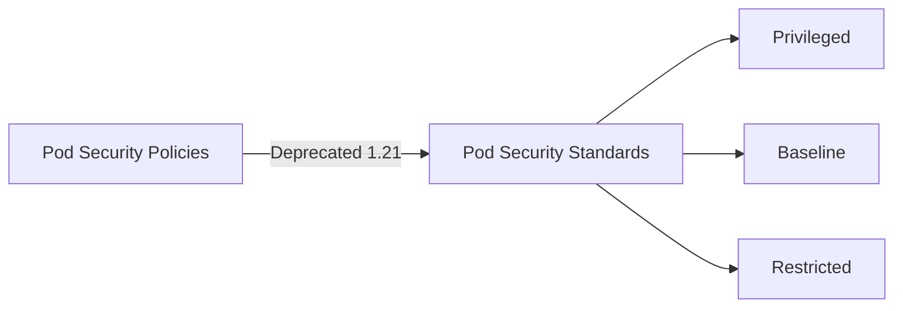

# How to Configure Pod Security Policies (Deprecated) and Pod Security Standards

Author: [nawazdhandala](https://www.github.com/nawazdhandala)

Tags: Kubernetes, Security, Pod Security Standards, PSA, DevOps

Description: A comprehensive guide to Kubernetes pod security, covering the migration from deprecated PodSecurityPolicies to Pod Security Standards (PSS) and Pod Security Admission (PSA), with practical examples and enforcement strategies.

---

Pod Security Policies (PSP) were deprecated in Kubernetes 1.21 and removed in 1.25. Pod Security Standards (PSS) and Pod Security Admission (PSA) are the built-in replacements. This guide covers both the legacy approach and the modern standards.

## Understanding the Transition



| Feature | PSP (Legacy) | PSS/PSA (Modern) |
|---------|--------------|------------------|
| Kubernetes Version | Pre-1.25 | 1.22+ |
| Configuration | Custom RBAC | Namespace labels |
| Granularity | Per-policy | Three profiles |
| Complexity | High | Low |

## Pod Security Standards Profiles

### Privileged

No restrictions. Allows all pod configurations.

```yaml
# Use for trusted system components only
# kube-system namespace typically uses this
```

### Baseline

Prevents known privilege escalations. Good starting point for most workloads.

Restrictions include:
- No privileged containers
- No hostNetwork, hostPID, hostIPC
- No hostPath volumes
- Limited capabilities

### Restricted

Heavily restricted for hardened security.

Additional restrictions:
- Must run as non-root
- No privilege escalation
- Seccomp profile required
- Limited volume types

## Enabling Pod Security Admission

### Namespace Labels

Apply PSA using namespace labels:

```yaml
apiVersion: v1
kind: Namespace
metadata:
  name: production
  labels:
    # Enforce restricted profile - reject violations
    pod-security.kubernetes.io/enforce: restricted
    pod-security.kubernetes.io/enforce-version: latest

    # Warn on baseline violations
    pod-security.kubernetes.io/warn: baseline
    pod-security.kubernetes.io/warn-version: latest

    # Audit restricted violations
    pod-security.kubernetes.io/audit: restricted
    pod-security.kubernetes.io/audit-version: latest
```

Modes:
- **enforce**: Reject pods that violate the policy
- **warn**: Allow but warn in API response
- **audit**: Log violations to audit log

### Apply to Existing Namespace

```bash
# Label existing namespace
kubectl label namespace production \
  pod-security.kubernetes.io/enforce=restricted \
  pod-security.kubernetes.io/warn=restricted

# Verify labels
kubectl get namespace production -o yaml | grep pod-security
```

## Pod Configuration for Each Profile

### Baseline-Compliant Pod

```yaml
apiVersion: v1
kind: Pod
metadata:
  name: baseline-pod
spec:
  containers:
    - name: app
      image: myapp:v1
      # No privileged settings
      # No host namespaces
      # No dangerous capabilities
      securityContext:
        allowPrivilegeEscalation: false
```

### Restricted-Compliant Pod

```yaml
apiVersion: v1
kind: Pod
metadata:
  name: restricted-pod
spec:
  securityContext:
    runAsNonRoot: true
    seccompProfile:
      type: RuntimeDefault
  containers:
    - name: app
      image: myapp:v1
      securityContext:
        allowPrivilegeEscalation: false
        runAsNonRoot: true
        runAsUser: 1000
        runAsGroup: 1000
        capabilities:
          drop:
            - ALL
        seccompProfile:
          type: RuntimeDefault
      volumeMounts:
        - name: data
          mountPath: /data
  volumes:
    - name: data
      emptyDir: {}    # Only allowed volume types
```

### Full Restricted-Compliant Deployment

```yaml
apiVersion: apps/v1
kind: Deployment
metadata:
  name: secure-app
  namespace: production
spec:
  replicas: 3
  selector:
    matchLabels:
      app: secure
  template:
    metadata:
      labels:
        app: secure
    spec:
      securityContext:
        runAsNonRoot: true
        runAsUser: 1000
        runAsGroup: 1000
        fsGroup: 1000
        seccompProfile:
          type: RuntimeDefault
      containers:
        - name: app
          image: myapp:v1
          ports:
            - containerPort: 8080
          securityContext:
            allowPrivilegeEscalation: false
            readOnlyRootFilesystem: true
            capabilities:
              drop:
                - ALL
          volumeMounts:
            - name: tmp
              mountPath: /tmp
            - name: config
              mountPath: /etc/app
              readOnly: true
          resources:
            requests:
              memory: "256Mi"
              cpu: "100m"
            limits:
              memory: "512Mi"
              cpu: "500m"
      volumes:
        - name: tmp
          emptyDir: {}
        - name: config
          configMap:
            name: app-config
```

## Testing Pod Security Compliance

### Dry-Run Test

```bash
# Test if pod would be accepted
kubectl apply -f pod.yaml --dry-run=server

# Check for warnings
kubectl apply -f pod.yaml --dry-run=server 2>&1
```

### Check Namespace Policy

```bash
# View current PSA labels
kubectl get namespace production -o jsonpath='{.metadata.labels}' | jq

# List all namespaces with their policies
kubectl get namespaces -o custom-columns=NAME:.metadata.name,ENFORCE:.metadata.labels.pod-security\.kubernetes\.io/enforce
```

### Common Violations

```bash
# Error: violates PodSecurity "restricted:latest"
# allowPrivilegeEscalation != false

# Fix:
securityContext:
  allowPrivilegeEscalation: false
```

```bash
# Error: violates PodSecurity "restricted:latest"
# runAsNonRoot != true

# Fix:
securityContext:
  runAsNonRoot: true
  runAsUser: 1000
```

## Exemptions

### Built-in Exemptions

Some resources are exempt by default:
- kube-system namespace
- System service accounts

### Custom Exemptions

Configure in admission controller:

```yaml
apiVersion: apiserver.config.k8s.io/v1
kind: AdmissionConfiguration
plugins:
  - name: PodSecurity
    configuration:
      apiVersion: pod-security.admission.config.k8s.io/v1
      kind: PodSecurityConfiguration
      defaults:
        enforce: baseline
        enforce-version: latest
        warn: restricted
        warn-version: latest
      exemptions:
        usernames:
          - system:serviceaccount:kube-system:replicaset-controller
        runtimeClasses:
          - special-runtime
        namespaces:
          - kube-system
          - monitoring
```

## Migration from PSP

### Step 1: Audit Current State

```bash
# List existing PSPs
kubectl get psp

# Check which pods use which PSP
kubectl get pods --all-namespaces -o jsonpath='{range .items[*]}{.metadata.namespace}/{.metadata.name}: {.metadata.annotations.kubernetes\.io/psp}{"\n"}{end}'
```

### Step 2: Map PSP to PSS

| PSP Setting | PSS Profile |
|-------------|-------------|
| privileged: true | Privileged |
| hostNetwork: true | Baseline violation |
| hostPID: true | Baseline violation |
| runAsUser: MustRunAsNonRoot | Restricted |
| allowPrivilegeEscalation: false | Restricted |

### Step 3: Apply PSA Labels

```bash
# Start with warn mode
kubectl label namespace production \
  pod-security.kubernetes.io/warn=restricted

# Monitor for violations
kubectl get events --field-selector reason=FailedCreate

# Then enforce
kubectl label namespace production \
  pod-security.kubernetes.io/enforce=restricted
```

### Step 4: Update Workloads

Fix violations before enforcement:

```yaml
# Before (PSP compliant but not PSS restricted)
spec:
  containers:
    - name: app
      image: myapp:v1

# After (PSS restricted compliant)
spec:
  securityContext:
    runAsNonRoot: true
    seccompProfile:
      type: RuntimeDefault
  containers:
    - name: app
      image: myapp:v1
      securityContext:
        allowPrivilegeEscalation: false
        runAsNonRoot: true
        capabilities:
          drop:
            - ALL
```

## Legacy: PodSecurityPolicy (Pre-1.25)

For clusters still on older versions:

### Restrictive PSP

```yaml
apiVersion: policy/v1beta1
kind: PodSecurityPolicy
metadata:
  name: restricted
spec:
  privileged: false
  allowPrivilegeEscalation: false
  hostNetwork: false
  hostIPC: false
  hostPID: false
  runAsUser:
    rule: MustRunAsNonRoot
  fsGroup:
    rule: MustRunAs
    ranges:
      - min: 1
        max: 65535
  supplementalGroups:
    rule: MustRunAs
    ranges:
      - min: 1
        max: 65535
  volumes:
    - 'configMap'
    - 'emptyDir'
    - 'projected'
    - 'secret'
    - 'downwardAPI'
    - 'persistentVolumeClaim'
  readOnlyRootFilesystem: true
  requiredDropCapabilities:
    - ALL
  seLinux:
    rule: RunAsAny
```

### RBAC for PSP

```yaml
apiVersion: rbac.authorization.k8s.io/v1
kind: ClusterRole
metadata:
  name: use-restricted-psp
rules:
  - apiGroups: ['policy']
    resources: ['podsecuritypolicies']
    resourceNames: ['restricted']
    verbs: ['use']
---
apiVersion: rbac.authorization.k8s.io/v1
kind: ClusterRoleBinding
metadata:
  name: use-restricted-psp
roleRef:
  apiGroup: rbac.authorization.k8s.io
  kind: ClusterRole
  name: use-restricted-psp
subjects:
  - kind: Group
    name: system:serviceaccounts
    apiGroup: rbac.authorization.k8s.io
```

## Monitoring and Auditing

### Audit Logs

```bash
# Check audit logs for PSA violations
# In audit log, look for:
# annotations: authorization.k8s.io/audit-annotations

# Query audit log
grep "pod-security.kubernetes.io" /var/log/kubernetes/audit.log
```

### Prometheus Metrics

```yaml
# Alert on PSA warnings
- alert: PodSecurityViolation
  expr: |
    increase(apiserver_admission_controller_admission_duration_seconds_count{
      name="PodSecurity",
      rejected="true"
    }[5m]) > 0
  labels:
    severity: warning
  annotations:
    summary: "Pod security violations detected"
```

## Best Practices

### 1. Start with Warn Mode

```bash
kubectl label namespace production \
  pod-security.kubernetes.io/warn=restricted \
  pod-security.kubernetes.io/audit=restricted
```

### 2. Use Restricted for Production

```yaml
labels:
  pod-security.kubernetes.io/enforce: restricted
```

### 3. Baseline for Development

```yaml
labels:
  pod-security.kubernetes.io/enforce: baseline
  pod-security.kubernetes.io/warn: restricted
```

### 4. Document Exemptions

```yaml
# In namespace annotation
annotations:
  pod-security.kubernetes.io/exemptions: |
    This namespace uses baseline because legacy app X
    requires hostNetwork for service mesh integration.
    Ticket: SEC-1234
```

### 5. Regular Compliance Checks

```bash
#!/bin/bash
# Check all namespaces for PSA compliance

for ns in $(kubectl get namespaces -o jsonpath='{.items[*].metadata.name}'); do
  enforce=$(kubectl get namespace $ns -o jsonpath='{.metadata.labels.pod-security\.kubernetes\.io/enforce}')
  echo "$ns: ${enforce:-none}"
done
```

---

Pod Security Standards provide a simpler, more maintainable approach to pod security than the deprecated PodSecurityPolicies. Start with warn mode to identify violations, update your workloads to be compliant, then enforce the appropriate profile. Use restricted for production workloads and baseline as a minimum everywhere else.
