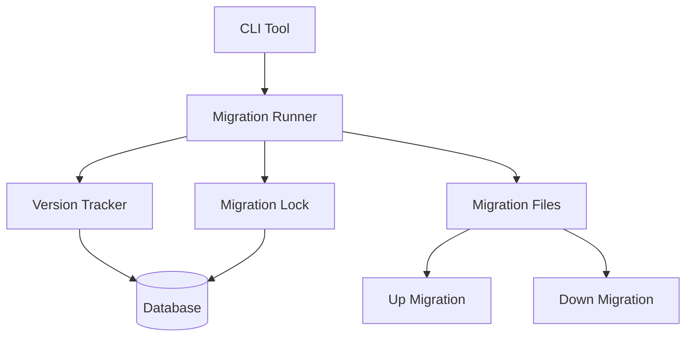

# How to Build a Database Migration System in Node.js

Author: [nawazdhandala](https://www.github.com/nawazdhandala)

Tags: Node.js, TypeScript, Database, Migrations, PostgreSQL, DevOps, Backend

Description: Learn how to build a robust database migration system in Node.js from scratch. This guide covers migration file management, up/down execution, version tracking, CLI tools, and best practices for production deployments.

---

Database migrations provide a systematic way to evolve your database schema over time. While tools like Knex, TypeORM, and Prisma include migration features, understanding how to build one from scratch gives you control over the process and helps you troubleshoot issues when they arise.

## Migration System Architecture

A migration system consists of several components:



## Migration File Structure

Each migration is a file with up and down functions:

```typescript
// migrations/20260125_001_create_users_table.ts
import { MigrationContext } from '../types';

export const name = 'create_users_table';
export const timestamp = 20260125001;

export async function up(ctx: MigrationContext): Promise<void> {
  await ctx.query(`
    CREATE TABLE users (
      id UUID PRIMARY KEY DEFAULT gen_random_uuid(),
      email VARCHAR(255) NOT NULL UNIQUE,
      password_hash VARCHAR(255) NOT NULL,
      name VARCHAR(255),
      created_at TIMESTAMP WITH TIME ZONE DEFAULT NOW(),
      updated_at TIMESTAMP WITH TIME ZONE DEFAULT NOW()
    )
  `);

  await ctx.query(`
    CREATE INDEX idx_users_email ON users(email)
  `);
}

export async function down(ctx: MigrationContext): Promise<void> {
  await ctx.query('DROP TABLE IF EXISTS users CASCADE');
}
```

## Core Types and Interfaces

```typescript
// types.ts
export interface MigrationContext {
  query: (sql: string, params?: any[]) => Promise<any>;
  log: (message: string) => void;
}

export interface Migration {
  name: string;
  timestamp: number;
  up: (ctx: MigrationContext) => Promise<void>;
  down: (ctx: MigrationContext) => Promise<void>;
}

export interface MigrationRecord {
  id: number;
  name: string;
  timestamp: number;
  executed_at: Date;
  checksum: string;
}

export interface MigrationResult {
  name: string;
  status: 'success' | 'failed' | 'skipped';
  duration: number;
  error?: string;
}
```

## Migration Runner Implementation

```typescript
// migration-runner.ts
import { Pool, PoolClient } from 'pg';
import * as crypto from 'crypto';
import * as fs from 'fs/promises';
import * as path from 'path';
import { Migration, MigrationContext, MigrationRecord, MigrationResult } from './types';

export class MigrationRunner {
  private pool: Pool;
  private migrationsPath: string;
  private tableName: string;

  constructor(options: {
    connectionString: string;
    migrationsPath: string;
    tableName?: string;
  }) {
    this.pool = new Pool({ connectionString: options.connectionString });
    this.migrationsPath = options.migrationsPath;
    this.tableName = options.tableName || 'schema_migrations';
  }

  // Initialize migration tracking table
  async initialize(): Promise<void> {
    await this.pool.query(`
      CREATE TABLE IF NOT EXISTS ${this.tableName} (
        id SERIAL PRIMARY KEY,
        name VARCHAR(255) NOT NULL UNIQUE,
        timestamp BIGINT NOT NULL,
        executed_at TIMESTAMP WITH TIME ZONE DEFAULT NOW(),
        checksum VARCHAR(64) NOT NULL
      )
    `);

    // Create advisory lock for preventing concurrent migrations
    await this.pool.query(`
      CREATE TABLE IF NOT EXISTS ${this.tableName}_lock (
        id INTEGER PRIMARY KEY DEFAULT 1,
        locked_at TIMESTAMP WITH TIME ZONE,
        locked_by VARCHAR(255),
        CONSTRAINT single_row CHECK (id = 1)
      )
    `);

    await this.pool.query(`
      INSERT INTO ${this.tableName}_lock (id) VALUES (1)
      ON CONFLICT DO NOTHING
    `);
  }

  // Load all migration files
  async loadMigrations(): Promise<Migration[]> {
    const files = await fs.readdir(this.migrationsPath);
    const migrationFiles = files
      .filter((f) => f.endsWith('.ts') || f.endsWith('.js'))
      .sort();

    const migrations: Migration[] = [];

    for (const file of migrationFiles) {
      const filePath = path.join(this.migrationsPath, file);
      const module = await import(filePath);

      migrations.push({
        name: module.name || path.basename(file, path.extname(file)),
        timestamp: module.timestamp || this.extractTimestamp(file),
        up: module.up,
        down: module.down,
      });
    }

    return migrations.sort((a, b) => a.timestamp - b.timestamp);
  }

  private extractTimestamp(filename: string): number {
    const match = filename.match(/^(\d+)/);
    return match ? parseInt(match[1], 10) : 0;
  }

  // Get executed migrations from database
  async getExecutedMigrations(): Promise<MigrationRecord[]> {
    const result = await this.pool.query(
      `SELECT * FROM ${this.tableName} ORDER BY timestamp ASC`
    );
    return result.rows;
  }

  // Calculate checksum for migration content
  private async calculateChecksum(migration: Migration): Promise<string> {
    const content = migration.up.toString() + migration.down.toString();
    return crypto.createHash('sha256').update(content).digest('hex');
  }

  // Acquire migration lock
  private async acquireLock(client: PoolClient): Promise<boolean> {
    const lockId = `${process.pid}-${Date.now()}`;

    const result = await client.query(`
      UPDATE ${this.tableName}_lock
      SET locked_at = NOW(), locked_by = $1
      WHERE id = 1 AND (locked_at IS NULL OR locked_at < NOW() - INTERVAL '10 minutes')
      RETURNING *
    `, [lockId]);

    return result.rowCount > 0;
  }

  // Release migration lock
  private async releaseLock(client: PoolClient): Promise<void> {
    await client.query(`
      UPDATE ${this.tableName}_lock
      SET locked_at = NULL, locked_by = NULL
      WHERE id = 1
    `);
  }

  // Run pending migrations
  async up(options: { steps?: number } = {}): Promise<MigrationResult[]> {
    const client = await this.pool.connect();
    const results: MigrationResult[] = [];

    try {
      // Acquire lock
      const locked = await this.acquireLock(client);
      if (!locked) {
        throw new Error('Could not acquire migration lock. Another migration may be running.');
      }

      const migrations = await this.loadMigrations();
      const executed = await this.getExecutedMigrations();
      const executedNames = new Set(executed.map((m) => m.name));

      const pending = migrations.filter((m) => !executedNames.has(m.name));
      const toRun = options.steps ? pending.slice(0, options.steps) : pending;

      for (const migration of toRun) {
        const startTime = Date.now();

        try {
          await client.query('BEGIN');

          const ctx: MigrationContext = {
            query: (sql, params) => client.query(sql, params),
            log: (msg) => console.log(`  [${migration.name}] ${msg}`),
          };

          console.log(`Running migration: ${migration.name}`);
          await migration.up(ctx);

          // Record migration
          const checksum = await this.calculateChecksum(migration);
          await client.query(
            `INSERT INTO ${this.tableName} (name, timestamp, checksum) VALUES ($1, $2, $3)`,
            [migration.name, migration.timestamp, checksum]
          );

          await client.query('COMMIT');

          results.push({
            name: migration.name,
            status: 'success',
            duration: Date.now() - startTime,
          });

          console.log(`Completed: ${migration.name} (${Date.now() - startTime}ms)`);
        } catch (error) {
          await client.query('ROLLBACK');

          results.push({
            name: migration.name,
            status: 'failed',
            duration: Date.now() - startTime,
            error: (error as Error).message,
          });

          console.error(`Failed: ${migration.name}`, error);
          throw error; // Stop on first failure
        }
      }

      return results;
    } finally {
      await this.releaseLock(client);
      client.release();
    }
  }

  // Rollback migrations
  async down(options: { steps?: number } = {}): Promise<MigrationResult[]> {
    const client = await this.pool.connect();
    const results: MigrationResult[] = [];

    try {
      const locked = await this.acquireLock(client);
      if (!locked) {
        throw new Error('Could not acquire migration lock.');
      }

      const migrations = await this.loadMigrations();
      const executed = await this.getExecutedMigrations();

      // Get migrations to rollback (most recent first)
      const toRollback = executed
        .slice()
        .reverse()
        .slice(0, options.steps || 1);

      for (const record of toRollback) {
        const migration = migrations.find((m) => m.name === record.name);

        if (!migration) {
          console.warn(`Migration file not found for: ${record.name}`);
          continue;
        }

        const startTime = Date.now();

        try {
          await client.query('BEGIN');

          const ctx: MigrationContext = {
            query: (sql, params) => client.query(sql, params),
            log: (msg) => console.log(`  [${migration.name}] ${msg}`),
          };

          console.log(`Rolling back: ${migration.name}`);
          await migration.down(ctx);

          // Remove migration record
          await client.query(
            `DELETE FROM ${this.tableName} WHERE name = $1`,
            [migration.name]
          );

          await client.query('COMMIT');

          results.push({
            name: migration.name,
            status: 'success',
            duration: Date.now() - startTime,
          });

          console.log(`Rolled back: ${migration.name} (${Date.now() - startTime}ms)`);
        } catch (error) {
          await client.query('ROLLBACK');

          results.push({
            name: migration.name,
            status: 'failed',
            duration: Date.now() - startTime,
            error: (error as Error).message,
          });

          throw error;
        }
      }

      return results;
    } finally {
      await this.releaseLock(client);
      client.release();
    }
  }

  // Get migration status
  async status(): Promise<{ pending: string[]; executed: string[] }> {
    const migrations = await this.loadMigrations();
    const executed = await this.getExecutedMigrations();
    const executedNames = new Set(executed.map((m) => m.name));

    return {
      pending: migrations.filter((m) => !executedNames.has(m.name)).map((m) => m.name),
      executed: executed.map((m) => m.name),
    };
  }

  // Close database connection
  async close(): Promise<void> {
    await this.pool.end();
  }
}
```

## CLI Tool

```typescript
// cli.ts
#!/usr/bin/env node
import { Command } from 'commander';
import * as path from 'path';
import * as fs from 'fs/promises';
import { MigrationRunner } from './migration-runner';

const program = new Command();

function getRunner(): MigrationRunner {
  return new MigrationRunner({
    connectionString: process.env.DATABASE_URL || 'postgresql://localhost/myapp',
    migrationsPath: path.join(process.cwd(), 'migrations'),
  });
}

program
  .name('migrate')
  .description('Database migration tool')
  .version('1.0.0');

program
  .command('init')
  .description('Initialize migration system')
  .action(async () => {
    const runner = getRunner();
    await runner.initialize();
    console.log('Migration system initialized');
    await runner.close();
  });

program
  .command('create <name>')
  .description('Create a new migration file')
  .action(async (name: string) => {
    const timestamp = new Date().toISOString().replace(/\D/g, '').slice(0, 14);
    const filename = `${timestamp}_${name.toLowerCase().replace(/\s+/g, '_')}.ts`;
    const filepath = path.join(process.cwd(), 'migrations', filename);

    const template = `import { MigrationContext } from '../types';

export const name = '${name.toLowerCase().replace(/\s+/g, '_')}';
export const timestamp = ${timestamp};

export async function up(ctx: MigrationContext): Promise<void> {
  // Add your migration logic here
  await ctx.query(\`
    -- Your SQL here
  \`);
}

export async function down(ctx: MigrationContext): Promise<void> {
  // Add your rollback logic here
  await ctx.query(\`
    -- Your rollback SQL here
  \`);
}
`;

    await fs.mkdir(path.dirname(filepath), { recursive: true });
    await fs.writeFile(filepath, template);
    console.log(`Created migration: ${filepath}`);
  });

program
  .command('up')
  .description('Run pending migrations')
  .option('-s, --steps <number>', 'Number of migrations to run')
  .action(async (options) => {
    const runner = getRunner();
    await runner.initialize();

    const results = await runner.up({
      steps: options.steps ? parseInt(options.steps, 10) : undefined,
    });

    console.log('\nMigration summary:');
    results.forEach((r) => {
      console.log(`  ${r.status === 'success' ? 'OK' : 'FAIL'} ${r.name} (${r.duration}ms)`);
    });

    await runner.close();
  });

program
  .command('down')
  .description('Rollback migrations')
  .option('-s, --steps <number>', 'Number of migrations to rollback', '1')
  .action(async (options) => {
    const runner = getRunner();
    await runner.initialize();

    const results = await runner.down({
      steps: parseInt(options.steps, 10),
    });

    console.log('\nRollback summary:');
    results.forEach((r) => {
      console.log(`  ${r.status === 'success' ? 'OK' : 'FAIL'} ${r.name} (${r.duration}ms)`);
    });

    await runner.close();
  });

program
  .command('status')
  .description('Show migration status')
  .action(async () => {
    const runner = getRunner();
    await runner.initialize();

    const status = await runner.status();

    console.log('\nExecuted migrations:');
    status.executed.forEach((name) => console.log(`  [x] ${name}`));

    console.log('\nPending migrations:');
    status.pending.forEach((name) => console.log(`  [ ] ${name}`));

    await runner.close();
  });

program.parse();
```

## Sample Migrations

```typescript
// migrations/20260125_001_create_users.ts
import { MigrationContext } from '../types';

export const name = 'create_users';
export const timestamp = 20260125001;

export async function up(ctx: MigrationContext): Promise<void> {
  ctx.log('Creating users table');

  await ctx.query(`
    CREATE TABLE users (
      id UUID PRIMARY KEY DEFAULT gen_random_uuid(),
      email VARCHAR(255) NOT NULL UNIQUE,
      password_hash VARCHAR(255) NOT NULL,
      name VARCHAR(255),
      created_at TIMESTAMP WITH TIME ZONE DEFAULT NOW(),
      updated_at TIMESTAMP WITH TIME ZONE DEFAULT NOW()
    )
  `);

  await ctx.query(`CREATE INDEX idx_users_email ON users(email)`);
}

export async function down(ctx: MigrationContext): Promise<void> {
  await ctx.query('DROP TABLE IF EXISTS users CASCADE');
}
```

```typescript
// migrations/20260125_002_add_user_roles.ts
import { MigrationContext } from '../types';

export const name = 'add_user_roles';
export const timestamp = 20260125002;

export async function up(ctx: MigrationContext): Promise<void> {
  // Create enum type
  await ctx.query(`
    CREATE TYPE user_role AS ENUM ('user', 'admin', 'moderator')
  `);

  // Add column with default
  await ctx.query(`
    ALTER TABLE users ADD COLUMN role user_role NOT NULL DEFAULT 'user'
  `);

  ctx.log('Added role column to users table');
}

export async function down(ctx: MigrationContext): Promise<void> {
  await ctx.query('ALTER TABLE users DROP COLUMN IF EXISTS role');
  await ctx.query('DROP TYPE IF EXISTS user_role');
}
```

```typescript
// migrations/20260125_003_create_posts.ts
import { MigrationContext } from '../types';

export const name = 'create_posts';
export const timestamp = 20260125003;

export async function up(ctx: MigrationContext): Promise<void> {
  await ctx.query(`
    CREATE TABLE posts (
      id UUID PRIMARY KEY DEFAULT gen_random_uuid(),
      user_id UUID NOT NULL REFERENCES users(id) ON DELETE CASCADE,
      title VARCHAR(255) NOT NULL,
      content TEXT,
      published BOOLEAN DEFAULT false,
      created_at TIMESTAMP WITH TIME ZONE DEFAULT NOW(),
      updated_at TIMESTAMP WITH TIME ZONE DEFAULT NOW()
    )
  `);

  await ctx.query(`CREATE INDEX idx_posts_user_id ON posts(user_id)`);
  await ctx.query(`CREATE INDEX idx_posts_published ON posts(published) WHERE published = true`);
}

export async function down(ctx: MigrationContext): Promise<void> {
  await ctx.query('DROP TABLE IF EXISTS posts CASCADE');
}
```

## Best Practices

### 1. Always Write Down Migrations

Never skip the down function. You will need to rollback at some point:

```typescript
// Bad: No down migration
export async function down(ctx: MigrationContext): Promise<void> {
  // Not implemented
}

// Good: Proper rollback
export async function down(ctx: MigrationContext): Promise<void> {
  await ctx.query('ALTER TABLE users DROP COLUMN IF EXISTS new_column');
}
```

### 2. Make Migrations Idempotent When Possible

```typescript
// Use IF NOT EXISTS and IF EXISTS
export async function up(ctx: MigrationContext): Promise<void> {
  await ctx.query(`
    CREATE TABLE IF NOT EXISTS users (
      id UUID PRIMARY KEY DEFAULT gen_random_uuid()
    )
  `);
}
```

### 3. Handle Data Migrations Carefully

```typescript
// Separate schema and data migrations
export async function up(ctx: MigrationContext): Promise<void> {
  // Add new column
  await ctx.query('ALTER TABLE users ADD COLUMN full_name VARCHAR(255)');

  // Migrate data in batches to avoid locking
  let processed = 0;
  while (true) {
    const result = await ctx.query(`
      UPDATE users
      SET full_name = CONCAT(first_name, ' ', last_name)
      WHERE full_name IS NULL
      LIMIT 1000
      RETURNING id
    `);

    processed += result.rowCount;
    ctx.log(`Processed ${processed} users`);

    if (result.rowCount === 0) break;
  }
}
```

## Summary

| Component | Purpose |
|-----------|---------|
| **Migration Files** | Define up/down schema changes |
| **Version Tracker** | Track executed migrations in database |
| **Migration Lock** | Prevent concurrent migration runs |
| **CLI Tool** | Interface for running migrations |
| **Checksums** | Detect modified migration files |

A custom migration system gives you full control over your database schema evolution. While existing tools work well for most cases, building your own helps you understand the underlying mechanics and customize behavior for specific requirements. The key principles are transactional execution, proper locking, version tracking, and always having a rollback path.
