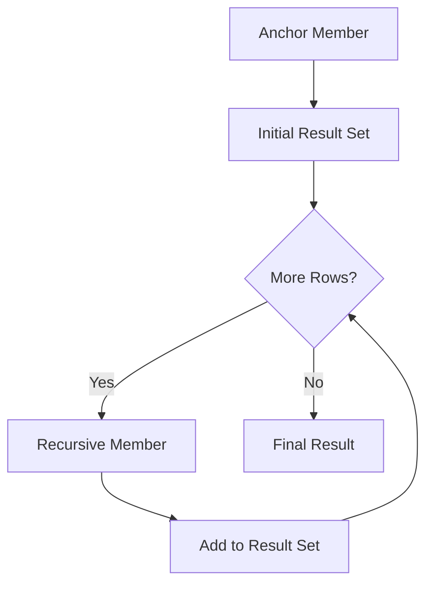

# How to Write Recursive Queries with CTEs in PostgreSQL

Author: [nawazdhandala](https://www.github.com/nawazdhandala)

Tags: PostgreSQL, SQL, Recursive CTE, Hierarchical Data, Query Optimization

Description: Master recursive Common Table Expressions in PostgreSQL to query hierarchical data like organization charts, bill of materials, and graph traversals with practical examples.

---

Hierarchical data is everywhere: organization charts, file systems, category trees, dependency graphs. Traditional SQL struggles with these structures, but PostgreSQL's recursive CTEs let you traverse hierarchies elegantly in a single query.

## Understanding Recursive CTEs

A recursive CTE has two parts: the anchor member (starting point) and the recursive member (iteration step).



Basic syntax:

```sql
WITH RECURSIVE cte_name AS (
    -- Anchor member: starting rows
    SELECT columns FROM table WHERE condition

    UNION ALL

    -- Recursive member: joins previous iteration
    SELECT columns FROM table
    JOIN cte_name ON join_condition
)
SELECT * FROM cte_name;
```

## Example 1: Organization Hierarchy

Let's build an employee hierarchy:

```sql
-- Create the employees table
CREATE TABLE employees (
    id serial PRIMARY KEY,
    name varchar(100),
    manager_id integer REFERENCES employees(id),
    title varchar(100),
    hire_date date
);

-- Insert sample data
INSERT INTO employees (id, name, manager_id, title, hire_date) VALUES
    (1, 'Alice Chen', NULL, 'CEO', '2015-01-15'),
    (2, 'Bob Smith', 1, 'CTO', '2016-03-20'),
    (3, 'Carol Davis', 1, 'CFO', '2016-05-10'),
    (4, 'David Lee', 2, 'Engineering Manager', '2017-08-01'),
    (5, 'Eve Johnson', 2, 'Product Manager', '2018-02-15'),
    (6, 'Frank Brown', 4, 'Senior Developer', '2019-06-01'),
    (7, 'Grace Wilson', 4, 'Senior Developer', '2019-07-15'),
    (8, 'Henry Miller', 6, 'Developer', '2020-11-01'),
    (9, 'Ivy Taylor', 3, 'Financial Analyst', '2021-01-10');
```

### Find All Reports Under a Manager

```sql
WITH RECURSIVE org_tree AS (
    -- Anchor: start with the manager
    SELECT id, name, manager_id, title, 1 AS level
    FROM employees
    WHERE id = 2  -- Bob Smith (CTO)

    UNION ALL

    -- Recursive: find direct reports of current level
    SELECT e.id, e.name, e.manager_id, e.title, ot.level + 1
    FROM employees e
    INNER JOIN org_tree ot ON e.manager_id = ot.id
)
SELECT
    level,
    repeat('  ', level - 1) || name AS org_chart,
    title
FROM org_tree
ORDER BY level, name;
```

Result:
```
 level |    org_chart        |        title
-------+---------------------+----------------------
     1 | Bob Smith           | CTO
     2 |   David Lee         | Engineering Manager
     2 |   Eve Johnson       | Product Manager
     3 |     Frank Brown     | Senior Developer
     3 |     Grace Wilson    | Senior Developer
     4 |       Henry Miller  | Developer
```

### Build a Full Path from Employee to CEO

```sql
WITH RECURSIVE manager_path AS (
    -- Anchor: start with the employee
    SELECT id, name, manager_id, name::text AS path
    FROM employees
    WHERE id = 8  -- Henry Miller

    UNION ALL

    -- Recursive: walk up to manager
    SELECT e.id, e.name, e.manager_id, e.name || ' > ' || mp.path
    FROM employees e
    INNER JOIN manager_path mp ON e.id = mp.manager_id
)
SELECT path
FROM manager_path
WHERE manager_id IS NULL;  -- CEO has no manager
```

Result:
```
Alice Chen > Bob Smith > David Lee > Frank Brown > Henry Miller
```

## Example 2: Bill of Materials

Product assemblies with nested components:

```sql
CREATE TABLE parts (
    id serial PRIMARY KEY,
    name varchar(100),
    unit_cost numeric(10,2)
);

CREATE TABLE assemblies (
    parent_id integer REFERENCES parts(id),
    child_id integer REFERENCES parts(id),
    quantity integer,
    PRIMARY KEY (parent_id, child_id)
);

-- Insert parts
INSERT INTO parts (id, name, unit_cost) VALUES
    (1, 'Bicycle', 0),
    (2, 'Frame', 150),
    (3, 'Wheel Assembly', 0),
    (4, 'Rim', 35),
    (5, 'Tire', 25),
    (6, 'Spoke', 0.50),
    (7, 'Handlebar', 45),
    (8, 'Seat', 30);

-- Insert assembly relationships
INSERT INTO assemblies (parent_id, child_id, quantity) VALUES
    (1, 2, 1),   -- Bicycle has 1 Frame
    (1, 3, 2),   -- Bicycle has 2 Wheel Assemblies
    (1, 7, 1),   -- Bicycle has 1 Handlebar
    (1, 8, 1),   -- Bicycle has 1 Seat
    (3, 4, 1),   -- Wheel Assembly has 1 Rim
    (3, 5, 1),   -- Wheel Assembly has 1 Tire
    (3, 6, 36);  -- Wheel Assembly has 36 Spokes
```

### Explode the Bill of Materials

```sql
WITH RECURSIVE bom AS (
    -- Anchor: top-level product
    SELECT
        p.id,
        p.name,
        1 AS quantity,
        p.unit_cost,
        1 AS level,
        ARRAY[p.id] AS path
    FROM parts p
    WHERE p.id = 1  -- Bicycle

    UNION ALL

    -- Recursive: child components
    SELECT
        p.id,
        p.name,
        a.quantity * bom.quantity,
        p.unit_cost,
        bom.level + 1,
        bom.path || p.id
    FROM parts p
    INNER JOIN assemblies a ON p.id = a.child_id
    INNER JOIN bom ON a.parent_id = bom.id
)
SELECT
    repeat('  ', level - 1) || name AS component,
    quantity,
    unit_cost,
    quantity * unit_cost AS total_cost
FROM bom
ORDER BY path;
```

### Calculate Total Assembly Cost

```sql
WITH RECURSIVE bom AS (
    SELECT p.id, p.name, 1 AS quantity, p.unit_cost
    FROM parts p WHERE p.id = 1

    UNION ALL

    SELECT p.id, p.name, a.quantity * bom.quantity, p.unit_cost
    FROM parts p
    INNER JOIN assemblies a ON p.id = a.child_id
    INNER JOIN bom ON a.parent_id = bom.id
)
SELECT sum(quantity * unit_cost) AS total_cost
FROM bom
WHERE unit_cost > 0;  -- Only count leaf parts with costs
```

## Example 3: Graph Traversal

Find paths between nodes in a graph:

```sql
CREATE TABLE edges (
    from_node varchar(10),
    to_node varchar(10),
    weight integer,
    PRIMARY KEY (from_node, to_node)
);

INSERT INTO edges VALUES
    ('A', 'B', 5), ('A', 'C', 3),
    ('B', 'D', 2), ('B', 'E', 4),
    ('C', 'E', 6), ('C', 'F', 8),
    ('D', 'G', 1), ('E', 'G', 3),
    ('F', 'G', 2);
```

### Find All Paths Between Two Nodes

```sql
WITH RECURSIVE paths AS (
    -- Anchor: start at source
    SELECT
        from_node,
        to_node,
        weight,
        ARRAY[from_node, to_node] AS path,
        weight AS total_weight
    FROM edges
    WHERE from_node = 'A'

    UNION ALL

    -- Recursive: extend path
    SELECT
        e.from_node,
        e.to_node,
        e.weight,
        p.path || e.to_node,
        p.total_weight + e.weight
    FROM edges e
    INNER JOIN paths p ON e.from_node = p.to_node
    WHERE NOT e.to_node = ANY(p.path)  -- Prevent cycles
)
SELECT path, total_weight
FROM paths
WHERE to_node = 'G'
ORDER BY total_weight;
```

Result:
```
         path          | total_weight
-----------------------+--------------
 {A,B,D,G}             |            8
 {A,B,E,G}             |           12
 {A,C,F,G}             |           13
 {A,C,E,G}             |           12
```

## Preventing Infinite Loops

Recursive CTEs can loop forever without safeguards.

### Use a Path Array to Detect Cycles

```sql
WITH RECURSIVE traverse AS (
    SELECT id, name, manager_id, ARRAY[id] AS visited
    FROM employees WHERE id = 1

    UNION ALL

    SELECT e.id, e.name, e.manager_id, t.visited || e.id
    FROM employees e
    INNER JOIN traverse t ON e.manager_id = t.id
    WHERE NOT e.id = ANY(t.visited)  -- Skip if already visited
)
SELECT * FROM traverse;
```

### Limit Recursion Depth

```sql
WITH RECURSIVE limited AS (
    SELECT id, name, manager_id, 1 AS depth
    FROM employees WHERE id = 1

    UNION ALL

    SELECT e.id, e.name, e.manager_id, l.depth + 1
    FROM employees e
    INNER JOIN limited l ON e.manager_id = l.id
    WHERE l.depth < 10  -- Stop after 10 levels
)
SELECT * FROM limited;
```

## Performance Considerations

### Index the Join Column

```sql
-- Essential for recursive CTEs on large tables
CREATE INDEX employees_manager_idx ON employees(manager_id);
```

### Use UNION Instead of UNION ALL for Deduplication

```sql
-- UNION removes duplicates but is slower
WITH RECURSIVE unique_paths AS (
    SELECT id, manager_id FROM employees WHERE id = 1

    UNION  -- Removes duplicates automatically

    SELECT e.id, e.manager_id
    FROM employees e
    INNER JOIN unique_paths up ON e.manager_id = up.id
)
SELECT * FROM unique_paths;
```

### Check Execution Plans

```sql
EXPLAIN (ANALYZE, BUFFERS)
WITH RECURSIVE org_tree AS (
    SELECT id, name, manager_id FROM employees WHERE id = 1

    UNION ALL

    SELECT e.id, e.name, e.manager_id
    FROM employees e
    INNER JOIN org_tree ot ON e.manager_id = ot.id
)
SELECT * FROM org_tree;
```

## Real-World Example: Category Tree

An e-commerce category hierarchy:

```sql
CREATE TABLE categories (
    id serial PRIMARY KEY,
    name varchar(100),
    parent_id integer REFERENCES categories(id),
    slug varchar(100)
);

INSERT INTO categories (id, name, parent_id, slug) VALUES
    (1, 'Electronics', NULL, 'electronics'),
    (2, 'Computers', 1, 'computers'),
    (3, 'Laptops', 2, 'laptops'),
    (4, 'Gaming Laptops', 3, 'gaming-laptops'),
    (5, 'Phones', 1, 'phones'),
    (6, 'Smartphones', 5, 'smartphones');

-- Generate breadcrumb for any category
WITH RECURSIVE breadcrumb AS (
    SELECT id, name, parent_id, slug, name::text AS path
    FROM categories
    WHERE id = 4  -- Gaming Laptops

    UNION ALL

    SELECT c.id, c.name, c.parent_id, c.slug, c.name || ' > ' || b.path
    FROM categories c
    INNER JOIN breadcrumb b ON c.id = b.parent_id
)
SELECT path
FROM breadcrumb
WHERE parent_id IS NULL;

-- Result: Electronics > Computers > Laptops > Gaming Laptops
```

---

Recursive CTEs transform hierarchical queries from multiple round trips into single efficient operations. The pattern stays the same: anchor member sets the starting point, recursive member extends the result set, and a termination condition prevents infinite loops. Master this pattern and hierarchical data becomes straightforward to query.
