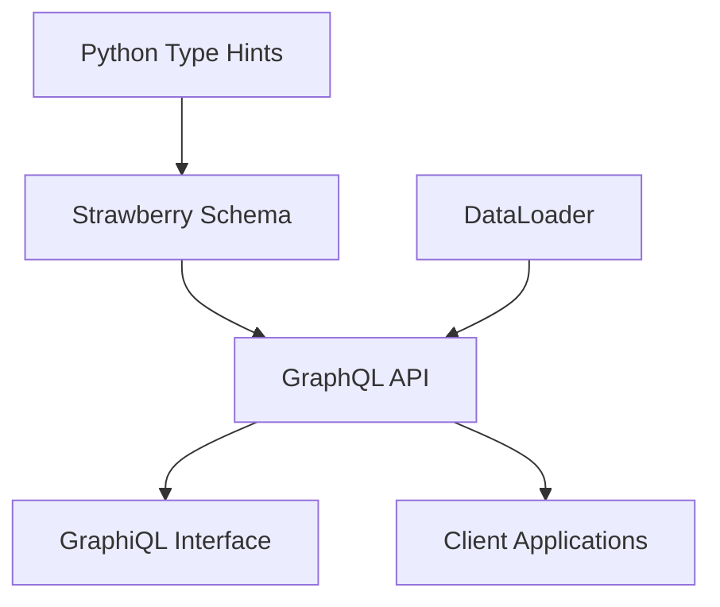

# How to Build GraphQL APIs with Strawberry in Python

Author: [nawazdhandala](https://www.github.com/nawazdhandala)

Tags: Python, GraphQL, Strawberry, API, FastAPI, Flask, Type Safety, Queries, Mutations, Subscriptions

Description: Learn how to build type-safe GraphQL APIs in Python using Strawberry. This guide covers schema definition, queries, mutations, subscriptions, authentication, and integration with FastAPI and Flask.

---

> GraphQL gives clients the power to request exactly the data they need. Strawberry is a modern Python library that leverages Python's type hints to create GraphQL APIs with minimal boilerplate. It catches errors at development time rather than runtime, making your APIs more reliable.

Unlike schema-first approaches, Strawberry uses a code-first philosophy. You define your types using Python classes and dataclasses, and Strawberry generates the GraphQL schema automatically. This keeps your code DRY and fully type-checked.

---

## Why Strawberry?

Strawberry offers several advantages over alternatives like Graphene:

- Native Python type hints for schema definition
- Built-in support for async/await
- First-class integration with FastAPI
- DataLoader pattern for N+1 query prevention
- Modern API design following Python best practices



---

## Getting Started

Install Strawberry with your preferred framework:

```bash
# Core library
pip install strawberry-graphql

# With FastAPI integration
pip install strawberry-graphql[fastapi]

# With Flask integration
pip install strawberry-graphql[flask]
```

---

## Defining Your First Schema

Start with a simple schema using Python dataclasses:

```python
# schema.py
# Basic Strawberry GraphQL schema definition

import strawberry
from typing import List, Optional
from dataclasses import field
from datetime import datetime


@strawberry.type
class Author:
    """
    Represents a book author.
    The @strawberry.type decorator marks this as a GraphQL type.
    """
    id: strawberry.ID
    name: str
    bio: Optional[str] = None
    created_at: datetime = field(default_factory=datetime.utcnow)


@strawberry.type
class Book:
    """
    Represents a book in the system.
    Fields map directly to GraphQL schema fields.
    """
    id: strawberry.ID
    title: str
    isbn: str
    published_year: int
    author: Author
    genres: List[str] = field(default_factory=list)

    @strawberry.field
    def age(self) -> int:
        """
        Computed field: calculates how old the book is.
        This is resolved on-demand when queried.
        """
        current_year = datetime.now().year
        return current_year - self.published_year


# Sample data for demonstration
AUTHORS_DB = {
    "1": Author(id="1", name="George Orwell", bio="English novelist"),
    "2": Author(id="2", name="Jane Austen", bio="English novelist"),
}

BOOKS_DB = {
    "1": Book(
        id="1",
        title="1984",
        isbn="978-0451524935",
        published_year=1949,
        author=AUTHORS_DB["1"],
        genres=["Dystopian", "Political Fiction"]
    ),
    "2": Book(
        id="2",
        title="Pride and Prejudice",
        isbn="978-0141439518",
        published_year=1813,
        author=AUTHORS_DB["2"],
        genres=["Romance", "Classic"]
    ),
}


@strawberry.type
class Query:
    """
    Root query type for the GraphQL API.
    All read operations are defined here.
    """

    @strawberry.field
    def book(self, id: strawberry.ID) -> Optional[Book]:
        """Get a single book by ID."""
        return BOOKS_DB.get(id)

    @strawberry.field
    def books(self) -> List[Book]:
        """Get all books."""
        return list(BOOKS_DB.values())

    @strawberry.field
    def author(self, id: strawberry.ID) -> Optional[Author]:
        """Get a single author by ID."""
        return AUTHORS_DB.get(id)

    @strawberry.field
    def authors(self) -> List[Author]:
        """Get all authors."""
        return list(AUTHORS_DB.values())


# Create the schema
schema = strawberry.Schema(query=Query)
```

---

## Adding Mutations

Mutations handle create, update, and delete operations:

```python
# mutations.py
# GraphQL mutations for modifying data

import strawberry
from typing import Optional
from dataclasses import dataclass

# Import types from schema
from schema import Book, Author, BOOKS_DB, AUTHORS_DB


@strawberry.input
class CreateBookInput:
    """
    Input type for creating a new book.
    @strawberry.input creates a GraphQL input type.
    """
    title: str
    isbn: str
    published_year: int
    author_id: strawberry.ID
    genres: list[str] = strawberry.field(default_factory=list)


@strawberry.input
class UpdateBookInput:
    """Input type for updating an existing book."""
    title: Optional[str] = None
    isbn: Optional[str] = None
    published_year: Optional[int] = None
    genres: Optional[list[str]] = None


@strawberry.type
class BookMutationResponse:
    """
    Response type for book mutations.
    Includes success status and optional error message.
    """
    success: bool
    message: str
    book: Optional[Book] = None


@strawberry.type
class Mutation:
    """
    Root mutation type.
    All write operations are defined here.
    """

    @strawberry.mutation
    def create_book(self, input: CreateBookInput) -> BookMutationResponse:
        """
        Create a new book.
        Returns the created book or an error message.
        """
        # Validate author exists
        author = AUTHORS_DB.get(input.author_id)
        if not author:
            return BookMutationResponse(
                success=False,
                message=f"Author with ID {input.author_id} not found"
            )

        # Check for duplicate ISBN
        for book in BOOKS_DB.values():
            if book.isbn == input.isbn:
                return BookMutationResponse(
                    success=False,
                    message=f"Book with ISBN {input.isbn} already exists"
                )

        # Create the book
        new_id = str(len(BOOKS_DB) + 1)
        new_book = Book(
            id=new_id,
            title=input.title,
            isbn=input.isbn,
            published_year=input.published_year,
            author=author,
            genres=input.genres
        )

        BOOKS_DB[new_id] = new_book

        return BookMutationResponse(
            success=True,
            message="Book created successfully",
            book=new_book
        )

    @strawberry.mutation
    def update_book(
        self,
        id: strawberry.ID,
        input: UpdateBookInput
    ) -> BookMutationResponse:
        """
        Update an existing book.
        Only provided fields are updated.
        """
        book = BOOKS_DB.get(id)
        if not book:
            return BookMutationResponse(
                success=False,
                message=f"Book with ID {id} not found"
            )

        # Update only provided fields
        if input.title is not None:
            book.title = input.title
        if input.isbn is not None:
            book.isbn = input.isbn
        if input.published_year is not None:
            book.published_year = input.published_year
        if input.genres is not None:
            book.genres = input.genres

        return BookMutationResponse(
            success=True,
            message="Book updated successfully",
            book=book
        )

    @strawberry.mutation
    def delete_book(self, id: strawberry.ID) -> BookMutationResponse:
        """Delete a book by ID."""
        if id not in BOOKS_DB:
            return BookMutationResponse(
                success=False,
                message=f"Book with ID {id} not found"
            )

        deleted_book = BOOKS_DB.pop(id)

        return BookMutationResponse(
            success=True,
            message="Book deleted successfully",
            book=deleted_book
        )


# Update schema to include mutations
schema = strawberry.Schema(query=Query, mutation=Mutation)
```

---

## Implementing Subscriptions

Subscriptions provide real-time updates:

```python
# subscriptions.py
# GraphQL subscriptions for real-time updates

import strawberry
import asyncio
from typing import AsyncGenerator
from datetime import datetime


@strawberry.type
class BookEvent:
    """Event emitted when a book is modified."""
    event_type: str  # "created", "updated", "deleted"
    book_id: strawberry.ID
    timestamp: datetime
    book_title: str


# Simple event queue for demonstration
# In production, use Redis PubSub or similar
book_event_queue: asyncio.Queue = asyncio.Queue()


async def publish_book_event(event: BookEvent):
    """Publish an event to all subscribers."""
    await book_event_queue.put(event)


@strawberry.type
class Subscription:
    """
    Root subscription type.
    Subscriptions use async generators to stream data.
    """

    @strawberry.subscription
    async def book_events(self) -> AsyncGenerator[BookEvent, None]:
        """
        Subscribe to book events.
        Yields events as they occur.
        """
        while True:
            try:
                # Wait for the next event
                event = await asyncio.wait_for(
                    book_event_queue.get(),
                    timeout=30.0
                )
                yield event
            except asyncio.TimeoutError:
                # Send heartbeat to keep connection alive
                continue

    @strawberry.subscription
    async def countdown(self, start: int = 10) -> AsyncGenerator[int, None]:
        """
        Simple countdown subscription for testing.
        Demonstrates streaming integer values.
        """
        for i in range(start, 0, -1):
            yield i
            await asyncio.sleep(1)


# Update schema with subscriptions
schema = strawberry.Schema(
    query=Query,
    mutation=Mutation,
    subscription=Subscription
)
```

---

## DataLoader for N+1 Prevention

Prevent N+1 queries with DataLoader:

```python
# dataloaders.py
# DataLoader pattern for efficient data fetching

import strawberry
from strawberry.dataloader import DataLoader
from typing import List, Optional
from collections import defaultdict


# Simulated database
class Database:
    """Simulated database for demonstration."""

    authors = {
        "1": {"id": "1", "name": "George Orwell"},
        "2": {"id": "2", "name": "Jane Austen"},
        "3": {"id": "3", "name": "Mark Twain"},
    }

    books = {
        "1": {"id": "1", "title": "1984", "author_id": "1"},
        "2": {"id": "2", "title": "Animal Farm", "author_id": "1"},
        "3": {"id": "3", "title": "Pride and Prejudice", "author_id": "2"},
        "4": {"id": "4", "title": "Tom Sawyer", "author_id": "3"},
    }


async def load_authors(keys: List[str]) -> List[Optional[dict]]:
    """
    Batch load authors by their IDs.
    Called once with all requested IDs instead of N times.
    """
    print(f"Loading authors: {keys}")  # Debug: shows batching

    # Simulate database query
    # In production: SELECT * FROM authors WHERE id IN (keys)
    return [Database.authors.get(key) for key in keys]


async def load_books_by_author(author_ids: List[str]) -> List[List[dict]]:
    """
    Batch load books for multiple authors.
    Returns a list of book lists, one per author.
    """
    print(f"Loading books for authors: {author_ids}")

    # Group books by author
    books_by_author = defaultdict(list)
    for book in Database.books.values():
        if book["author_id"] in author_ids:
            books_by_author[book["author_id"]].append(book)

    # Return in same order as input keys
    return [books_by_author.get(author_id, []) for author_id in author_ids]


@strawberry.type
class BookWithLoader:
    """Book type that uses DataLoader for author resolution."""
    id: strawberry.ID
    title: str
    author_id: strawberry.Private[str]  # Internal field, not exposed in schema

    @strawberry.field
    async def author(self, info: strawberry.Info) -> "AuthorWithLoader":
        """
        Resolve author using DataLoader.
        Multiple books requesting authors get batched.
        """
        loader = info.context["author_loader"]
        author_data = await loader.load(self.author_id)
        return AuthorWithLoader(
            id=author_data["id"],
            name=author_data["name"]
        )


@strawberry.type
class AuthorWithLoader:
    """Author type that uses DataLoader for books resolution."""
    id: strawberry.ID
    name: str

    @strawberry.field
    async def books(self, info: strawberry.Info) -> List[BookWithLoader]:
        """
        Resolve books using DataLoader.
        Multiple authors requesting books get batched.
        """
        loader = info.context["books_by_author_loader"]
        books_data = await loader.load(self.id)
        return [
            BookWithLoader(
                id=b["id"],
                title=b["title"],
                author_id=b["author_id"]
            )
            for b in books_data
        ]


@strawberry.type
class QueryWithLoader:
    """Query type demonstrating DataLoader usage."""

    @strawberry.field
    async def books(self) -> List[BookWithLoader]:
        """Get all books with efficient author loading."""
        return [
            BookWithLoader(
                id=b["id"],
                title=b["title"],
                author_id=b["author_id"]
            )
            for b in Database.books.values()
        ]

    @strawberry.field
    async def authors(self) -> List[AuthorWithLoader]:
        """Get all authors with efficient book loading."""
        return [
            AuthorWithLoader(id=a["id"], name=a["name"])
            for a in Database.authors.values()
        ]


def get_context():
    """
    Create context with DataLoaders.
    Called for each request to ensure fresh loaders.
    """
    return {
        "author_loader": DataLoader(load_fn=load_authors),
        "books_by_author_loader": DataLoader(load_fn=load_books_by_author),
    }
```

---

## FastAPI Integration

Integrate Strawberry with FastAPI:

```python
# main_fastapi.py
# Strawberry GraphQL with FastAPI

from fastapi import FastAPI, Depends, Request
from fastapi.middleware.cors import CORSMiddleware
from strawberry.fastapi import GraphQLRouter
import strawberry
from typing import Optional

# Import schema components
from schema import Query
from mutations import Mutation
from subscriptions import Subscription
from dataloaders import get_context, DataLoader, load_authors, load_books_by_author


# Authentication context
async def get_current_user(request: Request) -> Optional[dict]:
    """
    Extract user from request headers.
    In production, validate JWT or session.
    """
    auth_header = request.headers.get("Authorization")
    if not auth_header:
        return None

    # Simplified: In production, decode and verify JWT
    if auth_header.startswith("Bearer "):
        token = auth_header[7:]
        # Validate token and return user
        return {"id": "user_1", "name": "Test User", "roles": ["admin"]}

    return None


async def get_context_with_auth(
    request: Request,
    user: Optional[dict] = Depends(get_current_user)
) -> dict:
    """
    Build context with authentication and DataLoaders.
    This is injected into every GraphQL request.
    """
    return {
        "request": request,
        "user": user,
        "author_loader": DataLoader(load_fn=load_authors),
        "books_by_author_loader": DataLoader(load_fn=load_books_by_author),
    }


# Create schema
schema = strawberry.Schema(
    query=Query,
    mutation=Mutation,
    subscription=Subscription
)

# Create GraphQL router
graphql_app = GraphQLRouter(
    schema,
    context_getter=get_context_with_auth,
    graphiql=True  # Enable GraphiQL interface
)

# Create FastAPI app
app = FastAPI(title="Book API")

# Configure CORS
app.add_middleware(
    CORSMiddleware,
    allow_origins=["*"],
    allow_credentials=True,
    allow_methods=["*"],
    allow_headers=["*"],
)

# Mount GraphQL endpoint
app.include_router(graphql_app, prefix="/graphql")


@app.get("/health")
async def health():
    """Health check endpoint."""
    return {"status": "healthy"}


if __name__ == "__main__":
    import uvicorn
    uvicorn.run(app, host="0.0.0.0", port=8000)
```

---

## Authentication and Authorization

Implement field-level authorization:

```python
# auth.py
# Authentication and authorization for GraphQL

import strawberry
from strawberry.permission import BasePermission
from strawberry.types import Info
from typing import Any


class IsAuthenticated(BasePermission):
    """
    Permission class requiring authentication.
    Use as decorator on fields that need auth.
    """
    message = "User is not authenticated"

    def has_permission(self, source: Any, info: Info, **kwargs) -> bool:
        user = info.context.get("user")
        return user is not None


class HasRole(BasePermission):
    """
    Permission class requiring specific role.
    Can be customized per field.
    """
    message = "User does not have required role"

    def __init__(self, role: str):
        self.role = role

    def has_permission(self, source: Any, info: Info, **kwargs) -> bool:
        user = info.context.get("user")
        if not user:
            return False

        user_roles = user.get("roles", [])
        return self.role in user_roles


@strawberry.type
class SecureQuery:
    """Query with protected fields."""

    @strawberry.field
    def public_data(self) -> str:
        """Available to everyone."""
        return "This is public"

    @strawberry.field(permission_classes=[IsAuthenticated])
    def user_data(self, info: Info) -> str:
        """Only available to authenticated users."""
        user = info.context["user"]
        return f"Hello, {user['name']}"

    @strawberry.field(permission_classes=[HasRole("admin")])
    def admin_data(self) -> str:
        """Only available to admins."""
        return "Secret admin information"


@strawberry.type
class SecureMutation:
    """Mutation with protected operations."""

    @strawberry.mutation(permission_classes=[IsAuthenticated])
    def update_profile(self, name: str, info: Info) -> str:
        """Update user profile (requires auth)."""
        user = info.context["user"]
        # Update user in database
        return f"Updated profile for {user['id']}"

    @strawberry.mutation(permission_classes=[HasRole("admin")])
    def delete_user(self, user_id: str) -> str:
        """Delete a user (admin only)."""
        # Delete user from database
        return f"Deleted user {user_id}"
```

---

## Input Validation

Validate input with custom scalars and validators:

```python
# validation.py
# Input validation for GraphQL

import strawberry
import re
from typing import NewType, Annotated
from pydantic import BaseModel, EmailStr, field_validator


# Custom scalar for email validation
@strawberry.scalar(
    description="Valid email address",
    serialize=lambda v: str(v),
    parse_value=lambda v: validate_email(v)
)
class Email:
    pass


def validate_email(value: str) -> str:
    """Validate email format."""
    pattern = r'^[a-zA-Z0-9._%+-]+@[a-zA-Z0-9.-]+\.[a-zA-Z]{2,}$'
    if not re.match(pattern, value):
        raise ValueError(f"Invalid email: {value}")
    return value


# Custom scalar for ISBN
@strawberry.scalar(
    description="Valid ISBN-13",
    serialize=lambda v: str(v),
    parse_value=lambda v: validate_isbn(v)
)
class ISBN:
    pass


def validate_isbn(value: str) -> str:
    """Validate ISBN-13 format."""
    # Remove hyphens for validation
    clean = value.replace("-", "")
    if not re.match(r'^\d{13}$', clean):
        raise ValueError(f"Invalid ISBN: {value}")
    return value


@strawberry.input
class CreateUserInput:
    """
    Input with validated fields.
    Validation happens automatically during parsing.
    """
    name: str
    email: Email
    age: int

    @strawberry.field
    def __post_init__(self):
        """Additional validation after field parsing."""
        if len(self.name) < 2:
            raise ValueError("Name must be at least 2 characters")
        if self.age < 0 or self.age > 150:
            raise ValueError("Age must be between 0 and 150")


# Using Pydantic for complex validation
class BookInputModel(BaseModel):
    """Pydantic model for book validation."""
    title: str
    isbn: str
    published_year: int

    @field_validator('title')
    def title_not_empty(cls, v):
        if not v.strip():
            raise ValueError('Title cannot be empty')
        return v.strip()

    @field_validator('published_year')
    def valid_year(cls, v):
        if v < 1000 or v > 2100:
            raise ValueError('Published year must be between 1000 and 2100')
        return v


@strawberry.experimental.pydantic.input(model=BookInputModel)
class BookInput:
    """
    Strawberry input type backed by Pydantic model.
    Gets all validation from the Pydantic model.
    """
    pass


@strawberry.type
class ValidationMutation:
    """Mutations demonstrating validation."""

    @strawberry.mutation
    def create_user(self, input: CreateUserInput) -> str:
        """Create user with validated input."""
        # Input is already validated
        return f"Created user: {input.name}"

    @strawberry.mutation
    def create_book(self, input: BookInput) -> str:
        """Create book with Pydantic validation."""
        # Pydantic validation applied automatically
        return f"Created book: {input.title}"
```

---

## Complete Example Application

Here is a full example bringing everything together:

```python
# app.py
# Complete Strawberry GraphQL application

import strawberry
from strawberry.fastapi import GraphQLRouter
from fastapi import FastAPI
from typing import List, Optional
from datetime import datetime


# Types
@strawberry.type
class User:
    id: strawberry.ID
    name: str
    email: str
    created_at: datetime


@strawberry.type
class Post:
    id: strawberry.ID
    title: str
    content: str
    author_id: strawberry.Private[str]
    created_at: datetime

    @strawberry.field
    async def author(self, info: strawberry.Info) -> User:
        """Resolve author using DataLoader."""
        loader = info.context["user_loader"]
        return await loader.load(self.author_id)


# Simple in-memory store
users_db = {}
posts_db = {}


# Query
@strawberry.type
class Query:
    @strawberry.field
    def user(self, id: strawberry.ID) -> Optional[User]:
        return users_db.get(id)

    @strawberry.field
    def users(self) -> List[User]:
        return list(users_db.values())

    @strawberry.field
    def post(self, id: strawberry.ID) -> Optional[Post]:
        return posts_db.get(id)

    @strawberry.field
    def posts(self) -> List[Post]:
        return list(posts_db.values())


# Inputs
@strawberry.input
class CreateUserInput:
    name: str
    email: str


@strawberry.input
class CreatePostInput:
    title: str
    content: str
    author_id: strawberry.ID


# Mutation
@strawberry.type
class Mutation:
    @strawberry.mutation
    def create_user(self, input: CreateUserInput) -> User:
        user_id = str(len(users_db) + 1)
        user = User(
            id=user_id,
            name=input.name,
            email=input.email,
            created_at=datetime.utcnow()
        )
        users_db[user_id] = user
        return user

    @strawberry.mutation
    def create_post(self, input: CreatePostInput) -> Post:
        if input.author_id not in users_db:
            raise ValueError("Author not found")

        post_id = str(len(posts_db) + 1)
        post = Post(
            id=post_id,
            title=input.title,
            content=input.content,
            author_id=input.author_id,
            created_at=datetime.utcnow()
        )
        posts_db[post_id] = post
        return post


# Schema and app
schema = strawberry.Schema(query=Query, mutation=Mutation)
graphql_app = GraphQLRouter(schema)

app = FastAPI()
app.include_router(graphql_app, prefix="/graphql")


if __name__ == "__main__":
    import uvicorn
    uvicorn.run(app, host="0.0.0.0", port=8000)
```

---

## Best Practices

1. **Use DataLoaders**: Always use DataLoaders for resolving related data to prevent N+1 queries.

2. **Type everything**: Leverage Python's type hints for automatic schema generation and better IDE support.

3. **Validate inputs**: Use custom scalars or Pydantic integration for input validation.

4. **Implement proper error handling**: Return meaningful error messages in mutation responses.

5. **Use permissions sparingly**: Apply authorization at the field level for fine-grained access control.

6. **Document your schema**: Add descriptions to types and fields for self-documenting APIs.

---

*Building GraphQL APIs? [OneUptime](https://oneuptime.com) helps you monitor API performance, track error rates, and ensure your GraphQL endpoints are always available.*

**Related Reading:**
- [How to Validate Data with Pydantic v2 Models](https://oneuptime.com/blog/post/2026-01-21-python-pydantic-v2-validation/view)
- [How to Implement Circuit Breakers in Python](https://oneuptime.com/blog/post/2026-01-23-python-circuit-breakers/view)
