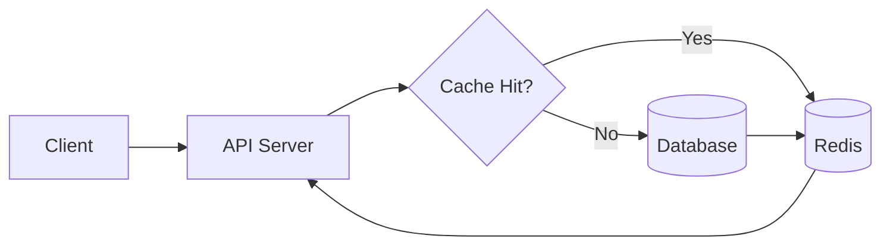

# How to Implement Response Caching with Redis in Python

Author: [nawazdhandala](https://www.github.com/nawazdhandala)

Tags: Python, Redis, Caching, Performance, FastAPI, Flask, API Optimization

Description: Learn how to implement response caching with Redis in Python to improve API performance and reduce database load. This guide covers cache decorators, cache invalidation strategies, and production patterns for FastAPI and Flask applications.

---

> Caching frequently accessed data in Redis dramatically improves response times and reduces load on your database. A well-implemented cache can turn 500ms database queries into 5ms cache hits. This guide shows you how to build robust caching in Python applications.

Response caching sits between your application and expensive operations. Cache the results of database queries, API calls, or complex computations to serve repeated requests instantly.

---

## Why Redis for Caching?

Redis is an ideal caching solution because of its speed and features:

- **In-memory storage** - Sub-millisecond response times
- **Rich data structures** - Strings, hashes, lists, sets, and sorted sets
- **TTL support** - Automatic expiration of cached data
- **Atomic operations** - Thread-safe operations out of the box
- **Persistence options** - Optional data durability



---

## Setup

Install Redis client for Python. We'll use `redis-py` which supports both synchronous and async operations.

```bash
pip install redis hiredis  # hiredis for faster parsing
```

For async support with FastAPI:

```bash
pip install redis[hiredis]  # Includes async support
```

---

## Basic Caching

Start with a simple synchronous caching implementation using Redis strings.

```python
# cache/basic.py
# Basic Redis caching utilities
import redis
import json
import pickle
from typing import Any, Optional, Callable
from functools import wraps
import logging

logger = logging.getLogger(__name__)

class RedisCache:
    """Simple Redis cache with JSON serialization"""

    def __init__(self, redis_url: str = "redis://localhost:6379", prefix: str = "cache:"):
        self.redis = redis.from_url(redis_url, decode_responses=True)
        self.prefix = prefix

    def _make_key(self, key: str) -> str:
        """Generate a prefixed cache key"""
        return f"{self.prefix}{key}"

    def get(self, key: str) -> Optional[Any]:
        """Get a value from cache"""
        try:
            data = self.redis.get(self._make_key(key))
            if data is None:
                return None
            return json.loads(data)
        except Exception as e:
            logger.warning(f"Cache get error for {key}: {e}")
            return None

    def set(self, key: str, value: Any, ttl: int = 300) -> bool:
        """Set a value in cache with TTL in seconds"""
        try:
            data = json.dumps(value)
            self.redis.setex(self._make_key(key), ttl, data)
            return True
        except Exception as e:
            logger.warning(f"Cache set error for {key}: {e}")
            return False

    def delete(self, key: str) -> bool:
        """Delete a key from cache"""
        try:
            self.redis.delete(self._make_key(key))
            return True
        except Exception as e:
            logger.warning(f"Cache delete error for {key}: {e}")
            return False

    def exists(self, key: str) -> bool:
        """Check if a key exists in cache"""
        return bool(self.redis.exists(self._make_key(key)))

    def clear_prefix(self, pattern: str) -> int:
        """Delete all keys matching a pattern"""
        keys = self.redis.keys(f"{self.prefix}{pattern}*")
        if keys:
            return self.redis.delete(*keys)
        return 0

# Usage example
cache = RedisCache()

# Store a user profile
user_data = {"id": 123, "name": "Alice", "email": "alice@example.com"}
cache.set("user:123", user_data, ttl=600)  # Cache for 10 minutes

# Retrieve later
cached_user = cache.get("user:123")
if cached_user:
    print(f"Cache hit: {cached_user['name']}")
else:
    # Fetch from database
    pass
```

---

## Cache Decorator

Create a decorator that automatically caches function results. This is the cleanest way to add caching to existing code.

```python
# cache/decorator.py
# Decorator for automatic function result caching
import redis
import json
import hashlib
from typing import Callable, Optional
from functools import wraps

class CacheDecorator:
    """Decorator class for caching function results"""

    def __init__(self, redis_url: str = "redis://localhost:6379"):
        self.redis = redis.from_url(redis_url, decode_responses=True)

    def _generate_cache_key(self, func: Callable, args: tuple, kwargs: dict) -> str:
        """Generate a unique cache key from function name and arguments"""
        # Combine function name with serialized arguments
        key_data = {
            'func': f"{func.__module__}.{func.__qualname__}",
            'args': args,
            'kwargs': kwargs
        }
        key_string = json.dumps(key_data, sort_keys=True, default=str)
        # Hash for a shorter key
        key_hash = hashlib.md5(key_string.encode()).hexdigest()
        return f"fn:{func.__name__}:{key_hash}"

    def cached(self, ttl: int = 300, key_prefix: str = None):
        """Decorator that caches function results"""
        def decorator(func: Callable):
            @wraps(func)
            def wrapper(*args, **kwargs):
                # Generate cache key
                if key_prefix:
                    cache_key = f"{key_prefix}:{self._generate_cache_key(func, args, kwargs)}"
                else:
                    cache_key = self._generate_cache_key(func, args, kwargs)

                # Try to get from cache
                cached_result = self.redis.get(cache_key)
                if cached_result is not None:
                    return json.loads(cached_result)

                # Execute function and cache result
                result = func(*args, **kwargs)
                self.redis.setex(cache_key, ttl, json.dumps(result, default=str))
                return result

            # Add cache control methods to the wrapper
            wrapper.cache_clear = lambda: self.redis.delete(
                *self.redis.keys(f"fn:{func.__name__}:*")
            )
            return wrapper
        return decorator

# Create a global cache decorator instance
cache_decorator = CacheDecorator()
cached = cache_decorator.cached

# Usage with the decorator
@cached(ttl=600)
def get_user_profile(user_id: int) -> dict:
    """Fetch user profile from database (cached)"""
    # Expensive database query
    return db.query(User).filter(User.id == user_id).first().to_dict()

@cached(ttl=3600, key_prefix="products")
def get_product_catalog(category: str) -> list:
    """Get products in a category (cached for 1 hour)"""
    return db.query(Product).filter(Product.category == category).all()

# Clear cache for a specific function
get_user_profile.cache_clear()
```

---

## Async Caching for FastAPI

FastAPI uses async functions, so we need an async-compatible cache implementation.

```python
# cache/async_cache.py
# Async Redis cache for FastAPI applications
import redis.asyncio as redis
import json
from typing import Any, Optional, Callable
from functools import wraps
import hashlib

class AsyncRedisCache:
    """Async Redis cache for FastAPI and other async frameworks"""

    def __init__(self, redis_url: str = "redis://localhost:6379"):
        self.redis_url = redis_url
        self._redis: Optional[redis.Redis] = None

    async def connect(self):
        """Initialize Redis connection"""
        if self._redis is None:
            self._redis = redis.from_url(self.redis_url, decode_responses=True)

    async def disconnect(self):
        """Close Redis connection"""
        if self._redis:
            await self._redis.close()

    async def get(self, key: str) -> Optional[Any]:
        """Get value from cache"""
        data = await self._redis.get(key)
        if data is None:
            return None
        return json.loads(data)

    async def set(self, key: str, value: Any, ttl: int = 300):
        """Set value in cache with TTL"""
        await self._redis.setex(key, ttl, json.dumps(value, default=str))

    async def delete(self, key: str):
        """Delete key from cache"""
        await self._redis.delete(key)

    async def get_or_set(
        self,
        key: str,
        factory: Callable,
        ttl: int = 300
    ) -> Any:
        """Get from cache or compute and cache the result"""
        cached = await self.get(key)
        if cached is not None:
            return cached

        # Compute the value
        if asyncio.iscoroutinefunction(factory):
            result = await factory()
        else:
            result = factory()

        await self.set(key, result, ttl)
        return result

# Async cache decorator
def async_cached(cache: AsyncRedisCache, ttl: int = 300, key_builder: Callable = None):
    """Decorator for caching async function results"""
    def decorator(func: Callable):
        @wraps(func)
        async def wrapper(*args, **kwargs):
            # Build cache key
            if key_builder:
                cache_key = key_builder(*args, **kwargs)
            else:
                key_parts = [func.__name__] + [str(a) for a in args]
                key_parts += [f"{k}={v}" for k, v in sorted(kwargs.items())]
                cache_key = ":".join(key_parts)

            # Try cache first
            cached = await cache.get(cache_key)
            if cached is not None:
                return cached

            # Execute and cache
            result = await func(*args, **kwargs)
            await cache.set(cache_key, result, ttl)
            return result

        return wrapper
    return decorator

# FastAPI integration example
from fastapi import FastAPI, Depends
from contextlib import asynccontextmanager

cache = AsyncRedisCache()

@asynccontextmanager
async def lifespan(app: FastAPI):
    """Manage cache connection lifecycle"""
    await cache.connect()
    yield
    await cache.disconnect()

app = FastAPI(lifespan=lifespan)

def get_cache() -> AsyncRedisCache:
    """Dependency that provides the cache"""
    return cache

@app.get("/users/{user_id}")
@async_cached(cache, ttl=300, key_builder=lambda user_id: f"user:{user_id}")
async def get_user(user_id: int):
    """Get user profile (cached for 5 minutes)"""
    # Fetch from database
    user = await db.get_user(user_id)
    return user.to_dict()

@app.get("/products")
async def get_products(
    category: str,
    cache: AsyncRedisCache = Depends(get_cache)
):
    """Get products with manual cache control"""
    cache_key = f"products:category:{category}"

    # Try cache
    cached = await cache.get(cache_key)
    if cached:
        return {"products": cached, "cached": True}

    # Fetch and cache
    products = await db.get_products_by_category(category)
    await cache.set(cache_key, products, ttl=1800)
    return {"products": products, "cached": False}
```

---

## Cache Invalidation

Cache invalidation is famously difficult. Here are several strategies for keeping cache in sync with your data.

### Time-Based Expiration

The simplest approach. Set a TTL and let Redis expire the data automatically.

```python
# cache/invalidation.py
# Cache invalidation strategies

# Strategy 1: Time-based expiration (already built into set with TTL)
cache.set("user:123", user_data, ttl=300)  # Expires in 5 minutes
```

### Write-Through Cache

Update cache whenever you update the database. Keeps cache always in sync.

```python
# Strategy 2: Write-through cache
class UserRepository:
    """Repository with write-through caching"""

    def __init__(self, db, cache: AsyncRedisCache):
        self.db = db
        self.cache = cache

    async def get_user(self, user_id: int) -> dict:
        """Get user with cache"""
        cache_key = f"user:{user_id}"
        cached = await self.cache.get(cache_key)
        if cached:
            return cached

        user = await self.db.get_user(user_id)
        if user:
            await self.cache.set(cache_key, user.to_dict(), ttl=3600)
        return user.to_dict() if user else None

    async def update_user(self, user_id: int, data: dict) -> dict:
        """Update user and cache"""
        # Update database
        user = await self.db.update_user(user_id, data)

        # Update cache immediately
        cache_key = f"user:{user_id}"
        await self.cache.set(cache_key, user.to_dict(), ttl=3600)

        return user.to_dict()

    async def delete_user(self, user_id: int):
        """Delete user and invalidate cache"""
        await self.db.delete_user(user_id)
        await self.cache.delete(f"user:{user_id}")
```

### Tag-Based Invalidation

Group related cache entries with tags for batch invalidation.

```python
# Strategy 3: Tag-based invalidation
class TaggedCache:
    """Cache with tag support for grouped invalidation"""

    def __init__(self, redis_client):
        self.redis = redis_client

    async def set_with_tags(self, key: str, value: Any, tags: list, ttl: int = 300):
        """Set a value with associated tags"""
        # Store the value
        await self.redis.setex(key, ttl, json.dumps(value))

        # Add key to each tag's set
        for tag in tags:
            await self.redis.sadd(f"tag:{tag}", key)
            await self.redis.expire(f"tag:{tag}", ttl + 60)  # Tag lives slightly longer

    async def invalidate_by_tag(self, tag: str):
        """Delete all cache entries with a specific tag"""
        tag_key = f"tag:{tag}"
        keys = await self.redis.smembers(tag_key)
        if keys:
            await self.redis.delete(*keys)
        await self.redis.delete(tag_key)

# Usage example
tagged_cache = TaggedCache(redis_client)

# Cache product with multiple tags
await tagged_cache.set_with_tags(
    "product:123",
    product_data,
    tags=["products", "category:electronics", "brand:acme"],
    ttl=3600
)

# Later: invalidate all electronics products
await tagged_cache.invalidate_by_tag("category:electronics")
```

---

## Cache Patterns

### Cache-Aside (Lazy Loading)

The most common pattern. Check cache first, load from source on miss.

```python
# patterns/cache_aside.py
# Cache-aside pattern implementation
async def get_data_cache_aside(cache, db, key: str, fetch_func, ttl: int = 300):
    """
    Cache-aside pattern:
    1. Check cache
    2. On miss, fetch from source
    3. Store in cache
    4. Return result
    """
    # Step 1: Check cache
    cached = await cache.get(key)
    if cached is not None:
        return cached

    # Step 2: Fetch from source
    data = await fetch_func()

    # Step 3: Store in cache
    if data is not None:
        await cache.set(key, data, ttl)

    # Step 4: Return
    return data
```

### Read-Through Cache

The cache itself handles loading data from the source.

```python
# patterns/read_through.py
# Read-through cache implementation
class ReadThroughCache:
    """Cache that automatically loads from source on miss"""

    def __init__(self, redis_client, loader: Callable):
        self.redis = redis_client
        self.loader = loader  # Function to load data from source

    async def get(self, key: str, ttl: int = 300) -> Any:
        """Get from cache, automatically loading on miss"""
        cached = await self.redis.get(key)
        if cached is not None:
            return json.loads(cached)

        # Load from source
        data = await self.loader(key)
        if data is not None:
            await self.redis.setex(key, ttl, json.dumps(data))

        return data

# Usage
async def load_user_from_db(user_id: str) -> dict:
    """Loader function for users"""
    user = await db.get_user(int(user_id.split(":")[1]))
    return user.to_dict() if user else None

user_cache = ReadThroughCache(redis_client, load_user_from_db)
user = await user_cache.get("user:123")  # Automatically loads from DB on miss
```

### Cache Stampede Prevention

Prevent multiple requests from hitting the database simultaneously when cache expires.

```python
# patterns/stampede_prevention.py
# Prevent cache stampede with locking
import asyncio

class StampedeProtectedCache:
    """Cache with stampede prevention using distributed locks"""

    def __init__(self, redis_client):
        self.redis = redis_client
        self.lock_timeout = 5  # Lock expires after 5 seconds

    async def get_or_compute(
        self,
        key: str,
        compute_func: Callable,
        ttl: int = 300
    ) -> Any:
        """Get from cache or compute with stampede protection"""
        # Try cache first
        cached = await self.redis.get(key)
        if cached is not None:
            return json.loads(cached)

        # Try to acquire lock
        lock_key = f"lock:{key}"
        lock_acquired = await self.redis.set(
            lock_key,
            "1",
            nx=True,  # Only set if not exists
            ex=self.lock_timeout
        )

        if lock_acquired:
            try:
                # We got the lock, compute the value
                result = await compute_func()
                await self.redis.setex(key, ttl, json.dumps(result))
                return result
            finally:
                # Release lock
                await self.redis.delete(lock_key)
        else:
            # Another process is computing, wait and retry
            for _ in range(10):  # Retry up to 10 times
                await asyncio.sleep(0.1)  # Wait 100ms
                cached = await self.redis.get(key)
                if cached is not None:
                    return json.loads(cached)

            # Fallback: compute anyway if still no result
            return await compute_func()
```

---

## Monitoring Cache Performance

Track cache hit rates and latency to optimize your caching strategy.

```python
# monitoring/cache_metrics.py
# Cache wrapper with metrics collection
import time
from dataclasses import dataclass, field

@dataclass
class CacheMetrics:
    """Track cache performance metrics"""
    hits: int = 0
    misses: int = 0
    errors: int = 0
    total_latency_ms: float = 0
    operations: int = 0

    @property
    def hit_rate(self) -> float:
        total = self.hits + self.misses
        return self.hits / total if total > 0 else 0

    @property
    def avg_latency_ms(self) -> float:
        return self.total_latency_ms / self.operations if self.operations > 0 else 0

class MonitoredCache:
    """Cache wrapper that collects performance metrics"""

    def __init__(self, cache, metrics: CacheMetrics = None):
        self.cache = cache
        self.metrics = metrics or CacheMetrics()

    async def get(self, key: str) -> Any:
        start = time.perf_counter()
        try:
            result = await self.cache.get(key)
            if result is not None:
                self.metrics.hits += 1
            else:
                self.metrics.misses += 1
            return result
        except Exception as e:
            self.metrics.errors += 1
            raise
        finally:
            elapsed = (time.perf_counter() - start) * 1000
            self.metrics.total_latency_ms += elapsed
            self.metrics.operations += 1

    def get_stats(self) -> dict:
        """Return current metrics"""
        return {
            "hits": self.metrics.hits,
            "misses": self.metrics.misses,
            "hit_rate": f"{self.metrics.hit_rate:.2%}",
            "avg_latency_ms": f"{self.metrics.avg_latency_ms:.2f}",
            "errors": self.metrics.errors
        }

# Expose metrics endpoint
@app.get("/cache/stats")
async def cache_stats():
    return monitored_cache.get_stats()
```

---

## Best Practices

1. **Set appropriate TTLs** - Balance freshness against database load
2. **Use consistent key naming** - Follow a pattern like `entity:id:field`
3. **Handle cache failures gracefully** - Fall back to database on Redis errors
4. **Monitor hit rates** - Low hit rates indicate caching the wrong data
5. **Avoid caching everything** - Only cache data that's read more than written
6. **Consider memory limits** - Set Redis maxmemory and eviction policies
7. **Use connection pooling** - Redis clients handle this automatically

---

## Conclusion

Response caching with Redis transforms application performance. Key takeaways:

- **Simple API** - Get, set, and delete with TTL support
- **Decorators** - Add caching to existing functions cleanly
- **Invalidation strategies** - Time-based, write-through, or tag-based
- **Stampede prevention** - Protect against cache miss storms
- **Metrics** - Track hit rates to optimize your caching

Start with time-based expiration and evolve to more sophisticated invalidation as your needs grow.

---

*Need to monitor your Redis cache? [OneUptime](https://oneuptime.com) provides real-time monitoring for Redis instances and cache performance metrics.*
