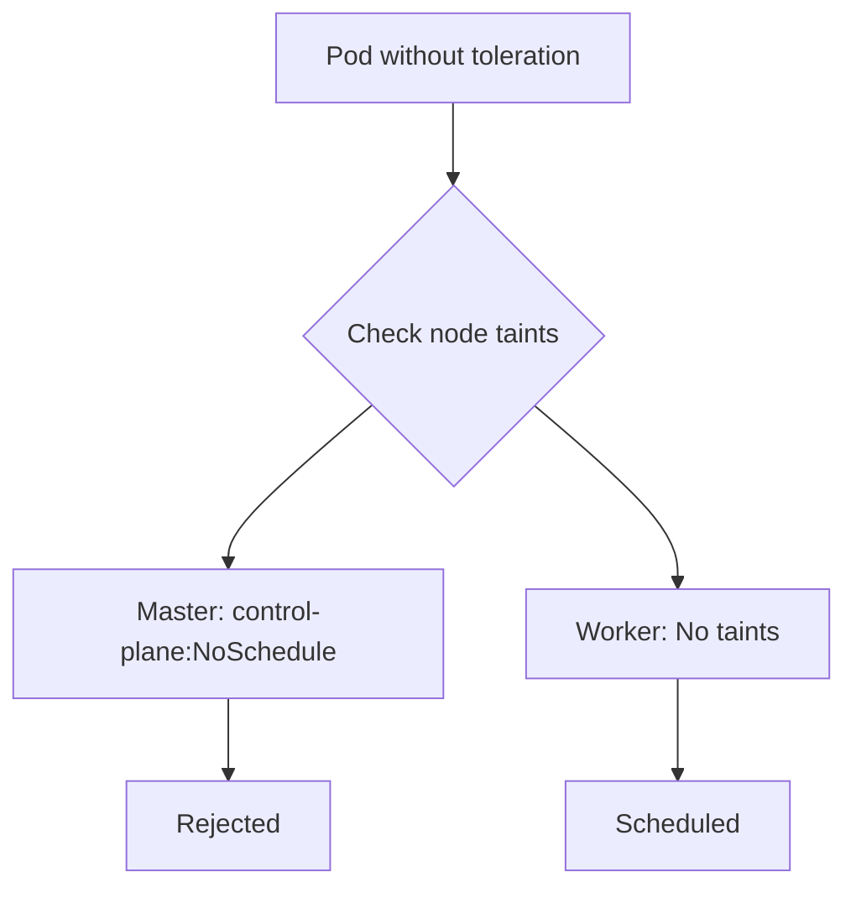

# How to Schedule Pods on Master Nodes in Kubernetes

Author: [nawazdhandala](https://www.github.com/nawazdhandala)

Tags: Kubernetes, Scheduling, Taints, Tolerations, Control Plane

Description: Learn how to schedule pods on Kubernetes master/control plane nodes by removing taints or adding tolerations. Includes use cases and warnings about production implications.

---

By default, Kubernetes prevents workloads from running on master nodes (control plane nodes). This protects critical components like etcd, kube-apiserver, and kube-scheduler from resource contention. However, in small clusters or development environments, you might want to use master nodes for application workloads. This guide shows you how.

## Why Master Nodes Are Not Schedulable

Master nodes have taints that repel pods without matching tolerations:

```bash
# Check taints on master nodes
kubectl describe node master-node-1 | grep Taints

# Common taints on master nodes:
# node-role.kubernetes.io/control-plane:NoSchedule
# node-role.kubernetes.io/master:NoSchedule  (older versions)
```

The `NoSchedule` effect means pods without a matching toleration will not be scheduled on these nodes.



## Method 1: Remove Taints from Master Nodes

The simplest approach is removing the taint entirely:

```bash
# Remove control-plane taint (Kubernetes 1.24+)
kubectl taint nodes master-node-1 node-role.kubernetes.io/control-plane:NoSchedule-

# Remove master taint (older versions)
kubectl taint nodes master-node-1 node-role.kubernetes.io/master:NoSchedule-

# Remove from all master nodes
kubectl taint nodes --selector=node-role.kubernetes.io/control-plane node-role.kubernetes.io/control-plane:NoSchedule-
```

The trailing `-` removes the taint. Verify:

```bash
kubectl describe node master-node-1 | grep Taints
# Taints: <none>
```

Now all pods can schedule on master nodes.

## Method 2: Add Tolerations to Specific Pods

If you want only specific pods on master nodes, add tolerations instead:

```yaml
# deployment.yaml
apiVersion: apps/v1
kind: Deployment
metadata:
  name: monitoring-agent
spec:
  replicas: 1
  selector:
    matchLabels:
      app: monitoring
  template:
    metadata:
      labels:
        app: monitoring
    spec:
      tolerations:
      # Tolerate control-plane taint
      - key: node-role.kubernetes.io/control-plane
        operator: Exists
        effect: NoSchedule
      # Tolerate master taint (for older clusters)
      - key: node-role.kubernetes.io/master
        operator: Exists
        effect: NoSchedule
      containers:
      - name: agent
        image: monitoring-agent:1.0
```

This pod can run on master nodes, but regular pods without tolerations cannot.

## Method 3: Use Node Affinity to Target Master Nodes

Combine tolerations with node affinity to ensure pods run on master nodes:

```yaml
apiVersion: apps/v1
kind: Deployment
metadata:
  name: control-plane-tool
spec:
  replicas: 1
  selector:
    matchLabels:
      app: cp-tool
  template:
    metadata:
      labels:
        app: cp-tool
    spec:
      tolerations:
      - key: node-role.kubernetes.io/control-plane
        operator: Exists
        effect: NoSchedule
      affinity:
        nodeAffinity:
          requiredDuringSchedulingIgnoredDuringExecution:
            nodeSelectorTerms:
            - matchExpressions:
              # Schedule only on control-plane nodes
              - key: node-role.kubernetes.io/control-plane
                operator: Exists
      containers:
      - name: tool
        image: control-plane-tool:1.0
```

Or use nodeSelector for simpler targeting:

```yaml
spec:
  nodeSelector:
    node-role.kubernetes.io/control-plane: ""
  tolerations:
  - key: node-role.kubernetes.io/control-plane
    operator: Exists
    effect: NoSchedule
```

## DaemonSets on Master Nodes

DaemonSets often need to run on all nodes, including masters. Add tolerations to the DaemonSet:

```yaml
apiVersion: apps/v1
kind: DaemonSet
metadata:
  name: node-exporter
spec:
  selector:
    matchLabels:
      app: node-exporter
  template:
    metadata:
      labels:
        app: node-exporter
    spec:
      tolerations:
      # Run on all nodes including masters
      - operator: Exists  # Tolerate ALL taints
      containers:
      - name: exporter
        image: prom/node-exporter:v1.7.0
        ports:
        - containerPort: 9100
```

Using `operator: Exists` without a `key` tolerates all taints, allowing the DaemonSet to run everywhere.

## Common Use Cases

### Single-Node Development Cluster

For minikube or single-node clusters:

```bash
# Remove taint from the only node
kubectl taint nodes minikube node-role.kubernetes.io/control-plane:NoSchedule-
```

### Small Production Cluster (3 nodes)

In a 3-node cluster where all nodes are control plane:

```bash
# Remove taints from all nodes
kubectl taint nodes --all node-role.kubernetes.io/control-plane:NoSchedule-
```

### Monitoring Agents

Deploy monitoring on all nodes:

```yaml
apiVersion: apps/v1
kind: DaemonSet
metadata:
  name: datadog-agent
spec:
  selector:
    matchLabels:
      app: datadog
  template:
    metadata:
      labels:
        app: datadog
    spec:
      tolerations:
      - key: node-role.kubernetes.io/control-plane
        operator: Exists
        effect: NoSchedule
      - key: node.kubernetes.io/not-ready
        operator: Exists
        effect: NoSchedule
      containers:
      - name: agent
        image: datadog/agent:7
```

## Re-Adding Taints

To restore the default behavior:

```bash
# Add taint back to master nodes
kubectl taint nodes master-node-1 node-role.kubernetes.io/control-plane:NoSchedule

# Or for all control plane nodes
kubectl taint nodes --selector=node-role.kubernetes.io/control-plane node-role.kubernetes.io/control-plane:NoSchedule
```

## Warnings and Best Practices

### Production Considerations

Running workloads on control plane nodes can cause:

1. **Resource contention** - Your pods compete with etcd, API server, controller-manager
2. **Stability risks** - A memory-hungry pod can OOM kill etcd
3. **Security concerns** - Pods on control plane nodes have closer access to cluster secrets

```yaml
# If you must run on control plane, set strict resource limits
resources:
  requests:
    memory: 128Mi
    cpu: 100m
  limits:
    memory: 256Mi
    cpu: 200m
```

### Use Priority Classes

Ensure control plane components always have priority:

```yaml
# System-critical pods get highest priority
apiVersion: scheduling.k8s.io/v1
kind: PriorityClass
metadata:
  name: system-critical
value: 1000000000
globalDefault: false
description: "Critical system pods"
---
# Your workloads get lower priority
apiVersion: scheduling.k8s.io/v1
kind: PriorityClass
metadata:
  name: low-priority
value: 100
globalDefault: true
description: "Default low priority for workloads"
```

### Resource Reservations

Configure kubelet to reserve resources for system components:

```yaml
# kubelet config
apiVersion: kubelet.config.k8s.io/v1beta1
kind: KubeletConfiguration
kubeReserved:
  cpu: "500m"
  memory: "1Gi"
systemReserved:
  cpu: "500m"
  memory: "1Gi"
evictionHard:
  memory.available: "500Mi"
```

## Checking Node Schedulability

Verify which nodes accept pods:

```bash
# List nodes with taints
kubectl get nodes -o custom-columns=NAME:.metadata.name,TAINTS:.spec.taints

# Check if a specific pod can schedule
kubectl auth can-i create pods --as=system:serviceaccount:default:default

# See where a pod would schedule (dry run)
kubectl run test --image=nginx --dry-run=server -o yaml
```

## Summary

Master nodes are tainted by default to protect control plane components. You can allow pods on master nodes by either removing the taint (makes all pods schedulable) or adding tolerations to specific pods. For DaemonSets that need to run everywhere, add tolerations for control plane taints. In production, be cautious about resource contention and consider using priority classes to ensure control plane pods always get scheduled first. For small development clusters, removing the taint entirely is often the simplest solution.
