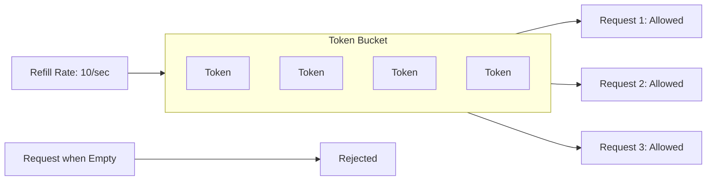

# How to Implement Token Bucket Rate Limiting in Python

Author: [nawazdhandala](https://www.github.com/nawazdhandala)

Tags: Python, Rate Limiting, Token Bucket, API, FastAPI, Redis, Performance, Scalability

Description: Learn how to implement the token bucket algorithm for rate limiting in Python. This guide covers in-memory and Redis-backed implementations, with practical FastAPI integration examples.

---

> Rate limiting protects your API from abuse and ensures fair resource allocation. The token bucket algorithm is one of the most popular approaches because it allows controlled bursting while maintaining a steady average rate. This guide shows you how to implement it from scratch.

Every production API needs rate limiting. Without it, a single client can monopolize your resources, intentional or not. The token bucket algorithm strikes a balance between strict rate enforcement and allowing legitimate traffic bursts.

---

## How Token Bucket Works

Imagine a bucket that holds tokens. Tokens are added to the bucket at a steady rate (the refill rate). When a request arrives, it must consume a token to proceed. If no tokens are available, the request is rejected or delayed.



Key properties:

| Property | Description |
|----------|-------------|
| **Bucket Size** | Maximum tokens (burst capacity) |
| **Refill Rate** | Tokens added per second |
| **Burst** | Bucket size allows temporary burst above average rate |
| **Smoothing** | Steady refill prevents sustained high rates |

---

## Basic In-Memory Implementation

Let us start with a simple single-process token bucket that uses monotonic time for accuracy.

```python
# token_bucket.py
# In-memory token bucket rate limiter
import time
from dataclasses import dataclass
from typing import Tuple

@dataclass
class TokenBucket:
    """
    Token bucket rate limiter.

    Args:
        capacity: Maximum number of tokens (burst size)
        refill_rate: Tokens added per second
    """
    capacity: float
    refill_rate: float
    tokens: float = None
    last_refill: float = None

    def __post_init__(self):
        # Start with a full bucket
        if self.tokens is None:
            self.tokens = self.capacity
        if self.last_refill is None:
            self.last_refill = time.monotonic()

    def _refill(self) -> None:
        """Add tokens based on elapsed time since last refill"""
        now = time.monotonic()
        elapsed = now - self.last_refill

        # Calculate tokens to add based on time elapsed
        tokens_to_add = elapsed * self.refill_rate

        # Add tokens but do not exceed capacity
        self.tokens = min(self.capacity, self.tokens + tokens_to_add)
        self.last_refill = now

    def consume(self, tokens: float = 1.0) -> Tuple[bool, float]:
        """
        Try to consume tokens from the bucket.

        Args:
            tokens: Number of tokens to consume

        Returns:
            Tuple of (allowed, wait_time)
            - allowed: True if request is allowed
            - wait_time: Seconds to wait if not allowed (0 if allowed)
        """
        self._refill()

        if self.tokens >= tokens:
            # Enough tokens available - consume them
            self.tokens -= tokens
            return True, 0.0
        else:
            # Not enough tokens - calculate wait time
            tokens_needed = tokens - self.tokens
            wait_time = tokens_needed / self.refill_rate
            return False, wait_time

    def get_state(self) -> dict:
        """Get current bucket state for debugging"""
        self._refill()
        return {
            "tokens": self.tokens,
            "capacity": self.capacity,
            "refill_rate": self.refill_rate
        }

# Example usage
def demo_token_bucket():
    # Allow 10 requests per second with burst of 20
    bucket = TokenBucket(capacity=20, refill_rate=10)

    for i in range(25):
        allowed, wait_time = bucket.consume()
        if allowed:
            print(f"Request {i+1}: Allowed")
        else:
            print(f"Request {i+1}: Denied (wait {wait_time:.2f}s)")

    # Wait a bit and try again
    time.sleep(0.5)  # 5 tokens should refill
    allowed, _ = bucket.consume()
    print(f"After 0.5s wait: {'Allowed' if allowed else 'Denied'}")
```

---

## Thread-Safe Implementation

For multi-threaded applications, we need proper synchronization:

```python
# thread_safe_bucket.py
# Thread-safe token bucket with lock protection
import threading
import time
from typing import Dict, Tuple

class ThreadSafeTokenBucket:
    """
    Thread-safe token bucket for multi-threaded applications.
    """

    def __init__(self, capacity: float, refill_rate: float):
        self.capacity = capacity
        self.refill_rate = refill_rate
        self.tokens = capacity
        self.last_refill = time.monotonic()
        self.lock = threading.Lock()

    def consume(self, tokens: float = 1.0) -> Tuple[bool, float]:
        """Thread-safe token consumption"""
        with self.lock:
            self._refill_unlocked()

            if self.tokens >= tokens:
                self.tokens -= tokens
                return True, 0.0
            else:
                tokens_needed = tokens - self.tokens
                wait_time = tokens_needed / self.refill_rate
                return False, wait_time

    def _refill_unlocked(self) -> None:
        """Refill tokens - must be called while holding lock"""
        now = time.monotonic()
        elapsed = now - self.last_refill
        tokens_to_add = elapsed * self.refill_rate
        self.tokens = min(self.capacity, self.tokens + tokens_to_add)
        self.last_refill = now

class RateLimiter:
    """
    Rate limiter that manages token buckets per client.
    """

    def __init__(
        self,
        capacity: float = 100,
        refill_rate: float = 10,
        cleanup_interval: int = 300
    ):
        self.capacity = capacity
        self.refill_rate = refill_rate
        self.cleanup_interval = cleanup_interval

        self.buckets: Dict[str, ThreadSafeTokenBucket] = {}
        self.bucket_lock = threading.Lock()
        self.last_cleanup = time.monotonic()

    def is_allowed(self, client_id: str, tokens: float = 1.0) -> Tuple[bool, float]:
        """
        Check if a request from client_id is allowed.

        Args:
            client_id: Unique identifier for the client (IP, API key, etc.)
            tokens: Number of tokens this request consumes

        Returns:
            Tuple of (allowed, wait_time)
        """
        bucket = self._get_bucket(client_id)
        return bucket.consume(tokens)

    def _get_bucket(self, client_id: str) -> ThreadSafeTokenBucket:
        """Get or create a bucket for a client"""
        with self.bucket_lock:
            self._maybe_cleanup()

            if client_id not in self.buckets:
                self.buckets[client_id] = ThreadSafeTokenBucket(
                    capacity=self.capacity,
                    refill_rate=self.refill_rate
                )

            return self.buckets[client_id]

    def _maybe_cleanup(self) -> None:
        """Periodically remove inactive buckets to prevent memory growth"""
        now = time.monotonic()
        if now - self.last_cleanup > self.cleanup_interval:
            # Remove buckets that have been full for a while (inactive clients)
            inactive_threshold = self.capacity * 0.99
            keys_to_remove = []

            for client_id, bucket in self.buckets.items():
                if bucket.tokens >= inactive_threshold:
                    keys_to_remove.append(client_id)

            for key in keys_to_remove:
                del self.buckets[key]

            self.last_cleanup = now
```

---

## Async Implementation for FastAPI

For async applications like FastAPI, we need an async-compatible implementation:

```python
# async_token_bucket.py
# Async token bucket for use with FastAPI and asyncio
import asyncio
import time
from typing import Dict, Tuple, Optional
from dataclasses import dataclass

@dataclass
class AsyncTokenBucket:
    """
    Async-compatible token bucket.
    Uses asyncio.Lock for coroutine-safe access.
    """
    capacity: float
    refill_rate: float
    tokens: float = None
    last_refill: float = None
    lock: asyncio.Lock = None

    def __post_init__(self):
        if self.tokens is None:
            self.tokens = self.capacity
        if self.last_refill is None:
            self.last_refill = time.monotonic()
        if self.lock is None:
            self.lock = asyncio.Lock()

    async def consume(self, tokens: float = 1.0) -> Tuple[bool, float]:
        """Async token consumption"""
        async with self.lock:
            self._refill()

            if self.tokens >= tokens:
                self.tokens -= tokens
                return True, 0.0
            else:
                tokens_needed = tokens - self.tokens
                wait_time = tokens_needed / self.refill_rate
                return False, wait_time

    async def wait_and_consume(
        self,
        tokens: float = 1.0,
        max_wait: float = 10.0
    ) -> bool:
        """
        Wait for tokens to become available, then consume.
        Returns False if wait would exceed max_wait.
        """
        allowed, wait_time = await self.consume(tokens)

        if allowed:
            return True

        if wait_time > max_wait:
            return False

        # Wait for tokens to refill
        await asyncio.sleep(wait_time)

        # Try again
        allowed, _ = await self.consume(tokens)
        return allowed

    def _refill(self) -> None:
        """Refill tokens based on elapsed time"""
        now = time.monotonic()
        elapsed = now - self.last_refill
        tokens_to_add = elapsed * self.refill_rate
        self.tokens = min(self.capacity, self.tokens + tokens_to_add)
        self.last_refill = now

class AsyncRateLimiter:
    """
    Async rate limiter for FastAPI applications.
    """

    def __init__(
        self,
        capacity: float = 100,
        refill_rate: float = 10
    ):
        self.capacity = capacity
        self.refill_rate = refill_rate
        self.buckets: Dict[str, AsyncTokenBucket] = {}
        self.lock = asyncio.Lock()

    async def is_allowed(
        self,
        client_id: str,
        tokens: float = 1.0
    ) -> Tuple[bool, float]:
        """Check if request is allowed"""
        bucket = await self._get_bucket(client_id)
        return await bucket.consume(tokens)

    async def wait_for_token(
        self,
        client_id: str,
        tokens: float = 1.0,
        max_wait: float = 10.0
    ) -> bool:
        """Wait for a token to become available"""
        bucket = await self._get_bucket(client_id)
        return await bucket.wait_and_consume(tokens, max_wait)

    async def _get_bucket(self, client_id: str) -> AsyncTokenBucket:
        """Get or create bucket for client"""
        async with self.lock:
            if client_id not in self.buckets:
                self.buckets[client_id] = AsyncTokenBucket(
                    capacity=self.capacity,
                    refill_rate=self.refill_rate,
                    lock=asyncio.Lock()
                )
            return self.buckets[client_id]

    def get_stats(self) -> Dict:
        """Get limiter statistics"""
        return {
            "active_buckets": len(self.buckets),
            "capacity": self.capacity,
            "refill_rate": self.refill_rate
        }
```

---

## FastAPI Integration

Here is a complete FastAPI application with token bucket rate limiting:

```python
# fastapi_rate_limit.py
# FastAPI application with token bucket rate limiting
from fastapi import FastAPI, Request, HTTPException, Depends
from fastapi.responses import JSONResponse
from contextlib import asynccontextmanager
from async_token_bucket import AsyncRateLimiter

# Create rate limiter instances for different tiers
default_limiter = AsyncRateLimiter(capacity=100, refill_rate=10)
premium_limiter = AsyncRateLimiter(capacity=1000, refill_rate=100)

app = FastAPI()

def get_client_id(request: Request) -> str:
    """
    Extract client identifier from request.
    Uses X-API-Key header or falls back to IP address.
    """
    # Prefer API key for authenticated clients
    api_key = request.headers.get("X-API-Key")
    if api_key:
        return f"key:{api_key}"

    # Fall back to IP address
    forwarded = request.headers.get("X-Forwarded-For")
    if forwarded:
        # Get the first IP in the chain
        ip = forwarded.split(",")[0].strip()
    else:
        ip = request.client.host

    return f"ip:{ip}"

def get_rate_limiter(request: Request) -> AsyncRateLimiter:
    """
    Select rate limiter based on client tier.
    Premium clients get higher limits.
    """
    api_key = request.headers.get("X-API-Key")

    if api_key and is_premium_key(api_key):
        return premium_limiter

    return default_limiter

def is_premium_key(api_key: str) -> bool:
    """Check if API key has premium tier"""
    # In production, check against database
    return api_key.startswith("premium_")

async def rate_limit_dependency(
    request: Request,
    limiter: AsyncRateLimiter = Depends(get_rate_limiter)
):
    """
    FastAPI dependency that enforces rate limiting.
    Raises 429 if rate limit exceeded.
    """
    client_id = get_client_id(request)
    allowed, wait_time = await limiter.is_allowed(client_id)

    if not allowed:
        raise HTTPException(
            status_code=429,
            detail={
                "error": "Rate limit exceeded",
                "retry_after": wait_time
            },
            headers={
                "Retry-After": str(int(wait_time) + 1),
                "X-RateLimit-Reset": str(int(wait_time))
            }
        )

# Apply rate limiting to all routes
@app.middleware("http")
async def rate_limit_middleware(request: Request, call_next):
    """
    Middleware alternative for global rate limiting.
    """
    # Skip rate limiting for health checks
    if request.url.path in ["/health", "/metrics"]:
        return await call_next(request)

    client_id = get_client_id(request)
    limiter = get_rate_limiter(request)

    allowed, wait_time = await limiter.is_allowed(client_id)

    if not allowed:
        return JSONResponse(
            status_code=429,
            content={
                "error": "Rate limit exceeded",
                "retry_after": wait_time
            },
            headers={
                "Retry-After": str(int(wait_time) + 1)
            }
        )

    # Add rate limit headers to response
    response = await call_next(request)

    # Get current bucket state for headers
    bucket = await limiter._get_bucket(client_id)
    response.headers["X-RateLimit-Limit"] = str(int(limiter.capacity))
    response.headers["X-RateLimit-Remaining"] = str(int(bucket.tokens))

    return response

@app.get("/api/data")
async def get_data():
    """Example endpoint with rate limiting from middleware"""
    return {"data": "Hello, World!"}

@app.get("/api/expensive")
async def expensive_operation(
    _: None = Depends(rate_limit_dependency)
):
    """
    Expensive endpoint with additional rate limit check.
    Consumes 10 tokens instead of 1.
    """
    # This uses the dependency for explicit control
    return {"result": "Expensive computation complete"}

@app.get("/health")
async def health():
    """Health check - not rate limited"""
    return {"status": "healthy"}

@app.get("/metrics")
async def metrics():
    """Rate limiter metrics"""
    return {
        "default": default_limiter.get_stats(),
        "premium": premium_limiter.get_stats()
    }
```

---

## Redis-Backed Implementation

For distributed systems where rate limits must be shared across multiple instances, use Redis:

```python
# redis_token_bucket.py
# Distributed token bucket using Redis
import redis.asyncio as redis
import time
from typing import Tuple, Optional

class RedisTokenBucket:
    """
    Distributed token bucket using Redis.
    Allows rate limiting across multiple application instances.
    """

    # Lua script for atomic token bucket operation
    # This ensures consistency even with concurrent access
    LUA_SCRIPT = """
    local key = KEYS[1]
    local capacity = tonumber(ARGV[1])
    local refill_rate = tonumber(ARGV[2])
    local requested = tonumber(ARGV[3])
    local now = tonumber(ARGV[4])
    local ttl = tonumber(ARGV[5])

    -- Get current state
    local bucket = redis.call('HMGET', key, 'tokens', 'last_refill')
    local tokens = tonumber(bucket[1])
    local last_refill = tonumber(bucket[2])

    -- Initialize if new bucket
    if tokens == nil then
        tokens = capacity
        last_refill = now
    end

    -- Calculate tokens to add based on elapsed time
    local elapsed = now - last_refill
    local tokens_to_add = elapsed * refill_rate
    tokens = math.min(capacity, tokens + tokens_to_add)

    -- Try to consume tokens
    local allowed = 0
    local wait_time = 0

    if tokens >= requested then
        tokens = tokens - requested
        allowed = 1
    else
        local tokens_needed = requested - tokens
        wait_time = tokens_needed / refill_rate
    end

    -- Save state
    redis.call('HMSET', key, 'tokens', tokens, 'last_refill', now)
    redis.call('EXPIRE', key, ttl)

    return {allowed, tostring(wait_time), tostring(tokens)}
    """

    def __init__(
        self,
        redis_url: str = "redis://localhost:6379",
        capacity: float = 100,
        refill_rate: float = 10,
        key_prefix: str = "ratelimit",
        bucket_ttl: int = 3600
    ):
        self.redis_url = redis_url
        self.capacity = capacity
        self.refill_rate = refill_rate
        self.key_prefix = key_prefix
        self.bucket_ttl = bucket_ttl

        self.client: redis.Redis = None
        self.script_sha: str = None

    async def connect(self):
        """Connect to Redis and load Lua script"""
        self.client = await redis.from_url(self.redis_url)

        # Load the Lua script
        self.script_sha = await self.client.script_load(self.LUA_SCRIPT)

    async def close(self):
        """Close Redis connection"""
        if self.client:
            await self.client.close()

    async def consume(
        self,
        client_id: str,
        tokens: float = 1.0
    ) -> Tuple[bool, float, float]:
        """
        Try to consume tokens for a client.

        Returns:
            Tuple of (allowed, wait_time, remaining_tokens)
        """
        key = f"{self.key_prefix}:{client_id}"
        now = time.time()

        result = await self.client.evalsha(
            self.script_sha,
            1,  # Number of keys
            key,
            self.capacity,
            self.refill_rate,
            tokens,
            now,
            self.bucket_ttl
        )

        allowed = bool(result[0])
        wait_time = float(result[1])
        remaining = float(result[2])

        return allowed, wait_time, remaining

    async def get_remaining(self, client_id: str) -> float:
        """Get remaining tokens for a client"""
        key = f"{self.key_prefix}:{client_id}"
        data = await self.client.hgetall(key)

        if not data:
            return self.capacity

        tokens = float(data.get(b'tokens', self.capacity))
        last_refill = float(data.get(b'last_refill', time.time()))

        # Calculate current tokens
        elapsed = time.time() - last_refill
        tokens_to_add = elapsed * self.refill_rate

        return min(self.capacity, tokens + tokens_to_add)

class RedisRateLimiter:
    """
    Distributed rate limiter using Redis token buckets.
    """

    def __init__(
        self,
        redis_url: str = "redis://localhost:6379",
        capacity: float = 100,
        refill_rate: float = 10
    ):
        self.bucket = RedisTokenBucket(
            redis_url=redis_url,
            capacity=capacity,
            refill_rate=refill_rate
        )

    async def connect(self):
        await self.bucket.connect()

    async def close(self):
        await self.bucket.close()

    async def is_allowed(
        self,
        client_id: str,
        tokens: float = 1.0
    ) -> Tuple[bool, float]:
        """Check if request is allowed"""
        allowed, wait_time, _ = await self.bucket.consume(client_id, tokens)
        return allowed, wait_time
```

---

## Variable Cost Rate Limiting

Some endpoints are more expensive than others. Here is how to charge different token costs:

```python
# variable_cost.py
# Rate limiting with variable token costs per endpoint
from fastapi import FastAPI, Request, Depends, HTTPException

app = FastAPI()

# Define token costs for different operations
OPERATION_COSTS = {
    "read": 1,
    "write": 5,
    "search": 10,
    "export": 50,
    "bulk_import": 100
}

async def rate_limit_with_cost(
    request: Request,
    operation: str
):
    """
    Rate limit based on operation cost.
    """
    client_id = get_client_id(request)
    cost = OPERATION_COSTS.get(operation, 1)

    allowed, wait_time = await rate_limiter.is_allowed(client_id, tokens=cost)

    if not allowed:
        raise HTTPException(
            status_code=429,
            detail={
                "error": "Rate limit exceeded",
                "operation_cost": cost,
                "retry_after": wait_time
            }
        )

@app.get("/items/{item_id}")
async def get_item(
    item_id: int,
    _: None = Depends(lambda r: rate_limit_with_cost(r, "read"))
):
    """Read operation - costs 1 token"""
    return {"item_id": item_id}

@app.post("/items")
async def create_item(
    _: None = Depends(lambda r: rate_limit_with_cost(r, "write"))
):
    """Write operation - costs 5 tokens"""
    return {"status": "created"}

@app.get("/search")
async def search(
    q: str,
    _: None = Depends(lambda r: rate_limit_with_cost(r, "search"))
):
    """Search operation - costs 10 tokens"""
    return {"results": []}

@app.post("/export")
async def export_data(
    _: None = Depends(lambda r: rate_limit_with_cost(r, "export"))
):
    """Export operation - costs 50 tokens"""
    return {"download_url": "..."}
```

---

## Best Practices

### 1. Always Include Rate Limit Headers

```python
# Inform clients about their rate limit status
response.headers["X-RateLimit-Limit"] = str(capacity)
response.headers["X-RateLimit-Remaining"] = str(remaining)
response.headers["X-RateLimit-Reset"] = str(reset_time)
response.headers["Retry-After"] = str(wait_time)
```

### 2. Use Appropriate Bucket Sizes

```python
# Small bucket = smooth traffic, no bursts
bucket = TokenBucket(capacity=10, refill_rate=10)  # 1 second of burst

# Large bucket = allows bursts, same average rate
bucket = TokenBucket(capacity=100, refill_rate=10)  # 10 seconds of burst
```

### 3. Monitor Rate Limit Rejections

```python
# Track rejections for alerting
@app.middleware("http")
async def track_rate_limits(request: Request, call_next):
    response = await call_next(request)

    if response.status_code == 429:
        metrics.increment("rate_limit.rejected", tags={
            "path": request.url.path,
            "client": get_client_id(request)
        })

    return response
```

---

## Conclusion

The token bucket algorithm provides flexible rate limiting that allows bursts while maintaining a consistent average rate. Start with an in-memory implementation for single-process applications, and move to Redis when you need distributed rate limiting. Remember to communicate limits clearly to your clients through response headers, and monitor rejection rates to tune your limits appropriately.

---

*Need to monitor your rate limiting effectiveness? [OneUptime](https://oneuptime.com) provides real-time dashboards for API rate limit metrics and alerts when rejection rates spike.*

**Related Reading:**
- [How to Reduce DB Load with Request Coalescing in Python](https://oneuptime.com/blog/post/2026-01-23-request-coalescing-python/view)
- [How to Implement Rate Limiting in FastAPI](https://oneuptime.com/blog/post/2025-01-06-fastapi-rate-limiting/view)
