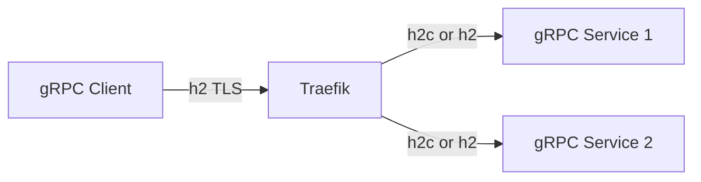
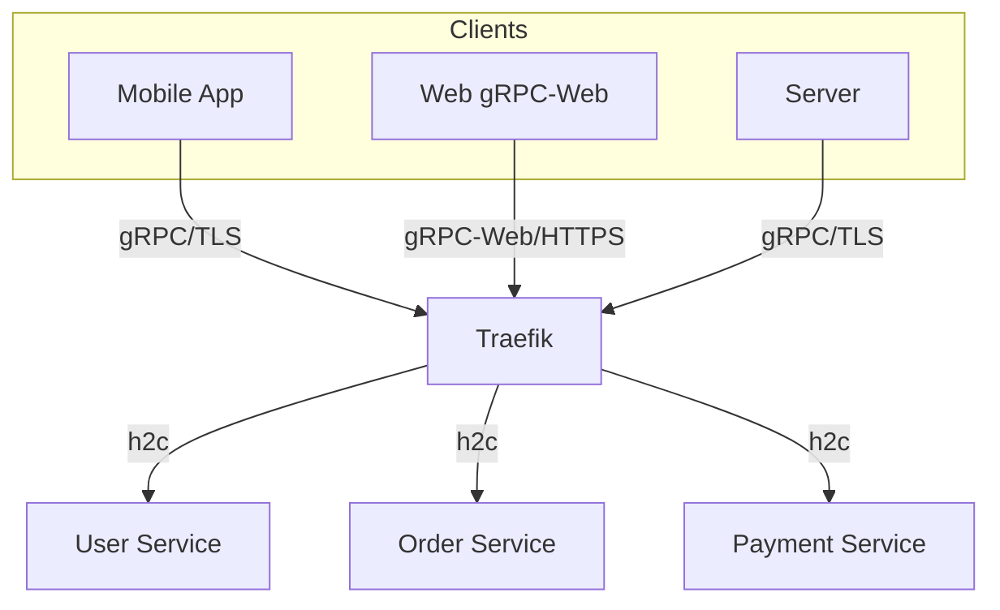

# How to Configure Traefik for gRPC

Author: [nawazdhandala](https://www.github.com/nawazdhandala)

Tags: Traefik, gRPC, Microservices, Load Balancing, HTTP/2

Description: Set up Traefik to route gRPC traffic with TLS termination, load balancing, health checks, and proper HTTP/2 configuration.

---

gRPC is a high-performance RPC framework that uses HTTP/2 for transport and Protocol Buffers for serialization. Routing gRPC through Traefik requires special consideration because gRPC relies on HTTP/2 features like multiplexing, header compression, and bidirectional streaming.

This guide covers configuring Traefik for gRPC services, including TLS requirements, load balancing strategies, and debugging common issues.

## gRPC and HTTP/2 Requirements

gRPC has specific requirements for proxying:

- **HTTP/2**: gRPC requires HTTP/2 (h2 or h2c)
- **TLS**: Most gRPC clients expect TLS. h2c (HTTP/2 cleartext) works but is less common
- **Long-lived connections**: gRPC uses persistent connections with multiplexed streams
- **Trailers**: gRPC uses HTTP trailers for status codes



## Basic gRPC Configuration

Enable HTTP/2 in Traefik's entrypoint:

```yaml
# traefik-grpc-config.yaml
apiVersion: v1
kind: ConfigMap
metadata:
  name: traefik-config
  namespace: traefik
data:
  traefik.yaml: |
    entryPoints:
      # HTTPS entrypoint with HTTP/2 enabled (default for TLS)
      websecure:
        address: ":443"
        http2:
          maxConcurrentStreams: 250

      # Dedicated gRPC entrypoint (optional)
      grpc:
        address: ":50051"
        http2:
          maxConcurrentStreams: 250

    providers:
      kubernetesCRD: {}

    certificatesResolvers:
      letsencrypt:
        acme:
          email: admin@example.com
          storage: /data/acme.json
          httpChallenge:
            entryPoint: web
```

## Creating gRPC Routes

Use IngressRoute to route gRPC traffic:

```yaml
# grpc-route.yaml
apiVersion: traefik.io/v1alpha1
kind: IngressRoute
metadata:
  name: grpc-service
  namespace: default
spec:
  entryPoints:
    - websecure
  routes:
    - match: Host(`grpc.example.com`)
      kind: Rule
      services:
        - name: grpc-service
          port: 50051
          # Scheme h2c tells Traefik to use HTTP/2 cleartext to backend
          scheme: h2c
  tls: {}
```

The `scheme: h2c` setting is critical. It tells Traefik to use HTTP/2 without TLS when connecting to the backend service, which is how most gRPC services run internally.

## TLS Configuration Options

### Option 1: TLS Termination at Traefik

Traefik handles TLS, backend receives cleartext:

```yaml
# tls-termination.yaml
apiVersion: traefik.io/v1alpha1
kind: IngressRoute
metadata:
  name: grpc-tls-termination
  namespace: default
spec:
  entryPoints:
    - websecure
  routes:
    - match: Host(`grpc.example.com`)
      kind: Rule
      services:
        - name: grpc-service
          port: 50051
          scheme: h2c  # Cleartext HTTP/2 to backend
  tls:
    certResolver: letsencrypt
```

### Option 2: TLS Passthrough

Traefik passes encrypted traffic to backend:

```yaml
# tls-passthrough.yaml
apiVersion: traefik.io/v1alpha1
kind: IngressRouteTCP
metadata:
  name: grpc-passthrough
  namespace: default
spec:
  entryPoints:
    - grpc
  routes:
    - match: HostSNI(`grpc.example.com`)
      services:
        - name: grpc-service
          port: 50051
  tls:
    passthrough: true
```

### Option 3: End-to-End TLS

Traefik terminates external TLS, uses separate TLS to backend:

```yaml
# end-to-end-tls.yaml
apiVersion: traefik.io/v1alpha1
kind: ServersTransport
metadata:
  name: grpc-transport
  namespace: default
spec:
  serverName: grpc-service.default.svc
  insecureSkipVerify: false
  rootCAsSecrets:
    - grpc-ca-cert
---
apiVersion: traefik.io/v1alpha1
kind: IngressRoute
metadata:
  name: grpc-e2e-tls
  namespace: default
spec:
  entryPoints:
    - websecure
  routes:
    - match: Host(`grpc.example.com`)
      kind: Rule
      services:
        - name: grpc-service
          port: 50051
          serversTransport: grpc-transport
          scheme: https
  tls:
    certResolver: letsencrypt
```

## Load Balancing gRPC

gRPC uses persistent connections, so traditional round-robin may cause imbalanced load. Configure appropriate load balancing:

```yaml
# grpc-load-balancing.yaml
apiVersion: traefik.io/v1alpha1
kind: IngressRoute
metadata:
  name: grpc-balanced
  namespace: default
spec:
  entryPoints:
    - websecure
  routes:
    - match: Host(`grpc.example.com`)
      kind: Rule
      services:
        - name: grpc-service
          port: 50051
          scheme: h2c
          # Weight can be used for canary deployments
          weight: 1
  tls: {}
```

For better load distribution with gRPC, consider:

1. **Client-side load balancing**: gRPC clients can balance across multiple endpoints
2. **L7 load balancing**: Traefik balances at the request level, not connection level
3. **Connection pooling**: Each Traefik pod maintains its own connection pool

## Health Checks for gRPC

gRPC services implement a standard health checking protocol. Configure Traefik to use it:

```yaml
# grpc-health-check.yaml
apiVersion: traefik.io/v1alpha1
kind: IngressRoute
metadata:
  name: grpc-with-health
  namespace: default
spec:
  entryPoints:
    - websecure
  routes:
    - match: Host(`grpc.example.com`)
      kind: Rule
      services:
        - name: grpc-service
          port: 50051
          scheme: h2c
          healthCheck:
            # Path for HTTP health check
            # gRPC health is typically via grpc.health.v1.Health/Check
            path: /
            interval: 10s
            timeout: 5s
  tls: {}
```

Alternatively, use Kubernetes probes in your gRPC deployment:

```yaml
# grpc-deployment-health.yaml
apiVersion: apps/v1
kind: Deployment
metadata:
  name: grpc-service
  namespace: default
spec:
  replicas: 3
  selector:
    matchLabels:
      app: grpc-service
  template:
    metadata:
      labels:
        app: grpc-service
    spec:
      containers:
        - name: grpc
          image: your-grpc-service:latest
          ports:
            - containerPort: 50051
              name: grpc
          # gRPC health check using grpc-health-probe
          livenessProbe:
            exec:
              command:
                - /bin/grpc_health_probe
                - -addr=:50051
            initialDelaySeconds: 10
            periodSeconds: 10
          readinessProbe:
            exec:
              command:
                - /bin/grpc_health_probe
                - -addr=:50051
            initialDelaySeconds: 5
            periodSeconds: 5
```

## Middleware for gRPC

Apply middleware to gRPC routes:

```yaml
# grpc-middleware.yaml
# Rate limiting for gRPC
apiVersion: traefik.io/v1alpha1
kind: Middleware
metadata:
  name: grpc-rate-limit
  namespace: default
spec:
  rateLimit:
    average: 100
    burst: 50
---
# Headers middleware
apiVersion: traefik.io/v1alpha1
kind: Middleware
metadata:
  name: grpc-headers
  namespace: default
spec:
  headers:
    customRequestHeaders:
      X-Forwarded-Proto: "https"
---
apiVersion: traefik.io/v1alpha1
kind: IngressRoute
metadata:
  name: grpc-with-middleware
  namespace: default
spec:
  entryPoints:
    - websecure
  routes:
    - match: Host(`grpc.example.com`)
      kind: Rule
      middlewares:
        - name: grpc-rate-limit
        - name: grpc-headers
      services:
        - name: grpc-service
          port: 50051
          scheme: h2c
  tls: {}
```

## Routing Multiple gRPC Services

Route different gRPC services based on path or host:

```yaml
# multi-grpc-services.yaml
apiVersion: traefik.io/v1alpha1
kind: IngressRoute
metadata:
  name: grpc-services
  namespace: default
spec:
  entryPoints:
    - websecure
  routes:
    # Route by gRPC service name (path-based)
    - match: Host(`grpc.example.com`) && PathPrefix(`/mypackage.UserService`)
      kind: Rule
      services:
        - name: user-service
          port: 50051
          scheme: h2c

    - match: Host(`grpc.example.com`) && PathPrefix(`/mypackage.OrderService`)
      kind: Rule
      services:
        - name: order-service
          port: 50051
          scheme: h2c

    # Fallback route
    - match: Host(`grpc.example.com`)
      kind: Rule
      services:
        - name: default-grpc-service
          port: 50051
          scheme: h2c
  tls: {}
```

## gRPC-Web Support

Enable gRPC-Web for browser clients:

```yaml
# grpc-web.yaml
apiVersion: traefik.io/v1alpha1
kind: Middleware
metadata:
  name: grpc-web
  namespace: default
spec:
  grpcWeb:
    allowOrigins:
      - https://app.example.com
---
apiVersion: traefik.io/v1alpha1
kind: IngressRoute
metadata:
  name: grpc-web-route
  namespace: default
spec:
  entryPoints:
    - websecure
  routes:
    - match: Host(`grpc.example.com`)
      kind: Rule
      middlewares:
        - name: grpc-web
      services:
        - name: grpc-service
          port: 50051
          scheme: h2c
  tls: {}
```

## Testing gRPC Through Traefik

Use grpcurl to test your setup:

```bash
# Install grpcurl
brew install grpcurl  # macOS
# or download from https://github.com/fullstorydev/grpcurl

# List available services (requires reflection enabled)
grpcurl -plaintext localhost:50051 list

# Test through Traefik with TLS
grpcurl grpc.example.com:443 list

# Call a specific method
grpcurl -d '{"name": "World"}' grpc.example.com:443 mypackage.Greeter/SayHello

# Test with custom headers
grpcurl -H "Authorization: Bearer $TOKEN" \
  grpc.example.com:443 mypackage.UserService/GetUser
```

## Debugging gRPC Issues

Common problems and solutions:

```bash
# Check Traefik logs for gRPC errors
kubectl logs -n traefik deployment/traefik | grep -i grpc

# Verify HTTP/2 is working
curl -v --http2 https://grpc.example.com

# Check if backend is reachable with h2c
kubectl run debug --rm -it --image=fullstorydev/grpcurl -- \
  -plaintext grpc-service.default.svc:50051 list

# Verify TLS certificate
openssl s_client -connect grpc.example.com:443 -alpn h2
```

Common issues:

1. **Connection refused**: Check scheme (h2c vs https) matches backend config
2. **RST_STREAM errors**: Usually TLS or HTTP/2 negotiation problems
3. **Deadline exceeded**: Increase timeouts in Traefik and client
4. **Unbalanced load**: gRPC reuses connections; consider L7 balancing

## Architecture Overview



## Best Practices

1. **Use TLS**: Always use TLS for external gRPC traffic
2. **Set appropriate timeouts**: gRPC streams can be long-lived
3. **Enable health checking**: Use gRPC health checking protocol
4. **Monitor connections**: Track HTTP/2 stream counts
5. **Configure max streams**: Prevent resource exhaustion
6. **Use h2c internally**: Avoid double TLS overhead
7. **Consider client-side LB**: For better load distribution

---

Traefik handles gRPC traffic effectively once configured for HTTP/2. The key is understanding the TLS termination options and using the correct scheme for backend communication. With proper health checks and load balancing, Traefik becomes a reliable gateway for your gRPC microservices.
