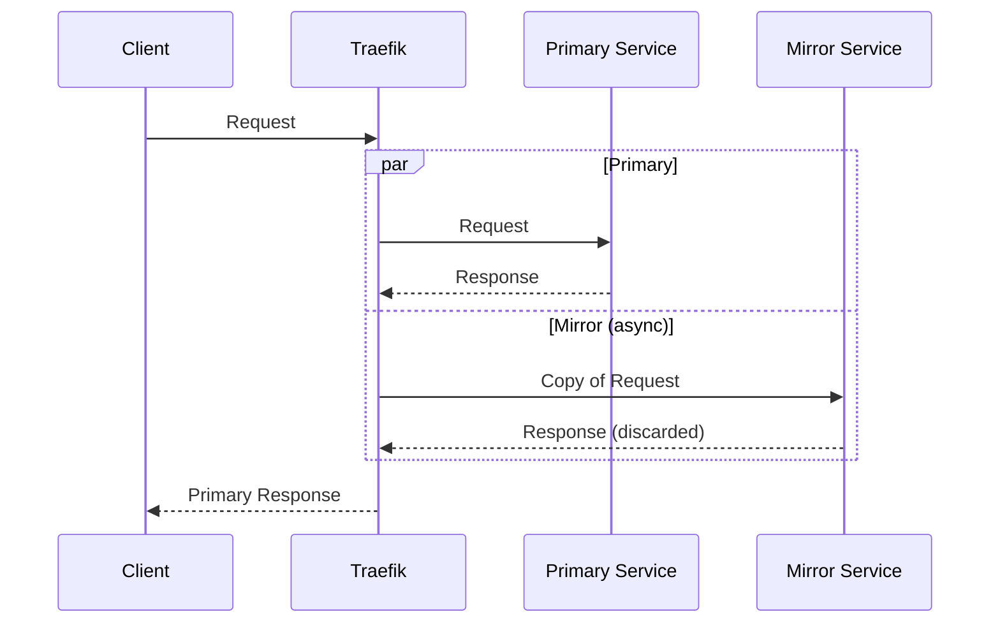
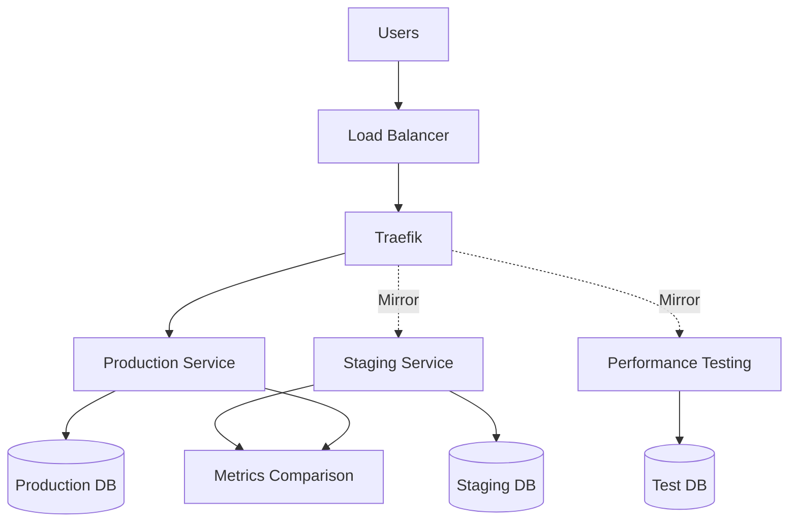

# How to Implement Traffic Mirroring in Traefik

Author: [nawazdhandala](https://www.github.com/nawazdhandala)

Tags: Traefik, Traffic Mirroring, Testing, Shadow Traffic, DevOps

Description: Configure Traefik to mirror production traffic to test environments for validation, performance testing, and debugging without affecting users.

---

Traffic mirroring duplicates live production requests to a secondary service. The mirror receives an exact copy of real traffic, but its responses are discarded. This technique is invaluable for testing new versions with production workloads, validating performance under real conditions, and debugging issues that only appear with real user traffic.

This guide covers setting up traffic mirroring in Traefik, including partial mirroring, multiple mirrors, and monitoring mirror health.

## How Traffic Mirroring Works

When mirroring is enabled, Traefik:

1. Receives a request from a client
2. Forwards the request to the primary service
3. Simultaneously sends a copy to the mirror service
4. Returns only the primary service's response to the client
5. Discards the mirror's response



## Basic Traffic Mirroring

Create a TraefikService with mirroring configuration:

```yaml
# mirror-service.yaml
apiVersion: traefik.io/v1alpha1
kind: TraefikService
metadata:
  name: mirrored-service
  namespace: default
spec:
  mirroring:
    # Primary service receives all traffic
    name: production-service
    port: 80
    # Mirror configuration
    mirrors:
      - name: staging-service
        port: 80
        # Percentage of traffic to mirror (0-100)
        percent: 100
```

Route traffic through the mirrored service:

```yaml
# mirror-route.yaml
apiVersion: traefik.io/v1alpha1
kind: IngressRoute
metadata:
  name: api
  namespace: default
spec:
  entryPoints:
    - websecure
  routes:
    - match: Host(`api.example.com`)
      kind: Rule
      services:
        - name: mirrored-service
          kind: TraefikService
  tls: {}
```

## Partial Traffic Mirroring

Mirror only a percentage of traffic to avoid overwhelming the mirror service:

```yaml
# partial-mirror.yaml
apiVersion: traefik.io/v1alpha1
kind: TraefikService
metadata:
  name: partial-mirror
  namespace: default
spec:
  mirroring:
    name: production-service
    port: 80
    mirrors:
      - name: staging-service
        port: 80
        # Only mirror 10% of traffic
        percent: 10
```

This is useful when:

- The mirror service has limited capacity
- You want to reduce load during initial testing
- You are debugging specific issues and need sample traffic

## Multiple Mirrors

Send traffic to multiple mirror destinations:

```yaml
# multi-mirror.yaml
apiVersion: traefik.io/v1alpha1
kind: TraefikService
metadata:
  name: multi-mirror
  namespace: default
spec:
  mirroring:
    name: production-service
    port: 80
    mirrors:
      # New version testing
      - name: staging-v2
        port: 80
        percent: 100
      # Performance testing environment
      - name: perf-testing
        port: 80
        percent: 50
      # Logging/analytics service
      - name: traffic-analyzer
        port: 80
        percent: 100
```

Each mirror operates independently, and mirror failures do not affect other mirrors or the primary service.

## Mirroring with Request Body

By default, Traefik mirrors the request including headers and body. For large request bodies, consider:

```yaml
# mirror-with-max-body.yaml
apiVersion: traefik.io/v1alpha1
kind: TraefikService
metadata:
  name: mirror-limited-body
  namespace: default
spec:
  mirroring:
    name: production-service
    port: 80
    # Maximum body size to buffer for mirroring
    maxBodySize: 1048576  # 1 MB
    mirrors:
      - name: staging-service
        port: 80
        percent: 100
```

Requests with bodies larger than `maxBodySize` will not be mirrored.

## Conditional Mirroring

Mirror only specific types of requests by using route matching:

```yaml
# conditional-mirror.yaml
# Mirror only API requests, not static assets
apiVersion: traefik.io/v1alpha1
kind: TraefikService
metadata:
  name: api-mirror
  namespace: default
spec:
  mirroring:
    name: production-api
    port: 80
    mirrors:
      - name: staging-api
        port: 80
        percent: 100
---
apiVersion: traefik.io/v1alpha1
kind: IngressRoute
metadata:
  name: routes
  namespace: default
spec:
  entryPoints:
    - websecure
  routes:
    # API requests with mirroring
    - match: Host(`example.com`) && PathPrefix(`/api`)
      kind: Rule
      services:
        - name: api-mirror
          kind: TraefikService

    # Static assets without mirroring
    - match: Host(`example.com`) && PathPrefix(`/static`)
      kind: Rule
      services:
        - name: static-service
          port: 80
  tls: {}
```

## Mirror to Different Environments

Mirror production traffic to different testing environments:

```yaml
# environment-mirrors.yaml
# Services
apiVersion: v1
kind: Service
metadata:
  name: prod-api
  namespace: production
spec:
  selector:
    app: api
    env: prod
  ports:
    - port: 80
---
apiVersion: v1
kind: Service
metadata:
  name: staging-api
  namespace: staging
spec:
  selector:
    app: api
    env: staging
  ports:
    - port: 80
---
apiVersion: v1
kind: Service
metadata:
  name: canary-api
  namespace: canary
spec:
  selector:
    app: api
    env: canary
  ports:
    - port: 80
---
# Cross-namespace mirroring requires ExternalName services
apiVersion: v1
kind: Service
metadata:
  name: staging-api-external
  namespace: production
spec:
  type: ExternalName
  externalName: staging-api.staging.svc.cluster.local
---
apiVersion: traefik.io/v1alpha1
kind: TraefikService
metadata:
  name: prod-with-mirrors
  namespace: production
spec:
  mirroring:
    name: prod-api
    port: 80
    mirrors:
      - name: staging-api-external
        port: 80
        percent: 100
```

## Monitoring Mirror Services

Track mirror performance to ensure it is processing traffic correctly:

```yaml
# Enable detailed metrics
apiVersion: v1
kind: ConfigMap
metadata:
  name: traefik-config
  namespace: traefik
data:
  traefik.yaml: |
    metrics:
      prometheus:
        addServicesLabels: true
        addRoutersLabels: true
```

Query Prometheus for mirror-specific metrics:

```promql
# Request rate to mirror service
sum(rate(traefik_service_requests_total{service="staging-service@kubernetes"}[5m]))

# Error rate on mirror (should not affect users)
sum(rate(traefik_service_requests_total{service="staging-service@kubernetes", code=~"5.."}[5m]))
/
sum(rate(traefik_service_requests_total{service="staging-service@kubernetes"}[5m]))

# Latency comparison between primary and mirror
histogram_quantile(0.95,
  sum by (le, service) (
    rate(traefik_service_request_duration_seconds_bucket{service=~"(production|staging)-service@kubernetes"}[5m])
  )
)
```

## Use Cases for Traffic Mirroring

### 1. Pre-Production Validation

Test new versions with real traffic patterns:

```yaml
# pre-release-mirror.yaml
apiVersion: traefik.io/v1alpha1
kind: TraefikService
metadata:
  name: pre-release-test
  namespace: default
spec:
  mirroring:
    name: current-version
    port: 80
    mirrors:
      - name: release-candidate
        port: 80
        percent: 100
```

Compare error rates and latencies between versions before promoting.

### 2. Performance Testing

Replay production traffic to load testing environments:

```yaml
# perf-testing-mirror.yaml
apiVersion: traefik.io/v1alpha1
kind: TraefikService
metadata:
  name: perf-test
  namespace: default
spec:
  mirroring:
    name: production-api
    port: 80
    mirrors:
      - name: load-test-env
        port: 80
        # Only mirror 20% to avoid overwhelming test env
        percent: 20
```

### 3. Debugging Production Issues

Capture traffic for analysis:

```yaml
# debug-mirror.yaml
apiVersion: traefik.io/v1alpha1
kind: TraefikService
metadata:
  name: debug-capture
  namespace: default
spec:
  mirroring:
    name: production-api
    port: 80
    mirrors:
      - name: traffic-capture-service
        port: 80
        percent: 100
```

The capture service can log requests, record timing, or store for later replay.

### 4. A/B Testing Infrastructure

Validate infrastructure changes:

```yaml
# infra-testing-mirror.yaml
apiVersion: traefik.io/v1alpha1
kind: TraefikService
metadata:
  name: infra-test
  namespace: default
spec:
  mirroring:
    name: current-infrastructure
    port: 80
    mirrors:
      # Test with different database
      - name: new-database-setup
        port: 80
        percent: 100
      # Test with different caching
      - name: new-cache-setup
        port: 80
        percent: 100
```

## Error Handling

Mirror failures should not impact production traffic. Traefik handles this by:

- Running mirror requests asynchronously
- Not waiting for mirror responses
- Not propagating mirror errors to clients

However, monitor mirror health to ensure testing validity:

```yaml
# mirror-health-alert.yaml
apiVersion: monitoring.coreos.com/v1
kind: PrometheusRule
metadata:
  name: mirror-alerts
  namespace: monitoring
spec:
  groups:
    - name: traffic-mirroring
      rules:
        - alert: MirrorHighErrorRate
          expr: |
            sum(rate(traefik_service_requests_total{service="staging-service@kubernetes", code=~"5.."}[5m]))
            /
            sum(rate(traefik_service_requests_total{service="staging-service@kubernetes"}[5m]))
            > 0.1
          for: 5m
          labels:
            severity: warning
          annotations:
            summary: "Mirror service has high error rate"
            description: "Staging mirror is returning errors, test results may be invalid"
```

## Architecture with Mirroring



## Best Practices

1. **Start with low percentages**: Begin mirroring at 10-20% and increase gradually
2. **Monitor mirror service**: Ensure mirror can handle the load
3. **Use separate databases**: Mirror services should use isolated data stores
4. **Sanitize responses**: Mirror responses are discarded, but log them for analysis
5. **Watch for side effects**: Mirrored POST/PUT requests execute on both services
6. **Set timeouts**: Prevent slow mirrors from accumulating connections
7. **Plan capacity**: Mirror service needs resources proportional to traffic percentage

---

Traffic mirroring provides a safe way to test with production traffic patterns. New versions face real-world conditions without risk to users, and you can compare behavior between current and new implementations. Combined with proper monitoring, mirroring becomes an essential tool for confident deployments.
