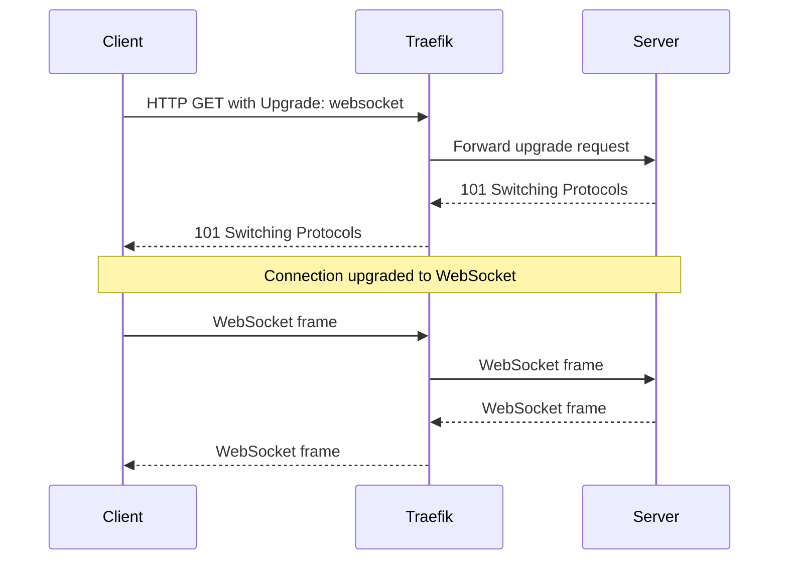
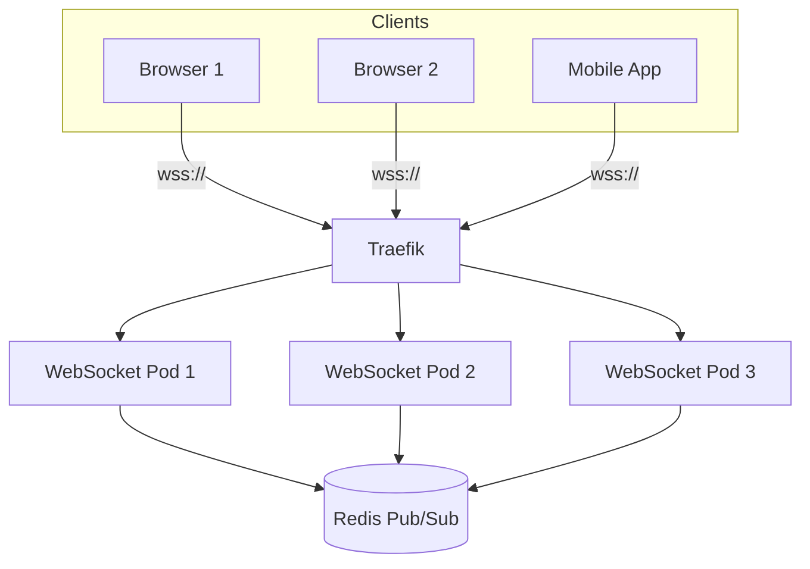

# How to Configure Traefik for WebSocket

Author: [nawazdhandala](https://www.github.com/nawazdhandala)

Tags: Traefik, WebSocket, Real-time, Load Balancing, DevOps

Description: Set up Traefik to handle WebSocket connections with proper upgrade handling, sticky sessions, and timeout configuration for real-time applications.

---

WebSocket enables bidirectional, real-time communication between clients and servers over a single persistent connection. Unlike HTTP's request-response model, WebSocket maintains an open connection for continuous data exchange. Traefik supports WebSocket out of the box, but proper configuration ensures connections remain stable and scale correctly.

This guide covers configuring Traefik for WebSocket applications, including connection upgrades, sticky sessions, timeouts, and load balancing strategies.

## How WebSocket Works Through Traefik

A WebSocket connection starts as an HTTP request with an Upgrade header. The server responds with a 101 status code, and the connection switches from HTTP to WebSocket protocol:



## Basic WebSocket Configuration

Traefik handles WebSocket connections automatically. A standard IngressRoute works:

```yaml
# websocket-route.yaml
apiVersion: traefik.io/v1alpha1
kind: IngressRoute
metadata:
  name: websocket-app
  namespace: default
spec:
  entryPoints:
    - websecure
  routes:
    - match: Host(`ws.example.com`)
      kind: Rule
      services:
        - name: websocket-service
          port: 8080
  tls: {}
```

WebSocket upgrade handling is automatic. No special middleware is required.

## Timeout Configuration

WebSocket connections are long-lived. Default HTTP timeouts will prematurely close them. Configure appropriate timeouts:

```yaml
# traefik-websocket-config.yaml
apiVersion: v1
kind: ConfigMap
metadata:
  name: traefik-config
  namespace: traefik
data:
  traefik.yaml: |
    entryPoints:
      websecure:
        address: ":443"
        transport:
          respondingTimeouts:
            # Time to wait for response headers
            readTimeout: 0  # 0 = no timeout
            # Time allowed for response write
            writeTimeout: 0  # 0 = no timeout
            # Time to keep idle connection open
            idleTimeout: 3600s  # 1 hour

    providers:
      kubernetesCRD: {}
```

For service-level timeouts:

```yaml
# websocket-service-config.yaml
apiVersion: traefik.io/v1alpha1
kind: ServersTransport
metadata:
  name: websocket-transport
  namespace: default
spec:
  forwardingTimeouts:
    # Timeout for establishing connection to backend
    dialTimeout: 30s
    # Timeout for response headers
    responseHeaderTimeout: 0s  # 0 = no timeout
    # Time to keep idle connections
    idleConnTimeout: 3600s
---
apiVersion: traefik.io/v1alpha1
kind: IngressRoute
metadata:
  name: websocket-app
  namespace: default
spec:
  entryPoints:
    - websecure
  routes:
    - match: Host(`ws.example.com`)
      kind: Rule
      services:
        - name: websocket-service
          port: 8080
          serversTransport: websocket-transport
  tls: {}
```

## Sticky Sessions

WebSocket applications often require sticky sessions to maintain state. Configure session affinity:

```yaml
# sticky-websocket.yaml
apiVersion: traefik.io/v1alpha1
kind: IngressRoute
metadata:
  name: websocket-sticky
  namespace: default
spec:
  entryPoints:
    - websecure
  routes:
    - match: Host(`ws.example.com`)
      kind: Rule
      services:
        - name: websocket-service
          port: 8080
          sticky:
            cookie:
              name: ws_session
              httpOnly: true
              secure: true
              sameSite: strict
  tls: {}
```

The cookie ensures subsequent requests from the same client go to the same backend pod.

## Path-Based WebSocket Routing

Route WebSocket connections alongside regular HTTP:

```yaml
# mixed-websocket-http.yaml
apiVersion: traefik.io/v1alpha1
kind: IngressRoute
metadata:
  name: app-routes
  namespace: default
spec:
  entryPoints:
    - websecure
  routes:
    # WebSocket endpoint
    - match: Host(`app.example.com`) && PathPrefix(`/ws`)
      kind: Rule
      services:
        - name: websocket-service
          port: 8080
          sticky:
            cookie:
              name: ws_session

    # REST API
    - match: Host(`app.example.com`) && PathPrefix(`/api`)
      kind: Rule
      services:
        - name: api-service
          port: 8080

    # Static files / frontend
    - match: Host(`app.example.com`)
      kind: Rule
      services:
        - name: frontend-service
          port: 80
  tls: {}
```

## Socket.IO Configuration

Socket.IO uses WebSocket with fallback to polling. Configure both:

```yaml
# socketio-route.yaml
apiVersion: traefik.io/v1alpha1
kind: IngressRoute
metadata:
  name: socketio-app
  namespace: default
spec:
  entryPoints:
    - websecure
  routes:
    # Socket.IO uses /socket.io/ path by default
    - match: Host(`app.example.com`) && PathPrefix(`/socket.io`)
      kind: Rule
      services:
        - name: socketio-service
          port: 3000
          sticky:
            cookie:
              name: socketio_session
              httpOnly: true
              secure: true
  tls: {}
```

Sticky sessions are essential for Socket.IO when using multiple server instances, as polling requests must reach the same server as the WebSocket connection.

## Health Checks for WebSocket Services

WebSocket services need appropriate health checks:

```yaml
# websocket-deployment.yaml
apiVersion: apps/v1
kind: Deployment
metadata:
  name: websocket-service
  namespace: default
spec:
  replicas: 3
  selector:
    matchLabels:
      app: websocket
  template:
    metadata:
      labels:
        app: websocket
    spec:
      containers:
        - name: app
          image: websocket-app:latest
          ports:
            - containerPort: 8080
          # Use HTTP health endpoint, not WebSocket
          livenessProbe:
            httpGet:
              path: /health
              port: 8080
            initialDelaySeconds: 10
            periodSeconds: 10
          readinessProbe:
            httpGet:
              path: /ready
              port: 8080
            initialDelaySeconds: 5
            periodSeconds: 5
          resources:
            requests:
              cpu: 100m
              memory: 128Mi
            limits:
              cpu: 500m
              memory: 256Mi
```

## WebSocket with Authentication

Apply authentication before WebSocket upgrade:

```yaml
# authenticated-websocket.yaml
apiVersion: traefik.io/v1alpha1
kind: Middleware
metadata:
  name: ws-auth
  namespace: default
spec:
  forwardAuth:
    address: http://auth-service:8080/verify
    authRequestHeaders:
      - Authorization
      - Cookie
    authResponseHeaders:
      - X-User-ID
---
apiVersion: traefik.io/v1alpha1
kind: IngressRoute
metadata:
  name: websocket-auth
  namespace: default
spec:
  entryPoints:
    - websecure
  routes:
    - match: Host(`ws.example.com`)
      kind: Rule
      middlewares:
        - name: ws-auth
      services:
        - name: websocket-service
          port: 8080
  tls: {}
```

The auth middleware validates the initial HTTP request before the WebSocket upgrade.

## Rate Limiting WebSocket Connections

Limit the rate of new WebSocket connections:

```yaml
# rate-limited-websocket.yaml
apiVersion: traefik.io/v1alpha1
kind: Middleware
metadata:
  name: ws-rate-limit
  namespace: default
spec:
  rateLimit:
    # Connections per second
    average: 10
    burst: 20
    sourceCriterion:
      ipStrategy:
        depth: 0
---
apiVersion: traefik.io/v1alpha1
kind: IngressRoute
metadata:
  name: websocket-limited
  namespace: default
spec:
  entryPoints:
    - websecure
  routes:
    - match: Host(`ws.example.com`)
      kind: Rule
      middlewares:
        - name: ws-rate-limit
      services:
        - name: websocket-service
          port: 8080
  tls: {}
```

Note: Rate limiting applies to the connection handshake, not to messages within an established connection.

## Scaling WebSocket Services

WebSocket connections are stateful, making scaling more complex:

```yaml
# websocket-scaled.yaml
apiVersion: apps/v1
kind: Deployment
metadata:
  name: websocket-service
  namespace: default
spec:
  replicas: 5
  selector:
    matchLabels:
      app: websocket
  template:
    metadata:
      labels:
        app: websocket
    spec:
      containers:
        - name: app
          image: websocket-app:latest
          ports:
            - containerPort: 8080
          env:
            # Redis for pub/sub between instances
            - name: REDIS_URL
              value: redis://redis-service:6379
---
# Use Redis for cross-instance communication
apiVersion: v1
kind: Service
metadata:
  name: redis-service
  namespace: default
spec:
  selector:
    app: redis
  ports:
    - port: 6379
---
apiVersion: traefik.io/v1alpha1
kind: IngressRoute
metadata:
  name: websocket-scaled
  namespace: default
spec:
  entryPoints:
    - websecure
  routes:
    - match: Host(`ws.example.com`)
      kind: Rule
      services:
        - name: websocket-service
          port: 8080
          # Sticky sessions ensure client stays on same pod
          sticky:
            cookie:
              name: ws_sticky
  tls: {}
```

The application should use Redis pub/sub or similar to broadcast messages across instances.

## Monitoring WebSocket Connections

Track WebSocket metrics through Traefik:

```promql
# Active connections (all connections, including WebSocket)
traefik_entrypoint_open_connections{entrypoint="websecure"}

# Request rate (initial handshakes)
rate(traefik_service_requests_total{service="websocket-service@kubernetes"}[5m])

# Connection duration histogram
histogram_quantile(0.95,
  rate(traefik_service_request_duration_seconds_bucket{service="websocket-service@kubernetes"}[5m])
)
```

## Testing WebSocket Through Traefik

Verify WebSocket connectivity:

```bash
# Install websocat for testing
brew install websocat  # macOS

# Test WebSocket connection
websocat wss://ws.example.com/socket

# Test with authentication header
websocat -H "Authorization: Bearer $TOKEN" wss://ws.example.com/socket

# Test Socket.IO
# (Socket.IO has specific handshake, use client library)
node -e "
const io = require('socket.io-client');
const socket = io('https://app.example.com');
socket.on('connect', () => console.log('Connected:', socket.id));
socket.on('disconnect', () => process.exit(0));
"
```

Check connection upgrade in curl:

```bash
# Verify upgrade headers
curl -v -N \
  -H "Connection: Upgrade" \
  -H "Upgrade: websocket" \
  -H "Sec-WebSocket-Key: dGhlIHNhbXBsZSBub25jZQ==" \
  -H "Sec-WebSocket-Version: 13" \
  https://ws.example.com/socket
```

## Architecture Overview



## Troubleshooting

Common issues and solutions:

1. **Connection drops after 60 seconds**: Increase idle timeout in Traefik config
2. **WebSocket upgrade fails**: Check that no middleware is stripping Upgrade headers
3. **Sticky sessions not working**: Verify cookie configuration and client cookie handling
4. **Load imbalance**: Ensure sticky sessions are enabled or use external state (Redis)
5. **Connection reset**: Check backend server timeouts match or exceed Traefik timeouts

## Best Practices

1. **Set proper timeouts**: Match timeouts between Traefik and backend
2. **Use sticky sessions**: For stateful WebSocket applications
3. **Implement heartbeats**: Keep connections alive through firewalls and proxies
4. **Plan for reconnection**: Clients should handle disconnects gracefully
5. **Monitor connections**: Track open connection counts and duration
6. **Use TLS**: Always use wss:// in production
7. **Scale with pub/sub**: Use Redis or similar for multi-instance communication

---

Traefik handles WebSocket connections automatically once you configure appropriate timeouts. The main considerations are session stickiness for stateful applications and proper timeout configuration to prevent premature connection closure. With these in place, Traefik becomes a reliable gateway for real-time WebSocket applications.
