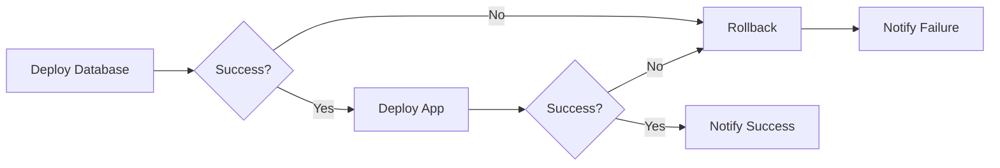

# How to Implement Ansible Tower/AWX

Author: [nawazdhandala](https://www.github.com/nawazdhandala)

Tags: Ansible, AWX, Ansible Tower, Automation Platform, DevOps, Enterprise Automation

Description: Deploy and configure AWX (the open-source Ansible Tower) for enterprise automation with web UI, RBAC, job scheduling, and API-driven workflows.

---

Ansible Tower (commercial) and AWX (open-source upstream) provide a web-based interface and API for managing Ansible automation at scale. They add features essential for enterprise use: role-based access control, job scheduling, credential management, and audit logging. AWX transforms command-line Ansible into a self-service automation platform.

This guide covers deploying AWX and configuring it for production use.

## AWX vs Ansible Tower

Both products share the same codebase, but differ in support and features:

| Feature | AWX | Ansible Tower |
|---------|-----|---------------|
| License | Apache 2.0 | Commercial |
| Support | Community | Red Hat |
| Updates | Continuous | Quarterly |
| Clustering | Manual | Built-in HA |
| Best for | Development, small teams | Enterprise production |

## Deploying AWX on Kubernetes

AWX runs best on Kubernetes using the AWX Operator.

```bash
# Install AWX Operator
kubectl apply -f https://raw.githubusercontent.com/ansible/awx-operator/devel/deploy/awx-operator.yaml

# Wait for operator to be ready
kubectl get pods -n awx -w
```

Create an AWX instance:

```yaml
# awx-instance.yml
---
apiVersion: awx.ansible.com/v1beta1
kind: AWX
metadata:
  name: awx
  namespace: awx
spec:
  # Basic settings
  service_type: ClusterIP
  ingress_type: ingress
  hostname: awx.example.com

  # Admin user
  admin_user: admin
  admin_password_secret: awx-admin-password

  # PostgreSQL settings
  postgres_storage_class: standard
  postgres_storage_requirements:
    requests:
      storage: 10Gi

  # Resource limits
  web_resource_requirements:
    requests:
      cpu: 500m
      memory: 1Gi
    limits:
      cpu: 1000m
      memory: 2Gi

  task_resource_requirements:
    requests:
      cpu: 500m
      memory: 1Gi
    limits:
      cpu: 2000m
      memory: 4Gi

  # Persistent storage for projects
  projects_persistence: true
  projects_storage_class: standard
  projects_storage_size: 10Gi
```

```bash
# Create admin password secret
kubectl create secret generic awx-admin-password \
  -n awx \
  --from-literal=password='SecurePassword123!'

# Deploy AWX
kubectl apply -f awx-instance.yml

# Monitor deployment
kubectl logs -f deployment/awx-operator-controller-manager -n awx
```

## Initial Configuration

After deployment, configure AWX through the web UI or API.

### Creating Organizations

```yaml
# Using awx-cli or API
# Install awx-cli
pip install awxkit

# Configure authentication
export TOWER_HOST=https://awx.example.com
export TOWER_USERNAME=admin
export TOWER_PASSWORD=SecurePassword123!
```

```bash
# Create organization
awx organizations create \
  --name "Operations" \
  --description "Operations team organization"

# Create team
awx teams create \
  --name "DevOps" \
  --organization "Operations"
```

### Setting Up Credentials

```bash
# Machine credential (SSH)
awx credentials create \
  --name "Production Servers" \
  --organization "Operations" \
  --credential_type "Machine" \
  --inputs '{"username": "deploy", "ssh_key_data": "@~/.ssh/deploy_key"}'

# Source Control credential (Git)
awx credentials create \
  --name "GitHub" \
  --organization "Operations" \
  --credential_type "Source Control" \
  --inputs '{"username": "git", "ssh_key_data": "@~/.ssh/github_key"}'

# Vault credential
awx credentials create \
  --name "Ansible Vault" \
  --organization "Operations" \
  --credential_type "Vault" \
  --inputs '{"vault_password": "vault_secret_password"}'
```

### Creating Projects

```bash
# Create project from Git repository
awx projects create \
  --name "Infrastructure Automation" \
  --organization "Operations" \
  --scm_type "git" \
  --scm_url "git@github.com:company/ansible-configs.git" \
  --scm_branch "main" \
  --credential "GitHub" \
  --scm_update_on_launch true
```

### Setting Up Inventories

```bash
# Create static inventory
awx inventories create \
  --name "Production" \
  --organization "Operations"

# Add hosts
awx hosts create \
  --name "web1.example.com" \
  --inventory "Production" \
  --variables '{"http_port": 80}'

# Add groups
awx groups create \
  --name "webservers" \
  --inventory "Production"

# Add host to group
awx hosts associate \
  --host "web1.example.com" \
  --group "webservers"
```

### Creating Job Templates

```bash
# Create job template
awx job_templates create \
  --name "Deploy Application" \
  --organization "Operations" \
  --project "Infrastructure Automation" \
  --playbook "playbooks/deploy.yml" \
  --inventory "Production" \
  --credential "Production Servers" \
  --vault_credential "Ansible Vault" \
  --ask_variables_on_launch true \
  --extra_vars '{"app_version": "latest"}'
```

## Role-Based Access Control

Configure permissions for teams and users.

```yaml
# RBAC configuration via API
# POST /api/v2/roles/

# Grant team access to inventory
{
  "name": "Use",
  "type": "inventory",
  "resource_id": 1,
  "team_id": 1
}

# Grant job template execute permission
{
  "name": "Execute",
  "type": "job_template",
  "resource_id": 1,
  "team_id": 1
}
```

```bash
# Using awx-cli
# Grant team admin access to project
awx roles grant \
  --type project \
  --resource "Infrastructure Automation" \
  --team "DevOps" \
  --role admin

# Grant execute permission on job template
awx roles grant \
  --type job_template \
  --resource "Deploy Application" \
  --team "DevOps" \
  --role execute
```

## Dynamic Inventory

Configure cloud provider inventory sources.

```yaml
# AWS EC2 dynamic inventory source
# inventory_source.yml
---
plugin: amazon.aws.aws_ec2
regions:
  - us-east-1
  - us-west-2
keyed_groups:
  - key: tags.Environment
    prefix: env
  - key: instance_type
    prefix: type
filters:
  instance-state-name: running
compose:
  ansible_host: public_ip_address
```

```bash
# Create inventory source in AWX
awx inventory_sources create \
  --name "AWS EC2" \
  --inventory "Production" \
  --source "ec2" \
  --credential "AWS Credentials" \
  --update_on_launch true \
  --overwrite true
```

## Workflow Templates

Chain multiple job templates together.



```bash
# Create workflow template
awx workflow_job_templates create \
  --name "Full Deployment" \
  --organization "Operations" \
  --ask_variables_on_launch true

# Add workflow nodes
awx workflow_job_template_nodes create \
  --workflow_job_template "Full Deployment" \
  --unified_job_template "Deploy Database"

awx workflow_job_template_nodes create \
  --workflow_job_template "Full Deployment" \
  --unified_job_template "Deploy Application"

# Link nodes with success/failure paths
# (This is typically done through the UI for complex workflows)
```

## Scheduling Jobs

Automate recurring tasks with schedules.

```bash
# Create schedule for nightly backups
awx schedules create \
  --name "Nightly Backup" \
  --unified_job_template "Backup Databases" \
  --rrule "DTSTART:20260125T020000Z RRULE:FREQ=DAILY;INTERVAL=1"

# Weekly security scan
awx schedules create \
  --name "Weekly Security Scan" \
  --unified_job_template "Security Audit" \
  --rrule "DTSTART:20260125T060000Z RRULE:FREQ=WEEKLY;BYDAY=SU"
```

## API Integration

Trigger jobs from external systems.

```python
# Python example using requests
import requests

AWX_URL = "https://awx.example.com"
TOKEN = "your_api_token"

def launch_job(template_id, extra_vars=None):
    """Launch a job template via AWX API"""
    headers = {
        "Authorization": f"Bearer {TOKEN}",
        "Content-Type": "application/json"
    }

    payload = {}
    if extra_vars:
        payload["extra_vars"] = extra_vars

    response = requests.post(
        f"{AWX_URL}/api/v2/job_templates/{template_id}/launch/",
        headers=headers,
        json=payload
    )

    if response.status_code == 201:
        job = response.json()
        return job["id"]
    else:
        raise Exception(f"Failed to launch job: {response.text}")

def wait_for_job(job_id):
    """Wait for job completion and return status"""
    headers = {"Authorization": f"Bearer {TOKEN}"}

    while True:
        response = requests.get(
            f"{AWX_URL}/api/v2/jobs/{job_id}/",
            headers=headers
        )
        job = response.json()

        if job["status"] in ["successful", "failed", "error", "canceled"]:
            return job["status"]

        time.sleep(5)

# Launch deployment
job_id = launch_job(
    template_id=5,
    extra_vars={"app_version": "v1.2.0"}
)
print(f"Launched job {job_id}")

status = wait_for_job(job_id)
print(f"Job completed with status: {status}")
```

## CI/CD Integration

Integrate AWX with your CI/CD pipeline.

```yaml
# .github/workflows/deploy.yml
name: Deploy with AWX

on:
  push:
    branches: [main]

jobs:
  deploy:
    runs-on: ubuntu-latest
    steps:
      - name: Trigger AWX Deployment
        run: |
          curl -X POST \
            -H "Authorization: Bearer ${{ secrets.AWX_TOKEN }}" \
            -H "Content-Type: application/json" \
            -d '{"extra_vars": {"app_version": "${{ github.sha }}"}}' \
            "${{ secrets.AWX_URL }}/api/v2/job_templates/5/launch/"

      - name: Wait for deployment
        run: |
          # Poll job status until complete
          JOB_ID=$(curl -s -X GET \
            -H "Authorization: Bearer ${{ secrets.AWX_TOKEN }}" \
            "${{ secrets.AWX_URL }}/api/v2/job_templates/5/jobs/?order_by=-id&page_size=1" \
            | jq -r '.results[0].id')

          while true; do
            STATUS=$(curl -s \
              -H "Authorization: Bearer ${{ secrets.AWX_TOKEN }}" \
              "${{ secrets.AWX_URL }}/api/v2/jobs/$JOB_ID/" \
              | jq -r '.status')

            echo "Job status: $STATUS"

            if [ "$STATUS" = "successful" ]; then
              exit 0
            elif [ "$STATUS" = "failed" ] || [ "$STATUS" = "error" ]; then
              exit 1
            fi

            sleep 10
          done
```

## Backup and Recovery

Protect your AWX configuration.

```bash
# Backup AWX database
kubectl exec -n awx deployment/awx-postgres -- \
  pg_dump -U awx awx > awx-backup-$(date +%Y%m%d).sql

# Export configuration as code
awx export --all > awx-config-backup.json

# Restore from backup
kubectl exec -i -n awx deployment/awx-postgres -- \
  psql -U awx awx < awx-backup-20260125.sql
```

## Monitoring AWX

Track job execution and system health.

```yaml
# Prometheus ServiceMonitor for AWX metrics
apiVersion: monitoring.coreos.com/v1
kind: ServiceMonitor
metadata:
  name: awx
  namespace: monitoring
spec:
  selector:
    matchLabels:
      app.kubernetes.io/component: awx
  endpoints:
    - port: http
      path: /api/v2/metrics/
      interval: 30s
```

---

AWX transforms Ansible from a powerful command-line tool into an enterprise automation platform. The web interface makes automation accessible to operations teams who may not be comfortable with CLIs, while the API enables integration with CI/CD pipelines and ticketing systems. Start with basic job templates, add RBAC as your team grows, and leverage workflows for complex multi-step deployments.
