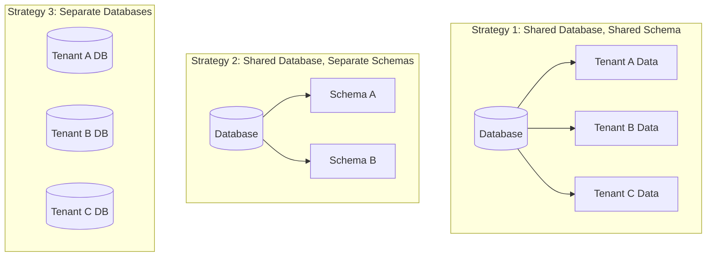

# How to Build Multi-Tenant APIs in Python

Author: [nawazdhandala](https://www.github.com/nawazdhandala)

Tags: Python, Multi-tenancy, FastAPI, API Design, SaaS, Database, Architecture

Description: Learn how to build multi-tenant APIs in Python using FastAPI. This guide covers tenant isolation strategies, database patterns, middleware implementation, and security best practices for SaaS applications.

---

> Multi-tenancy lets a single application serve multiple customers (tenants) while keeping their data isolated. Building it right means balancing isolation, performance, and operational complexity. This guide shows you practical patterns for implementing multi-tenant APIs in Python.

SaaS applications almost always need multi-tenancy. Whether you are building a project management tool, analytics platform, or any B2B product, you will need to ensure each customer sees only their data.

---

## Multi-Tenancy Strategies

There are three main approaches to multi-tenancy, each with different trade-offs.



| Strategy | Isolation | Complexity | Cost | Best For |
|----------|-----------|------------|------|----------|
| Shared schema | Low | Low | Low | Many small tenants |
| Separate schemas | Medium | Medium | Medium | Compliance needs |
| Separate databases | High | High | High | Large enterprise clients |

For most applications, the shared schema approach with a tenant_id column provides good isolation with minimal overhead.

---

## Basic Tenant Context

The foundation of multi-tenancy is tracking which tenant is making each request. This example uses FastAPI's dependency injection to extract and validate tenant context.

```python
# tenant_context.py
# Core tenant context management for multi-tenant API
from fastapi import FastAPI, Request, HTTPException, Depends
from contextvars import ContextVar
from typing import Optional
from dataclasses import dataclass

# Context variable to store current tenant (thread-safe for async)
current_tenant_var: ContextVar[Optional[str]] = ContextVar('current_tenant', default=None)

@dataclass
class TenantContext:
    """Holds tenant information for the current request"""
    tenant_id: str
    tenant_name: str
    plan: str  # e.g., 'free', 'pro', 'enterprise'
    settings: dict  # Tenant-specific configuration

def get_current_tenant() -> str:
    """Get current tenant ID from context"""
    tenant_id = current_tenant_var.get()
    if not tenant_id:
        raise HTTPException(status_code=401, detail="Tenant context not set")
    return tenant_id

async def extract_tenant_from_header(request: Request) -> str:
    """Extract tenant ID from request header"""
    tenant_id = request.headers.get("X-Tenant-ID")
    if not tenant_id:
        raise HTTPException(
            status_code=400,
            detail="X-Tenant-ID header is required"
        )
    return tenant_id

async def extract_tenant_from_subdomain(request: Request) -> str:
    """Extract tenant ID from subdomain (e.g., acme.yourapp.com)"""
    host = request.headers.get("host", "")
    parts = host.split(".")

    # Expect format: {tenant}.yourapp.com
    if len(parts) >= 3:
        tenant_slug = parts[0]
        # Look up tenant ID from slug
        tenant = await get_tenant_by_slug(tenant_slug)
        if tenant:
            return tenant.id

    raise HTTPException(status_code=400, detail="Invalid tenant subdomain")

async def extract_tenant_from_jwt(request: Request) -> str:
    """Extract tenant ID from JWT token claims"""
    # Token should contain tenant_id claim
    token = request.headers.get("Authorization", "").replace("Bearer ", "")
    if not token:
        raise HTTPException(status_code=401, detail="Authorization required")

    try:
        payload = decode_jwt(token)
        tenant_id = payload.get("tenant_id")
        if not tenant_id:
            raise HTTPException(status_code=401, detail="Token missing tenant_id")
        return tenant_id
    except JWTError:
        raise HTTPException(status_code=401, detail="Invalid token")
```

---

## Tenant Middleware

Middleware runs on every request to set up the tenant context before route handlers execute.

```python
# tenant_middleware.py
# Middleware to establish tenant context for each request
from fastapi import FastAPI, Request, Response
from starlette.middleware.base import BaseHTTPMiddleware
from typing import Callable

class TenantMiddleware(BaseHTTPMiddleware):
    """Middleware that sets tenant context for each request"""

    def __init__(self, app: FastAPI, tenant_extractor: Callable):
        super().__init__(app)
        self.tenant_extractor = tenant_extractor

    async def dispatch(self, request: Request, call_next: Callable) -> Response:
        # Skip tenant check for health endpoints
        if request.url.path in ["/health", "/metrics", "/docs", "/openapi.json"]:
            return await call_next(request)

        try:
            # Extract tenant ID using configured strategy
            tenant_id = await self.tenant_extractor(request)

            # Validate tenant exists and is active
            tenant = await self.validate_tenant(tenant_id)
            if not tenant:
                return Response(
                    content='{"detail": "Tenant not found"}',
                    status_code=404,
                    media_type="application/json"
                )

            if not tenant.is_active:
                return Response(
                    content='{"detail": "Tenant account suspended"}',
                    status_code=403,
                    media_type="application/json"
                )

            # Set tenant in context variable
            token = current_tenant_var.set(tenant_id)

            # Add tenant info to request state for easy access
            request.state.tenant = tenant

            try:
                response = await call_next(request)
                return response
            finally:
                # Reset context after request completes
                current_tenant_var.reset(token)

        except HTTPException as e:
            return Response(
                content=f'{{"detail": "{e.detail}"}}',
                status_code=e.status_code,
                media_type="application/json"
            )

    async def validate_tenant(self, tenant_id: str) -> Optional[TenantContext]:
        """Look up and validate tenant from database or cache"""
        # Check cache first for performance
        cached = await cache.get(f"tenant:{tenant_id}")
        if cached:
            return TenantContext(**cached)

        # Query database
        tenant = await db.tenants.find_one({"_id": tenant_id})
        if tenant:
            context = TenantContext(
                tenant_id=tenant["_id"],
                tenant_name=tenant["name"],
                plan=tenant["plan"],
                settings=tenant.get("settings", {})
            )
            # Cache for future requests
            await cache.set(f"tenant:{tenant_id}", context.__dict__, ttl=300)
            return context

        return None

# Apply middleware to FastAPI app
app = FastAPI()
app.add_middleware(TenantMiddleware, tenant_extractor=extract_tenant_from_header)
```

---

## Database Layer with Tenant Filtering

The database layer must automatically filter queries by tenant to prevent data leakage.

```python
# tenant_db.py
# Database layer with automatic tenant filtering
from sqlalchemy import Column, String, ForeignKey, event
from sqlalchemy.orm import Session, Query
from sqlalchemy.ext.declarative import declarative_base
from typing import TypeVar, Generic, List, Optional

Base = declarative_base()
T = TypeVar('T')

class TenantMixin:
    """Mixin that adds tenant_id to models"""
    tenant_id = Column(String(36), nullable=False, index=True)

class TenantModel(Base, TenantMixin):
    """Base class for tenant-scoped models"""
    __abstract__ = True

    @classmethod
    def query_for_tenant(cls, session: Session, tenant_id: str) -> Query:
        """Get query pre-filtered by tenant"""
        return session.query(cls).filter(cls.tenant_id == tenant_id)

# Example tenant-scoped models
class Project(TenantModel):
    __tablename__ = 'projects'

    id = Column(String(36), primary_key=True)
    name = Column(String(255), nullable=False)
    description = Column(String)

class Task(TenantModel):
    __tablename__ = 'tasks'

    id = Column(String(36), primary_key=True)
    project_id = Column(String(36), ForeignKey('projects.id'))
    title = Column(String(255), nullable=False)
    status = Column(String(50), default='pending')

class TenantRepository(Generic[T]):
    """Generic repository with automatic tenant scoping"""

    def __init__(self, model: type, session: Session, tenant_id: str):
        self.model = model
        self.session = session
        self.tenant_id = tenant_id

    def _base_query(self) -> Query:
        """Get query with tenant filter applied"""
        return self.session.query(self.model).filter(
            self.model.tenant_id == self.tenant_id
        )

    def get_by_id(self, id: str) -> Optional[T]:
        """Get single record by ID (tenant-scoped)"""
        return self._base_query().filter(self.model.id == id).first()

    def get_all(self, limit: int = 100, offset: int = 0) -> List[T]:
        """Get all records for tenant with pagination"""
        return self._base_query().offset(offset).limit(limit).all()

    def create(self, **kwargs) -> T:
        """Create new record with tenant_id automatically set"""
        # Always set tenant_id, even if caller tries to override
        kwargs['tenant_id'] = self.tenant_id
        instance = self.model(**kwargs)
        self.session.add(instance)
        return instance

    def delete(self, id: str) -> bool:
        """Delete record by ID (tenant-scoped)"""
        # Important: filter by both ID and tenant_id
        result = self._base_query().filter(self.model.id == id).delete()
        return result > 0

# Dependency for FastAPI routes
async def get_project_repo(
    session: Session = Depends(get_db_session),
    tenant_id: str = Depends(get_current_tenant)
) -> TenantRepository[Project]:
    """Get tenant-scoped project repository"""
    return TenantRepository(Project, session, tenant_id)
```

---

## API Routes with Tenant Isolation

Routes use dependency injection to ensure all operations are tenant-scoped.

```python
# tenant_routes.py
# API routes with tenant isolation
from fastapi import APIRouter, Depends, HTTPException, status
from pydantic import BaseModel
from typing import List
import uuid

router = APIRouter(prefix="/projects", tags=["projects"])

class ProjectCreate(BaseModel):
    name: str
    description: Optional[str] = None

class ProjectResponse(BaseModel):
    id: str
    name: str
    description: Optional[str]
    tenant_id: str

@router.get("/", response_model=List[ProjectResponse])
async def list_projects(
    repo: TenantRepository[Project] = Depends(get_project_repo),
    limit: int = 50,
    offset: int = 0
):
    """List all projects for the current tenant"""
    # Repository is already scoped to tenant - no additional filtering needed
    projects = repo.get_all(limit=limit, offset=offset)
    return projects

@router.get("/{project_id}", response_model=ProjectResponse)
async def get_project(
    project_id: str,
    repo: TenantRepository[Project] = Depends(get_project_repo)
):
    """Get a specific project"""
    # Lookup is automatically tenant-scoped
    project = repo.get_by_id(project_id)
    if not project:
        raise HTTPException(
            status_code=status.HTTP_404_NOT_FOUND,
            detail="Project not found"
        )
    return project

@router.post("/", response_model=ProjectResponse, status_code=status.HTTP_201_CREATED)
async def create_project(
    data: ProjectCreate,
    repo: TenantRepository[Project] = Depends(get_project_repo),
    session: Session = Depends(get_db_session)
):
    """Create a new project for the current tenant"""
    project = repo.create(
        id=str(uuid.uuid4()),
        name=data.name,
        description=data.description
        # tenant_id is set automatically by the repository
    )
    session.commit()
    return project

@router.delete("/{project_id}", status_code=status.HTTP_204_NO_CONTENT)
async def delete_project(
    project_id: str,
    repo: TenantRepository[Project] = Depends(get_project_repo),
    session: Session = Depends(get_db_session)
):
    """Delete a project"""
    deleted = repo.delete(project_id)
    if not deleted:
        raise HTTPException(
            status_code=status.HTTP_404_NOT_FOUND,
            detail="Project not found"
        )
    session.commit()
```

---

## Rate Limiting Per Tenant

Different tenants may have different rate limits based on their plan.

```python
# tenant_rate_limit.py
# Per-tenant rate limiting
from fastapi import Request, HTTPException
from datetime import datetime, timedelta
import asyncio

class TenantRateLimiter:
    """Rate limiter with per-tenant and per-plan limits"""

    # Requests per minute by plan
    PLAN_LIMITS = {
        'free': 60,
        'pro': 300,
        'enterprise': 1000
    }

    def __init__(self, redis_client):
        self.redis = redis_client

    async def check_rate_limit(self, tenant_id: str, plan: str) -> bool:
        """Check if request is within rate limit"""
        limit = self.PLAN_LIMITS.get(plan, 60)
        key = f"rate_limit:{tenant_id}:{self._current_minute()}"

        # Increment counter
        current = await self.redis.incr(key)

        # Set expiry on first request of the minute
        if current == 1:
            await self.redis.expire(key, 60)

        return current <= limit

    async def get_remaining(self, tenant_id: str, plan: str) -> dict:
        """Get rate limit status for response headers"""
        limit = self.PLAN_LIMITS.get(plan, 60)
        key = f"rate_limit:{tenant_id}:{self._current_minute()}"

        current = await self.redis.get(key)
        current = int(current) if current else 0

        return {
            "X-RateLimit-Limit": str(limit),
            "X-RateLimit-Remaining": str(max(0, limit - current)),
            "X-RateLimit-Reset": str(self._seconds_until_reset())
        }

    def _current_minute(self) -> str:
        """Get current minute as string for key"""
        return datetime.utcnow().strftime("%Y%m%d%H%M")

    def _seconds_until_reset(self) -> int:
        """Seconds until rate limit resets"""
        now = datetime.utcnow()
        next_minute = (now + timedelta(minutes=1)).replace(second=0, microsecond=0)
        return int((next_minute - now).total_seconds())

async def rate_limit_middleware(request: Request, call_next):
    """Middleware to enforce rate limits"""
    # Skip for non-tenant endpoints
    if not hasattr(request.state, 'tenant'):
        return await call_next(request)

    tenant = request.state.tenant
    limiter = TenantRateLimiter(request.app.state.redis)

    # Check rate limit
    allowed = await limiter.check_rate_limit(tenant.tenant_id, tenant.plan)

    if not allowed:
        # Get rate limit info for headers
        headers = await limiter.get_remaining(tenant.tenant_id, tenant.plan)
        raise HTTPException(
            status_code=429,
            detail="Rate limit exceeded",
            headers=headers
        )

    response = await call_next(request)

    # Add rate limit headers to response
    headers = await limiter.get_remaining(tenant.tenant_id, tenant.plan)
    for key, value in headers.items():
        response.headers[key] = value

    return response
```

---

## Tenant-Specific Configuration

Tenants often need custom settings like feature flags, integrations, or branding.

```python
# tenant_config.py
# Tenant-specific configuration management
from pydantic import BaseModel
from typing import Dict, Any, Optional
from enum import Enum

class FeatureFlag(str, Enum):
    ADVANCED_ANALYTICS = "advanced_analytics"
    API_WEBHOOKS = "api_webhooks"
    SSO = "sso"
    CUSTOM_DOMAINS = "custom_domains"

class TenantSettings(BaseModel):
    """Tenant-specific settings"""
    # Feature flags
    features: Dict[str, bool] = {}

    # Resource limits
    max_projects: int = 10
    max_users: int = 5
    max_storage_gb: int = 1

    # Customization
    brand_color: Optional[str] = None
    logo_url: Optional[str] = None

    # Integrations
    slack_webhook: Optional[str] = None
    custom_domain: Optional[str] = None

class TenantConfigService:
    """Service for managing tenant configuration"""

    # Default settings by plan
    PLAN_DEFAULTS = {
        'free': TenantSettings(
            features={
                FeatureFlag.ADVANCED_ANALYTICS: False,
                FeatureFlag.API_WEBHOOKS: False,
                FeatureFlag.SSO: False,
            },
            max_projects=3,
            max_users=2,
            max_storage_gb=1
        ),
        'pro': TenantSettings(
            features={
                FeatureFlag.ADVANCED_ANALYTICS: True,
                FeatureFlag.API_WEBHOOKS: True,
                FeatureFlag.SSO: False,
            },
            max_projects=50,
            max_users=20,
            max_storage_gb=10
        ),
        'enterprise': TenantSettings(
            features={
                FeatureFlag.ADVANCED_ANALYTICS: True,
                FeatureFlag.API_WEBHOOKS: True,
                FeatureFlag.SSO: True,
                FeatureFlag.CUSTOM_DOMAINS: True,
            },
            max_projects=-1,  # Unlimited
            max_users=-1,
            max_storage_gb=100
        )
    }

    def __init__(self, db, cache):
        self.db = db
        self.cache = cache

    async def get_settings(self, tenant_id: str, plan: str) -> TenantSettings:
        """Get merged settings (defaults + overrides)"""
        # Start with plan defaults
        defaults = self.PLAN_DEFAULTS.get(plan, self.PLAN_DEFAULTS['free'])

        # Get tenant-specific overrides from database
        overrides = await self.db.tenant_settings.find_one(
            {"tenant_id": tenant_id}
        )

        if overrides:
            # Merge overrides into defaults
            return TenantSettings(**{**defaults.dict(), **overrides})

        return defaults

    def has_feature(self, settings: TenantSettings, feature: FeatureFlag) -> bool:
        """Check if tenant has access to a feature"""
        return settings.features.get(feature, False)

# Dependency for feature checks
async def require_feature(feature: FeatureFlag):
    """Dependency that requires a specific feature"""
    async def check(
        request: Request,
        config_service: TenantConfigService = Depends(get_config_service)
    ):
        tenant = request.state.tenant
        settings = await config_service.get_settings(
            tenant.tenant_id,
            tenant.plan
        )

        if not config_service.has_feature(settings, feature):
            raise HTTPException(
                status_code=403,
                detail=f"Feature '{feature.value}' not available on your plan"
            )

        return settings

    return check

# Usage in routes
@router.get("/analytics/advanced")
async def advanced_analytics(
    settings: TenantSettings = Depends(require_feature(FeatureFlag.ADVANCED_ANALYTICS))
):
    """Endpoint that requires advanced analytics feature"""
    return {"data": "advanced analytics data"}
```

---

## Testing Multi-Tenant Code

Testing requires setting up tenant context properly.

```python
# test_tenant.py
# Testing patterns for multi-tenant code
import pytest
from fastapi.testclient import TestClient
from unittest.mock import AsyncMock, patch

@pytest.fixture
def tenant_headers():
    """Headers for authenticated tenant requests"""
    return {"X-Tenant-ID": "test-tenant-123"}

@pytest.fixture
def enterprise_tenant_headers():
    """Headers for enterprise tenant"""
    return {"X-Tenant-ID": "enterprise-tenant-456"}

def test_list_projects_returns_only_tenant_data(client, tenant_headers):
    """Verify projects are filtered by tenant"""
    # Create projects for test tenant
    client.post("/projects", json={"name": "Project A"}, headers=tenant_headers)
    client.post("/projects", json={"name": "Project B"}, headers=tenant_headers)

    # Create project for different tenant
    other_headers = {"X-Tenant-ID": "other-tenant"}
    client.post("/projects", json={"name": "Other Project"}, headers=other_headers)

    # List should only return test tenant's projects
    response = client.get("/projects", headers=tenant_headers)
    assert response.status_code == 200
    projects = response.json()

    assert len(projects) == 2
    assert all(p["tenant_id"] == "test-tenant-123" for p in projects)

def test_cannot_access_other_tenant_project(client, tenant_headers):
    """Verify cross-tenant access is blocked"""
    # Create project for different tenant
    other_headers = {"X-Tenant-ID": "other-tenant"}
    response = client.post(
        "/projects",
        json={"name": "Secret Project"},
        headers=other_headers
    )
    project_id = response.json()["id"]

    # Try to access from different tenant
    response = client.get(f"/projects/{project_id}", headers=tenant_headers)
    assert response.status_code == 404  # Should not find it

def test_feature_gating(client, tenant_headers, enterprise_tenant_headers):
    """Verify feature access is enforced by plan"""
    # Free tenant cannot access advanced features
    response = client.get("/analytics/advanced", headers=tenant_headers)
    assert response.status_code == 403

    # Enterprise tenant can access
    response = client.get("/analytics/advanced", headers=enterprise_tenant_headers)
    assert response.status_code == 200
```

---

## Conclusion

Building multi-tenant APIs requires careful attention to isolation at every layer:

- **Request context**: Extract and validate tenant ID from headers, subdomains, or tokens
- **Middleware**: Set up tenant context before routes execute
- **Database**: Automatically filter all queries by tenant_id
- **Rate limiting**: Apply different limits based on tenant plan
- **Feature flags**: Gate functionality by plan or tenant settings
- **Testing**: Verify isolation prevents cross-tenant data access

The shared schema approach works well for most SaaS applications. Start simple and add complexity only when you need stronger isolation for compliance or large enterprise customers.

---

*Building a multi-tenant SaaS? [OneUptime](https://oneuptime.com) provides monitoring, status pages, and incident management that works with your multi-tenant architecture.*

**Related Reading:**
- [How to Implement Rate Limiting in Python with FastAPI](https://oneuptime.com/blog/post/2025-01-06-fastapi-rate-limiting/view)
- [How to Build Health Checks and Readiness Probes in Python](https://oneuptime.com/blog/post/2025-01-06-python-health-checks-kubernetes/view)
