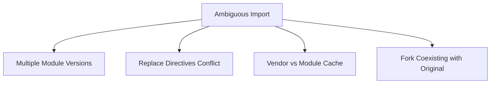

# How to Fix "ambiguous import" Errors in Go

Author: [nawazdhandala](https://www.github.com/nawazdhandala)

Tags: Go, Golang, Errors, Import, Modules, Dependencies

Description: Learn how to fix "ambiguous import" errors in Go when multiple modules provide the same package path.

---

Ambiguous import errors occur when Go finds multiple modules that could provide the same package. This typically happens with module replacements, forks, or vendored dependencies.

---

## The Error

```
ambiguous import: found package github.com/user/pkg in multiple modules:
    github.com/user/pkg v1.0.0
    github.com/user/pkg/v2 v2.0.0
```

Or:

```
ambiguous import: found package example.com/pkg in multiple directories:
    /path/to/vendor/example.com/pkg
    /home/user/go/pkg/mod/example.com/pkg@v1.0.0
```

---

## Common Causes



---

## Solution 1: Clean Module Cache

```bash
# Clear module cache
go clean -modcache

# Re-download dependencies
go mod download

# Tidy to resolve
go mod tidy
```

---

## Solution 2: Fix Conflicting Versions

Check what's requiring different versions:

```bash
# Show module graph
go mod graph | grep problematic/package

# Show why a module is needed
go mod why -m github.com/user/pkg
```

Update `go.mod` to use consistent version:

```go
module myproject

go 1.21

require (
    github.com/user/pkg v1.5.0  // Use single version
)

// Remove or update conflicting replace
// replace github.com/user/pkg => ...
```

---

## Solution 3: Resolve Replace Conflicts

```go
// go.mod with conflict
module myproject

go 1.21

require (
    github.com/original/pkg v1.0.0
)

// This creates ambiguity:
replace github.com/original/pkg => github.com/fork/pkg v1.1.0
replace github.com/original/pkg => ../local/pkg

// FIX: Remove duplicate replace, keep one
replace github.com/original/pkg => github.com/fork/pkg v1.1.0
```

---

## Solution 4: Choose Between Vendor and Module

```bash
# Option A: Use vendor only
go build -mod=vendor ./...

# Option B: Use module cache only
rm -rf vendor/
go build ./...

# Option C: Regenerate vendor
rm -rf vendor/
go mod vendor
go build -mod=vendor ./...
```

---

## Solution 5: Fix Major Version Conflicts

When both v1 and v2 are imported:

```go
// go.mod
module myproject

go 1.21

require (
    github.com/user/pkg v1.5.0      // v1
    github.com/user/pkg/v2 v2.0.0   // v2
)
```

In your code, use explicit imports:

```go
package main

import (
    // v1 import
    pkgv1 "github.com/user/pkg"
    
    // v2 import with alias
    pkgv2 "github.com/user/pkg/v2"
)

func main() {
    pkgv1.DoSomething()
    pkgv2.DoSomethingNew()
}
```

---

## Solution 6: Fix Transitive Dependency Conflicts

When dependencies require different versions:

```bash
# Find the conflict
go mod graph | grep conflicting/pkg

# Output might show:
# myproject github.com/dep-a@v1.0.0
# github.com/dep-a@v1.0.0 github.com/conflicting/pkg@v1.0.0
# myproject github.com/dep-b@v1.0.0
# github.com/dep-b@v1.0.0 github.com/conflicting/pkg@v2.0.0
```

Force a specific version:

```go
// go.mod
module myproject

go 1.21

require (
    github.com/dep-a v1.0.0
    github.com/dep-b v1.0.0
    // Explicitly require the version you want
    github.com/conflicting/pkg v2.0.0
)
```

---

## Solution 7: Exclude Problematic Versions

```go
// go.mod
module myproject

go 1.21

require (
    github.com/user/pkg v1.5.0
)

// Exclude versions causing issues
exclude (
    github.com/user/pkg v1.3.0
    github.com/user/pkg v1.4.0
)
```

---

## Debugging Ambiguous Imports

```bash
# Verbose build output
go build -v ./... 2>&1 | grep -i ambiguous

# List all module versions
go list -m all | grep pkg-name

# Show module location
go list -m -f '{{.Dir}}' github.com/user/pkg

# Check for duplicate packages
find . -name "go.mod" -exec grep -l "github.com/user/pkg" {} \;
```

---

## Workspace-Related Ambiguity

With Go workspaces (`go.work`):

```go
// go.work
go 1.21

use (
    ./module-a
    ./module-b
)

// If both modules define the same package, use replace
replace github.com/shared/pkg => ./shared-pkg
```

---

## Common Patterns

### Pattern 1: Fork Replacement

```go
// go.mod
module myproject

go 1.21

require (
    github.com/original/pkg v1.0.0
)

// Replace with your fork
replace github.com/original/pkg => github.com/yourfork/pkg v1.0.1-fixed

// Do NOT also require the fork directly
// require github.com/yourfork/pkg v1.0.1-fixed  // WRONG - creates ambiguity
```

### Pattern 2: Local Development

```go
// go.mod
module myproject

go 1.21

require (
    github.com/company/shared-lib v1.0.0
)

// For local development only
replace github.com/company/shared-lib => ../shared-lib
```

### Pattern 3: Monorepo

```
monorepo/
├── go.work
├── service-a/
│   └── go.mod
├── service-b/
│   └── go.mod
└── shared/
    └── go.mod
```

```go
// go.work
go 1.21

use (
    ./service-a
    ./service-b
    ./shared
)
```

---

## Prevention Strategies

1. **Use consistent versions across projects**

```bash
# Check all versions in use
go list -m all | sort | uniq
```

2. **Avoid multiple replace directives for same module**

```go
// Only one replace per module
replace github.com/pkg => ./local/pkg
```

3. **Clean regularly**

```bash
go mod tidy
go mod verify
```

4. **Use workspaces for multi-module development**

---

## Summary

| Cause | Solution |
|-------|----------|
| Multiple versions | Pin specific version |
| Replace conflicts | Remove duplicate replaces |
| Vendor + cache | Choose one build mode |
| Major versions | Use explicit import paths |
| Transitive deps | Explicitly require version |

**Quick Fix Commands:**

```bash
# Nuclear option
go clean -modcache
rm -rf vendor/
go mod tidy
go mod download
go mod verify
```

---

*Managing complex Go dependencies? [OneUptime](https://oneuptime.com) helps you track builds, monitor for dependency conflicts, and ensure your services stay healthy.*
