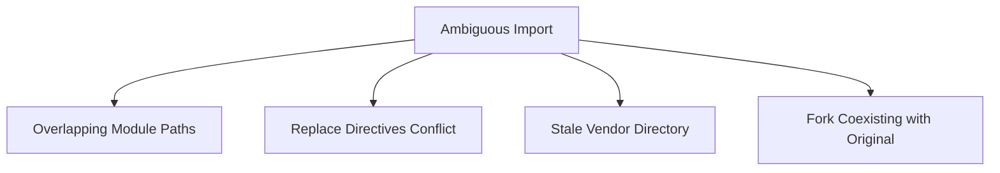

# How to Fix 'ambiguous import' Errors in Go

Author: [nawazdhandala](https://www.github.com/nawazdhandala)

Tags: Go, Golang, Error, Import, Module, Dependencies

Description: Learn how to fix 'ambiguous import' errors in Go when multiple modules provide the same package path.

---

Ambiguous import errors occur when Go finds multiple modules in the build list that provide the same package path. This typically happens with overlapping module paths, split modules, workspace replacements, forks, or stale vendored dependencies.

---

## The Error

```text
ambiguous import: found package github.com/user/pkg in multiple modules:
    github.com/user v1.0.0
    github.com/user/pkg v0.3.0
```

Or:

```text
ambiguous import: found package example.com/pkg in multiple modules:
    example.com/pkg v1.0.0
    example.com/monorepo v0.9.0
```

---

## Common Causes


```mermaid
graph TD
    A[Ambiguous Import] --> B[Overlapping Module Paths]
    A --> C[Replace Directives Conflict]
    A --> D[Stale Vendor Directory]
    A --> E[Fork Coexisting with Original]
```

---

## Solution 1: Clean Module Cache

Use this only when you suspect a corrupted module cache. If two modules really provide the same package path, clearing the cache will not remove the ambiguity.

```bash
# Clear module cache

go clean -modcache

# Re-download dependencies
go mod download

# Tidy to resolve
go mod tidy
```

---

## Solution 2: Fix Overlapping Modules

Check what's requiring overlapping module paths:

```bash
# Show module graph
go mod graph | grep github.com/user

# Show why a module is needed
go mod why -m github.com/user/pkg
```

Update `go.mod` so only one selected module provides the imported package path:

```go
module myproject

go 1.21

require (
    github.com/user v1.5.0
    // Remove github.com/user/pkg if github.com/user already provides github.com/user/pkg
)

// Remove or update conflicting replace
// replace github.com/user/pkg => ...
```

---

## Solution 3: Resolve Replace Conflicts

```go
// go.work with a workspace-level fix
go 1.21

use (
    ./module-a
    ./module-b
)

// Conflicting replace directives across workspace modules are disallowed.
// Override them once at the workspace level.
replace github.com/original/pkg => ../local/pkg
```

```go
// go.mod
module myproject

go 1.21

require github.com/original/pkg v1.0.0

// Keep one replacement target for the module.
replace github.com/original/pkg => github.com/fork/pkg v1.1.0
```

---

## Solution 4: Choose Between Vendor and Module

```bash
# Option A: Use vendor only
go build -mod=vendor ./...

# Option B: Use module cache only
go build -mod=mod ./...

# Option C: Regenerate vendor
go mod vendor
go build -mod=vendor ./...
```

---

## Solution 5: Fix Major Version Conflicts

Major versions v2 and higher use a `/vN` module path suffix, so v1 and v2 can coexist when the imports are explicit:

```go
// go.mod
module myproject

go 1.21

require (
    github.com/user/pkg v1.5.0      // v1
    github.com/user/pkg/v2 v2.0.0   // v2
)
```

In your code, use explicit imports:

```go
package main

import (
    // v1 import
    pkgv1 "github.com/user/pkg"
    
    // v2 import with alias
    pkgv2 "github.com/user/pkg/v2"
)

func main() {
    pkgv1.DoSomething()
    pkgv2.DoSomethingNew()
}
```

If a v2 module still declares the old module path or code imports v2 packages without the `/v2` suffix, fix the module path and imports instead of trying to force both versions onto the same package path.

---

## Solution 6: Fix Transitive Dependency Conflicts

When dependencies require modules that both contain the same package path:

```bash
# Find the conflict
go mod graph | grep example.com/mono

# Output might show:
# myproject github.com/dep-a@v1.0.0
# github.com/dep-a@v1.0.0 example.com/mono@v1.0.0
# myproject github.com/dep-b@v1.0.0
# github.com/dep-b@v1.0.0 example.com/mono/sub@v0.2.0
```

Upgrade, downgrade, or replace dependencies so only one module in the build list provides the package:

```go
// go.mod
module myproject

go 1.21

require (
    // dep-a v1.1.0 no longer requires example.com/mono
    github.com/dep-a v1.1.0
    github.com/dep-b v1.0.0
    example.com/mono/sub v0.2.0
)
```

---

## Solution 7: Exclude Problematic Versions

```go
// go.mod
module myproject

go 1.21

require (
    github.com/user/pkg v1.5.0
)

// Exclude versions causing issues so MVS selects another allowed version.
exclude (
    github.com/user/pkg v1.3.0
    github.com/user/pkg v1.4.0
)
```

---

## Debugging Ambiguous Imports

```bash
# Verbose build output
go build -v ./... 2>&1 | grep -i ambiguous

# List all module versions
go list -m all | grep pkg-name

# Show module location
go list -m -f '{{.Dir}}' github.com/user/pkg

# Check for module files that mention the package path
find . -name "go.mod" -exec grep -l "github.com/user/pkg" {} \;
```

---

## Workspace-Related Ambiguity

With Go workspaces (`go.work`):

```go
// go.work
go 1.21

use (
    ./module-a
    ./module-b
)

// If workspace modules have conflicting replacements, override them here.
replace github.com/shared/pkg => ./shared-pkg
```

---

## Common Patterns

### Pattern 1: Fork Replacement

```go
// go.mod
module myproject

go 1.21

require (
    github.com/original/pkg v1.0.0
)

// Replace with your fork
replace github.com/original/pkg => github.com/yourfork/pkg v1.0.1-fixed

// Do NOT also require or import the fork under a second module path.
// require github.com/yourfork/pkg v1.0.1-fixed  // WRONG - keep one module identity
```

### Pattern 2: Local Development

```go
// go.mod
module myproject

go 1.21

require (
    github.com/company/shared-lib v1.0.0
)

// For local development only
replace github.com/company/shared-lib => ../shared-lib
```

### Pattern 3: Monorepo

```text
monorepo/
├── go.work
├── service-a/
│   └── go.mod
├── service-b/
│   └── go.mod
└── shared/
    └── go.mod
```

```go
// go.work
go 1.21

use (
    ./service-a
    ./service-b
    ./shared
)
```

---

## Prevention Strategies

1. **Use consistent versions across projects**

```bash
# Check all versions in use
go list -m all | sort | uniq
```

2. **Avoid multiple replace directives for same module**

```go
// Only one replace per module
replace github.com/pkg => ./local/pkg
```

3. **Clean regularly**

```bash
go mod tidy
go mod verify
```

4. **Use workspaces for multi-module development**

---

## Summary

| Cause | Solution |
|-------|----------|
| Overlapping modules | Keep one provider for the package path |
| Replace conflicts | Remove duplicate replaces |
| Stale vendor directory | Regenerate vendor or use `-mod=mod` |
| Major versions | Use explicit import paths |
| Transitive deps | Upgrade or replace dependencies |

**Quick Fix Commands:**

```bash
# Cleanup after fixing the module graph
go clean -modcache
go mod tidy
go mod download
go mod vendor
go mod verify
```

---

*Managing complex Go dependencies? [OneUptime](https://oneuptime.com) helps you track builds, monitor for dependency conflicts, and ensure your services stay healthy.*
