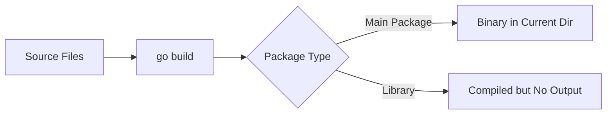

# How to Understand go build vs go install in Go

Author: [nawazdhandala](https://www.github.com/nawazdhandala)

Tags: Go, Golang, go build, go install, Compilation, CLI Tools, Binary

Description: Learn the differences between go build and go install commands, when to use each, and how they interact with modules and the Go toolchain.

---

Two of the most common Go commands are `go build` and `go install`. They seem similar but serve different purposes. This guide explains when and how to use each.

---

## Quick Comparison

| Command | Output Location | Use Case |
|---------|-----------------|----------|
| `go build` | Current directory (or temp) | Development, testing |
| `go install` | `$GOPATH/bin` or `$GOBIN` | Installing tools, distribution |

---

## go build

`go build` compiles packages and dependencies but doesn't install the result.

### Basic Usage

```bash
# Build current package
go build

# Build specific package
go build ./cmd/myapp

# Build with custom output name
go build -o myapp ./cmd/myapp

# Build for different OS/architecture
GOOS=linux GOARCH=amd64 go build -o myapp-linux ./cmd/myapp
```

### What Happens



For a main package, `go build` creates an executable in the current directory:

```bash
# Project structure
myapp/
  main.go
  
# Run build
cd myapp
go build

# Result
myapp/
  main.go
  myapp      # <- Binary created here
```

For library packages, `go build` compiles but produces no output file (useful for checking if code compiles).

---

## go install

`go install` compiles and installs packages to `$GOBIN` (or `$GOPATH/bin` if `$GOBIN` is not set).

### Basic Usage

```bash
# Install current package
go install

# Install specific package
go install ./cmd/myapp

# Install remote package (tool)
go install github.com/golangci/golangci-lint/cmd/golangci-lint@latest

# Install specific version
go install github.com/some/tool@v1.2.3
```

### What Happens


```bash
# Check where binaries are installed
go env GOBIN
go env GOPATH

# Typical location
# $HOME/go/bin/myapp
```

---

## Practical Examples

### Example 1: Developing a CLI Tool

```bash
# During development - use go build
cd ~/projects/mytool
go build -o mytool
./mytool --help  # Test locally

# When ready to use system-wide
go install
mytool --help  # Available anywhere (if $GOBIN in PATH)
```

### Example 2: Building for Multiple Platforms

```bash
# go build is better for cross-compilation
GOOS=linux GOARCH=amd64 go build -o dist/myapp-linux-amd64
GOOS=darwin GOARCH=amd64 go build -o dist/myapp-darwin-amd64
GOOS=windows GOARCH=amd64 go build -o dist/myapp-windows-amd64.exe

# go install always targets the current platform
```

### Example 3: Installing Go Tools

```bash
# Install commonly used tools
go install golang.org/x/tools/cmd/goimports@latest
go install github.com/golangci/golangci-lint/cmd/golangci-lint@latest
go install github.com/go-delve/delve/cmd/dlv@latest

# These are now available as commands
goimports --help
golangci-lint --help
dlv --help
```

---

## Build Flags

Both commands support similar flags:

```bash
# Verbose output
go build -v ./...

# Remove debug info (smaller binary)
go build -ldflags="-s -w" -o myapp

# Inject version information
go build -ldflags="-X main.version=1.0.0" -o myapp

# Race detector
go build -race -o myapp

# Show what would be built
go build -n ./...

# Force rebuild
go build -a ./...
```

---

## Module Mode vs GOPATH Mode

### Module Mode (Modern, Recommended)

```bash
# With go.mod present
go build ./...     # Build all packages
go install ./...   # Install all main packages

# Install remote tools
go install github.com/some/tool@latest
```

### GOPATH Mode (Legacy)

```bash
# Without modules (deprecated)
export GO111MODULE=off
go get github.com/some/tool  # Downloads AND installs

# This is why go install @version was introduced - 
# to separate downloading from installing
```

---

## go build Output Location

### Main Packages

```bash
# Named after directory by default
cd myproject
go build  # Creates ./myproject

# Custom name
go build -o app
go build -o bin/app
```

### Specifying Output Directory

```bash
# Build to specific location
go build -o ./bin/ ./cmd/...

# Build all commands
go build -o ./dist/ ./cmd/app1 ./cmd/app2
```

### Library Packages

```bash
# Building a library does nothing visible
go build ./pkg/mylib  # No output file, just validates

# But it does cache the compilation
# Check build cache
go env GOCACHE
```

---

## go install Behavior

### Local Packages

```bash
# Install from current module
go install ./cmd/myapp

# Binary goes to $GOBIN or $GOPATH/bin
ls $(go env GOBIN)
```

### Remote Packages

```bash
# Install with version (required for remote)
go install github.com/user/repo@latest
go install github.com/user/repo@v1.2.3
go install github.com/user/repo@commit-hash

# Cannot install remote without version
go install github.com/user/repo  # Error in module mode
```

---

## Build Cache

Both commands use the build cache:

```bash
# View cache location
go env GOCACHE

# Clear cache
go clean -cache

# The cache speeds up rebuilds
time go build  # First build: slow
time go build  # Second build: fast (cached)
```

---

## Common Patterns

### Development Workflow

```bash
#!/bin/bash
# dev.sh - Development build script

# Build for current platform
go build -o ./bin/myapp ./cmd/myapp

# Run with arguments
./bin/myapp "$@"
```

### Release Workflow

```bash
#!/bin/bash
# release.sh - Build for all platforms

VERSION=$(git describe --tags)

PLATFORMS=("linux/amd64" "darwin/amd64" "darwin/arm64" "windows/amd64")

for PLATFORM in "${PLATFORMS[@]}"; do
    GOOS=${PLATFORM%/*}
    GOARCH=${PLATFORM#*/}
    OUTPUT="dist/myapp-${GOOS}-${GOARCH}"
    
    if [ "$GOOS" = "windows" ]; then
        OUTPUT="${OUTPUT}.exe"
    fi
    
    echo "Building $OUTPUT..."
    GOOS=$GOOS GOARCH=$GOARCH go build \
        -ldflags="-s -w -X main.version=${VERSION}" \
        -o "$OUTPUT" \
        ./cmd/myapp
done
```

### Install Script

```bash
#!/bin/bash
# install.sh - Install development tools

tools=(
    "golang.org/x/tools/cmd/goimports@latest"
    "github.com/golangci/golangci-lint/cmd/golangci-lint@latest"
    "github.com/cosmtrek/air@latest"
)

for tool in "${tools[@]}"; do
    echo "Installing $tool..."
    go install "$tool"
done
```

---

## Troubleshooting

### Binary Not Found After go install

```bash
# Check if GOBIN is in PATH
echo $PATH | grep -q "$(go env GOBIN)" && echo "GOBIN in PATH" || echo "Add GOBIN to PATH"

# Add to ~/.bashrc or ~/.zshrc
export PATH="$PATH:$(go env GOPATH)/bin"
```

### Wrong Binary Built

```bash
# Ensure you're in the right directory
pwd
ls go.mod

# Clean and rebuild
go clean
go build
```

### Cross-Compilation Issues

```bash
# Some packages need CGO
CGO_ENABLED=0 go build -o myapp  # Disable CGO for static binary

# Or use specific cross-compile toolchain
CGO_ENABLED=1 CC=x86_64-linux-musl-gcc go build -o myapp
```

---

## Summary

Use `go build` when:

- Developing and testing locally
- Cross-compiling for different platforms
- Building with custom output names
- Creating release binaries

Use `go install` when:

- Installing CLI tools for personal use
- Making tools available system-wide
- Installing development tools like linters

**Key Differences:**

| Feature | go build | go install |
|---------|----------|------------|
| Output location | Current dir / specified | $GOBIN |
| Cross-compilation | Yes | No (current platform only) |
| Remote packages | No | Yes (with @version) |
| Output naming | Customizable | Fixed (package name) |

---

*Deploying Go applications? [OneUptime](https://oneuptime.com) provides comprehensive monitoring and observability to ensure your services run smoothly in production.*
