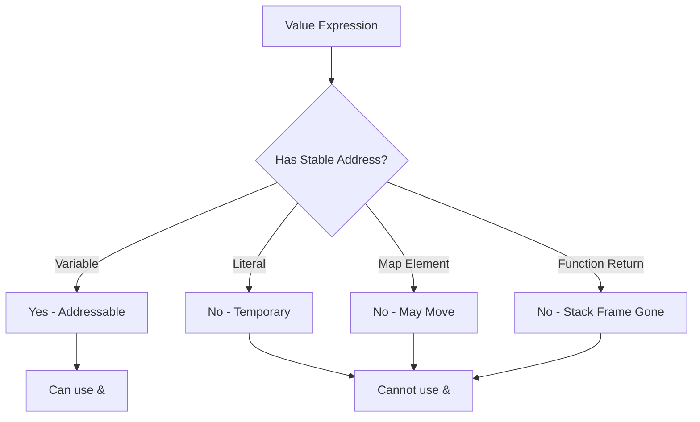

# How to Fix 'cannot take address of' Errors in Go

Author: [nawazdhandala](https://www.github.com/nawazdhandala)

Tags: Go, Golang, Errors, Pointers, Address, Memory

Description: Learn how to fix 'cannot take address of' errors in Go when trying to get pointers to temporary values, literals, and map values.

---

The "cannot take address of" error occurs when you try to use the `&` operator on values that don't have a memory address you can reference, such as literals, temporary values, and map elements.

---

## Common Scenarios

### Scenario 1: Address of Literal

**Problem:**

```go
package main

func main() {
    // Error: cannot take address of 42
    ptr := &42
    
    // Error: cannot take address of "hello"
    strPtr := &"hello"
}
```

**Solution:**

```go
package main

import "fmt"

func main() {
    // Store in variable first
    num := 42
    ptr := &num
    
    str := "hello"
    strPtr := &str
    
    fmt.Println(*ptr, *strPtr)
}

// Or use helper function
func IntPtr(i int) *int {
    return &i
}

func StringPtr(s string) *string {
    return &s
}
```

---

### Scenario 2: Address of Map Element

**Problem:**

```go
package main

type User struct {
    Name string
    Age  int
}

func main() {
    users := map[string]User{
        "alice": {Name: "Alice", Age: 30},
    }
    
    // Error: cannot take address of users["alice"]
    ptr := &users["alice"]
    
    // Error: cannot take address of users["alice"].Age
    users["alice"].Age = 31
}
```

**Why?** Map values may be relocated during map growth, making pointers unstable.

**Solution:**

```go
package main

import "fmt"

type User struct {
    Name string
    Age  int
}

func main() {
    // Option 1: Store pointers in map
    users := map[string]*User{
        "alice": {Name: "Alice", Age: 30},
    }
    
    users["alice"].Age = 31  // Works!
    fmt.Println(users["alice"])
    
    // Option 2: Get, modify, put back
    users2 := map[string]User{
        "bob": {Name: "Bob", Age: 25},
    }
    
    user := users2["bob"]
    user.Age = 26
    users2["bob"] = user  // Put back modified value
    
    fmt.Println(users2["bob"])
}
```

---

### Scenario 3: Address of Function Return Value

**Problem:**

```go
package main

func getValue() int {
    return 42
}

func main() {
    // Error: cannot take address of getValue()
    ptr := &getValue()
}
```

**Solution:**

```go
package main

import "fmt"

func getValue() int {
    return 42
}

func getValuePtr() *int {
    v := 42
    return &v
}

func main() {
    // Option 1: Assign to variable first
    val := getValue()
    ptr := &val
    
    // Option 2: Return pointer from function
    ptr2 := getValuePtr()
    
    fmt.Println(*ptr, *ptr2)
}
```

---

### Scenario 4: Address of Constant

**Problem:**

```go
package main

const MaxSize = 100

func main() {
    // Error: cannot take address of MaxSize
    ptr := &MaxSize
}
```

**Solution:**

```go
package main

import "fmt"

const MaxSize = 100

func main() {
    // Copy to variable
    maxSize := MaxSize
    ptr := &maxSize
    
    fmt.Println(*ptr)
}
```

---

### Scenario 5: Address of Type Conversion Result

**Problem:**

```go
package main

func main() {
    var x int32 = 10
    
    // Error: cannot take address of int64(x)
    ptr := &int64(x)
}
```

**Solution:**

```go
package main

import "fmt"

func main() {
    var x int32 = 10
    
    // Assign conversion result first
    y := int64(x)
    ptr := &y
    
    fmt.Println(*ptr)
}
```

---

### Scenario 6: Address of Composite Literal Elements

**Problem:**

```go
package main

type Point struct {
    X, Y int
}

func main() {
    // Error: cannot take address of Point{X: 1, Y: 2}.X
    ptr := &Point{X: 1, Y: 2}.X
}
```

**Solution:**

```go
package main

import "fmt"

type Point struct {
    X, Y int
}

func main() {
    // Take address of whole literal
    p := &Point{X: 1, Y: 2}
    ptr := &p.X  // Now we can take address of field
    
    fmt.Println(*ptr)
    
    // Or assign literal first
    point := Point{X: 1, Y: 2}
    xPtr := &point.X
    
    fmt.Println(*xPtr)
}
```

---

## Helper Functions Pattern

```go
package main

import "fmt"

// Generic pointer helper (Go 1.18+)
func Ptr[T any](v T) *T {
    return &v
}

// Type-specific helpers (pre-generics)
func IntPtr(v int) *int          { return &v }
func StringPtr(v string) *string { return &v }
func BoolPtr(v bool) *bool       { return &v }
func Float64Ptr(v float64) *float64 { return &v }

type Config struct {
    Host    *string
    Port    *int
    Enabled *bool
}

func main() {
    // Using helpers for optional fields
    cfg := Config{
        Host:    StringPtr("localhost"),
        Port:    IntPtr(8080),
        Enabled: BoolPtr(true),
    }
    
    fmt.Printf("Host: %s, Port: %d, Enabled: %v\n",
        *cfg.Host, *cfg.Port, *cfg.Enabled)
    
    // Using generic helper
    strPtr := Ptr("hello")
    intPtr := Ptr(42)
    
    fmt.Println(*strPtr, *intPtr)
}
```

---

## Why This Restriction Exists



**Addressable values:**
- Variables
- Pointer indirections (`*p`)
- Slice indexing (`s[i]`)
- Field of addressable struct (`x.field`)
- Array indexing of addressable array

**Non-addressable:**
- Literals
- Constants
- Map index expressions
- Function/method calls
- Type conversions
- Parenthesized non-addressable expressions

---

## Summary

| Cannot Take Address Of | Solution |
|------------------------|----------|
| Literal | Assign to variable first |
| Map element | Use pointer values in map |
| Function return | Return pointer from function |
| Constant | Copy to variable |
| Type conversion | Store result in variable |

**Best Practices:**

1. Use helper functions for pointer creation
2. Store pointers in maps for mutable values
3. Return pointers from functions when needed
4. Understand which expressions are addressable
5. Use generics for type-safe pointer helpers

---

*Debugging pointer issues in Go? [OneUptime](https://oneuptime.com) helps you monitor your applications and track memory-related issues in production.*
