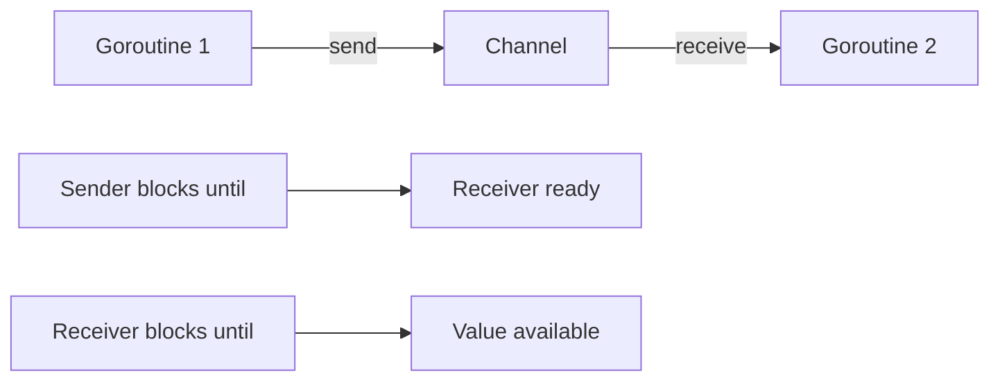

# How to Use Channels for Goroutine Communication in Go

Author: [nawazdhandala](https://www.github.com/nawazdhandala)

Tags: Go, Golang, Channels, Goroutines, Concurrency, Communication

Description: Learn how to use channels effectively in Go for safe communication between goroutines, including buffered channels, select, and common patterns.

---

Channels are Go's primary mechanism for communication between goroutines. They provide a way to send and receive values safely without explicit locks or condition variables.

---

## Basic Channel Operations

```go
package main

import "fmt"

func main() {
    // Create unbuffered channel
    ch := make(chan string)
    
    // Send in goroutine
    go func() {
        ch <- "Hello from goroutine!"
    }()
    
    // Receive in main
    msg := <-ch
    fmt.Println(msg)
}
```

---

## Channel Types

```go
package main

import "fmt"

func main() {
    // Unbuffered channel - synchronous
    unbuffered := make(chan int)
    
    // Buffered channel - async up to capacity
    buffered := make(chan int, 3)
    
    // Send-only channel
    var sendOnly chan<- int = buffered
    
    // Receive-only channel
    var recvOnly <-chan int = buffered
    
    // Send without blocking (buffered has space)
    buffered <- 1
    buffered <- 2
    buffered <- 3
    
    fmt.Println(<-buffered)  // 1
    fmt.Println(cap(buffered))  // 3
    
    _ = sendOnly
    _ = recvOnly
    _ = unbuffered
}
```

---

## Channel Flow Diagram



---

## Worker Pattern

```go
package main

import (
    "fmt"
    "sync"
)

func worker(id int, jobs <-chan int, results chan<- int, wg *sync.WaitGroup) {
    defer wg.Done()
    
    for job := range jobs {
        fmt.Printf("Worker %d processing job %d\n", id, job)
        results <- job * 2
    }
}

func main() {
    jobs := make(chan int, 100)
    results := make(chan int, 100)
    
    var wg sync.WaitGroup
    
    // Start workers
    for w := 1; w <= 3; w++ {
        wg.Add(1)
        go worker(w, jobs, results, &wg)
    }
    
    // Send jobs
    for j := 1; j <= 9; j++ {
        jobs <- j
    }
    close(jobs)
    
    // Wait and close results
    go func() {
        wg.Wait()
        close(results)
    }()
    
    // Collect results
    for result := range results {
        fmt.Println("Result:", result)
    }
}
```

---

## Select Statement

```go
package main

import (
    "fmt"
    "time"
)

func main() {
    ch1 := make(chan string)
    ch2 := make(chan string)
    
    go func() {
        time.Sleep(100 * time.Millisecond)
        ch1 <- "from ch1"
    }()
    
    go func() {
        time.Sleep(200 * time.Millisecond)
        ch2 <- "from ch2"
    }()
    
    // Wait for first available
    for i := 0; i < 2; i++ {
        select {
        case msg1 := <-ch1:
            fmt.Println("Received:", msg1)
        case msg2 := <-ch2:
            fmt.Println("Received:", msg2)
        }
    }
}
```

---

## Timeout with Select

```go
package main

import (
    "fmt"
    "time"
)

func main() {
    ch := make(chan string)
    
    go func() {
        time.Sleep(2 * time.Second)
        ch <- "result"
    }()
    
    select {
    case result := <-ch:
        fmt.Println("Got result:", result)
    case <-time.After(1 * time.Second):
        fmt.Println("Timeout!")
    }
}
```

---

## Non-Blocking Operations

```go
package main

import "fmt"

func main() {
    ch := make(chan int, 1)
    
    // Non-blocking send
    select {
    case ch <- 42:
        fmt.Println("Sent successfully")
    default:
        fmt.Println("Channel full, cannot send")
    }
    
    // Non-blocking receive
    select {
    case val := <-ch:
        fmt.Println("Received:", val)
    default:
        fmt.Println("No value available")
    }
}
```

---

## Fan-Out / Fan-In

```go
package main

import (
    "fmt"
    "sync"
)

func producer(nums ...int) <-chan int {
    out := make(chan int)
    go func() {
        defer close(out)
        for _, n := range nums {
            out <- n
        }
    }()
    return out
}

func square(in <-chan int) <-chan int {
    out := make(chan int)
    go func() {
        defer close(out)
        for n := range in {
            out <- n * n
        }
    }()
    return out
}

func merge(channels ...<-chan int) <-chan int {
    var wg sync.WaitGroup
    out := make(chan int)
    
    output := func(ch <-chan int) {
        defer wg.Done()
        for n := range ch {
            out <- n
        }
    }
    
    wg.Add(len(channels))
    for _, ch := range channels {
        go output(ch)
    }
    
    go func() {
        wg.Wait()
        close(out)
    }()
    
    return out
}

func main() {
    in := producer(1, 2, 3, 4, 5)
    
    // Fan out to multiple workers
    c1 := square(in)
    c2 := square(in)
    
    // Fan in results
    for result := range merge(c1, c2) {
        fmt.Println(result)
    }
}
```

---

## Pipeline Pattern

```go
package main

import "fmt"

func generate(nums ...int) <-chan int {
    out := make(chan int)
    go func() {
        defer close(out)
        for _, n := range nums {
            out <- n
        }
    }()
    return out
}

func double(in <-chan int) <-chan int {
    out := make(chan int)
    go func() {
        defer close(out)
        for n := range in {
            out <- n * 2
        }
    }()
    return out
}

func addOne(in <-chan int) <-chan int {
    out := make(chan int)
    go func() {
        defer close(out)
        for n := range in {
            out <- n + 1
        }
    }()
    return out
}

func main() {
    // Chain: generate -> double -> addOne
    pipeline := addOne(double(generate(1, 2, 3, 4, 5)))
    
    for result := range pipeline {
        fmt.Println(result)  // 3, 5, 7, 9, 11
    }
}
```

---

## Cancellation with Done Channel

```go
package main

import (
    "fmt"
    "time"
)

func worker(done <-chan struct{}, jobs <-chan int) {
    for {
        select {
        case <-done:
            fmt.Println("Worker: shutting down")
            return
        case job := <-jobs:
            fmt.Println("Worker: processing", job)
            time.Sleep(100 * time.Millisecond)
        }
    }
}

func main() {
    done := make(chan struct{})
    jobs := make(chan int)
    
    go worker(done, jobs)
    
    // Send some jobs
    for i := 1; i <= 5; i++ {
        jobs <- i
    }
    
    // Signal shutdown
    close(done)
    
    time.Sleep(200 * time.Millisecond)
    fmt.Println("Main: done")
}
```

---

## Semaphore Pattern

```go
package main

import (
    "fmt"
    "sync"
    "time"
)

func main() {
    // Semaphore with capacity 3
    sem := make(chan struct{}, 3)
    
    var wg sync.WaitGroup
    
    for i := 1; i <= 10; i++ {
        wg.Add(1)
        go func(id int) {
            defer wg.Done()
            
            // Acquire semaphore
            sem <- struct{}{}
            defer func() { <-sem }()  // Release
            
            fmt.Printf("Worker %d: starting\n", id)
            time.Sleep(time.Second)
            fmt.Printf("Worker %d: done\n", id)
        }(i)
    }
    
    wg.Wait()
}
```

---

## Broadcast Pattern

```go
package main

import (
    "fmt"
    "sync"
    "time"
)

type Broadcaster struct {
    mu        sync.RWMutex
    listeners []chan string
}

func (b *Broadcaster) Subscribe() <-chan string {
    b.mu.Lock()
    defer b.mu.Unlock()
    
    ch := make(chan string, 1)
    b.listeners = append(b.listeners, ch)
    return ch
}

func (b *Broadcaster) Broadcast(msg string) {
    b.mu.RLock()
    defer b.mu.RUnlock()
    
    for _, ch := range b.listeners {
        select {
        case ch <- msg:
        default:
            // Skip if buffer full
        }
    }
}

func main() {
    b := &Broadcaster{}
    
    // Create listeners
    for i := 1; i <= 3; i++ {
        ch := b.Subscribe()
        go func(id int, ch <-chan string) {
            for msg := range ch {
                fmt.Printf("Listener %d: %s\n", id, msg)
            }
        }(i, ch)
    }
    
    // Broadcast messages
    b.Broadcast("Hello!")
    b.Broadcast("World!")
    
    time.Sleep(100 * time.Millisecond)
}
```

---

## Common Mistakes

```go
package main

import "fmt"

func main() {
    // Mistake 1: Sending on closed channel (panic)
    ch := make(chan int)
    close(ch)
    // ch <- 1  // panic: send on closed channel
    
    // Mistake 2: Closing nil channel (panic)
    var nilCh chan int
    // close(nilCh)  // panic: close of nil channel
    
    // Mistake 3: Forgetting to close, causing deadlock
    ch2 := make(chan int)
    go func() {
        ch2 <- 1
        // forgot close(ch2)
    }()
    _ = <-ch2
    // for v := range ch2 {}  // Would block forever
    
    fmt.Println("Examples of what NOT to do")
}
```

---

## Summary

| Pattern | Use Case |
|---------|----------|
| Unbuffered | Synchronization point |
| Buffered | Async communication with limit |
| Select | Multiple channel operations |
| Timeout | Prevent blocking forever |
| Done channel | Cancellation |
| Semaphore | Limit concurrency |
| Pipeline | Data transformation |
| Fan-out/Fan-in | Parallel processing |

**Best Practices:**

1. Always close channels from the sender side
2. Use buffered channels when sender/receiver speeds differ
3. Use select for timeouts and multiple channels
4. Check for closed channels with `val, ok := <-ch`
5. Use context for cancellation in production code
6. Document channel ownership clearly

---

*Building concurrent Go applications? [OneUptime](https://oneuptime.com) helps you monitor goroutine health, track channel metrics, and identify deadlocks in production.*
