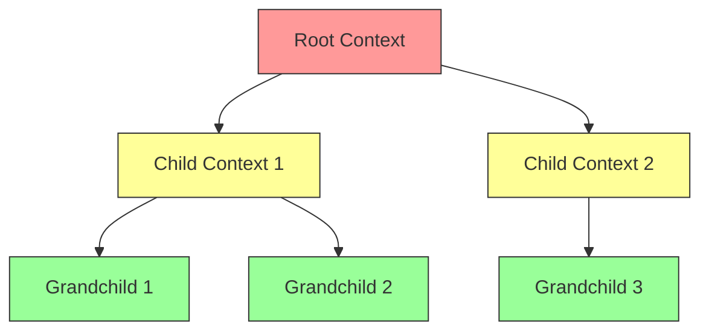

# How Context Cancellation Propagates in Go

Author: [nawazdhandala](https://www.github.com/nawazdhandala)

Tags: Go, Golang, Context, Cancellation, Goroutines, Concurrency

Description: Learn how context cancellation propagates through goroutine hierarchies in Go, including best practices for graceful shutdown and resource cleanup.

---

Context cancellation in Go propagates from parent to all children automatically. Understanding this mechanism is crucial for building responsive, resource-efficient applications that clean up properly.

---

## Basic Cancellation Propagation

```go
package main

import (
    "context"
    "fmt"
    "time"
)

func main() {
    // Create a cancellable context
    ctx, cancel := context.WithCancel(context.Background())
    
    // Start a goroutine
    go worker(ctx, "Worker-1")
    
    // Let it run for a bit
    time.Sleep(2 * time.Second)
    
    // Cancel the context
    fmt.Println("Main: cancelling context")
    cancel()
    
    // Give worker time to clean up
    time.Sleep(500 * time.Millisecond)
    fmt.Println("Main: done")
}

func worker(ctx context.Context, name string) {
    for {
        select {
        case <-ctx.Done():
            fmt.Printf("%s: context cancelled - %v\n", name, ctx.Err())
            return
        default:
            fmt.Printf("%s: working...\n", name)
            time.Sleep(500 * time.Millisecond)
        }
    }
}
```

---

## Parent-Child Context Hierarchy

```go
package main

import (
    "context"
    "fmt"
    "time"
)

func main() {
    // Root context
    rootCtx, rootCancel := context.WithCancel(context.Background())
    
    // Child context from root
    childCtx, _ := context.WithCancel(rootCtx)
    
    // Grandchild context from child
    grandchildCtx, _ := context.WithCancel(childCtx)
    
    // Start workers at each level
    go worker(rootCtx, "Root-Worker")
    go worker(childCtx, "Child-Worker")
    go worker(grandchildCtx, "Grandchild-Worker")
    
    time.Sleep(1 * time.Second)
    
    // Cancel root - all descendants cancel too
    fmt.Println("\n--- Cancelling root context ---\n")
    rootCancel()
    
    time.Sleep(500 * time.Millisecond)
}

func worker(ctx context.Context, name string) {
    for {
        select {
        case <-ctx.Done():
            fmt.Printf("%s: stopped (reason: %v)\n", name, ctx.Err())
            return
        default:
            fmt.Printf("%s: running\n", name)
            time.Sleep(200 * time.Millisecond)
        }
    }
}
```

**Output:**
```
Root-Worker: running
Child-Worker: running
Grandchild-Worker: running
...

--- Cancelling root context ---

Root-Worker: stopped (reason: context canceled)
Child-Worker: stopped (reason: context canceled)
Grandchild-Worker: stopped (reason: context canceled)
```

---

## Cancellation Propagation Flow



When root cancels, all contexts cancel.

---

## Timeout Context Propagation

```go
package main

import (
    "context"
    "fmt"
    "time"
)

func main() {
    // Parent with 3 second timeout
    parentCtx, parentCancel := context.WithTimeout(
        context.Background(),
        3*time.Second,
    )
    defer parentCancel()
    
    // Child with 5 second timeout (ineffective - parent shorter)
    childCtx, childCancel := context.WithTimeout(parentCtx, 5*time.Second)
    defer childCancel()
    
    // Grandchild with 1 second timeout (effective - shorter than parent)
    grandchildCtx, grandchildCancel := context.WithTimeout(childCtx, 1*time.Second)
    defer grandchildCancel()
    
    fmt.Println("Starting workers...")
    
    go worker(parentCtx, "Parent")
    go worker(childCtx, "Child")
    go worker(grandchildCtx, "Grandchild")
    
    time.Sleep(4 * time.Second)
}

func worker(ctx context.Context, name string) {
    start := time.Now()
    <-ctx.Done()
    fmt.Printf("%s cancelled after %v: %v\n", 
        name, time.Since(start).Round(time.Millisecond), ctx.Err())
}
```

**Output:**
```
Starting workers...
Grandchild cancelled after 1000ms: context deadline exceeded
Parent cancelled after 3000ms: context deadline exceeded
Child cancelled after 3000ms: context deadline exceeded
```

---

## Deep Propagation Example

```go
package main

import (
    "context"
    "fmt"
    "sync"
    "time"
)

type Service struct {
    name string
}

func (s *Service) Start(ctx context.Context, wg *sync.WaitGroup) {
    defer wg.Done()
    
    fmt.Printf("[%s] Starting\n", s.name)
    
    ticker := time.NewTicker(200 * time.Millisecond)
    defer ticker.Stop()
    
    for {
        select {
        case <-ctx.Done():
            fmt.Printf("[%s] Shutting down: %v\n", s.name, ctx.Err())
            return
        case <-ticker.C:
            fmt.Printf("[%s] Heartbeat\n", s.name)
        }
    }
}

func startSubsystem(ctx context.Context, name string, wg *sync.WaitGroup) {
    subsystemCtx, cancel := context.WithCancel(ctx)
    defer cancel()
    
    services := []*Service{
        {name: name + "-service-a"},
        {name: name + "-service-b"},
    }
    
    var serviceWg sync.WaitGroup
    for _, svc := range services {
        serviceWg.Add(1)
        go svc.Start(subsystemCtx, &serviceWg)
    }
    
    // Wait for parent cancellation
    <-ctx.Done()
    
    // Wait for services to stop
    serviceWg.Wait()
    fmt.Printf("[%s] All services stopped\n", name)
    wg.Done()
}

func main() {
    ctx, cancel := context.WithCancel(context.Background())
    
    var wg sync.WaitGroup
    
    // Start subsystems
    wg.Add(2)
    go startSubsystem(ctx, "subsystem-1", &wg)
    go startSubsystem(ctx, "subsystem-2", &wg)
    
    time.Sleep(1 * time.Second)
    
    fmt.Println("\n--- Initiating shutdown ---\n")
    cancel()
    
    wg.Wait()
    fmt.Println("All subsystems stopped")
}
```

---

## HTTP Request Context Propagation

```go
package main

import (
    "context"
    "fmt"
    "net/http"
    "time"
)

func handler(w http.ResponseWriter, r *http.Request) {
    ctx := r.Context()
    
    fmt.Println("Handler: started")
    
    // Simulate long operation
    select {
    case <-time.After(5 * time.Second):
        fmt.Fprintln(w, "Completed")
        fmt.Println("Handler: completed")
    case <-ctx.Done():
        // Client disconnected or timeout
        fmt.Println("Handler: cancelled -", ctx.Err())
        return
    }
}

func dbQuery(ctx context.Context) error {
    fmt.Println("DB: query started")
    
    select {
    case <-time.After(3 * time.Second):
        fmt.Println("DB: query completed")
        return nil
    case <-ctx.Done():
        fmt.Println("DB: query cancelled -", ctx.Err())
        return ctx.Err()
    }
}

func handlerWithDB(w http.ResponseWriter, r *http.Request) {
    ctx := r.Context()
    
    // Database query respects request context
    if err := dbQuery(ctx); err != nil {
        http.Error(w, "Database error", http.StatusInternalServerError)
        return
    }
    
    fmt.Fprintln(w, "Success")
}

func main() {
    http.HandleFunc("/slow", handler)
    http.HandleFunc("/db", handlerWithDB)
    
    fmt.Println("Server on :8080")
    http.ListenAndServe(":8080", nil)
}
```

---

## Context Propagation in Pipelines

```go
package main

import (
    "context"
    "fmt"
    "time"
)

func generator(ctx context.Context) <-chan int {
    out := make(chan int)
    go func() {
        defer close(out)
        for i := 0; ; i++ {
            select {
            case <-ctx.Done():
                fmt.Println("Generator: cancelled")
                return
            case out <- i:
                time.Sleep(100 * time.Millisecond)
            }
        }
    }()
    return out
}

func processor(ctx context.Context, in <-chan int) <-chan int {
    out := make(chan int)
    go func() {
        defer close(out)
        for n := range in {
            select {
            case <-ctx.Done():
                fmt.Println("Processor: cancelled")
                return
            case out <- n * 2:
            }
        }
        fmt.Println("Processor: input closed")
    }()
    return out
}

func consumer(ctx context.Context, in <-chan int) {
    for {
        select {
        case <-ctx.Done():
            fmt.Println("Consumer: cancelled")
            return
        case n, ok := <-in:
            if !ok {
                fmt.Println("Consumer: input closed")
                return
            }
            fmt.Println("Consumed:", n)
        }
    }
}

func main() {
    ctx, cancel := context.WithCancel(context.Background())
    
    // Build pipeline
    nums := generator(ctx)
    doubled := processor(ctx, nums)
    
    // Start consumer
    go consumer(ctx, doubled)
    
    // Let pipeline run
    time.Sleep(500 * time.Millisecond)
    
    // Cancel entire pipeline
    fmt.Println("\n--- Cancelling pipeline ---\n")
    cancel()
    
    time.Sleep(200 * time.Millisecond)
}
```

---

## Checking Cancellation Properly

```go
package main

import (
    "context"
    "fmt"
    "time"
)

func work(ctx context.Context, items []int) error {
    for i, item := range items {
        // Check cancellation at start of each iteration
        select {
        case <-ctx.Done():
            return fmt.Errorf("cancelled at item %d: %w", i, ctx.Err())
        default:
        }
        
        // Process item
        fmt.Printf("Processing item %d: %d\n", i, item)
        time.Sleep(300 * time.Millisecond)
        
        // Check again after long operation
        if ctx.Err() != nil {
            return fmt.Errorf("cancelled after processing %d: %w", i, ctx.Err())
        }
    }
    return nil
}

func main() {
    ctx, cancel := context.WithTimeout(context.Background(), 800*time.Millisecond)
    defer cancel()
    
    items := []int{1, 2, 3, 4, 5}
    
    if err := work(ctx, items); err != nil {
        fmt.Println("Error:", err)
    }
}
```

---

## Propagation with Values

```go
package main

import (
    "context"
    "fmt"
)

type contextKey string

const requestIDKey contextKey = "requestID"

func middleware(ctx context.Context) context.Context {
    return context.WithValue(ctx, requestIDKey, "req-12345")
}

func handler(ctx context.Context) {
    // Values propagate through hierarchy
    requestID := ctx.Value(requestIDKey)
    fmt.Println("Handler request ID:", requestID)
    
    // Create child context - values still accessible
    childCtx, cancel := context.WithCancel(ctx)
    defer cancel()
    
    childRequestID := childCtx.Value(requestIDKey)
    fmt.Println("Child request ID:", childRequestID)
}

func main() {
    ctx := context.Background()
    ctx = middleware(ctx)
    handler(ctx)
}
```

---

## Best Practices

```go
package main

import (
    "context"
    "fmt"
    "time"
)

// DO: Pass context as first parameter
func fetchData(ctx context.Context, id string) (string, error) {
    select {
    case <-ctx.Done():
        return "", ctx.Err()
    case <-time.After(100 * time.Millisecond):
        return "data-" + id, nil
    }
}

// DO: Create child context when needed
func processWithTimeout(ctx context.Context) error {
    childCtx, cancel := context.WithTimeout(ctx, 5*time.Second)
    defer cancel()  // Always defer cancel
    
    _, err := fetchData(childCtx, "123")
    return err
}

// DON'T: Store context in struct
type BadService struct {
    ctx context.Context  // Don't do this
}

// DO: Pass context per-call
type GoodService struct{}

func (s *GoodService) DoWork(ctx context.Context) error {
    select {
    case <-ctx.Done():
        return ctx.Err()
    default:
        return nil
    }
}

func main() {
    ctx := context.Background()
    
    svc := &GoodService{}
    svc.DoWork(ctx)
    
    fmt.Println("Done")
}
```

---

## Summary

| Aspect | Behavior |
|--------|----------|
| Cancel propagation | Parent to all children |
| Timeout inheritance | Shortest wins |
| Value inheritance | Children see parent values |
| Independent cancel | Child cancel does not affect parent |
| Done channel | Closes when context cancelled |

**Key Rules:**

1. Cancellation flows down, never up
2. Shorter timeout always wins
3. Always check `ctx.Done()` in loops
4. Always defer `cancel()` calls
5. Pass context as first parameter
6. Never store context in structs
7. Use `context.Background()` for root
8. Use `context.TODO()` when unsure

---

*Debugging context cancellation in production? [OneUptime](https://oneuptime.com) helps you trace request flows and identify where cancellations occur across your distributed systems.*
