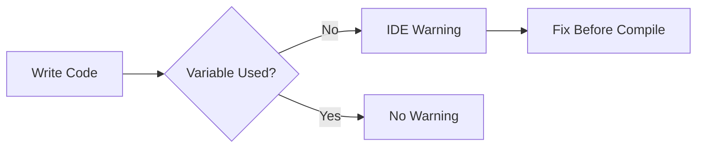

# How to Fix "declared and not used" Errors in Go

Author: [nawazdhandala](https://www.github.com/nawazdhandala)

Tags: Go, Golang, Errors, Variables, Unused, Compiler

Description: Learn how to fix the "declared and not used" error in Go by understanding why Go requires all variables to be used and various solutions.

---

Go enforces that all declared variables must be used. This error occurs when you declare a variable but never reference it in your code.

---

## The Error

```go
package main

func main() {
    x := 10  // declared and not used
}
```

**Error:**
```
./main.go:4:2: x declared and not used
```

---

## Why Go Enforces This

Go designers believe unused variables often indicate bugs or incomplete code. The compiler helps catch these issues early rather than leaving dead code.

---

## Solution 1: Use the Variable

The most straightforward fix - use the variable:

```go
package main

import "fmt"

func main() {
    x := 10
    fmt.Println(x)  // Now x is used
}
```

---

## Solution 2: Blank Identifier

Use `_` to explicitly ignore a value:

```go
package main

import "fmt"

func main() {
    // When you need to call a function but don't need all returns
    result, _ := someFunction()
    fmt.Println(result)
}

func someFunction() (int, error) {
    return 42, nil
}
```

---

## Solution 3: Remove the Variable

If you don't need the variable, remove it:

```go
package main

func main() {
    // Before: x := 10
    // After: variable removed
    
    doSomething()
}

func doSomething() {}
```

---

## Common Scenarios

### Unused Loop Variable

```go
package main

import "fmt"

func main() {
    items := []string{"a", "b", "c"}
    
    // Error: i declared and not used
    // for i, item := range items {
    //     fmt.Println(item)
    // }
    
    // Fix: use blank identifier for index
    for _, item := range items {
        fmt.Println(item)
    }
    
    // Or if you only need the index
    for i := range items {
        fmt.Println(i)
    }
}
```

### Unused Function Parameter

Function parameters are not subject to this rule:

```go
package main

// This is valid - unused parameters allowed
func handler(w ResponseWriter, r *Request) {
    // r is not used but no error
    w.Write([]byte("Hello"))
}

type ResponseWriter interface {
    Write([]byte) (int, error)
}
type Request struct{}
```

### Unused Error Return

```go
package main

import (
    "fmt"
    "os"
)

func main() {
    // Bad: ignoring error
    // file, _ := os.Open("file.txt")
    
    // Good: handle or explicitly ignore
    file, err := os.Open("file.txt")
    if err != nil {
        fmt.Println("Error:", err)
        return
    }
    defer file.Close()
    
    // Or use blank identifier if you truly want to ignore
    _ = someFunc()  // Explicitly ignored
}

func someFunc() error {
    return nil
}
```

---

## During Development

Sometimes you want to temporarily comment out code. Here are strategies:

### Temporary Assignment to Blank

```go
package main

func main() {
    x := complexCalculation()
    
    // Temporarily disable usage
    _ = x  // Prevents error while debugging
    
    // Later uncomment:
    // processResult(x)
}

func complexCalculation() int { return 42 }
```

### Conditional Compilation

```go
package main

import "fmt"

func main() {
    debug := true
    x := 10
    
    if debug {
        fmt.Println("Debug value:", x)
    }
}
```

---

## Multiple Unused Variables

```go
package main

import "fmt"

func main() {
    // Multiple returns from function
    a, b, c := multipleReturns()
    
    // If you only need 'b':
    // Error: a and c declared and not used
    
    // Fix:
    _, b2, _ := multipleReturns()
    fmt.Println(b, b2)
    
    _ = a  // Or explicitly ignore
    _ = c
}

func multipleReturns() (int, int, int) {
    return 1, 2, 3
}
```

---

## Package-Level Variables

Package-level variables don't cause this error:

```go
package main

var unused = 10  // No error at package level

func main() {
    // local := 20  // Error if not used
}
```

---

## IDE Integration

Most Go IDEs highlight unused variables:



---

## Build Tags for Debug Variables

```go
//go:build debug

package main

import "fmt"

var debugVar = 10

func main() {
    fmt.Println("Debug mode:", debugVar)
}
```

---

## Summary

| Scenario | Solution |
|----------|----------|
| Don't need value | Use `_` blank identifier |
| Need value later | Use it or assign to `_` temporarily |
| Multiple returns | Use `_` for unwanted values |
| Loop variable | Use `_` for index or value |
| Debug code | Conditional or build tags |

**Best Practices:**

1. Always use declared variables
2. Use `_` for intentionally ignored values
3. Don't silently ignore errors
4. Remove truly unused code
5. Use IDE support to catch issues early

---

*Building Go applications? [OneUptime](https://oneuptime.com) helps you monitor your services and catch errors before they impact users.*
