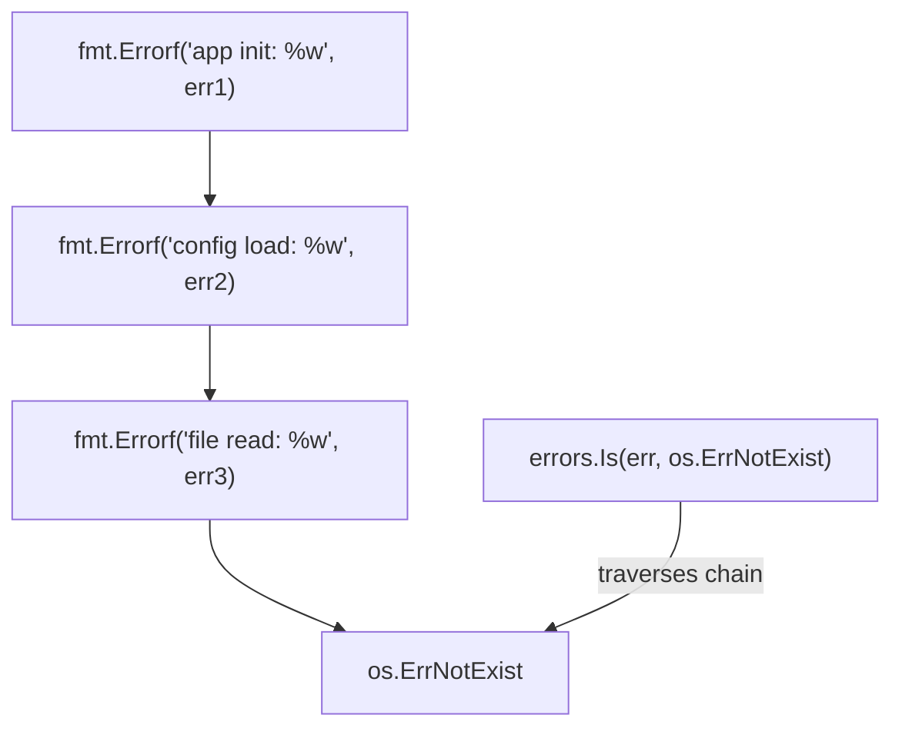

# How to Wrap Errors with %w in Go

Author: [nawazdhandala](https://www.github.com/nawazdhandala)

Tags: Go, Golang, Errors, Error Handling, Error Wrapping, fmt.Errorf

Description: Learn how to wrap errors in Go using %w with fmt.Errorf, create error chains, and use errors.Is and errors.As for proper error inspection.

---

Go 1.13 introduced error wrapping with the `%w` verb, allowing you to add context to errors while preserving the original error for inspection. This creates error chains that make debugging much easier.

---

## Basic Error Wrapping

```go
package main

import (
    "errors"
    "fmt"
    "os"
)

func readConfig(path string) ([]byte, error) {
    data, err := os.ReadFile(path)
    if err != nil {
        // Wrap the error with context
        return nil, fmt.Errorf("failed to read config file %s: %w", path, err)
    }
    return data, nil
}

func loadConfig() error {
    _, err := readConfig("/etc/app/config.json")
    if err != nil {
        // Wrap again with more context
        return fmt.Errorf("config initialization failed: %w", err)
    }
    return nil
}

func main() {
    err := loadConfig()
    if err != nil {
        fmt.Println("Error:", err)
        // Error: config initialization failed: failed to read config file /etc/app/config.json: open /etc/app/config.json: no such file or directory
    }
}
```

---

## %w vs %v: The Key Difference

```go
package main

import (
    "errors"
    "fmt"
)

var ErrNotFound = errors.New("not found")

func main() {
    // Using %v - loses the original error
    errV := fmt.Errorf("item lookup failed: %v", ErrNotFound)
    fmt.Println("With %v:", errors.Is(errV, ErrNotFound))  // false
    
    // Using %w - preserves the original error
    errW := fmt.Errorf("item lookup failed: %w", ErrNotFound)
    fmt.Println("With %w:", errors.Is(errW, ErrNotFound))  // true
}
```

| Verb | Preserves Chain | Use Case |
|------|-----------------|----------|
| `%v` | No | Just add context, don't expose wrapped error |
| `%w` | Yes | Add context AND allow error inspection |

---

## Checking Wrapped Errors with errors.Is

`errors.Is` checks if any error in the chain matches:

```go
package main

import (
    "errors"
    "fmt"
    "os"
)

func processFile(path string) error {
    data, err := os.ReadFile(path)
    if err != nil {
        return fmt.Errorf("processing %s: %w", path, err)
    }
    _ = data
    return nil
}

func main() {
    err := processFile("/nonexistent/file.txt")
    if err != nil {
        // Check for specific error types
        if errors.Is(err, os.ErrNotExist) {
            fmt.Println("File does not exist")
        } else if errors.Is(err, os.ErrPermission) {
            fmt.Println("Permission denied")
        } else {
            fmt.Println("Other error:", err)
        }
    }
    
    // You can also check custom sentinel errors
    var ErrValidation = errors.New("validation failed")
    wrapped := fmt.Errorf("user input: %w", ErrValidation)
    
    fmt.Println("Is validation error:", errors.Is(wrapped, ErrValidation))
}
```

---

## Extracting Errors with errors.As

`errors.As` extracts a specific error type from the chain:

```go
package main

import (
    "errors"
    "fmt"
    "os"
)

// Custom error type with additional data
type ValidationError struct {
    Field   string
    Message string
}

func (e *ValidationError) Error() string {
    return fmt.Sprintf("validation error on %s: %s", e.Field, e.Message)
}

func validateUser(name string) error {
    if name == "" {
        return &ValidationError{Field: "name", Message: "cannot be empty"}
    }
    return nil
}

func createUser(name string) error {
    if err := validateUser(name); err != nil {
        return fmt.Errorf("user creation failed: %w", err)
    }
    return nil
}

func main() {
    err := createUser("")
    if err != nil {
        // Extract the ValidationError from the chain
        var valErr *ValidationError
        if errors.As(err, &valErr) {
            fmt.Printf("Field: %s, Message: %s\n", valErr.Field, valErr.Message)
        }
        
        // Works with standard library types too
        var pathErr *os.PathError
        if errors.As(err, &pathErr) {
            fmt.Println("Path:", pathErr.Path)
        }
    }
}
```

---

## Creating Custom Wrapping Errors

```go
package main

import (
    "errors"
    "fmt"
)

// Error type that wraps another error
type RequestError struct {
    StatusCode int
    Message    string
    Err        error
}

func (e *RequestError) Error() string {
    if e.Err != nil {
        return fmt.Sprintf("request failed [%d]: %s: %v", e.StatusCode, e.Message, e.Err)
    }
    return fmt.Sprintf("request failed [%d]: %s", e.StatusCode, e.Message)
}

// Unwrap returns the wrapped error (required for errors.Is/As)
func (e *RequestError) Unwrap() error {
    return e.Err
}

func fetchData() error {
    // Simulate an underlying error
    underlyingErr := errors.New("connection timeout")
    
    return &RequestError{
        StatusCode: 503,
        Message:    "service unavailable",
        Err:        underlyingErr,
    }
}

func main() {
    err := fetchData()
    if err != nil {
        // Full error message
        fmt.Println("Error:", err)
        
        // Extract RequestError
        var reqErr *RequestError
        if errors.As(err, &reqErr) {
            fmt.Println("Status code:", reqErr.StatusCode)
        }
        
        // Check underlying error
        connectionTimeout := errors.New("connection timeout")
        // Note: This won't work because error values aren't compared by message
        fmt.Println("Is timeout:", errors.Is(err, connectionTimeout))  // false
    }
}
```

---

## Multi-Error Wrapping (Go 1.20+)

Go 1.20 added support for wrapping multiple errors:

```go
package main

import (
    "errors"
    "fmt"
)

func main() {
    err1 := errors.New("database connection failed")
    err2 := errors.New("cache connection failed")
    
    // Wrap multiple errors (Go 1.20+)
    combined := fmt.Errorf("service initialization: %w and %w", err1, err2)
    fmt.Println(combined)
    
    // Both errors are in the chain
    fmt.Println("Is DB error:", errors.Is(combined, err1))     // true
    fmt.Println("Is cache error:", errors.Is(combined, err2))  // true
    
    // Using errors.Join (Go 1.20+)
    joined := errors.Join(err1, err2)
    fmt.Println("\nJoined:", joined)
    fmt.Println("Is DB error:", errors.Is(joined, err1))     // true
    fmt.Println("Is cache error:", errors.Is(joined, err2))  // true
}
```

---

## Best Practices

### 1. Add Context at Each Level

```go
func readFile(path string) ([]byte, error) {
    data, err := os.ReadFile(path)
    if err != nil {
        return nil, fmt.Errorf("reading file: %w", err)
    }
    return data, nil
}

func parseConfig(path string) (*Config, error) {
    data, err := readFile(path)
    if err != nil {
        return nil, fmt.Errorf("loading config: %w", err)
    }
    // Parse...
    return nil, nil
}

func initApp() error {
    _, err := parseConfig("/etc/app/config.json")
    if err != nil {
        return fmt.Errorf("app initialization: %w", err)
    }
    return nil
}

// Result: "app initialization: loading config: reading file: open /etc/app/config.json: permission denied"
```

### 2. Define Sentinel Errors for Expected Cases

```go
package mypackage

import "errors"

// Exported sentinel errors
var (
    ErrNotFound     = errors.New("not found")
    ErrUnauthorized = errors.New("unauthorized")
    ErrInvalidInput = errors.New("invalid input")
)

func GetUser(id int) (*User, error) {
    user := db.Find(id)
    if user == nil {
        return nil, fmt.Errorf("user %d: %w", id, ErrNotFound)
    }
    return user, nil
}

// Callers can check:
// if errors.Is(err, mypackage.ErrNotFound) { ... }
```

### 3. Don't Over-Wrap

```go
// BAD: Wrapping adds no value
func process(data []byte) error {
    err := validate(data)
    if err != nil {
        return fmt.Errorf("error: %w", err)  // "error:" adds nothing
    }
    return nil
}

// GOOD: Wrap with meaningful context
func process(data []byte) error {
    err := validate(data)
    if err != nil {
        return fmt.Errorf("validating request body: %w", err)
    }
    return nil
}
```

### 4. Know When NOT to Wrap

```go
// Don't wrap when the caller shouldn't know about internal errors
func (s *Service) DoSomething() error {
    err := s.internalOperation()
    if err != nil {
        // Log internally, return sanitized error
        log.Printf("internal error: %v", err)
        return ErrServiceUnavailable  // Don't expose internal details
    }
    return nil
}
```

---

## Error Chain Visualization



---

## Summary

| Function | Purpose | Example |
|----------|---------|---------|
| `fmt.Errorf("%w", err)` | Wrap error with context | `fmt.Errorf("failed to parse: %w", err)` |
| `errors.Is(err, target)` | Check if error chain contains target | `errors.Is(err, os.ErrNotExist)` |
| `errors.As(err, &target)` | Extract error type from chain | `errors.As(err, &pathErr)` |
| `errors.Unwrap(err)` | Get the wrapped error | `wrapped := errors.Unwrap(err)` |
| `errors.Join(errs...)` | Combine multiple errors (Go 1.20+) | `errors.Join(err1, err2)` |

**Key Points:**

1. Use `%w` to preserve error chain, `%v` to hide it
2. Add meaningful context at each call level
3. Define sentinel errors for expected error conditions
4. Implement `Unwrap()` on custom error types
5. Use `errors.Is` for value comparison, `errors.As` for type extraction

---

*Need better error visibility in production? [OneUptime](https://oneuptime.com) aggregates and analyzes errors across your Go services, helping you identify patterns and root causes faster.*
