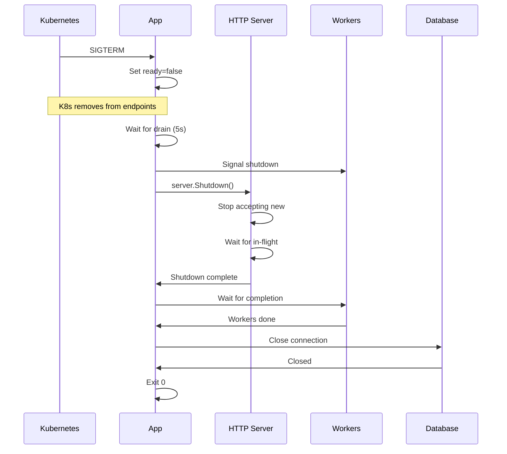

# How to Implement Graceful Shutdown in Go

Author: [nawazdhandala](https://www.github.com/nawazdhandala)

Tags: Go, Golang, Graceful Shutdown, Signals, HTTP Server, Kubernetes, Production

Description: Learn how to implement graceful shutdown in Go applications to properly handle termination signals, finish in-flight requests, and clean up resources.

---

Graceful shutdown ensures your application finishes current work before exiting. This prevents data loss, broken connections, and improves reliability in production environments like Kubernetes.

---

## Why Graceful Shutdown Matters

Without graceful shutdown:
- In-flight HTTP requests get dropped
- Database transactions may be incomplete
- Message queue consumers lose messages
- File writes may be corrupted
- Clients see connection reset errors

---

## Basic Signal Handling

```go
package main

import (
    "context"
    "fmt"
    "os"
    "os/signal"
    "syscall"
    "time"
)

func main() {
    // Create channel to receive signals
    sigChan := make(chan os.Signal, 1)
    
    // Register for SIGINT (Ctrl+C) and SIGTERM (docker stop, kill)
    signal.Notify(sigChan, syscall.SIGINT, syscall.SIGTERM)
    
    // Start your application work
    go func() {
        for {
            fmt.Println("Working...")
            time.Sleep(time.Second)
        }
    }()
    
    // Block until signal received
    sig := <-sigChan
    fmt.Printf("\nReceived signal: %s\n", sig)
    
    // Cleanup
    fmt.Println("Shutting down gracefully...")
    time.Sleep(2 * time.Second)  // Simulate cleanup
    fmt.Println("Done")
}
```

---

## Graceful HTTP Server Shutdown

```go
package main

import (
    "context"
    "fmt"
    "log"
    "net/http"
    "os"
    "os/signal"
    "syscall"
    "time"
)

func main() {
    // Create server
    mux := http.NewServeMux()
    mux.HandleFunc("/", func(w http.ResponseWriter, r *http.Request) {
        // Simulate slow request
        time.Sleep(5 * time.Second)
        fmt.Fprintln(w, "Hello, World!")
    })
    
    server := &http.Server{
        Addr:    ":8080",
        Handler: mux,
    }
    
    // Channel for shutdown signal
    shutdown := make(chan os.Signal, 1)
    signal.Notify(shutdown, syscall.SIGINT, syscall.SIGTERM)
    
    // Start server in goroutine
    go func() {
        log.Println("Server starting on :8080")
        if err := server.ListenAndServe(); err != http.ErrServerClosed {
            log.Fatalf("Server error: %v", err)
        }
    }()
    
    // Wait for shutdown signal
    <-shutdown
    log.Println("Shutdown signal received")
    
    // Create context with timeout for shutdown
    ctx, cancel := context.WithTimeout(context.Background(), 30*time.Second)
    defer cancel()
    
    // Shutdown gracefully
    if err := server.Shutdown(ctx); err != nil {
        log.Printf("Shutdown error: %v", err)
    }
    
    log.Println("Server stopped")
}
```

When `server.Shutdown()` is called:
1. Stops accepting new connections
2. Waits for active connections to complete
3. Returns when done or context times out

---

## Complete Application Pattern

```go
package main

import (
    "context"
    "database/sql"
    "fmt"
    "log"
    "net/http"
    "os"
    "os/signal"
    "sync"
    "syscall"
    "time"
)

type Application struct {
    server   *http.Server
    db       *sql.DB
    wg       sync.WaitGroup
    shutdown chan struct{}
}

func NewApplication() *Application {
    return &Application{
        shutdown: make(chan struct{}),
    }
}

func (app *Application) Start() error {
    // Initialize database
    var err error
    app.db, err = sql.Open("postgres", os.Getenv("DATABASE_URL"))
    if err != nil {
        return fmt.Errorf("database connection: %w", err)
    }
    
    // Initialize HTTP server
    mux := http.NewServeMux()
    mux.HandleFunc("/", app.handleRequest)
    mux.HandleFunc("/health", app.handleHealth)
    
    app.server = &http.Server{
        Addr:    ":8080",
        Handler: mux,
    }
    
    // Start background workers
    app.wg.Add(1)
    go app.backgroundWorker()
    
    // Start server
    go func() {
        log.Println("Server starting on :8080")
        if err := app.server.ListenAndServe(); err != http.ErrServerClosed {
            log.Printf("Server error: %v", err)
        }
    }()
    
    return nil
}

func (app *Application) handleRequest(w http.ResponseWriter, r *http.Request) {
    fmt.Fprintln(w, "Hello!")
}

func (app *Application) handleHealth(w http.ResponseWriter, r *http.Request) {
    w.WriteHeader(http.StatusOK)
    fmt.Fprintln(w, "OK")
}

func (app *Application) backgroundWorker() {
    defer app.wg.Done()
    
    ticker := time.NewTicker(10 * time.Second)
    defer ticker.Stop()
    
    for {
        select {
        case <-app.shutdown:
            log.Println("Background worker stopping")
            return
        case <-ticker.C:
            log.Println("Background worker tick")
        }
    }
}

func (app *Application) Shutdown(ctx context.Context) error {
    log.Println("Starting graceful shutdown...")
    
    // Signal background workers to stop
    close(app.shutdown)
    
    // Shutdown HTTP server
    if err := app.server.Shutdown(ctx); err != nil {
        return fmt.Errorf("server shutdown: %w", err)
    }
    log.Println("HTTP server stopped")
    
    // Wait for background workers
    done := make(chan struct{})
    go func() {
        app.wg.Wait()
        close(done)
    }()
    
    select {
    case <-done:
        log.Println("Background workers stopped")
    case <-ctx.Done():
        return fmt.Errorf("timeout waiting for workers")
    }
    
    // Close database connection
    if err := app.db.Close(); err != nil {
        return fmt.Errorf("database close: %w", err)
    }
    log.Println("Database connection closed")
    
    return nil
}

func main() {
    app := NewApplication()
    
    if err := app.Start(); err != nil {
        log.Fatal(err)
    }
    
    // Wait for shutdown signal
    sigChan := make(chan os.Signal, 1)
    signal.Notify(sigChan, syscall.SIGINT, syscall.SIGTERM)
    <-sigChan
    
    // Graceful shutdown with timeout
    ctx, cancel := context.WithTimeout(context.Background(), 30*time.Second)
    defer cancel()
    
    if err := app.Shutdown(ctx); err != nil {
        log.Printf("Shutdown error: %v", err)
        os.Exit(1)
    }
    
    log.Println("Shutdown complete")
}
```

---

## Kubernetes Integration

For Kubernetes, implement health checks and proper shutdown:

```go
package main

import (
    "context"
    "fmt"
    "log"
    "net/http"
    "os"
    "os/signal"
    "sync/atomic"
    "syscall"
    "time"
)

var (
    healthy int32 = 1  // Atomic flag for health status
    ready   int32 = 0  // Atomic flag for readiness
)

func main() {
    mux := http.NewServeMux()
    
    // Liveness probe - is the app alive?
    mux.HandleFunc("/healthz", func(w http.ResponseWriter, r *http.Request) {
        if atomic.LoadInt32(&healthy) == 1 {
            w.WriteHeader(http.StatusOK)
            fmt.Fprintln(w, "OK")
        } else {
            w.WriteHeader(http.StatusServiceUnavailable)
            fmt.Fprintln(w, "Not healthy")
        }
    })
    
    // Readiness probe - can the app receive traffic?
    mux.HandleFunc("/readyz", func(w http.ResponseWriter, r *http.Request) {
        if atomic.LoadInt32(&ready) == 1 {
            w.WriteHeader(http.StatusOK)
            fmt.Fprintln(w, "Ready")
        } else {
            w.WriteHeader(http.StatusServiceUnavailable)
            fmt.Fprintln(w, "Not ready")
        }
    })
    
    mux.HandleFunc("/", func(w http.ResponseWriter, r *http.Request) {
        time.Sleep(2 * time.Second)  // Simulate work
        fmt.Fprintln(w, "Hello!")
    })
    
    server := &http.Server{
        Addr:    ":8080",
        Handler: mux,
    }
    
    // Signal handling
    sigChan := make(chan os.Signal, 1)
    signal.Notify(sigChan, syscall.SIGINT, syscall.SIGTERM)
    
    // Start server
    go func() {
        log.Println("Starting server")
        if err := server.ListenAndServe(); err != http.ErrServerClosed {
            log.Fatal(err)
        }
    }()
    
    // Simulate initialization
    time.Sleep(time.Second)
    atomic.StoreInt32(&ready, 1)
    log.Println("Ready to accept traffic")
    
    // Wait for signal
    sig := <-sigChan
    log.Printf("Received %s, starting shutdown", sig)
    
    // Mark as not ready (Kubernetes will stop sending traffic)
    atomic.StoreInt32(&ready, 0)
    
    // Give Kubernetes time to update endpoints
    log.Println("Waiting for traffic to drain...")
    time.Sleep(5 * time.Second)
    
    // Shutdown with timeout
    ctx, cancel := context.WithTimeout(context.Background(), 30*time.Second)
    defer cancel()
    
    if err := server.Shutdown(ctx); err != nil {
        log.Printf("Shutdown error: %v", err)
    }
    
    log.Println("Shutdown complete")
}
```

Kubernetes deployment:

```yaml
apiVersion: apps/v1
kind: Deployment
spec:
  template:
    spec:
      terminationGracePeriodSeconds: 60
      containers:
      - name: app
        livenessProbe:
          httpGet:
            path: /healthz
            port: 8080
          initialDelaySeconds: 5
          periodSeconds: 10
        readinessProbe:
          httpGet:
            path: /readyz
            port: 8080
          initialDelaySeconds: 5
          periodSeconds: 5
```

---

## Shutdown Sequence Diagram



---

## Handling Long-Running Operations

```go
func (app *Application) processQueue(ctx context.Context) {
    for {
        select {
        case <-ctx.Done():
            log.Println("Queue processor stopping")
            return
        default:
        }
        
        // Get next item (with timeout)
        item, err := app.queue.Get(ctx, 5*time.Second)
        if err != nil {
            if ctx.Err() != nil {
                return  // Shutdown requested
            }
            continue
        }
        
        // Process with separate context for the work
        // This allows the item to complete even during shutdown
        workCtx, cancel := context.WithTimeout(context.Background(), 30*time.Second)
        if err := app.processItem(workCtx, item); err != nil {
            log.Printf("Error processing item: %v", err)
        }
        cancel()
    }
}
```

---

## Testing Graceful Shutdown

```go
func TestGracefulShutdown(t *testing.T) {
    app := NewApplication()
    if err := app.Start(); err != nil {
        t.Fatal(err)
    }
    
    // Make a slow request
    done := make(chan struct{})
    go func() {
        resp, err := http.Get("http://localhost:8080/slow")
        if err != nil {
            t.Errorf("Request failed: %v", err)
        }
        defer resp.Body.Close()
        close(done)
    }()
    
    // Wait for request to start
    time.Sleep(100 * time.Millisecond)
    
    // Trigger shutdown
    ctx, cancel := context.WithTimeout(context.Background(), 10*time.Second)
    defer cancel()
    
    if err := app.Shutdown(ctx); err != nil {
        t.Errorf("Shutdown error: %v", err)
    }
    
    // Verify request completed
    select {
    case <-done:
        // Success
    case <-time.After(15 * time.Second):
        t.Error("Request did not complete")
    }
}
```

---

## Summary

| Component | Shutdown Action |
|-----------|-----------------|
| HTTP Server | `server.Shutdown(ctx)` |
| Background workers | Signal via channel, wait with WaitGroup |
| Database | `db.Close()` |
| Message queues | Stop consuming, finish processing |
| File handles | Close and flush |
| Connections | Close gracefully |

**Best Practices:**

1. Always handle SIGINT and SIGTERM
2. Set a reasonable shutdown timeout (30-60s)
3. Stop accepting new work first
4. Wait for in-flight work to complete
5. Close resources in reverse order of creation
6. Log shutdown progress for debugging
7. Return proper exit codes (0 for success)

---

*Running Go applications in Kubernetes? [OneUptime](https://oneuptime.com) monitors your deployments and alerts you to shutdown issues, helping ensure zero-downtime deployments.*
