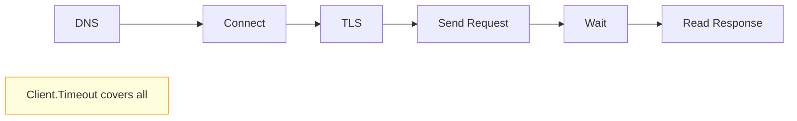

# How to Set HTTP Client Timeouts in Go

Author: [nawazdhandala](https://www.github.com/nawazdhandala)

Tags: Go, Golang, HTTP, Timeouts, Network, API, Client

Description: Learn how to properly configure HTTP client timeouts in Go to prevent hanging requests, including connection, read, write, and overall timeouts.

---

The default Go HTTP client has no timeout, meaning requests can hang indefinitely. This guide covers all the timeout options and best practices for production HTTP clients.

---

## The Problem: No Default Timeout

```go
package main

import (
    "io"
    "net/http"
)

func main() {
    // DANGER: No timeout - can hang forever!
    resp, err := http.Get("https://slow-server.example.com/data")
    if err != nil {
        panic(err)
    }
    defer resp.Body.Close()
    
    // If server is slow, this blocks indefinitely
    body, _ := io.ReadAll(resp.Body)
    _ = body
}
```

---

## Basic Client Timeout

The simplest solution is setting a total timeout:

```go
package main

import (
    "fmt"
    "io"
    "net/http"
    "time"
)

func main() {
    // Create client with timeout
    client := &http.Client{
        Timeout: 10 * time.Second,  // Total request timeout
    }
    
    resp, err := client.Get("https://api.example.com/data")
    if err != nil {
        // Error includes "context deadline exceeded" if timed out
        fmt.Println("Request failed:", err)
        return
    }
    defer resp.Body.Close()
    
    body, _ := io.ReadAll(resp.Body)
    fmt.Println("Response:", string(body))
}
```

The `Timeout` field covers the entire request lifecycle:



---

## Granular Transport Timeouts

For fine-grained control, configure the Transport:

```go
package main

import (
    "crypto/tls"
    "net"
    "net/http"
    "time"
)

func newHTTPClient() *http.Client {
    transport := &http.Transport{
        // Connection timeouts
        DialContext: (&net.Dialer{
            Timeout:   5 * time.Second,   // Time to establish connection
            KeepAlive: 30 * time.Second,  // Keep-alive probe interval
        }).DialContext,
        
        // TLS handshake timeout
        TLSHandshakeTimeout: 5 * time.Second,
        
        // Connection pool settings
        MaxIdleConns:        100,              // Max idle connections (all hosts)
        MaxIdleConnsPerHost: 10,               // Max idle connections per host
        MaxConnsPerHost:     100,              // Max total connections per host
        IdleConnTimeout:     90 * time.Second, // How long to keep idle connections
        
        // Response header timeout (time to receive response headers)
        ResponseHeaderTimeout: 10 * time.Second,
        
        // Expect-Continue timeout
        ExpectContinueTimeout: 1 * time.Second,
    }
    
    return &http.Client{
        Transport: transport,
        Timeout:   30 * time.Second,  // Overall timeout
    }
}

func main() {
    client := newHTTPClient()
    
    resp, err := client.Get("https://api.example.com/data")
    if err != nil {
        panic(err)
    }
    defer resp.Body.Close()
}
```

---

## Timeout Breakdown

| Timeout | What It Controls | Typical Value |
|---------|------------------|---------------|
| `Dialer.Timeout` | TCP connection establishment | 5-10s |
| `TLSHandshakeTimeout` | TLS handshake | 5-10s |
| `ResponseHeaderTimeout` | Waiting for response headers | 10-30s |
| `ExpectContinueTimeout` | Wait for "100 Continue" | 1-2s |
| `IdleConnTimeout` | Keep idle connections alive | 60-90s |
| `Client.Timeout` | Entire request lifecycle | 30-60s |

---

## Context-Based Timeouts

Use context for per-request timeouts:

```go
package main

import (
    "context"
    "fmt"
    "io"
    "net/http"
    "time"
)

func fetchWithTimeout(ctx context.Context, url string, timeout time.Duration) ([]byte, error) {
    // Create context with timeout
    ctx, cancel := context.WithTimeout(ctx, timeout)
    defer cancel()
    
    // Create request with context
    req, err := http.NewRequestWithContext(ctx, http.MethodGet, url, nil)
    if err != nil {
        return nil, err
    }
    
    // Use a client without timeout (context handles it)
    client := &http.Client{}
    
    resp, err := client.Do(req)
    if err != nil {
        return nil, err
    }
    defer resp.Body.Close()
    
    return io.ReadAll(resp.Body)
}

func main() {
    ctx := context.Background()
    
    // Different timeouts for different endpoints
    data, err := fetchWithTimeout(ctx, "https://fast-api.example.com/data", 5*time.Second)
    if err != nil {
        fmt.Println("Fast API failed:", err)
    }
    
    data, err = fetchWithTimeout(ctx, "https://slow-api.example.com/data", 30*time.Second)
    if err != nil {
        fmt.Println("Slow API failed:", err)
    }
    
    _ = data
}
```

---

## Read/Write Body Timeouts

Control time spent reading the response body:

```go
package main

import (
    "context"
    "fmt"
    "io"
    "net/http"
    "time"
)

func fetchWithBodyTimeout(url string, headerTimeout, bodyTimeout time.Duration) ([]byte, error) {
    // Context for connection + headers
    ctx, cancel := context.WithTimeout(context.Background(), headerTimeout)
    defer cancel()
    
    req, err := http.NewRequestWithContext(ctx, http.MethodGet, url, nil)
    if err != nil {
        return nil, err
    }
    
    client := &http.Client{}
    resp, err := client.Do(req)
    if err != nil {
        return nil, err
    }
    defer resp.Body.Close()
    
    // Separate timeout for body reading
    bodyCtx, bodyCancel := context.WithTimeout(context.Background(), bodyTimeout)
    defer bodyCancel()
    
    // Read body with timeout
    done := make(chan []byte, 1)
    errChan := make(chan error, 1)
    
    go func() {
        data, err := io.ReadAll(resp.Body)
        if err != nil {
            errChan <- err
            return
        }
        done <- data
    }()
    
    select {
    case data := <-done:
        return data, nil
    case err := <-errChan:
        return nil, err
    case <-bodyCtx.Done():
        return nil, fmt.Errorf("body read timeout: %w", bodyCtx.Err())
    }
}
```

---

## Production-Ready HTTP Client

```go
package main

import (
    "context"
    "crypto/tls"
    "fmt"
    "io"
    "net"
    "net/http"
    "time"
)

type HTTPClientConfig struct {
    // Connection settings
    ConnectTimeout      time.Duration
    TLSHandshakeTimeout time.Duration
    KeepAlive           time.Duration
    
    // Request settings
    RequestTimeout        time.Duration
    ResponseHeaderTimeout time.Duration
    
    // Pool settings
    MaxIdleConns        int
    MaxIdleConnsPerHost int
    MaxConnsPerHost     int
    IdleConnTimeout     time.Duration
}

func DefaultConfig() HTTPClientConfig {
    return HTTPClientConfig{
        ConnectTimeout:        5 * time.Second,
        TLSHandshakeTimeout:   5 * time.Second,
        KeepAlive:             30 * time.Second,
        RequestTimeout:        30 * time.Second,
        ResponseHeaderTimeout: 10 * time.Second,
        MaxIdleConns:          100,
        MaxIdleConnsPerHost:   10,
        MaxConnsPerHost:       100,
        IdleConnTimeout:       90 * time.Second,
    }
}

func NewHTTPClient(cfg HTTPClientConfig) *http.Client {
    transport := &http.Transport{
        DialContext: (&net.Dialer{
            Timeout:   cfg.ConnectTimeout,
            KeepAlive: cfg.KeepAlive,
        }).DialContext,
        TLSClientConfig:       &tls.Config{MinVersion: tls.VersionTLS12},
        TLSHandshakeTimeout:   cfg.TLSHandshakeTimeout,
        ResponseHeaderTimeout: cfg.ResponseHeaderTimeout,
        ExpectContinueTimeout: 1 * time.Second,
        MaxIdleConns:          cfg.MaxIdleConns,
        MaxIdleConnsPerHost:   cfg.MaxIdleConnsPerHost,
        MaxConnsPerHost:       cfg.MaxConnsPerHost,
        IdleConnTimeout:       cfg.IdleConnTimeout,
        ForceAttemptHTTP2:     true,
    }
    
    return &http.Client{
        Transport: transport,
        Timeout:   cfg.RequestTimeout,
    }
}

// HTTPClient wrapper with retry and logging
type HTTPClient struct {
    client *http.Client
    config HTTPClientConfig
}

func NewClient(cfg HTTPClientConfig) *HTTPClient {
    return &HTTPClient{
        client: NewHTTPClient(cfg),
        config: cfg,
    }
}

func (c *HTTPClient) Get(ctx context.Context, url string) ([]byte, error) {
    req, err := http.NewRequestWithContext(ctx, http.MethodGet, url, nil)
    if err != nil {
        return nil, fmt.Errorf("creating request: %w", err)
    }
    
    resp, err := c.client.Do(req)
    if err != nil {
        return nil, fmt.Errorf("executing request: %w", err)
    }
    defer resp.Body.Close()
    
    if resp.StatusCode >= 400 {
        return nil, fmt.Errorf("HTTP %d: %s", resp.StatusCode, resp.Status)
    }
    
    body, err := io.ReadAll(resp.Body)
    if err != nil {
        return nil, fmt.Errorf("reading body: %w", err)
    }
    
    return body, nil
}

func main() {
    cfg := DefaultConfig()
    cfg.RequestTimeout = 15 * time.Second  // Override defaults
    
    client := NewClient(cfg)
    
    ctx := context.Background()
    data, err := client.Get(ctx, "https://api.example.com/users")
    if err != nil {
        fmt.Println("Error:", err)
        return
    }
    
    fmt.Println("Response:", string(data))
}
```

---

## Handling Timeout Errors

```go
package main

import (
    "context"
    "errors"
    "fmt"
    "net"
    "net/http"
    "net/url"
    "os"
    "time"
)

func classifyError(err error) string {
    if err == nil {
        return "no error"
    }
    
    // Context timeout/cancellation
    if errors.Is(err, context.DeadlineExceeded) {
        return "request timeout"
    }
    if errors.Is(err, context.Canceled) {
        return "request cancelled"
    }
    
    // URL error (wraps net errors)
    var urlErr *url.Error
    if errors.As(err, &urlErr) {
        if urlErr.Timeout() {
            return "url timeout"
        }
        
        // Check wrapped error
        var netErr net.Error
        if errors.As(urlErr.Err, &netErr) {
            if netErr.Timeout() {
                return "network timeout"
            }
        }
        
        // DNS errors
        var dnsErr *net.DNSError
        if errors.As(urlErr.Err, &dnsErr) {
            return "DNS error: " + dnsErr.Error()
        }
    }
    
    // Connection refused
    var opErr *net.OpError
    if errors.As(err, &opErr) {
        return "network operation error: " + opErr.Error()
    }
    
    return "unknown error: " + err.Error()
}

func main() {
    client := &http.Client{
        Timeout: 2 * time.Second,
    }
    
    testURLs := []string{
        "https://httpstat.us/200?sleep=5000",  // Will timeout
        "https://nonexistent.invalid/",         // DNS error
        "http://localhost:12345/",              // Connection refused
    }
    
    for _, url := range testURLs {
        resp, err := client.Get(url)
        if err != nil {
            fmt.Printf("URL: %s\nError type: %s\n\n", url, classifyError(err))
            continue
        }
        resp.Body.Close()
        fmt.Printf("URL: %s - OK\n", url)
    }
}
```

---

## Retry with Backoff

```go
package main

import (
    "context"
    "fmt"
    "io"
    "math"
    "net/http"
    "time"
)

type RetryConfig struct {
    MaxRetries  int
    BaseDelay   time.Duration
    MaxDelay    time.Duration
    Multiplier  float64
}

func fetchWithRetry(ctx context.Context, client *http.Client, url string, cfg RetryConfig) ([]byte, error) {
    var lastErr error
    
    for attempt := 0; attempt <= cfg.MaxRetries; attempt++ {
        // Check context before attempt
        if ctx.Err() != nil {
            return nil, ctx.Err()
        }
        
        req, err := http.NewRequestWithContext(ctx, http.MethodGet, url, nil)
        if err != nil {
            return nil, err
        }
        
        resp, err := client.Do(req)
        if err == nil && resp.StatusCode < 500 {
            defer resp.Body.Close()
            return io.ReadAll(resp.Body)
        }
        
        if resp != nil {
            resp.Body.Close()
        }
        
        lastErr = err
        if err == nil {
            lastErr = fmt.Errorf("HTTP %d", resp.StatusCode)
        }
        
        // Don't retry if context cancelled
        if ctx.Err() != nil {
            return nil, ctx.Err()
        }
        
        // Calculate backoff
        delay := time.Duration(float64(cfg.BaseDelay) * math.Pow(cfg.Multiplier, float64(attempt)))
        if delay > cfg.MaxDelay {
            delay = cfg.MaxDelay
        }
        
        fmt.Printf("Attempt %d failed, retrying in %v...\n", attempt+1, delay)
        
        select {
        case <-time.After(delay):
        case <-ctx.Done():
            return nil, ctx.Err()
        }
    }
    
    return nil, fmt.Errorf("max retries exceeded: %w", lastErr)
}

func main() {
    client := &http.Client{Timeout: 10 * time.Second}
    
    ctx, cancel := context.WithTimeout(context.Background(), 30*time.Second)
    defer cancel()
    
    cfg := RetryConfig{
        MaxRetries: 3,
        BaseDelay:  1 * time.Second,
        MaxDelay:   10 * time.Second,
        Multiplier: 2.0,
    }
    
    data, err := fetchWithRetry(ctx, client, "https://api.example.com/data", cfg)
    if err != nil {
        fmt.Println("Failed:", err)
        return
    }
    
    fmt.Println("Success:", string(data))
}
```

---

## Summary

| Scenario | Recommended Timeout |
|----------|---------------------|
| Fast API calls | 5-10s total |
| Standard API calls | 30s total |
| Large file downloads | Per-context with body timeout |
| Background jobs | 60s+ with retries |
| Health checks | 2-5s total |

**Best Practices:**

1. Never use `http.DefaultClient` in production
2. Always set a `Client.Timeout` at minimum
3. Use context for per-request timeouts
4. Configure transport for granular control
5. Handle timeout errors gracefully
6. Implement retries with exponential backoff
7. Log timeout errors for monitoring

---

*Tracking HTTP performance in production? [OneUptime](https://oneuptime.com) monitors your API endpoints, tracks timeout rates, and alerts you when latency increases.*
