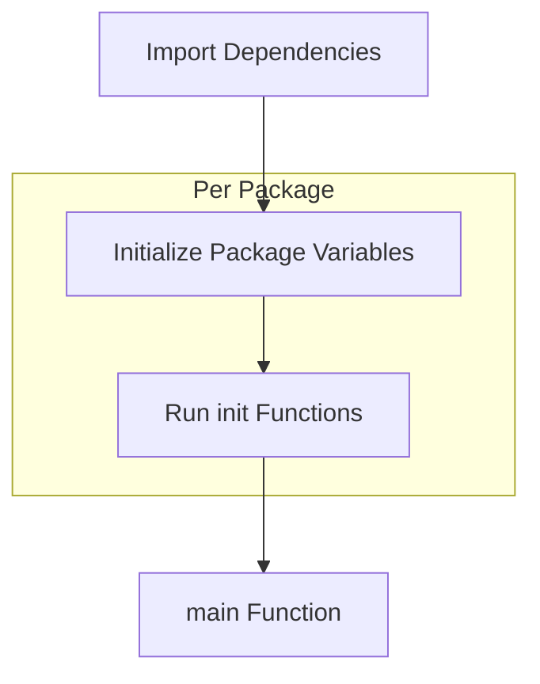

# How to Use Init Functions in Go

Author: [nawazdhandala](https://www.github.com/nawazdhandala)

Tags: Go, Golang, Init, Initialization, Package, Startup

Description: Learn how Go init functions work, their execution order, best practices, and when to use or avoid them for package initialization.

---

The `init` function in Go is a special function that runs automatically when a package is initialized. Understanding init functions is crucial for proper application startup and package design.

---

## Basic Init Function

```go
package main

import "fmt"

func init() {
    fmt.Println("1. init() called")
}

func main() {
    fmt.Println("2. main() called")
}
```

**Output:**
```
1. init() called
2. main() called
```

Key characteristics:
- No parameters
- No return values
- Called automatically before `main()`
- Cannot be called explicitly

---

## Multiple Init Functions

A single file can have multiple init functions:

```go
package main

import "fmt"

func init() {
    fmt.Println("First init")
}

func init() {
    fmt.Println("Second init")
}

func init() {
    fmt.Println("Third init")
}

func main() {
    fmt.Println("main")
}
```

**Output:**
```
First init
Second init
Third init
main
```

They execute in the order they appear in the source file.

---

## Initialization Order



Complete order:

1. **Import dependencies** (recursively, depth-first)
2. **Package-level variables** (in declaration order)
3. **init() functions** (in source order)
4. **main()** (only in main package)

---

## Package Variable Initialization

```go
package main

import "fmt"

// Variables initialized before init()
var (
    a = initA()
    b = initB()
    c = initC()
)

func initA() int {
    fmt.Println("Initializing a")
    return 1
}

func initB() int {
    fmt.Println("Initializing b")
    return 2
}

func initC() int {
    fmt.Println("Initializing c")
    return a + b  // Can use previously initialized variables
}

func init() {
    fmt.Println("init() - a:", a, "b:", b, "c:", c)
}

func main() {
    fmt.Println("main()")
}
```

**Output:**
```
Initializing a
Initializing b
Initializing c
init() - a: 1 b: 2 c: 3
main()
```

---

## Cross-Package Init Order

```go
// File: pkg/database/db.go
package database

import "fmt"

func init() {
    fmt.Println("database init")
}

// File: pkg/cache/cache.go
package cache

import (
    "fmt"
    _ "myapp/pkg/database"  // Import for init side effect
)

func init() {
    fmt.Println("cache init")
}

// File: main.go
package main

import (
    "fmt"
    _ "myapp/pkg/cache"
)

func init() {
    fmt.Println("main init")
}

func main() {
    fmt.Println("main()")
}
```

**Output:**
```
database init
cache init
main init
main()
```

Dependencies are initialized first (depth-first).

---

## Common Use Cases

### 1. Register Drivers

```go
package main

import (
    "database/sql"
    _ "github.com/lib/pq"  // Registers PostgreSQL driver via init()
)

func main() {
    db, err := sql.Open("postgres", "...")
    // pq driver was registered in its init()
}
```

The `pq` package:
```go
package pq

import "database/sql"

func init() {
    sql.Register("postgres", &Driver{})
}
```

### 2. Initialize Configuration

```go
package config

import (
    "encoding/json"
    "log"
    "os"
)

var Settings struct {
    DatabaseURL string `json:"database_url"`
    Port        int    `json:"port"`
    Debug       bool   `json:"debug"`
}

func init() {
    file, err := os.Open("config.json")
    if err != nil {
        log.Fatal("Cannot open config:", err)
    }
    defer file.Close()
    
    if err := json.NewDecoder(file).Decode(&Settings); err != nil {
        log.Fatal("Cannot parse config:", err)
    }
}
```

### 3. Validate Environment

```go
package main

import (
    "log"
    "os"
)

var requiredEnvVars = []string{
    "DATABASE_URL",
    "API_KEY",
    "SECRET_KEY",
}

func init() {
    for _, env := range requiredEnvVars {
        if os.Getenv(env) == "" {
            log.Fatalf("Required environment variable %s is not set", env)
        }
    }
}
```

### 4. Setup Logging

```go
package logging

import (
    "log"
    "os"
)

var Logger *log.Logger

func init() {
    file, err := os.OpenFile("app.log", os.O_CREATE|os.O_WRONLY|os.O_APPEND, 0666)
    if err != nil {
        log.Fatal("Cannot open log file:", err)
    }
    
    Logger = log.New(file, "APP: ", log.Ldate|log.Ltime|log.Lshortfile)
}
```

### 5. Compute Constants

```go
package math

import "math"

var (
    // Computed at init time
    SinTable [360]float64
    CosTable [360]float64
)

func init() {
    for i := 0; i < 360; i++ {
        rad := float64(i) * math.Pi / 180
        SinTable[i] = math.Sin(rad)
        CosTable[i] = math.Cos(rad)
    }
}
```

---

## Problems with Init Functions

### Problem 1: Hidden Dependencies

```go
// BAD: Import just for side effects is not obvious
import _ "myapp/pkg/metrics"

// The metrics package:
func init() {
    startMetricsServer()  // Side effect not visible to caller
}
```

### Problem 2: Hard to Test

```go
package database

var DB *sql.DB

func init() {
    // Connects to real database - can't mock in tests!
    var err error
    DB, err = sql.Open("postgres", os.Getenv("DATABASE_URL"))
    if err != nil {
        log.Fatal(err)
    }
}
```

### Problem 3: Error Handling

```go
func init() {
    // Can only panic or log.Fatal - no error return
    if err := setupSomething(); err != nil {
        panic(err)  // Crashes the program
    }
}
```

### Problem 4: Initialization Order Issues

```go
// pkg/a/a.go
package a

import "myapp/pkg/b"

var Value = b.Compute()  // Depends on b being initialized

// pkg/b/b.go
package b

import "myapp/pkg/a"

func Compute() int {
    return a.Value + 1  // Circular dependency!
}
```

---

## Better Alternatives

### Explicit Initialization Functions

```go
package database

import "database/sql"

type DB struct {
    conn *sql.DB
}

// Explicit, testable, error-returning
func New(dsn string) (*DB, error) {
    conn, err := sql.Open("postgres", dsn)
    if err != nil {
        return nil, err
    }
    return &DB{conn: conn}, nil
}

// Usage in main
func main() {
    db, err := database.New(os.Getenv("DATABASE_URL"))
    if err != nil {
        log.Fatal(err)
    }
    // Use db
}
```

### Dependency Injection

```go
package main

type App struct {
    DB     *database.DB
    Cache  *cache.Cache
    Logger *log.Logger
}

func NewApp(cfg Config) (*App, error) {
    db, err := database.New(cfg.DatabaseURL)
    if err != nil {
        return nil, fmt.Errorf("database: %w", err)
    }
    
    cache, err := cache.New(cfg.CacheURL)
    if err != nil {
        return nil, fmt.Errorf("cache: %w", err)
    }
    
    return &App{
        DB:     db,
        Cache:  cache,
        Logger: log.Default(),
    }, nil
}

func main() {
    app, err := NewApp(loadConfig())
    if err != nil {
        log.Fatal(err)
    }
    app.Run()
}
```

### sync.Once for Lazy Initialization

```go
package config

import (
    "sync"
)

var (
    settings *Settings
    once     sync.Once
)

func GetSettings() *Settings {
    once.Do(func() {
        settings = loadSettings()
    })
    return settings
}
```

---

## When to Use Init

**Good uses:**
- Registering drivers/plugins with a registry
- Computing constant lookup tables
- Verifying program correctness at build time

**Avoid init for:**
- Connecting to external services
- Loading configuration that can fail
- Complex initialization that needs error handling
- Anything that makes testing harder

---

## Summary

| Aspect | Init Functions | Explicit Functions |
|--------|---------------|-------------------|
| Error handling | panic/log.Fatal only | Return errors |
| Testing | Hard to mock | Easy to test |
| Dependencies | Implicit | Explicit |
| Order | Automatic | Controlled |
| Visibility | Hidden side effects | Obvious |

**Best Practices:**

1. Keep init functions simple and fast
2. Don't connect to external services in init
3. Prefer explicit initialization over init
4. Use init only for truly package-level setup
5. Document any init side effects
6. Avoid circular dependencies

---

*Managing complex Go application startup? [OneUptime](https://oneuptime.com) provides application monitoring that helps you track initialization time and identify slow startup patterns.*
