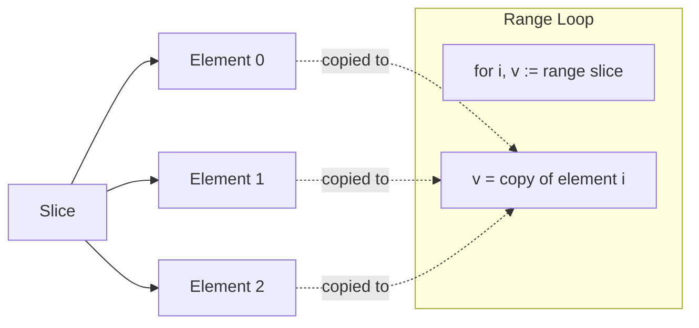

# How to Modify Values While Iterating Over a Slice in Go

Author: [nawazdhandala](https://www.github.com/nawazdhandala)

Tags: Go, Golang, Slices, Iteration, Range, Pointers, Common Mistakes

Description: Learn why modifying slice elements during iteration in Go doesn't work as expected and discover the correct patterns to update values in place.

---

A common source of bugs in Go involves modifying slice elements during iteration. The `range` keyword creates copies of values, which means your changes might not stick. This guide shows you the problem and multiple solutions.

---

## The Problem

Consider this seemingly correct code:

```go
package main

import "fmt"

type User struct {
    Name   string
    Active bool
}

func main() {
    users := []User{
        {Name: "Alice", Active: false},
        {Name: "Bob", Active: false},
        {Name: "Charlie", Active: false},
    }
    
    // Try to activate all users
    for _, user := range users {
        user.Active = true // This modifies a COPY, not the original
    }
    
    // Check results - still false!
    for _, user := range users {
        fmt.Printf("%s: %v\n", user.Name, user.Active)
    }
    // Output:
    // Alice: false
    // Bob: false
    // Charlie: false
}
```

The values remain unchanged because `user` is a **copy** of each element.

---

## How Range Works



When you use `for _, v := range slice`, Go:

1. Creates a loop variable `v`
2. Copies each element into `v` one at a time
3. Modifications to `v` affect only the copy

---

## Solution 1: Use Index to Modify Original

The most straightforward solution is to use the index to access the original:

```go
package main

import "fmt"

type User struct {
    Name   string
    Active bool
}

func main() {
    users := []User{
        {Name: "Alice", Active: false},
        {Name: "Bob", Active: false},
        {Name: "Charlie", Active: false},
    }
    
    // Use index to modify original elements
    for i := range users {
        users[i].Active = true
    }
    
    // Verify changes
    for _, user := range users {
        fmt.Printf("%s: %v\n", user.Name, user.Active)
    }
    // Output:
    // Alice: true
    // Bob: true
    // Charlie: true
}
```

---

## Solution 2: Use Slice of Pointers

If you prefer the value syntax, store pointers in your slice:

```go
package main

import "fmt"

type User struct {
    Name   string
    Active bool
}

func main() {
    // Slice of pointers
    users := []*User{
        {Name: "Alice", Active: false},
        {Name: "Bob", Active: false},
        {Name: "Charlie", Active: false},
    }
    
    // Now modifying user works because user is a pointer
    for _, user := range users {
        user.Active = true // Modifies the actual User through pointer
    }
    
    // Verify
    for _, user := range users {
        fmt.Printf("%s: %v\n", user.Name, user.Active)
    }
    // Output:
    // Alice: true
    // Bob: true
    // Charlie: true
}
```

---

## Solution 3: Take Address During Iteration

You can take the address of slice elements using the index:

```go
package main

import "fmt"

type Task struct {
    ID        int
    Completed bool
}

func main() {
    tasks := []Task{
        {ID: 1, Completed: false},
        {ID: 2, Completed: false},
        {ID: 3, Completed: false},
    }
    
    // Get pointer to each element
    for i := range tasks {
        task := &tasks[i] // Get pointer to actual element
        task.Completed = true
    }
    
    fmt.Printf("%+v\n", tasks)
    // Output: [{ID:1 Completed:true} {ID:2 Completed:true} {ID:3 Completed:true}]
}
```

---

## Comparing Approaches

| Approach | Syntax | Memory | Best For |
|----------|--------|--------|----------|
| Index access `slice[i]` | Simple | No extra alloc | Most cases |
| Slice of pointers `[]*T` | Natural | Pointer overhead | When pointers make sense |
| Address during loop `&slice[i]` | Pointer variable | No extra alloc | Multiple modifications |

---

## Common Mistake: Capturing Loop Variables in Goroutines

A related issue involves closures in goroutines:

```go
package main

import (
    "fmt"
    "sync"
)

type Job struct {
    ID int
}

func main() {
    jobs := []Job{{ID: 1}, {ID: 2}, {ID: 3}}
    
    var wg sync.WaitGroup
    
    // WRONG: All goroutines see the last value of job
    for _, job := range jobs {
        wg.Add(1)
        go func() {
            defer wg.Done()
            fmt.Println(job.ID) // Captures loop variable by reference
        }()
    }
    wg.Wait()
    // Likely outputs: 3, 3, 3 (or some unpredictable result)
}
```

### Fix 1: Pass as Parameter

```go
for _, job := range jobs {
    wg.Add(1)
    go func(j Job) { // Pass value as parameter
        defer wg.Done()
        fmt.Println(j.ID)
    }(job)
}
```

### Fix 2: Create Local Copy

```go
for _, job := range jobs {
    job := job // Create new variable shadowing loop variable
    wg.Add(1)
    go func() {
        defer wg.Done()
        fmt.Println(job.ID)
    }()
}
```

### Fix 3: Use Index (Go 1.22+)

Starting with Go 1.22, loop variables are per-iteration:

```go
// Go 1.22+: Each iteration gets its own variable
for _, job := range jobs {
    wg.Add(1)
    go func() {
        defer wg.Done()
        fmt.Println(job.ID) // Safe in Go 1.22+
    }()
}
```

---

## Modifying Maps During Iteration

Maps have different behavior. You can modify existing keys but adding/deleting during iteration is tricky:

```go
package main

import "fmt"

func main() {
    scores := map[string]int{
        "Alice": 10,
        "Bob":   20,
        "Charlie": 30,
    }
    
    // Modifying existing values is safe
    for name := range scores {
        scores[name] *= 2
    }
    
    fmt.Println(scores) // map[Alice:20 Bob:40 Charlie:60]
    
    // Deleting during iteration is technically safe but order is unpredictable
    for name, score := range scores {
        if score < 30 {
            delete(scores, name) // Safe to delete current key
        }
    }
    
    fmt.Println(scores) // map[Bob:40 Charlie:60]
}
```

---

## Pattern: Transform Slice in Place

Here's a reusable pattern for in-place transformation:

```go
package main

import "fmt"

type Record struct {
    Value     int
    Processed bool
}

// TransformInPlace modifies each element using the provided function
func TransformInPlace[T any](slice []T, transform func(*T)) {
    for i := range slice {
        transform(&slice[i])
    }
}

func main() {
    records := []Record{
        {Value: 1},
        {Value: 2},
        {Value: 3},
    }
    
    // Double values and mark as processed
    TransformInPlace(records, func(r *Record) {
        r.Value *= 2
        r.Processed = true
    })
    
    fmt.Printf("%+v\n", records)
    // Output: [{Value:2 Processed:true} {Value:4 Processed:true} {Value:6 Processed:true}]
}
```

---

## Pattern: Filter and Modify (Without Allocation)

When you need to filter elements while modifying, this pattern avoids extra allocations:

```go
package main

import "fmt"

type Item struct {
    ID     int
    Active bool
}

// FilterModifyInPlace keeps items matching predicate and applies modifier
func FilterModifyInPlace(items []Item, keep func(*Item) bool) []Item {
    n := 0
    for i := range items {
        if keep(&items[i]) {
            items[n] = items[i]
            n++
        }
    }
    return items[:n]
}

func main() {
    items := []Item{
        {ID: 1, Active: false},
        {ID: 2, Active: true},
        {ID: 3, Active: false},
        {ID: 4, Active: true},
    }
    
    // Keep only items with even ID, activate them
    result := FilterModifyInPlace(items, func(item *Item) bool {
        if item.ID%2 == 0 {
            item.Active = true
            return true
        }
        return false
    })
    
    fmt.Printf("%+v\n", result)
    // Output: [{ID:2 Active:true} {ID:4 Active:true}]
}
```

---

## Summary

When modifying slice elements during iteration in Go:

| Approach | Example | When to Use |
|----------|---------|-------------|
| Use index | `slice[i].field = value` | Default choice |
| Pointer slice | `[]*T` then `v.field = value` | When pointers make sense |
| Address in loop | `v := &slice[i]` | Multiple modifications |
| Go 1.22+ | Loop vars per-iteration | New code |

**Key Points:**

1. `for _, v := range slice` creates a copy of each element
2. Modifying the copy doesn't affect the original slice
3. Use `slice[i]` or `&slice[i]` to modify originals
4. For goroutines, pass values as parameters or use Go 1.22+
5. Maps allow modification of existing keys during iteration

---

*Building Go applications? [OneUptime](https://oneuptime.com) helps you monitor performance and catch bugs in production with distributed tracing and real-time alerts.*
