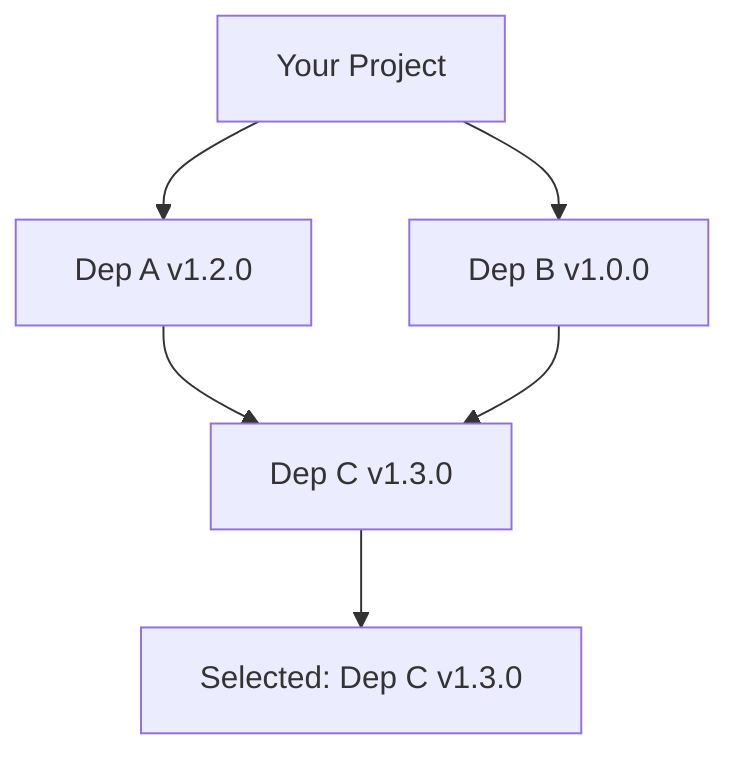

# How to Use Go Modules for Dependency Management

Author: [nawazdhandala](https://www.github.com/nawazdhandala)

Tags: Go, Golang, Modules, Dependencies, go.mod, Package Management

Description: Learn how to use Go modules for dependency management, including initialization, versioning, updates, and best practices for managing Go packages.

---

Go modules are the official dependency management system in Go since version 1.11. They provide versioned dependencies, reproducible builds, and work outside of GOPATH.

---

## Initializing a Module

```bash
# Create a new module
mkdir myproject && cd myproject
go mod init github.com/username/myproject

# Or for local-only projects
go mod init myproject
```

This creates a `go.mod` file:

```go
module github.com/username/myproject

go 1.21
```

---

## Adding Dependencies

```bash
# Add a dependency (automatically updates go.mod)
go get github.com/gorilla/mux

# Add a specific version
go get github.com/gorilla/mux@v1.8.0

# Add latest version
go get github.com/gorilla/mux@latest

# Add a commit
go get github.com/gorilla/mux@abc1234
```

---

## The go.mod File

```go
module github.com/username/myproject

go 1.21

require (
    github.com/gorilla/mux v1.8.0
    github.com/lib/pq v1.10.9
    golang.org/x/sync v0.3.0
)

require (
    // Indirect dependencies (transitive)
    github.com/some/indirect v1.0.0 // indirect
)
```

---

## The go.sum File

Contains cryptographic checksums:

```
github.com/gorilla/mux v1.8.0 h1:i40aqfkR1h2SlN9hojwV5ZA91wcXFOvkdNIeFDP5koI=
github.com/gorilla/mux v1.8.0/go.mod h1:DVbg23sWSpFRCP0SfiEN6jmj59UnW/n46BH5rLB71So=
```

**Never edit go.sum manually.**

---

## Module Commands

```bash
# Download dependencies
go mod download

# Tidy - remove unused, add missing
go mod tidy

# Verify dependencies
go mod verify

# Show why a module is needed
go mod why github.com/gorilla/mux

# Show module graph
go mod graph

# Create vendor directory
go mod vendor

# Edit go.mod programmatically
go mod edit -require github.com/pkg/errors@v0.9.1
```

---

## Version Selection

Go uses Minimal Version Selection (MVS):



Go selects the **minimum version** that satisfies all requirements.

---

## Semantic Versioning

Go modules follow semver:

```
v1.2.3
 │ │ └── Patch (bug fixes)
 │ └──── Minor (new features, backward compatible)
 └────── Major (breaking changes)
```

```bash
# Get compatible updates (same major)
go get -u=patch ./...  # Only patches
go get -u ./...        # Minor + patches

# Major version changes
go get github.com/user/repo/v2  # v2 is different import path
```

---

## Import Compatibility Rule

Major versions >= 2 require path change:

```go
// v0.x.x and v1.x.x
import "github.com/user/repo"

// v2.x.x and later
import "github.com/user/repo/v2"

// v3.x.x
import "github.com/user/repo/v3"
```

---

## Working with Replace Directives

```go
module myproject

go 1.21

require (
    github.com/original/package v1.0.0
)

// Replace with local version for development
replace github.com/original/package => ../local/package

// Replace with fork
replace github.com/original/package => github.com/myfork/package v1.0.1

// Replace with specific version
replace github.com/old/module v1.0.0 => github.com/new/module v2.0.0
```

---

## Exclude Directive

```go
module myproject

go 1.21

require (
    github.com/some/package v1.5.0
)

// Exclude problematic versions
exclude github.com/some/package v1.3.0
exclude github.com/some/package v1.4.0
```

---

## Retract Directive (for Library Authors)

```go
module github.com/mylib/mypackage

go 1.21

// Retract broken versions
retract (
    v1.0.0  // Published accidentally
    [v1.1.0, v1.2.0]  // Security vulnerability
)
```

---

## Private Modules

```bash
# Set private module patterns
export GOPRIVATE=github.com/mycompany/*,gitlab.mycompany.com/*

# Or in go env
go env -w GOPRIVATE=github.com/mycompany/*

# Configure git for private repos
git config --global url."git@github.com:".insteadOf "https://github.com/"
```

---

## Updating Dependencies

```bash
# Update specific dependency
go get github.com/gorilla/mux@v1.8.1

# Update all direct dependencies
go get -u ./...

# Update all including test dependencies
go get -u -t ./...

# Update only patch versions
go get -u=patch ./...

# After updates, clean up
go mod tidy
```

---

## Checking for Updates

```bash
# List available updates
go list -m -u all

# List outdated modules
go list -m -u -json all | jq 'select(.Update)'

# Using tools like go-mod-outdated
go install github.com/psampaz/go-mod-outdated@latest
go list -u -m -json all | go-mod-outdated
```

---

## Multi-Module Workspaces (Go 1.18+)

```bash
# Initialize workspace
go work init ./module1 ./module2

# Add more modules
go work use ./module3
```

Creates `go.work`:

```go
go 1.21

use (
    ./module1
    ./module2
    ./module3
)
```

---

## Module Proxy

```bash
# Use Go module proxy (default)
export GOPROXY=https://proxy.golang.org,direct

# Use multiple proxies
export GOPROXY=https://goproxy.io,https://proxy.golang.org,direct

# Direct only (no proxy)
export GOPROXY=direct

# Private proxy
export GOPROXY=https://my.proxy.com,https://proxy.golang.org,direct
```

---

## Best Practices

### 1. Keep go.mod Clean

```bash
# Regularly tidy
go mod tidy

# Verify integrity
go mod verify
```

### 2. Pin Versions in Production

```go
require (
    // Pin to specific versions
    github.com/gorilla/mux v1.8.0
    github.com/lib/pq v1.10.9
)
```

### 3. Use Semantic Import Versioning

```go
// In your library's v2
module github.com/yourname/yourlib/v2

// Users import as
import "github.com/yourname/yourlib/v2"
```

### 4. Document Module Requirements

```go
module myproject

go 1.21  // Minimum Go version

// Use specific toolchain (Go 1.21+)
toolchain go1.21.0
```

---

## Troubleshooting

```bash
# Clear module cache
go clean -modcache

# Download fresh
go mod download

# Debug module resolution
go mod why github.com/some/package
go mod graph | grep github.com/some/package

# Force rebuild
go build -a ./...
```

---

## Summary

| Command | Purpose |
|---------|---------|
| `go mod init` | Initialize module |
| `go mod tidy` | Clean dependencies |
| `go mod download` | Download dependencies |
| `go mod verify` | Verify checksums |
| `go mod vendor` | Create vendor/ |
| `go get pkg@ver` | Add/update dependency |
| `go list -m -u all` | Check for updates |

**Key Files:**

- `go.mod` - Module definition and requirements
- `go.sum` - Checksums for verification
- `go.work` - Workspace definition (multi-module)

---

*Managing Go dependencies at scale? [OneUptime](https://oneuptime.com) helps you monitor builds, track dependency updates, and ensure your services stay healthy.*
