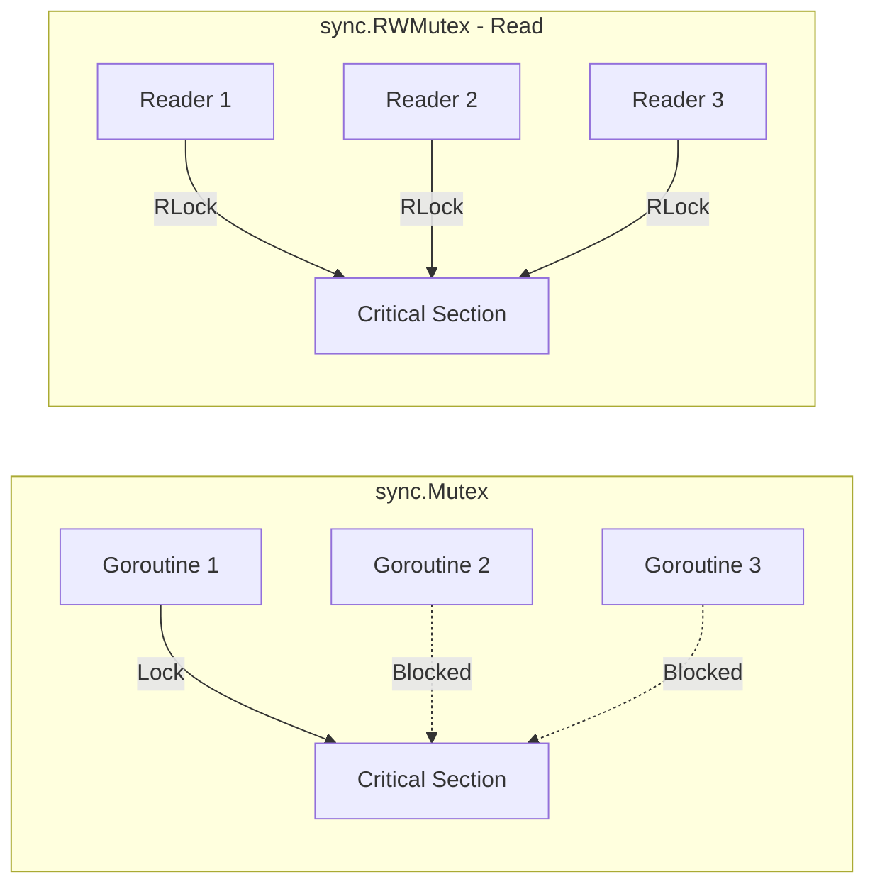

# How to Use Mutex in Go: Patterns and Best Practices

Author: [nawazdhandala](https://www.github.com/nawazdhandala)

Tags: Go, Golang, Mutex, Concurrency, Synchronization, Race Conditions

Description: Master Go mutexes with this comprehensive guide covering sync.Mutex, sync.RWMutex, common patterns, and best practices for safe concurrent programming.

---

Mutexes are fundamental to concurrent programming in Go. They protect shared data from race conditions by ensuring only one goroutine can access critical sections at a time.

---

## Basic Mutex Usage

```go
package main

import (
    "fmt"
    "sync"
)

// Counter with mutex protection
type Counter struct {
    mu    sync.Mutex
    value int
}

func (c *Counter) Increment() {
    c.mu.Lock()         // Acquire lock
    c.value++           // Critical section
    c.mu.Unlock()       // Release lock
}

func (c *Counter) Value() int {
    c.mu.Lock()
    defer c.mu.Unlock()
    return c.value
}

func main() {
    counter := &Counter{}
    var wg sync.WaitGroup
    
    // 1000 goroutines incrementing concurrently
    for i := 0; i < 1000; i++ {
        wg.Add(1)
        go func() {
            defer wg.Done()
            counter.Increment()
        }()
    }
    
    wg.Wait()
    fmt.Println("Final value:", counter.Value())  // Always 1000
}
```

---

## sync.RWMutex for Read-Heavy Workloads

When reads vastly outnumber writes, use `RWMutex`:

```go
package main

import (
    "fmt"
    "sync"
    "time"
)

type Cache struct {
    mu   sync.RWMutex
    data map[string]string
}

func NewCache() *Cache {
    return &Cache{
        data: make(map[string]string),
    }
}

// Set acquires write lock (exclusive)
func (c *Cache) Set(key, value string) {
    c.mu.Lock()
    defer c.mu.Unlock()
    c.data[key] = value
}

// Get acquires read lock (shared - multiple readers allowed)
func (c *Cache) Get(key string) (string, bool) {
    c.mu.RLock()
    defer c.mu.RUnlock()
    val, ok := c.data[key]
    return val, ok
}

// GetAll needs read lock for iteration
func (c *Cache) GetAll() map[string]string {
    c.mu.RLock()
    defer c.mu.RUnlock()
    
    // Return a copy to avoid races after returning
    copy := make(map[string]string, len(c.data))
    for k, v := range c.data {
        copy[k] = v
    }
    return copy
}

func main() {
    cache := NewCache()
    
    // One writer
    go func() {
        for i := 0; i < 10; i++ {
            cache.Set("key", fmt.Sprintf("value%d", i))
            time.Sleep(100 * time.Millisecond)
        }
    }()
    
    // Many readers (can run concurrently)
    var wg sync.WaitGroup
    for i := 0; i < 5; i++ {
        wg.Add(1)
        go func(id int) {
            defer wg.Done()
            for j := 0; j < 10; j++ {
                val, _ := cache.Get("key")
                fmt.Printf("Reader %d: %s\n", id, val)
                time.Sleep(50 * time.Millisecond)
            }
        }(i)
    }
    
    wg.Wait()
}
```

---

## Common Mutex Mistakes

### Mistake 1: Copying a Mutex

```go
// WRONG: Copying mutex copies its state
type Data struct {
    mu   sync.Mutex
    value int
}

func process(d Data) {  // d is a COPY including mutex
    d.mu.Lock()
    d.value++
    d.mu.Unlock()
}

// CORRECT: Pass pointer
func process(d *Data) {
    d.mu.Lock()
    d.value++
    d.mu.Unlock()
}
```

### Mistake 2: Forgetting to Unlock

```go
// WRONG: Early return leaves mutex locked
func (c *Counter) IncrementIfPositive(delta int) {
    c.mu.Lock()
    if delta <= 0 {
        return  // DEADLOCK: mutex never unlocked!
    }
    c.value += delta
    c.mu.Unlock()
}

// CORRECT: Use defer
func (c *Counter) IncrementIfPositive(delta int) {
    c.mu.Lock()
    defer c.mu.Unlock()  // Always unlocks, even on early return
    
    if delta <= 0 {
        return
    }
    c.value += delta
}
```

### Mistake 3: Double Locking (Deadlock)

```go
// WRONG: Method calls another method that also locks
func (c *Counter) Double() {
    c.mu.Lock()
    defer c.mu.Unlock()
    
    current := c.Value()  // DEADLOCK: Value() tries to lock again!
    c.value = current * 2
}

func (c *Counter) Value() int {
    c.mu.Lock()  // Already locked by Double()!
    defer c.mu.Unlock()
    return c.value
}

// CORRECT: Internal method without lock
func (c *Counter) Double() {
    c.mu.Lock()
    defer c.mu.Unlock()
    
    c.value = c.value * 2  // Access directly while locked
}

// Or use separate internal method
func (c *Counter) valueUnsafe() int {
    return c.value  // Caller must hold lock
}

func (c *Counter) Double() {
    c.mu.Lock()
    defer c.mu.Unlock()
    c.value = c.valueUnsafe() * 2
}
```

### Mistake 4: Locking for Too Long

```go
// WRONG: Holding lock during slow operation
func (c *Cache) FetchAndStore(key, url string) error {
    c.mu.Lock()
    defer c.mu.Unlock()
    
    // HTTP request while holding lock - BAD!
    resp, err := http.Get(url)
    if err != nil {
        return err
    }
    defer resp.Body.Close()
    
    data, _ := io.ReadAll(resp.Body)
    c.data[key] = string(data)
    return nil
}

// CORRECT: Minimize critical section
func (c *Cache) FetchAndStore(key, url string) error {
    // Do slow work OUTSIDE lock
    resp, err := http.Get(url)
    if err != nil {
        return err
    }
    defer resp.Body.Close()
    
    data, _ := io.ReadAll(resp.Body)
    
    // Only lock for the actual map write
    c.mu.Lock()
    c.data[key] = string(data)
    c.mu.Unlock()
    
    return nil
}
```

---

## Advanced Patterns

### Try-Lock Pattern

Go doesn't have a built-in try-lock, but you can implement one:

```go
package main

import (
    "sync"
    "sync/atomic"
)

type TryMutex struct {
    locked int32
}

func (m *TryMutex) TryLock() bool {
    return atomic.CompareAndSwapInt32(&m.locked, 0, 1)
}

func (m *TryMutex) Unlock() {
    atomic.StoreInt32(&m.locked, 0)
}

// Usage
func main() {
    var mu TryMutex
    
    if mu.TryLock() {
        defer mu.Unlock()
        // Do work
    } else {
        // Lock was held, do something else
    }
}
```

### Timed Lock with Context

```go
package main

import (
    "context"
    "sync"
    "time"
)

type TimedMutex struct {
    ch chan struct{}
}

func NewTimedMutex() *TimedMutex {
    return &TimedMutex{
        ch: make(chan struct{}, 1),
    }
}

func (m *TimedMutex) Lock() {
    m.ch <- struct{}{}
}

func (m *TimedMutex) Unlock() {
    <-m.ch
}

func (m *TimedMutex) LockWithTimeout(timeout time.Duration) bool {
    select {
    case m.ch <- struct{}{}:
        return true
    case <-time.After(timeout):
        return false
    }
}

func (m *TimedMutex) LockWithContext(ctx context.Context) error {
    select {
    case m.ch <- struct{}{}:
        return nil
    case <-ctx.Done():
        return ctx.Err()
    }
}
```

### Per-Key Locking

Lock only the specific key being accessed:

```go
package main

import (
    "sync"
)

type KeyedMutex struct {
    mu    sync.Mutex
    locks map[string]*sync.Mutex
}

func NewKeyedMutex() *KeyedMutex {
    return &KeyedMutex{
        locks: make(map[string]*sync.Mutex),
    }
}

func (km *KeyedMutex) Lock(key string) {
    km.mu.Lock()
    if _, ok := km.locks[key]; !ok {
        km.locks[key] = &sync.Mutex{}
    }
    keyMu := km.locks[key]
    km.mu.Unlock()
    
    keyMu.Lock()
}

func (km *KeyedMutex) Unlock(key string) {
    km.mu.Lock()
    keyMu := km.locks[key]
    km.mu.Unlock()
    
    keyMu.Unlock()
}

// Usage: different keys can be accessed concurrently
func main() {
    km := NewKeyedMutex()
    
    go func() {
        km.Lock("user:1")
        defer km.Unlock("user:1")
        // Work on user 1
    }()
    
    go func() {
        km.Lock("user:2")  // Doesn't block!
        defer km.Unlock("user:2")
        // Work on user 2 concurrently
    }()
}
```

---

## Mutex vs RWMutex Performance



| Scenario | Use sync.Mutex | Use sync.RWMutex |
|----------|----------------|------------------|
| All operations modify data | Yes | No |
| 90%+ reads, few writes | No | Yes |
| Simple counter | Yes | No |
| Cache with lookups | No | Yes |
| Unknown access pattern | Yes | No |

---

## Embedding Mutex in Struct

```go
package main

import (
    "sync"
)

// Method 1: Named field
type Counter1 struct {
    mu    sync.Mutex
    value int
}

// Method 2: Embedded (anonymous field)
type Counter2 struct {
    sync.Mutex  // Embedded
    value int
}

func main() {
    // Named field - explicit
    c1 := &Counter1{}
    c1.mu.Lock()
    c1.value++
    c1.mu.Unlock()
    
    // Embedded - Lock/Unlock promoted to Counter2
    c2 := &Counter2{}
    c2.Lock()      // Directly on struct
    c2.value++
    c2.Unlock()
}
```

**Recommendation:** Use named field (`mu sync.Mutex`) for clarity. Embedded mutexes can confuse readers about which methods are thread-safe.

---

## Summary

| Pattern | When to Use |
|---------|-------------|
| `sync.Mutex` | General mutual exclusion |
| `sync.RWMutex` | Read-heavy workloads |
| `defer mu.Unlock()` | Always - prevents forgetting |
| Per-key mutex | High-concurrency key-value stores |
| Timed mutex | When blocking indefinitely is unacceptable |

**Best Practices:**

1. Always use `defer` for unlocking
2. Keep critical sections short
3. Never copy a mutex
4. Prefer passing pointers to mutex-containing structs
5. Use RWMutex when reads vastly outnumber writes
6. Test with `-race` flag

---

*Need to monitor mutex contention in production? [OneUptime](https://oneuptime.com) provides Go application profiling and metrics to identify concurrency bottlenecks.*
