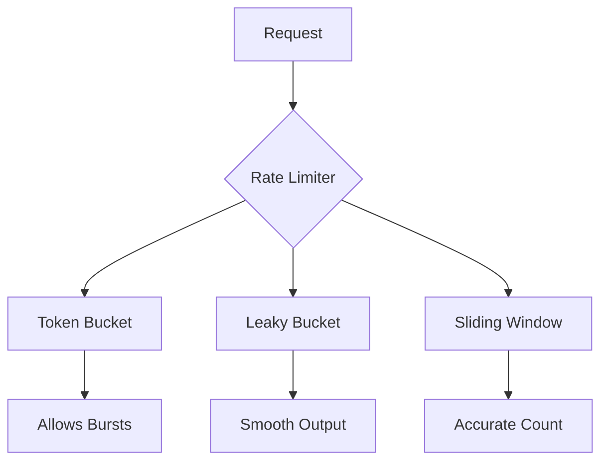

# How to Implement Rate Limiting in Go

Author: [nawazdhandala](https://www.github.com/nawazdhandala)

Tags: Go, Golang, Rate Limiting, Throttling, Token Bucket, Leaky Bucket

Description: Learn how to implement rate limiting patterns in Go using token buckets, leaky buckets, sliding windows, and the golang.org/x/time/rate package.

---

Rate limiting controls request flow to protect services from overload. Go provides excellent primitives and libraries for implementing various rate limiting algorithms.

---

## Using golang.org/x/time/rate

The standard library extension:

```go
package main

import (
    "context"
    "fmt"
    "time"

    "golang.org/x/time/rate"
)

func main() {
    // Allow 5 events per second, burst of 10
    limiter := rate.NewLimiter(rate.Limit(5), 10)
    
    ctx := context.Background()
    
    for i := 0; i < 20; i++ {
        // Wait blocks until allowed
        if err := limiter.Wait(ctx); err != nil {
            fmt.Println("Error:", err)
            return
        }
        fmt.Printf("Request %d at %s\n", i, time.Now().Format("15:04:05.000"))
    }
}
```

---

## Non-Blocking Rate Limiting

```go
package main

import (
    "fmt"
    "time"

    "golang.org/x/time/rate"
)

func main() {
    limiter := rate.NewLimiter(rate.Every(200*time.Millisecond), 5)
    
    for i := 0; i < 10; i++ {
        if limiter.Allow() {
            fmt.Printf("Request %d allowed at %s\n", 
                i, time.Now().Format("15:04:05.000"))
        } else {
            fmt.Printf("Request %d denied - rate limited\n", i)
        }
        time.Sleep(50 * time.Millisecond)
    }
}
```

---

## Token Bucket Implementation

Build from scratch:

```go
package main

import (
    "fmt"
    "sync"
    "time"
)

type TokenBucket struct {
    capacity   int           // Maximum tokens
    tokens     float64       // Current tokens
    rate       float64       // Tokens per second
    lastRefill time.Time
    mu         sync.Mutex
}

func NewTokenBucket(capacity int, tokensPerSecond float64) *TokenBucket {
    return &TokenBucket{
        capacity:   capacity,
        tokens:     float64(capacity),
        rate:       tokensPerSecond,
        lastRefill: time.Now(),
    }
}

func (tb *TokenBucket) refill() {
    now := time.Now()
    elapsed := now.Sub(tb.lastRefill).Seconds()
    tb.tokens += elapsed * tb.rate
    
    if tb.tokens > float64(tb.capacity) {
        tb.tokens = float64(tb.capacity)
    }
    tb.lastRefill = now
}

func (tb *TokenBucket) Allow() bool {
    tb.mu.Lock()
    defer tb.mu.Unlock()
    
    tb.refill()
    
    if tb.tokens >= 1 {
        tb.tokens--
        return true
    }
    return false
}

func (tb *TokenBucket) AllowN(n int) bool {
    tb.mu.Lock()
    defer tb.mu.Unlock()
    
    tb.refill()
    
    if tb.tokens >= float64(n) {
        tb.tokens -= float64(n)
        return true
    }
    return false
}

func main() {
    // 5 tokens capacity, 2 tokens per second
    bucket := NewTokenBucket(5, 2)
    
    for i := 0; i < 15; i++ {
        if bucket.Allow() {
            fmt.Printf("Request %d: allowed\n", i)
        } else {
            fmt.Printf("Request %d: denied\n", i)
        }
        time.Sleep(200 * time.Millisecond)
    }
}
```

---

## Sliding Window Rate Limiter

More accurate for distributed systems:

```go
package main

import (
    "fmt"
    "sync"
    "time"
)

type SlidingWindow struct {
    limit      int
    windowSize time.Duration
    requests   []time.Time
    mu         sync.Mutex
}

func NewSlidingWindow(limit int, window time.Duration) *SlidingWindow {
    return &SlidingWindow{
        limit:      limit,
        windowSize: window,
        requests:   make([]time.Time, 0, limit),
    }
}

func (sw *SlidingWindow) Allow() bool {
    sw.mu.Lock()
    defer sw.mu.Unlock()
    
    now := time.Now()
    windowStart := now.Add(-sw.windowSize)
    
    // Remove old requests outside window
    validRequests := make([]time.Time, 0, len(sw.requests))
    for _, t := range sw.requests {
        if t.After(windowStart) {
            validRequests = append(validRequests, t)
        }
    }
    sw.requests = validRequests
    
    // Check if under limit
    if len(sw.requests) < sw.limit {
        sw.requests = append(sw.requests, now)
        return true
    }
    
    return false
}

func (sw *SlidingWindow) Remaining() int {
    sw.mu.Lock()
    defer sw.mu.Unlock()
    
    now := time.Now()
    windowStart := now.Add(-sw.windowSize)
    
    count := 0
    for _, t := range sw.requests {
        if t.After(windowStart) {
            count++
        }
    }
    
    remaining := sw.limit - count
    if remaining < 0 {
        return 0
    }
    return remaining
}

func main() {
    // 5 requests per 2 seconds
    limiter := NewSlidingWindow(5, 2*time.Second)
    
    for i := 0; i < 15; i++ {
        if limiter.Allow() {
            fmt.Printf("Request %d: allowed (remaining: %d)\n", 
                i, limiter.Remaining())
        } else {
            fmt.Printf("Request %d: denied (remaining: %d)\n", 
                i, limiter.Remaining())
        }
        time.Sleep(300 * time.Millisecond)
    }
}
```

---

## Leaky Bucket Algorithm

Fixed output rate:

```go
package main

import (
    "fmt"
    "sync"
    "time"
)

type LeakyBucket struct {
    capacity int           // Queue size
    queue    chan struct{} // Request queue
    rate     time.Duration // Leak rate
    mu       sync.Mutex
}

func NewLeakyBucket(capacity int, rate time.Duration) *LeakyBucket {
    lb := &LeakyBucket{
        capacity: capacity,
        queue:    make(chan struct{}, capacity),
        rate:     rate,
    }
    
    // Start leaking (processing)
    go lb.leak()
    
    return lb
}

func (lb *LeakyBucket) leak() {
    ticker := time.NewTicker(lb.rate)
    defer ticker.Stop()
    
    for range ticker.C {
        select {
        case <-lb.queue:
            // Processed one request
        default:
            // Queue empty
        }
    }
}

func (lb *LeakyBucket) Allow() bool {
    select {
    case lb.queue <- struct{}{}:
        return true
    default:
        return false
    }
}

func (lb *LeakyBucket) QueueLength() int {
    return len(lb.queue)
}

func main() {
    // 5 capacity, process 1 every 500ms
    bucket := NewLeakyBucket(5, 500*time.Millisecond)
    
    for i := 0; i < 10; i++ {
        if bucket.Allow() {
            fmt.Printf("Request %d: queued (queue: %d)\n", 
                i, bucket.QueueLength())
        } else {
            fmt.Printf("Request %d: rejected - queue full\n", i)
        }
        time.Sleep(100 * time.Millisecond)
    }
    
    // Wait for processing
    time.Sleep(3 * time.Second)
    fmt.Println("Final queue length:", bucket.QueueLength())
}
```

---

## Per-Client Rate Limiting

```go
package main

import (
    "fmt"
    "sync"
    "time"

    "golang.org/x/time/rate"
)

type ClientLimiter struct {
    clients map[string]*rate.Limiter
    rate    rate.Limit
    burst   int
    mu      sync.RWMutex
}

func NewClientLimiter(r rate.Limit, burst int) *ClientLimiter {
    return &ClientLimiter{
        clients: make(map[string]*rate.Limiter),
        rate:    r,
        burst:   burst,
    }
}

func (cl *ClientLimiter) GetLimiter(clientID string) *rate.Limiter {
    cl.mu.RLock()
    limiter, exists := cl.clients[clientID]
    cl.mu.RUnlock()
    
    if exists {
        return limiter
    }
    
    cl.mu.Lock()
    defer cl.mu.Unlock()
    
    // Double-check after acquiring write lock
    if limiter, exists = cl.clients[clientID]; exists {
        return limiter
    }
    
    limiter = rate.NewLimiter(cl.rate, cl.burst)
    cl.clients[clientID] = limiter
    return limiter
}

func (cl *ClientLimiter) Allow(clientID string) bool {
    return cl.GetLimiter(clientID).Allow()
}

func (cl *ClientLimiter) Cleanup(maxAge time.Duration) {
    // Remove old clients periodically
    cl.mu.Lock()
    defer cl.mu.Unlock()
    
    // In production, track last access time
    // and remove inactive clients
}

func main() {
    // 2 requests/second, burst of 5 per client
    limiter := NewClientLimiter(2, 5)
    
    clients := []string{"client-a", "client-b", "client-a", "client-a"}
    
    for i, client := range clients {
        for j := 0; j < 5; j++ {
            if limiter.Allow(client) {
                fmt.Printf("Request %d from %s: allowed\n", i*5+j, client)
            } else {
                fmt.Printf("Request %d from %s: denied\n", i*5+j, client)
            }
        }
    }
}
```

---

## HTTP Middleware Rate Limiter

```go
package main

import (
    "encoding/json"
    "fmt"
    "net/http"
    "sync"

    "golang.org/x/time/rate"
)

type RateLimitMiddleware struct {
    visitors map[string]*rate.Limiter
    rate     rate.Limit
    burst    int
    mu       sync.RWMutex
}

func NewRateLimitMiddleware(r rate.Limit, burst int) *RateLimitMiddleware {
    return &RateLimitMiddleware{
        visitors: make(map[string]*rate.Limiter),
        rate:     r,
        burst:    burst,
    }
}

func (rl *RateLimitMiddleware) getLimiter(ip string) *rate.Limiter {
    rl.mu.Lock()
    defer rl.mu.Unlock()
    
    limiter, exists := rl.visitors[ip]
    if !exists {
        limiter = rate.NewLimiter(rl.rate, rl.burst)
        rl.visitors[ip] = limiter
    }
    return limiter
}

func (rl *RateLimitMiddleware) Middleware(next http.Handler) http.Handler {
    return http.HandlerFunc(func(w http.ResponseWriter, r *http.Request) {
        ip := r.RemoteAddr
        
        limiter := rl.getLimiter(ip)
        
        if !limiter.Allow() {
            w.Header().Set("Content-Type", "application/json")
            w.Header().Set("Retry-After", "1")
            w.WriteHeader(http.StatusTooManyRequests)
            json.NewEncoder(w).Encode(map[string]string{
                "error": "rate limit exceeded",
            })
            return
        }
        
        next.ServeHTTP(w, r)
    })
}

func main() {
    // 10 requests/second, burst of 20
    rateLimiter := NewRateLimitMiddleware(10, 20)
    
    mux := http.NewServeMux()
    mux.HandleFunc("/api/data", func(w http.ResponseWriter, r *http.Request) {
        json.NewEncoder(w).Encode(map[string]string{"status": "ok"})
    })
    
    handler := rateLimiter.Middleware(mux)
    
    fmt.Println("Server starting on :8080")
    http.ListenAndServe(":8080", handler)
}
```

---

## Distributed Rate Limiting with Redis

```go
package main

import (
    "context"
    "fmt"
    "time"

    "github.com/redis/go-redis/v9"
)

type RedisRateLimiter struct {
    client *redis.Client
    limit  int
    window time.Duration
}

func NewRedisRateLimiter(client *redis.Client, limit int, window time.Duration) *RedisRateLimiter {
    return &RedisRateLimiter{
        client: client,
        limit:  limit,
        window: window,
    }
}

func (rl *RedisRateLimiter) Allow(ctx context.Context, key string) (bool, error) {
    now := time.Now().UnixNano()
    windowStart := now - int64(rl.window)
    
    pipe := rl.client.Pipeline()
    
    // Remove old entries
    pipe.ZRemRangeByScore(ctx, key, "0", fmt.Sprintf("%d", windowStart))
    
    // Count current entries
    countCmd := pipe.ZCard(ctx, key)
    
    // Add new entry
    pipe.ZAdd(ctx, key, redis.Z{Score: float64(now), Member: now})
    
    // Set expiration
    pipe.Expire(ctx, key, rl.window)
    
    _, err := pipe.Exec(ctx)
    if err != nil {
        return false, err
    }
    
    count := countCmd.Val()
    return count < int64(rl.limit), nil
}

func (rl *RedisRateLimiter) Remaining(ctx context.Context, key string) (int, error) {
    now := time.Now().UnixNano()
    windowStart := now - int64(rl.window)
    
    // Remove old and count
    rl.client.ZRemRangeByScore(ctx, key, "0", fmt.Sprintf("%d", windowStart))
    count, err := rl.client.ZCard(ctx, key).Result()
    if err != nil {
        return 0, err
    }
    
    remaining := rl.limit - int(count)
    if remaining < 0 {
        return 0, nil
    }
    return remaining, nil
}

func main() {
    client := redis.NewClient(&redis.Options{
        Addr: "localhost:6379",
    })
    
    limiter := NewRedisRateLimiter(client, 5, time.Minute)
    ctx := context.Background()
    
    for i := 0; i < 10; i++ {
        allowed, _ := limiter.Allow(ctx, "user:123")
        remaining, _ := limiter.Remaining(ctx, "user:123")
        
        fmt.Printf("Request %d: allowed=%v, remaining=%d\n", 
            i, allowed, remaining)
    }
}
```

---

## Rate Limiter Comparison



---

## Summary

| Algorithm | Burst Handling | Memory | Use Case |
|-----------|---------------|--------|----------|
| Token Bucket | Allows burst | O(1) | API rate limiting |
| Leaky Bucket | Smooths traffic | O(queue) | Traffic shaping |
| Sliding Window | No burst | O(n) | Accurate counting |
| Fixed Window | Boundary issues | O(1) | Simple use cases |

**Best Practices:**

1. Use `golang.org/x/time/rate` for most cases
2. Per-client limits prevent abuse
3. Return `Retry-After` header on 429
4. Use Redis for distributed systems
5. Log rate limit events for monitoring
6. Consider graceful degradation
7. Test under load to tune limits

---

*Monitoring rate limiting in production? [OneUptime](https://oneuptime.com) helps you track rate limit hits, identify abuse patterns, and optimize your limits.*
