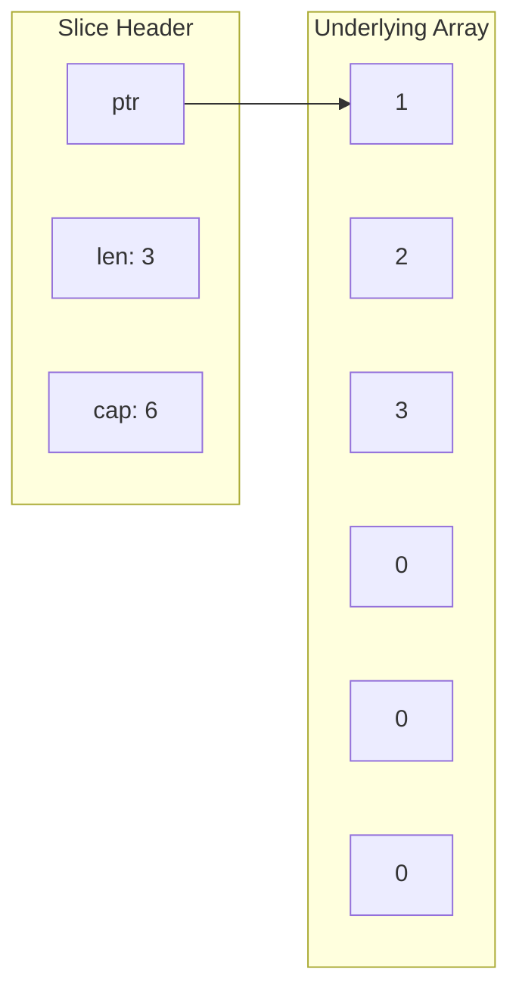

# How to Fix Slice Append Overwriting Existing Data in Go

Author: [nawazdhandala](https://www.github.com/nawazdhandala)

Tags: Go, Golang, Slices, Append, Memory, Arrays, Common Bugs

Description: Understand why slice append can overwrite data in Go and learn safe patterns for working with slices to avoid unexpected mutations.

---

One of Go's most confusing behaviors is when `append()` seems to overwrite data you didn't expect. This happens because of how slices share underlying arrays. Understanding this mechanism is crucial for writing correct Go code.

---

## The Problem

```go
package main

import "fmt"

func main() {
    original := make([]int, 3, 6)  // len=3, cap=6
    original[0], original[1], original[2] = 1, 2, 3
    
    // Create a slice from original
    slice1 := original[:2]  // [1, 2]
    
    // Append to slice1
    slice1 = append(slice1, 100)
    
    // Check original - it's been modified!
    fmt.Println("original:", original)  // [1 2 100] - NOT [1 2 3]!
    fmt.Println("slice1:", slice1)      // [1 2 100]
}
```

What happened? `slice1` shared the same underlying array as `original`, and `append` wrote into that shared space.

---

## Understanding Slice Internals

A slice is a struct with three fields:

```go
type slice struct {
    ptr *array  // Pointer to underlying array
    len int     // Length of slice
    cap int     // Capacity of slice
}
```



When you create a sub-slice, it shares the array:

```go
original := []int{1, 2, 3, 4, 5}
slice := original[1:3]  // [2, 3] - shares original's array
```

---

## When Append Overwrites

Append overwrites when:

1. The slice has extra capacity
2. You append within that capacity

```go
package main

import "fmt"

func main() {
    base := make([]int, 3, 5)  // len=3, cap=5
    base[0], base[1], base[2] = 1, 2, 3
    
    // sub shares base's array and has extra capacity
    sub := base[:2]  // len=2, cap=5
    
    // Append uses existing capacity - overwrites base[2]!
    sub = append(sub, 999)
    
    fmt.Println("base:", base)  // [1 2 999]
    fmt.Println("sub:", sub)    // [1 2 999]
}
```

---

## When Append Creates New Array

Append creates a new array when capacity is exceeded:

```go
package main

import "fmt"

func main() {
    base := []int{1, 2, 3}  // len=3, cap=3
    
    sub := base[:2]  // len=2, cap=3
    
    // Fill remaining capacity
    sub = append(sub, 100)  // Still same array, overwrites base[2]
    fmt.Println("After first append:")
    fmt.Println("base:", base)  // [1 2 100]
    
    // Now exceed capacity - new array allocated
    sub = append(sub, 200)  // New array created
    fmt.Println("After second append:")
    fmt.Println("base:", base)  // [1 2 100] - unchanged
    fmt.Println("sub:", sub)    // [1 2 100 200]
    
    // Further appends don't affect base
    sub[0] = 999
    fmt.Println("base:", base)  // [1 2 100] - still unchanged
}
```

---

## Safe Patterns

### Pattern 1: Use Full Slice Expression (Limit Capacity)

```go
package main

import "fmt"

func main() {
    base := []int{1, 2, 3, 4, 5}
    
    // Regular slice - inherits capacity
    unsafe := base[1:3]  // len=2, cap=4
    
    // Full slice expression - limits capacity
    safe := base[1:3:3]  // len=2, cap=2 (cap=high-low)
    
    // Append to unsafe overwrites base
    unsafe = append(unsafe, 100)
    fmt.Println("base after unsafe append:", base)  // [1 2 3 100 5]
    
    // Reset
    base = []int{1, 2, 3, 4, 5}
    safe = base[1:3:3]
    
    // Append to safe creates new array
    safe = append(safe, 200)
    fmt.Println("base after safe append:", base)  // [1 2 3 4 5] - unchanged
    fmt.Println("safe:", safe)                     // [2 3 200]
}
```

The full slice expression `a[low:high:max]` sets capacity to `max-low`.

### Pattern 2: Copy Instead of Slice

```go
package main

import "fmt"

func getSubset(data []int) []int {
    // WRONG: Returns slice of original - can cause problems
    // return data[1:3]
    
    // CORRECT: Return a copy
    subset := make([]int, 2)
    copy(subset, data[1:3])
    return subset
}

func main() {
    original := []int{1, 2, 3, 4, 5}
    subset := getSubset(original)
    
    // Modifying subset doesn't affect original
    subset = append(subset, 100)
    subset[0] = 999
    
    fmt.Println("original:", original)  // [1 2 3 4 5]
    fmt.Println("subset:", subset)      // [999 3 100]
}
```

### Pattern 3: Append to nil Slice

```go
package main

import "fmt"

func collectEven(nums []int) []int {
    var result []int  // nil slice
    
    for _, n := range nums {
        if n%2 == 0 {
            result = append(result, n)  // Creates new array
        }
    }
    
    return result  // Completely independent
}

func main() {
    nums := []int{1, 2, 3, 4, 5, 6}
    even := collectEven(nums)
    
    even[0] = 100  // Doesn't affect nums
    fmt.Println("nums:", nums)  // [1 2 3 4 5 6]
    fmt.Println("even:", even)  // [100 4 6]
}
```

### Pattern 4: Pre-allocate with make()

```go
package main

import "fmt"

func transform(input []int) []int {
    // Pre-allocate result with exact size
    result := make([]int, len(input))
    
    for i, v := range input {
        result[i] = v * 2
    }
    
    return result  // Independent slice
}

func main() {
    original := []int{1, 2, 3}
    doubled := transform(original)
    
    doubled[0] = 100
    fmt.Println("original:", original)  // [1 2 3]
    fmt.Println("doubled:", doubled)    // [100 4 6]
}
```

---

## Real-World Bug Example

```go
package main

import "fmt"

func filterPositive(nums []int) []int {
    result := nums[:0]  // Reuse underlying array - DANGER!
    
    for _, n := range nums {
        if n > 0 {
            result = append(result, n)
        }
    }
    
    return result
}

func main() {
    original := []int{-1, 2, -3, 4, 5, -6}
    positive := filterPositive(original)
    
    fmt.Println("positive:", positive)  // [2 4 5]
    fmt.Println("original:", original)  // [2 4 5 4 5 -6] - corrupted!
}
```

**Fix:**

```go
func filterPositive(nums []int) []int {
    var result []int  // New slice
    
    for _, n := range nums {
        if n > 0 {
            result = append(result, n)
        }
    }
    
    return result
}
```

---

## Summary

| Scenario | append Behavior |
|----------|-----------------|
| Within capacity | Writes to existing array (may overwrite) |
| Exceeds capacity | Allocates new array |
| From nil slice | Creates new array |

**Safe Patterns:**

1. **Full slice expression**: `a[low:high:max]` - limits capacity
2. **Copy**: `copy(dst, src)` - creates independent slice
3. **nil slice**: `var s []T` then append - always new array
4. **make**: `make([]T, len)` - pre-allocate new array

**Key Rule**: If you need an independent slice, either:

- Use full slice expression to limit capacity, or
- Copy the data to a new slice

---

*Building Go applications? [OneUptime](https://oneuptime.com) provides monitoring and observability to help you catch subtle bugs in production.*
