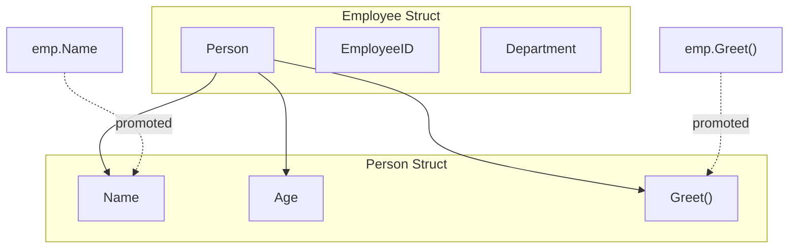

# How to Use Struct Embedding for Composition in Go

Author: [nawazdhandala](https://www.github.com/nawazdhandala)

Tags: Go, Golang, Structs, Embedding, Composition, Inheritance, OOP

Description: Learn how to use struct embedding in Go for composition over inheritance. Understand method promotion, embedding interfaces, and common patterns.

---

Go favors composition over inheritance. Struct embedding lets you compose types by including one struct inside another, automatically promoting fields and methods. This is one of Go's most powerful features.

---

## Basic Struct Embedding

```go
package main

import "fmt"

// Base type
type Person struct {
    Name string
    Age  int
}

func (p Person) Greet() string {
    return fmt.Sprintf("Hello, I'm %s", p.Name)
}

// Embedding Person in Employee
type Employee struct {
    Person      // Embedded (anonymous field)
    EmployeeID string
    Department string
}

func main() {
    emp := Employee{
        Person:     Person{Name: "Alice", Age: 30},
        EmployeeID: "E123",
        Department: "Engineering",
    }
    
    // Access embedded fields directly
    fmt.Println("Name:", emp.Name)          // Promoted field
    fmt.Println("Age:", emp.Age)            // Promoted field
    fmt.Println("ID:", emp.EmployeeID)
    
    // Access embedded methods directly
    fmt.Println(emp.Greet())                // Promoted method
    
    // Can still access via the embedded type name
    fmt.Println("Via Person:", emp.Person.Name)
}
```

**Output:**
```
Name: Alice
Age: 30
ID: E123
Hello, I'm Alice
Via Person: Alice
```

---

## How Embedding Works



---

## Multiple Embedding

```go
package main

import "fmt"

type Address struct {
    Street  string
    City    string
    Country string
}

func (a Address) FullAddress() string {
    return fmt.Sprintf("%s, %s, %s", a.Street, a.City, a.Country)
}

type ContactInfo struct {
    Email string
    Phone string
}

func (c ContactInfo) PrimaryContact() string {
    return c.Email
}

// Embed multiple types
type Customer struct {
    Address
    ContactInfo
    CustomerID string
    Name       string
}

func main() {
    cust := Customer{
        Address: Address{
            Street:  "123 Main St",
            City:    "New York",
            Country: "USA",
        },
        ContactInfo: ContactInfo{
            Email: "customer@example.com",
            Phone: "555-1234",
        },
        CustomerID: "C001",
        Name:       "John Doe",
    }
    
    // All fields and methods are promoted
    fmt.Println("City:", cust.City)
    fmt.Println("Email:", cust.Email)
    fmt.Println("Address:", cust.FullAddress())
    fmt.Println("Contact:", cust.PrimaryContact())
}
```

---

## Method Overriding

Outer type methods take precedence:

```go
package main

import "fmt"

type Animal struct {
    Name string
}

func (a Animal) Speak() string {
    return "..."
}

func (a Animal) Move() string {
    return "moving"
}

type Dog struct {
    Animal
    Breed string
}

// Override the Speak method
func (d Dog) Speak() string {
    return "Woof!"
}

func main() {
    dog := Dog{
        Animal: Animal{Name: "Buddy"},
        Breed:  "Labrador",
    }
    
    fmt.Println(dog.Speak())  // "Woof!" - Dog's method
    fmt.Println(dog.Move())   // "moving" - Animal's method (promoted)
    
    // Can still call embedded type's method
    fmt.Println(dog.Animal.Speak())  // "..."
}
```

---

## Embedding Interfaces

Embed interfaces to require implementation:

```go
package main

import (
    "fmt"
    "io"
    "strings"
)

// Custom writer that counts bytes
type CountingWriter struct {
    io.Writer  // Embed the interface
    Count int64
}

func (cw *CountingWriter) Write(p []byte) (int, error) {
    n, err := cw.Writer.Write(p)  // Call embedded writer
    cw.Count += int64(n)
    return n, err
}

func main() {
    var buf strings.Builder
    cw := &CountingWriter{Writer: &buf}
    
    fmt.Fprintln(cw, "Hello, World!")
    fmt.Fprintln(cw, "More text")
    
    fmt.Printf("Wrote %d bytes\n", cw.Count)
    fmt.Println("Content:", buf.String())
}
```

---

## Embedding Pointers

```go
package main

import "fmt"

type Engine struct {
    Horsepower int
    Type       string
}

func (e *Engine) Start() {
    fmt.Println("Engine started:", e.Type)
}

// Embed pointer to allow nil and shared references
type Car struct {
    *Engine  // Pointer embedding
    Model string
}

func main() {
    engine := &Engine{Horsepower: 300, Type: "V6"}
    
    car1 := Car{Engine: engine, Model: "Sedan"}
    car2 := Car{Engine: engine, Model: "Coupe"}  // Share same engine
    
    car1.Start()
    fmt.Println("Car1 HP:", car1.Horsepower)
    
    // Modify through car1, affects car2
    car1.Horsepower = 350
    fmt.Println("Car2 HP:", car2.Horsepower)  // 350
    
    // Be careful with nil embedded pointers
    carNoEngine := Car{Model: "Kit"}
    // carNoEngine.Start()  // PANIC: nil pointer dereference
    
    if carNoEngine.Engine != nil {
        carNoEngine.Start()
    }
}
```

---

## Field Name Conflicts

When embedded types have the same field name:

```go
package main

import "fmt"

type A struct {
    Name string
    X    int
}

type B struct {
    Name string
    Y    int
}

type C struct {
    A
    B
    Z int
}

func main() {
    c := C{
        A: A{Name: "A", X: 1},
        B: B{Name: "B", Y: 2},
        Z: 3,
    }
    
    // This is ambiguous - won't compile:
    // fmt.Println(c.Name)  // Error: ambiguous selector c.Name
    
    // Must qualify with type name
    fmt.Println("A.Name:", c.A.Name)
    fmt.Println("B.Name:", c.B.Name)
    
    // Non-conflicting fields still promoted
    fmt.Println("X:", c.X)
    fmt.Println("Y:", c.Y)
}
```

---

## Common Patterns

### Pattern 1: Extend Standard Library Types

```go
package main

import (
    "sync"
)

// Extend sync.Mutex with additional methods
type NamedMutex struct {
    sync.Mutex
    name string
}

func NewNamedMutex(name string) *NamedMutex {
    return &NamedMutex{name: name}
}

func (nm *NamedMutex) LockWithLog() {
    fmt.Printf("Locking: %s\n", nm.name)
    nm.Lock()  // Promoted from sync.Mutex
}

func (nm *NamedMutex) UnlockWithLog() {
    nm.Unlock()  // Promoted from sync.Mutex
    fmt.Printf("Unlocked: %s\n", nm.name)
}
```

### Pattern 2: Middleware/Decorator

```go
package main

import (
    "log"
    "net/http"
    "time"
)

type LoggingHandler struct {
    http.Handler
    Logger *log.Logger
}

func (lh *LoggingHandler) ServeHTTP(w http.ResponseWriter, r *http.Request) {
    start := time.Now()
    
    // Call embedded handler
    lh.Handler.ServeHTTP(w, r)
    
    // Log after
    lh.Logger.Printf("%s %s %v", r.Method, r.URL.Path, time.Since(start))
}

func main() {
    mux := http.NewServeMux()
    mux.HandleFunc("/", func(w http.ResponseWriter, r *http.Request) {
        w.Write([]byte("Hello"))
    })
    
    logged := &LoggingHandler{
        Handler: mux,
        Logger:  log.Default(),
    }
    
    http.ListenAndServe(":8080", logged)
}
```

### Pattern 3: Base Configuration

```go
package main

type BaseConfig struct {
    Debug   bool
    Timeout int
    LogPath string
}

type ServerConfig struct {
    BaseConfig
    Port     int
    Hostname string
}

type ClientConfig struct {
    BaseConfig
    ServerURL string
    APIKey    string
}

func main() {
    server := ServerConfig{
        BaseConfig: BaseConfig{Debug: true, Timeout: 30, LogPath: "/var/log/app"},
        Port:       8080,
        Hostname:   "localhost",
    }
    
    client := ClientConfig{
        BaseConfig: BaseConfig{Debug: false, Timeout: 10, LogPath: "/var/log/client"},
        ServerURL:  "https://api.example.com",
        APIKey:     "secret",
    }
    
    // Common config accessible on both
    _ = server.Debug
    _ = client.Timeout
}
```

---

## Embedding vs Named Fields

| Embedding | Named Field |
|-----------|-------------|
| `Person` | `person Person` |
| Fields/methods promoted | Must access via field name |
| Shorter syntax | More explicit |
| Can cause ambiguity | No ambiguity |
| Interface satisfaction | No interface satisfaction |

```go
// Embedding - implements fmt.Stringer if Person does
type Employee struct {
    Person
}

// Named field - does NOT implement fmt.Stringer
type Employee struct {
    person Person
}
```

---

## Summary

**Embedding provides:**
- Automatic field and method promotion
- Composition without inheritance
- Interface satisfaction through embedded types
- Ability to override methods

**Best Practices:**

1. Use embedding for "is-a" relationships with behavior
2. Use named fields when you don't want promotion
3. Be careful with method name conflicts
4. Document when embedding is for interface satisfaction
5. Handle nil embedded pointers carefully
6. Prefer composition over deep embedding hierarchies

---

*Building complex Go applications? [OneUptime](https://oneuptime.com) helps you monitor and trace your services, making it easier to understand how your composed types behave in production.*
