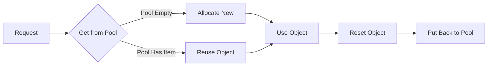

# How to Use sync.Pool for Object Reuse in Go

Author: [nawazdhandala](https://www.github.com/nawazdhandala)

Tags: Go, Golang, sync.Pool, Memory, Performance, Object Pool

Description: Learn how to use sync.Pool in Go to reuse objects, reduce garbage collection pressure, and improve application performance.

---

`sync.Pool` is a cache of objects that can be reused to reduce memory allocations. It is especially useful for frequently allocated objects that have similar lifecycles.

---

## Basic sync.Pool Usage

```go
package main

import (
    "bytes"
    "fmt"
    "sync"
)

var bufferPool = sync.Pool{
    New: func() interface{} {
        fmt.Println("Creating new buffer")
        return new(bytes.Buffer)
    },
}

func main() {
    // Get a buffer from pool (may create new one)
    buf := bufferPool.Get().(*bytes.Buffer)
    
    // Use the buffer
    buf.WriteString("Hello, World!")
    fmt.Println(buf.String())
    
    // Reset and return to pool
    buf.Reset()
    bufferPool.Put(buf)
    
    // Get again - reuses the buffer
    buf2 := bufferPool.Get().(*bytes.Buffer)
    buf2.WriteString("Reused buffer!")
    fmt.Println(buf2.String())
    
    buf2.Reset()
    bufferPool.Put(buf2)
}
```

---

## Why Use sync.Pool?



**Benefits:**

1. Reduces garbage collection pressure
2. Improves performance for high-allocation workloads
3. Automatic cleanup during GC
4. Thread-safe by design

---

## Pooling Byte Slices

```go
package main

import (
    "fmt"
    "sync"
)

// Pool for 4KB byte slices
var slicePool = sync.Pool{
    New: func() interface{} {
        slice := make([]byte, 4096)
        return &slice
    },
}

func getSlice() *[]byte {
    return slicePool.Get().(*[]byte)
}

func putSlice(s *[]byte) {
    // Reset slice length but keep capacity
    *s = (*s)[:0]
    slicePool.Put(s)
}

func processData(data []byte) {
    slice := getSlice()
    defer putSlice(slice)
    
    // Use slice for processing
    *slice = append(*slice, data...)
    fmt.Printf("Processed %d bytes\n", len(*slice))
}

func main() {
    for i := 0; i < 5; i++ {
        processData([]byte("some data to process"))
    }
}
```

---

## Pooling Structs

```go
package main

import (
    "fmt"
    "sync"
)

type Request struct {
    ID      int
    Method  string
    Path    string
    Headers map[string]string
    Body    []byte
}

var requestPool = sync.Pool{
    New: func() interface{} {
        return &Request{
            Headers: make(map[string]string),
            Body:    make([]byte, 0, 1024),
        }
    },
}

func acquireRequest() *Request {
    return requestPool.Get().(*Request)
}

func releaseRequest(r *Request) {
    // Reset all fields
    r.ID = 0
    r.Method = ""
    r.Path = ""
    
    // Clear map but keep it allocated
    for k := range r.Headers {
        delete(r.Headers, k)
    }
    
    // Reset slice but keep capacity
    r.Body = r.Body[:0]
    
    requestPool.Put(r)
}

func handleRequest() {
    req := acquireRequest()
    defer releaseRequest(req)
    
    req.ID = 123
    req.Method = "POST"
    req.Path = "/api/users"
    req.Headers["Content-Type"] = "application/json"
    req.Body = append(req.Body, []byte(`{"name":"John"}`)...)
    
    fmt.Printf("Processing: %s %s\n", req.Method, req.Path)
}

func main() {
    for i := 0; i < 3; i++ {
        handleRequest()
    }
}
```

---

## JSON Encoder Pool

Common pattern for HTTP APIs:

```go
package main

import (
    "bytes"
    "encoding/json"
    "fmt"
    "sync"
)

var encoderPool = sync.Pool{
    New: func() interface{} {
        return &bytes.Buffer{}
    },
}

func marshalJSON(v interface{}) ([]byte, error) {
    buf := encoderPool.Get().(*bytes.Buffer)
    defer func() {
        buf.Reset()
        encoderPool.Put(buf)
    }()
    
    encoder := json.NewEncoder(buf)
    if err := encoder.Encode(v); err != nil {
        return nil, err
    }
    
    // Return a copy since buf will be reused
    result := make([]byte, buf.Len())
    copy(result, buf.Bytes())
    return result, nil
}

type User struct {
    Name  string `json:"name"`
    Email string `json:"email"`
}

func main() {
    users := []User{
        {Name: "Alice", Email: "alice@example.com"},
        {Name: "Bob", Email: "bob@example.com"},
    }
    
    for _, u := range users {
        data, err := marshalJSON(u)
        if err != nil {
            fmt.Println("Error:", err)
            continue
        }
        fmt.Printf("JSON: %s", data)
    }
}
```

---

## Pool with Size Variations

Handle different buffer sizes:

```go
package main

import (
    "fmt"
    "sync"
)

type SizedPool struct {
    small  sync.Pool  // 1KB
    medium sync.Pool  // 8KB
    large  sync.Pool  // 64KB
}

func NewSizedPool() *SizedPool {
    return &SizedPool{
        small: sync.Pool{
            New: func() interface{} {
                b := make([]byte, 0, 1024)
                return &b
            },
        },
        medium: sync.Pool{
            New: func() interface{} {
                b := make([]byte, 0, 8192)
                return &b
            },
        },
        large: sync.Pool{
            New: func() interface{} {
                b := make([]byte, 0, 65536)
                return &b
            },
        },
    }
}

func (sp *SizedPool) Get(size int) *[]byte {
    if size <= 1024 {
        return sp.small.Get().(*[]byte)
    }
    if size <= 8192 {
        return sp.medium.Get().(*[]byte)
    }
    return sp.large.Get().(*[]byte)
}

func (sp *SizedPool) Put(b *[]byte) {
    cap := cap(*b)
    *b = (*b)[:0]
    
    if cap <= 1024 {
        sp.small.Put(b)
    } else if cap <= 8192 {
        sp.medium.Put(b)
    } else {
        sp.large.Put(b)
    }
}

func main() {
    pool := NewSizedPool()
    
    // Get appropriate sized buffer
    small := pool.Get(512)
    medium := pool.Get(4096)
    large := pool.Get(32000)
    
    fmt.Printf("Small cap: %d\n", cap(*small))
    fmt.Printf("Medium cap: %d\n", cap(*medium))
    fmt.Printf("Large cap: %d\n", cap(*large))
    
    pool.Put(small)
    pool.Put(medium)
    pool.Put(large)
}
```

---

## Connection Pool Example

```go
package main

import (
    "fmt"
    "sync"
    "time"
)

type Connection struct {
    ID        int
    CreatedAt time.Time
}

func (c *Connection) Execute(query string) string {
    return fmt.Sprintf("Connection %d: executed %q", c.ID, query)
}

func (c *Connection) Reset() {
    // Reset connection state
}

var connID int
var connMu sync.Mutex

var connPool = sync.Pool{
    New: func() interface{} {
        connMu.Lock()
        connID++
        id := connID
        connMu.Unlock()
        
        fmt.Printf("Creating new connection: %d\n", id)
        return &Connection{
            ID:        id,
            CreatedAt: time.Now(),
        }
    },
}

func withConnection(fn func(*Connection) error) error {
    conn := connPool.Get().(*Connection)
    defer func() {
        conn.Reset()
        connPool.Put(conn)
    }()
    
    return fn(conn)
}

func main() {
    // Simulate multiple requests
    var wg sync.WaitGroup
    
    for i := 0; i < 10; i++ {
        wg.Add(1)
        go func(reqID int) {
            defer wg.Done()
            
            withConnection(func(conn *Connection) error {
                result := conn.Execute(fmt.Sprintf("SELECT * FROM users WHERE id=%d", reqID))
                fmt.Println(result)
                return nil
            })
        }(i)
    }
    
    wg.Wait()
}
```

---

## Benchmarking Pool Performance

```go
package main

import (
    "bytes"
    "sync"
    "testing"
)

var pool = sync.Pool{
    New: func() interface{} {
        return new(bytes.Buffer)
    },
}

func BenchmarkWithoutPool(b *testing.B) {
    for i := 0; i < b.N; i++ {
        buf := new(bytes.Buffer)
        buf.WriteString("Hello, World!")
        _ = buf.String()
    }
}

func BenchmarkWithPool(b *testing.B) {
    for i := 0; i < b.N; i++ {
        buf := pool.Get().(*bytes.Buffer)
        buf.WriteString("Hello, World!")
        _ = buf.String()
        buf.Reset()
        pool.Put(buf)
    }
}

// Run with: go test -bench=. -benchmem
```

**Typical Results:**
```
BenchmarkWithoutPool-8    5000000    250 ns/op    64 B/op    1 allocs/op
BenchmarkWithPool-8      20000000     80 ns/op     0 B/op    0 allocs/op
```

---

## Common Pitfalls

```go
package main

import (
    "fmt"
    "sync"
)

// WRONG: Don't keep references after Put
func wrongUsage() {
    pool := sync.Pool{
        New: func() interface{} {
            return make([]byte, 100)
        },
    }
    
    slice := pool.Get().([]byte)
    pool.Put(slice)
    
    // BUG: slice may be reused by another goroutine
    slice[0] = 42  // Data race!
}

// WRONG: Forgetting to reset
func forgotReset() {
    pool := sync.Pool{
        New: func() interface{} {
            return &struct{ Data string }{}
        },
    }
    
    obj := pool.Get().(*struct{ Data string })
    obj.Data = "sensitive data"
    pool.Put(obj)  // Leaks data to next Get!
}

// CORRECT: Always reset before Put
func correctUsage() {
    pool := sync.Pool{
        New: func() interface{} {
            return &struct{ Data string }{}
        },
    }
    
    obj := pool.Get().(*struct{ Data string })
    obj.Data = "sensitive data"
    
    // Use the object...
    
    // Reset before returning
    obj.Data = ""
    pool.Put(obj)
}

func main() {
    correctUsage()
    fmt.Println("Correct usage demonstrated")
}
```

---

## Thread-Safe Usage Pattern

```go
package main

import (
    "fmt"
    "sync"
)

type Worker struct {
    ID     int
    Buffer []byte
}

func (w *Worker) Reset() {
    w.ID = 0
    w.Buffer = w.Buffer[:0]
}

var workerPool = sync.Pool{
    New: func() interface{} {
        return &Worker{
            Buffer: make([]byte, 0, 1024),
        }
    },
}

func processJob(id int, data []byte) {
    worker := workerPool.Get().(*Worker)
    defer func() {
        worker.Reset()
        workerPool.Put(worker)
    }()
    
    worker.ID = id
    worker.Buffer = append(worker.Buffer, data...)
    
    // Process...
    fmt.Printf("Worker %d processed %d bytes\n", worker.ID, len(worker.Buffer))
}

func main() {
    var wg sync.WaitGroup
    
    for i := 0; i < 100; i++ {
        wg.Add(1)
        go func(id int) {
            defer wg.Done()
            processJob(id, []byte("some data"))
        }(i)
    }
    
    wg.Wait()
    fmt.Println("All jobs completed")
}
```

---

## Summary

| Aspect | Recommendation |
|--------|----------------|
| When to use | High-frequency allocations |
| Object lifetime | Short-lived, similar lifecycle |
| Reset | Always reset before Put |
| References | Never keep after Put |
| GC behavior | Pool cleared on GC |
| New function | Define to avoid nil returns |

**Best Practices:**

1. Always provide a `New` function
2. Reset objects before returning to pool
3. Never use objects after Put
4. Use for high-allocation hot paths
5. Benchmark to verify benefits
6. Consider sized pools for variable sizes
7. Remember pool may be cleared during GC

---

*Optimizing memory usage in Go? [OneUptime](https://oneuptime.com) helps you monitor allocation rates, GC pauses, and memory pressure in production.*
