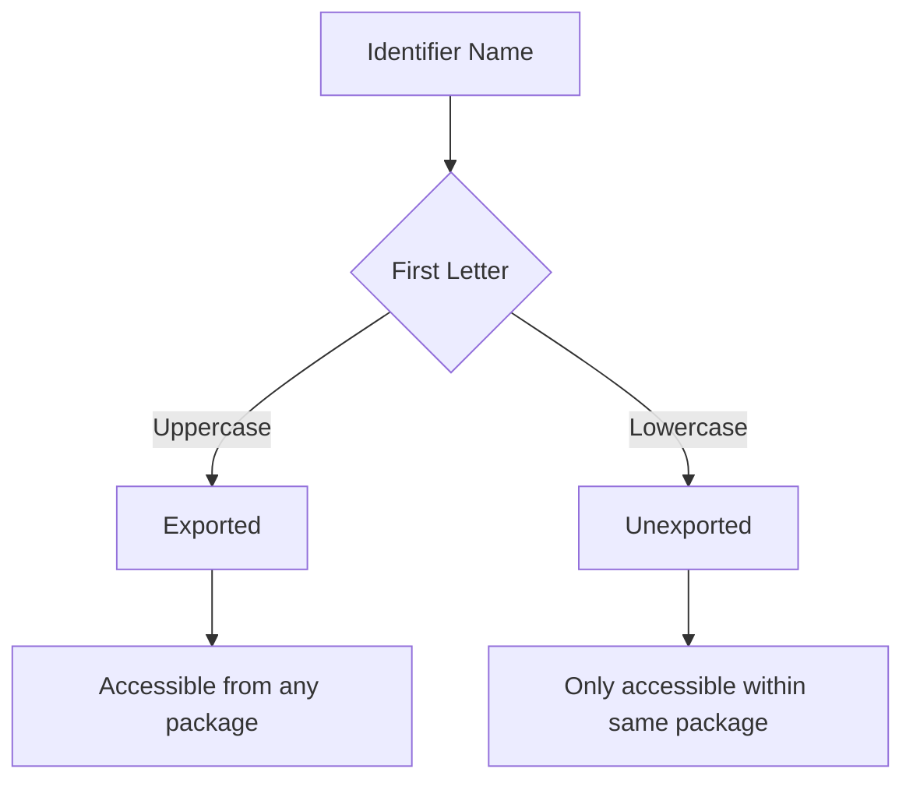

# How to Fix 'cannot refer to unexported name' Errors in Go

Author: [nawazdhandala](https://www.github.com/nawazdhandala)

Tags: Go, Golang, Errors, Export, Visibility, Packages

Description: Learn how to fix 'cannot refer to unexported name' errors in Go by understanding Go's visibility rules and proper package design.

---

Go uses capitalization to control visibility. Names starting with a lowercase letter are unexported (private to the package), while uppercase names are exported (public). This error occurs when trying to access unexported names from outside their package.

---

## The Error

```go
// package mylib/internal.go
package mylib

type config struct {  // unexported - lowercase 'c'
    host string
    port int
}

func helper() {}  // unexported - lowercase 'h'
```

```go
// main.go
package main

import "mylib"

func main() {
    c := mylib.config{}  // Error: cannot refer to unexported name mylib.config
    mylib.helper()       // Error: cannot refer to unexported name mylib.helper
}
```

---

## Understanding Go Visibility



---

## Solution 1: Export the Name

Change the first letter to uppercase:

```go
// package mylib/config.go
package mylib

// Exported - uppercase 'C'
type Config struct {
    Host string  // Also exported
    Port int     // Also exported
}

// Exported function
func Helper() {}
```

```go
// main.go
package main

import "mylib"

func main() {
    c := mylib.Config{Host: "localhost", Port: 8080}  // Works!
    mylib.Helper()  // Works!
}
```

---

## Solution 2: Use Constructor Functions

Keep the type unexported but provide an exported constructor:

```go
// package mylib/config.go
package mylib

// unexported type
type config struct {
    host string
    port int
}

// Exported constructor
func NewConfig(host string, port int) *config {
    return &config{
        host: host,
        port: port,
    }
}

// Exported methods on unexported type
func (c *config) Host() string {
    return c.host
}

func (c *config) Port() int {
    return c.port
}
```

```go
// main.go
package main

import (
    "fmt"
    "mylib"
)

func main() {
    c := mylib.NewConfig("localhost", 8080)
    fmt.Println(c.Host(), c.Port())  // Works!
}
```

---

## Solution 3: Use Interfaces

Export an interface, keep implementation private:

```go
// package mylib/database.go
package mylib

// Exported interface
type Database interface {
    Connect() error
    Query(sql string) ([]Row, error)
    Close() error
}

// Unexported implementation
type postgresDB struct {
    host     string
    port     int
    connected bool
}

// Exported constructor returns interface
func NewPostgresDB(host string, port int) Database {
    return &postgresDB{host: host, port: port}
}

func (db *postgresDB) Connect() error {
    db.connected = true
    return nil
}

func (db *postgresDB) Query(sql string) ([]Row, error) {
    return nil, nil
}

func (db *postgresDB) Close() error {
    db.connected = false
    return nil
}

type Row struct{}
```

```go
// main.go
package main

import "mylib"

func main() {
    db := mylib.NewPostgresDB("localhost", 5432)
    db.Connect()
    defer db.Close()
}
```

---

## Struct Fields Visibility

Struct fields follow the same rules:

```go
// package mylib/user.go
package mylib

type User struct {
    ID       int     // Exported - accessible from other packages
    Name     string  // Exported
    email    string  // Unexported - lowercase
    password string  // Unexported
}

// Constructor to set private fields
func NewUser(id int, name, email, password string) *User {
    return &User{
        ID:       id,
        Name:     name,
        email:    email,
        password: password,
    }
}

// Getters for private fields
func (u *User) Email() string {
    return u.email
}

// No getter for password - truly private
```

```go
// main.go
package main

import (
    "fmt"
    "mylib"
)

func main() {
    user := mylib.NewUser(1, "John", "john@example.com", "secret")
    
    fmt.Println(user.ID)       // Works - exported
    fmt.Println(user.Name)     // Works - exported
    fmt.Println(user.Email())  // Works - via getter
    // fmt.Println(user.email) // Error - unexported field
}
```

---

## JSON and Unexported Fields

Unexported fields are ignored by JSON:

```go
package main

import (
    "encoding/json"
    "fmt"
)

type Response struct {
    Status  string `json:"status"`   // Included in JSON
    Data    string `json:"data"`     // Included
    secret  string `json:"secret"`   // Ignored - unexported
}

func main() {
    r := Response{
        Status: "ok",
        Data:   "hello",
        secret: "hidden",
    }
    
    data, _ := json.Marshal(r)
    fmt.Println(string(data))
    // Output: {"status":"ok","data":"hello"}
    // Note: secret is not included
}
```

---

## Internal Packages

Go also supports `internal` packages for restricted visibility:

```
myproject/
├── internal/
│   └── secret/
│       └── secret.go    # Only importable within myproject
├── pkg/
│   └── public/
│       └── public.go    # Importable by anyone
└── main.go
```

```go
// internal/secret/secret.go
package secret

// Exported within internal, but not outside myproject
func SecretFunction() string {
    return "internal secret"
}
```

```go
// main.go in myproject
package main

import "myproject/internal/secret"  // Works

func main() {
    secret.SecretFunction()  // Works
}
```

```go
// other project trying to import
package main

import "myproject/internal/secret"  // Error: use of internal package not allowed
```

---

## Common Patterns

### Option Pattern with Unexported Fields

```go
package mylib

type Server struct {
    host    string
    port    int
    timeout int
}

type Option func(*Server)

func WithHost(host string) Option {
    return func(s *Server) {
        s.host = host
    }
}

func WithPort(port int) Option {
    return func(s *Server) {
        s.port = port
    }
}

func NewServer(opts ...Option) *Server {
    s := &Server{
        host:    "localhost",
        port:    8080,
        timeout: 30,
    }
    
    for _, opt := range opts {
        opt(s)
    }
    
    return s
}
```

### Embedded Unexported Types

```go
package mylib

type base struct {
    id int
}

func (b *base) GetID() int {
    return b.id
}

type User struct {
    base  // Embedded unexported
    Name string
}

func NewUser(id int, name string) *User {
    return &User{
        base: base{id: id},
        Name: name,
    }
}
```

---

## Summary

| Name | First Letter | Visibility |
|------|--------------|------------|
| `Config` | Uppercase | Exported (public) |
| `config` | Lowercase | Unexported (private) |
| `User.Name` | Uppercase | Exported field |
| `User.name` | Lowercase | Unexported field |

**Best Practices:**

1. Export only what's necessary (minimal API)
2. Use constructor functions for unexported types
3. Provide getters for read-only access to private fields
4. Use interfaces to hide implementation details
5. Use `internal/` packages for semi-private code
6. Document why something is unexported if not obvious

**Intentional Unexported Names:**

1. Implementation details
2. Internal state
3. Helper functions
4. Fields that shouldn't be set directly

---

*Building Go libraries? [OneUptime](https://oneuptime.com) helps you monitor your APIs and track usage patterns across your exported interfaces.*
