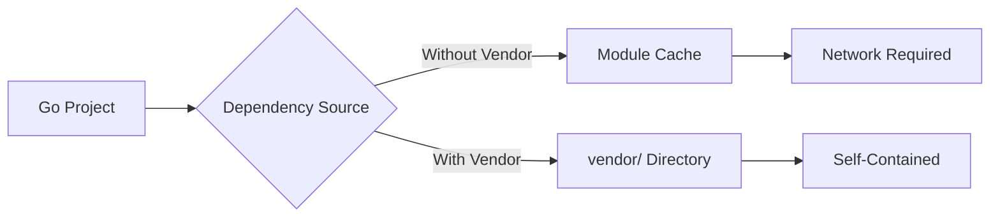

# How to Use Vendoring in Go

Author: [nawazdhandala](https://www.github.com/nawazdhandala)

Tags: Go, Golang, Vendoring, Dependencies, Modules, vendor

Description: Learn how to use vendoring in Go to manage dependencies locally, ensure reproducible builds, and work offline with the vendor directory.

---

Vendoring copies dependencies into your project's `vendor/` directory, ensuring reproducible builds and enabling offline development. While Go modules are the standard, vendoring remains useful for specific scenarios.

---

## Why Use Vendoring?



**Benefits:**

1. Reproducible builds without network
2. Full control over dependencies
3. Easier code review of dependencies
4. Protection against dependency removal
5. Required for some CI/CD environments

---

## Creating a Vendor Directory

```bash
# Initialize module if not already done
go mod init myproject

# Download dependencies and create vendor/
go mod vendor

# Verify vendor matches go.mod
go mod verify
```

---

## Project Structure with Vendor

```
myproject/
├── go.mod
├── go.sum
├── main.go
├── vendor/
│   ├── modules.txt
│   ├── github.com/
│   │   └── some/
│   │       └── package/
│   └── golang.org/
│       └── x/
│           └── sync/
```

---

## Building with Vendor

```bash
# Use vendor directory explicitly
go build -mod=vendor

# Run tests with vendor
go test -mod=vendor ./...

# Set default in go.mod (Go 1.14+)
```

In `go.mod`:

```go
module myproject

go 1.21

// Forces vendor usage
```

---

## Vendoring Workflow

```go
// main.go
package main

import (
    "fmt"
    "github.com/gorilla/mux"
)

func main() {
    r := mux.NewRouter()
    r.HandleFunc("/", homeHandler)
    fmt.Println("Router created")
}

func homeHandler(w http.ResponseWriter, r *http.Request) {}
```

```bash
# Step 1: Add dependency
go get github.com/gorilla/mux

# Step 2: Vendor it
go mod vendor

# Step 3: Verify
ls vendor/github.com/gorilla/mux
```

---

## The modules.txt File

`vendor/modules.txt` tracks vendored modules:

```
# github.com/gorilla/mux v1.8.0
## explicit; go 1.12
github.com/gorilla/mux

# golang.org/x/text v0.3.0
golang.org/x/text/encoding
golang.org/x/text/encoding/internal
```

---

## Updating Vendored Dependencies

```bash
# Update a specific dependency
go get github.com/gorilla/mux@latest

# Re-vendor
go mod vendor

# Or update all and re-vendor
go get -u ./...
go mod vendor
```

---

## Vendor vs Module Cache

| Aspect | Vendor | Module Cache |
|--------|--------|--------------|
| Location | Project's `vendor/` | `$GOPATH/pkg/mod` |
| Scope | Per-project | Global |
| Size | Larger repo | Shared cache |
| Offline | Yes | After first download |
| Version control | Committed | Not committed |

---

## Checking Vendor Status

```bash
# Verify vendor matches go.mod/go.sum
go mod verify

# Tidy and re-vendor
go mod tidy
go mod vendor

# Check for differences
git status vendor/
```

---

## Configuring Build Mode

```bash
# Environment variable
export GOFLAGS="-mod=vendor"

# Per-command
go build -mod=vendor
go test -mod=vendor ./...

# Options:
# -mod=vendor  Use vendor/
# -mod=mod     Use module cache
# -mod=readonly  No modifications to go.mod
```

---

## Vendoring in CI/CD

```yaml
# GitHub Actions example
name: Build

on: [push]

jobs:
  build:
    runs-on: ubuntu-latest
    steps:
    - uses: actions/checkout@v3
    
    - name: Set up Go
      uses: actions/setup-go@v4
      with:
        go-version: '1.21'
    
    - name: Verify vendor
      run: |
        go mod vendor
        git diff --exit-code vendor/
    
    - name: Build
      run: go build -mod=vendor ./...
    
    - name: Test
      run: go test -mod=vendor ./...
```

---

## Partial Vendoring

You can vendor only specific packages (not recommended):

```bash
# Vendor specific module
go mod vendor

# Remove unwanted (manual, not recommended)
rm -rf vendor/unwanted/package
```

Better approach - use replace directives:

```go
// go.mod
module myproject

go 1.21

require (
    github.com/gorilla/mux v1.8.0
)

replace github.com/gorilla/mux => ./local/mux
```

---

## Working with Private Repos

```bash
# Configure git for private repos
git config --global url."git@github.com:".insteadOf "https://github.com/"

# Set GOPRIVATE
export GOPRIVATE=github.com/mycompany/*

# Then vendor normally
go mod vendor
```

---

## Committing Vendor Directory

**.gitignore options:**

```gitignore
# Option 1: Don't commit vendor (use go mod download in CI)
vendor/

# Option 2: Commit vendor (self-contained builds)
# Don't add vendor/ to .gitignore
```

**Pros of committing vendor:**
- Reproducible builds
- No network dependency
- Protection against upstream changes

**Cons:**
- Larger repository
- More complex diffs
- Maintenance overhead

---

## Debugging Vendor Issues

```bash
# Check which module provides a package
go list -m -json all | jq '.Path'

# See where a package comes from
go list -f '{{.Dir}}' github.com/gorilla/mux

# Force rebuild without cache
go build -a -mod=vendor ./...

# Clean and re-vendor
rm -rf vendor/
go mod vendor
```

---

## Migration from dep to Modules

```bash
# If using dep (legacy)
rm -rf vendor/
rm Gopkg.toml Gopkg.lock

# Initialize modules
go mod init myproject

# Tidy dependencies
go mod tidy

# Re-vendor
go mod vendor
```

---

## Best Practices

```go
// go.mod
module myproject

go 1.21

require (
    // Pin versions explicitly
    github.com/gorilla/mux v1.8.0
    github.com/lib/pq v1.10.9
)
```

```bash
# Makefile for consistency
.PHONY: vendor
vendor:
	go mod tidy
	go mod vendor
	go mod verify

.PHONY: build
build: vendor
	go build -mod=vendor -o bin/app ./cmd/app

.PHONY: test
test:
	go test -mod=vendor -race ./...
```

---

## Summary

| Command | Description |
|---------|-------------|
| `go mod vendor` | Create/update vendor/ |
| `go mod verify` | Verify vendor integrity |
| `go build -mod=vendor` | Build using vendor |
| `go mod tidy && go mod vendor` | Clean and re-vendor |

**When to Vendor:**

1. Air-gapped/offline builds required
2. Strict reproducibility needs
3. Dependency auditing requirements
4. Protection against left-pad scenarios
5. Some enterprise CI/CD requirements

**When Not to Vendor:**

1. Small projects
2. Rapid development
3. Large dependency trees
4. When module cache suffices

---

*Managing Go dependencies in production? [OneUptime](https://oneuptime.com) helps you monitor build pipelines and track dependency-related issues.*
